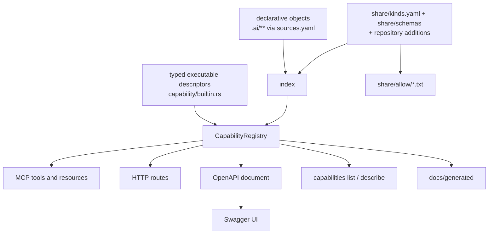

# Capabilities — one definition, every interface derived

How the Rust executable under [`apps/majordomus-cli/`](../apps/majordomus-cli/) exposes
what it exposes: one canonical declaration per capability, modules that compose
capabilities, a root that composes modules, the registry built from them, one executor
every transport calls, and the projections (MCP, HTTP, OpenAPI, Swagger UI, the command
line, the benchmark targets, the cache behaviour, the generated reference and manifests)
that are derived from the registry and define nothing of their own. Behaviour as
implemented and tested; where this document and the executable disagree, the document is
wrong and changes in the same commit. The decisions are
[ADR 2](../.ai/repo/adrs/0002-canonical-capability-registry.md) (the registry and the
projections) and [ADR 4](../.ai/repo/adrs/0004-canonical-architecture-and-performance-truth.md)
(modules, the executor, benchmarks as evidence); the rules are
`project.interfaces-are-projections`, `project.rust-canonical-declaration`,
`project.rust-benchmark-coverage` and `project.rust-hot-path`.

```text
ONE CANONICAL DECLARATION   capability! { id, kind?, title, description, input, output,
                                          stability, exposure, tags, cache?, benchmark?, handler }
        ↓
MODULE COMPOSITION          module! { id, title, description, stability, capabilities: [...] }
        ↓
ROOT COMPOSITION            compose_modules![repository, objects, capabilities, peers, perf]
        ↓
CAPABILITY REGISTRY         + every declarative object of the layer, validated, frozen, fingerprinted
        ↓
DERIVED PROJECTIONS         MCP · HTTP · OpenAPI → Swagger UI · CLI · benchmark targets and coverage
                            · cache policy · perf counters · docs/generated/*
```

A contributor adding one capability edits one `capability!` block (with its typed input
and output and the input's benchmark cases) and runs `majordomus generate`. Nothing else.

## What is canonical, what is derived, what is not authoritative

```text
CANONICAL                                   DERIVED (projections)          NOT AUTHORITATIVE
capability! blocks, one per module file     MCP tools and resources        examples in prose
  apps/majordomus-cli/src/capability/       HTTP routes                    screenshots
  builtin/<module>.rs, composed by          OpenAPI document               the committed snapshots
  module! and compose_modules!              Swagger UI configuration         under docs/generated/
declarative objects of the layer            capabilities list/describe       (caches of the registry)
  .ai/** as sources.yaml maps them          benchmark targets, coverage    a latency number in prose
how each kind is read and validated         cache behaviour (executor)       (evidence lives under
  share/kinds.yaml, share/schemas/*.json    perf counters                    .ai/local/benchmarks/ and
  .ai/repo/knowledge/kinds.yaml, schemas/   docs/generated/*                 .ai/repo/benchmarks/rust/)
the regression policy                       share/allow/*.txt (shell tool)
  .ai/repo/benchmarks/rust/policy.yaml
```



A change to one descriptor, one declarative file, one kind or one schema reaches every
projection on the next start or the next `majordomus generate`; nothing is edited twice.

## The model

A **capability** is a descriptor with:

| field | meaning |
|---|---|
| `id` | the canonical identity: a namespace, a dot, an opaque local part (`repository.info`, `rule.majordomus.scope-integrity@1`, `document.docs/CLI.md`); unique across both sources |
| `kind` | `query`: executable, read-only, one typed handler; `command`: executable, one typed handler, changes this process's own memory and nothing else (a peer announcing itself), bound to `POST` and announced to MCP clients as not read-only; `resource`: declarative content, read as it is. No kind writes to the repository |
| `title`, `description` | the words every projection shows |
| `input`, `output` | canonical JSON Schemas; for a query, derived from its Rust types; for a resource, the object view |
| `provenance` | `builtin` with the module, or `declarative` with the repository-relative path, directory, source class, section and, for a member of a collection file, the member's key path |
| `exposure` | explicit, per projection: `mcp` (tool name and/or resource URI), `http` (method and path under `/api/v1/`), `cli` (the words after `majordomus`); absent means not exposed there, and nothing infers one |
| `stability` | `implemented`, `behaviorally_verified`, `experimental`, `planned`, `unsupported`; a planned or unsupported capability may be listed and is never executable through any projection |

Id grammar: the namespace matches `[a-z][a-z0-9_-]*`; the local part is non-empty with no
whitespace or control character, any other Unicode included; ids are compared as strings,
case-sensitively. Declarative ids are `<kind>.<identity>`, where the identity is what the
kind's identity rule produced: `id@version` for a rule, `name` for a prompt, the
repository-relative path for a kind without identity fields.

## The registry

Built at one place per process, from the builtin executables composed explicitly in
`capability/builtin.rs` and from every object of the index. It refuses to build, naming
every party, on a duplicate id (Rust with Rust, Rust with declarative), a duplicate MCP
tool name or resource URI, a duplicate HTTP route, a duplicate CLI path, a malformed
exposure (a route outside `/api/v1/`, a tool name outside `[a-z0-9_]+`), a query or a
command without a handler, a resource with one, a command with an MCP resource exposure
or an HTTP method other than `POST`, a query exposed as an MCP resource whose input
requires anything (a read supplies none), and an executable exposure on a planned or
unsupported capability. Errors are collected, not stopped at the first. `majordomus
capabilities validate` runs exactly this and exits 10 with the list.

## Modules and composition

A capability lives in the Rust module of its namespace under
`apps/majordomus-cli/src/capability/builtin/`: `repository.rs`, `objects.rs`,
`capabilities.rs`, `peers.rs`, `perf.rs`. Each file declares its typed inputs and
outputs, implements `BenchmarkCases` for every input type, writes one handler per
capability, and ends with `module()`:

```rust
pub fn module() -> ModuleDescriptor {
    module! {
        id: "objects", title: "Objects", description: "...", stability: Stability::BehaviorallyVerified,
        capabilities: [
            capability! { id: "objects.list", ... handler: objects_list },
            capability! { id: "objects.search", ..., cache: CachePolicy::Process { max_entries: 64, ttl_seconds: None }, handler: objects_search },
        ],
    }
}
```

`builtin/mod.rs` composes the application, and that line is the only root composition:

```rust
pub fn modules() -> Vec<ModuleDescriptor> {
    compose_modules![repository, objects, capabilities, peers, perf]
}
```

The macros are `macro_rules!` that build plain values; `app.rs` hands them to the
registry builder explicitly. There is no procedural macro, no global registry filled
behind the caller's back, no link-time inventory and no build script reading `src/`. The
registry stamps nothing it did not receive: `module!` stamps its id on each capability,
and a capability whose id namespace is not its module (`ModuleMismatch`), a module
composed twice, an invalid module id, a cache policy that keeps nothing, a cached
command or a benchmark policy that contradicts the kind refuses the build, naming the id
and the provenance. Executables composed without a descriptor (tests, benchmarks) get a
module derived from their namespace; declarative objects get their kind. The registry's
summary counts modules, required and waived benchmark targets and cached executables,
and `capabilities validate` prints them.

## The executor and the cache

Every call goes through one path, whatever asked for it: `Context::execute` →
`CapabilityExecutor::execute` → the handler. The stdio session, `/mcp`, the HTTP routes,
the `capabilities` commands and the benchmark runners own protocol conversion and nothing
else, so instrumentation and caching apply to every transport at once. The executor
counts executions, handler invocations, cache hits, misses and evictions in the
process-wide `perf::COUNTERS`, beside the counters of the work that happens once
(repository scans, index builds, registry builds, schema generations, MCP projection
builds, OpenAPI builds, HTTP router builds) and phase timings on a monotonic clock;
`perf.counters` answers them over every transport, which is how the structural tests prove
that hundreds of requests rebuild nothing.

A cache is policy on the descriptor: `CachePolicy::Process { max_entries, ttl_seconds }`.
The key is the canonical id, the input in canonical form (object keys sorted at every
level, so a client's key order never matters) and the registry fingerprint, a sha-256 of
the index fingerprint (every object's path and content) and of every descriptor, so two
repository states never share an entry. Errors are never cached; a command is never
cached and the registry refuses a descriptor that asks; the bound evicts the oldest entry
first; nothing is persisted. Two capabilities declare it because a measurement said so
(`objects.search` and `capabilities.list`); every other handler answers from the
immutable index in microseconds and a cache there would be a second copy of nothing. The
generic tests iterate every cached capability with every case and with generated inputs:
uncached, cold and warm agree, a hit runs no handler.

## Benchmarks: every operation, a generated denominator

The benchmark projection derives its targets from the registry against a repository:
each executable with a required policy, directly and on every transport its exposure
declares, once per case its input type provides; plus the transports' own operations,
declared once as system targets (a cold `majordomus mcp` process, `initialize`, `ping`,
`tools/list`, `resources/list`, `resources/read`; `GET /`, `/openapi.json`, `/docs`).
Coverage is `covered / required` with the denominator computed, never typed: a required
capability whose input type produced no case for this repository is missing, and
`capabilities validate`, `bench coverage --check` and CI fail on it; a waiver is a typed
reason on the descriptor, reported and never counted.

```bash
majordomus bench coverage [--format json] [--check]      # covered / required, per transport and in total
majordomus bench [id] [--transport direct|mcp|http|system] [--profile quick|full|ci] [--format json] [--no-write]
majordomus bench --check                                 # against this platform's baseline, under the policy
majordomus bench baseline update [--profile full] [--allow-dirty]
```

The runners time a target directly through the executor (cold, the cache cleared before
every sample, and warm, for a cached capability; handler invocations counted), over a
real loopback socket served by the same process with the input bound as the route binds
it (query string for `GET`, JSON body for `POST`), and through a real `majordomus mcp
--standalone` child on stdio (one process, many samples; a fresh process per sample for
the process-cold target). Statistics: samples, min, p50, p90, p95, p99, max, mean,
stddev. A run is a document, `majordomus/benchmark-result/v1`, with the commit, the dirty
state, the build profile, the platform and the registry fingerprint, written under
`.ai/local/benchmarks/`; the accepted baseline is one tracked file per platform under
`.ai/repo/benchmarks/rust/baseline.<os>-<arch>-<build>.json`, promoted only by `bench
baseline update` (a dirty tree refuses without `--allow-dirty`); the regression policy is
`.ai/repo/benchmarks/rust/policy.yaml` (relative thresholds per metric, an absolute
floor under which a difference is noise, and per metric the sample count under which it
does not gate: a quick run fails on its median only, a full run on every percentile). `bench --check` reports every line, names new
targets and stale baseline entries (a renamed capability is never silently matched), and
notes when the registry fingerprint moved. A baseline is compared on its own platform
only; a CI runner without a committed baseline compares nothing and says so.

## Kinds and schemas, read at run time

Which files are declarative objects, and of which kind, is the repository's:
`.ai/repo/knowledge/sources.yaml` maps pathspecs to kinds. How a kind is read is data
too, in the tool distribution's share directory (`--share`, `MAJORDOMUS_SHARE`, the
repository's own `share/`, or the one beside the executable):

- `share/kinds.yaml` — per kind: the format (`markdown`, `yaml`, `text`), whether front
  matter is required, which JSON Schema the metadata must satisfy, which fields carry
  identity, title and description, a version field with its supported values, and for a
  collection file the list that holds the members. `declared:` names the kinds a Markdown
  file may declare for itself through its front matter (`context` today).
- `share/schemas/<name>.schema.json` — one JSON Schema (draft 2020-12) per contract;
  validated with a JSON Schema validator on every read. A key the schema does not allow is
  the diagnostic `unknown_key`; any other failed constraint is `schema_violation`, naming
  the path and the constraint.

A repository extends both under its `knowledge` section: `.ai/repo/knowledge/kinds.yaml`
adds kinds, `.ai/repo/knowledge/schemas/<name>.schema.json` adds schemas. Adding is the
only operation: a kind or a schema the distribution already declares is an error naming
both files. The shell tool's allow-lists under `share/allow/` are generated from the
schemas that carry `x-majordomus-allow` (`majordomus generate allow`); they are never
written by hand.

## Projections

| projection | derived from | where |
|---|---|---|
| MCP tools | capabilities with an `mcp.tool` exposure; `inputSchema` and `outputSchema` are the canonical schemas; `_meta.majordomus.id` carries the id; `readOnlyHint` follows the kind | `majordomus mcp` on stdio, and `/mcp` on the shared server |
| MCP resources | capabilities with an `mcp.resource` exposure; a query with one is read as JSON | `majordomus mcp` on stdio, and `/mcp` on the shared server |
| HTTP routes | capabilities with an `http` exposure; `GET` binds every top-level input property as a query parameter coerced by its schema type, `POST` binds the JSON body (a command's binding); errors map to 400 `invalid_input`, 404 `not_found`, 422 `refused`, 500 `internal`, 405 for another method on a known path | the shared server `majordomus mcp` starts, and `majordomus serve` |
| OpenAPI 3.1 | the same routes; `operationId` is the id; `x-majordomus-id`, `-kind`, `-stability`, `-provenance`, `-mcp`, `-cli` carry the rest; schemas hoisted into sorted components; the OAS 3.1 base dialect | `GET /openapi.json`, `docs/generated/openapi.json` |
| Swagger UI | a shell page that loads `/openapi.json`; it embeds no specification; its assets come from the pinned `swagger-ui-dist` on unpkg, the one part that is not offline | `GET /docs` |
| command line | `capabilities list` and `describe` dispatch through the registry's `cli` exposure; `schema` and `validate` are views of the registry, not capabilities | `majordomus capabilities …` |
| reference | the index of modules and builtin capabilities, one page per executable module with every capability in full; declarative resources described by rule, listed live | `docs/generated/capabilities.md`, `docs/generated/modules/<id>.md` |
| benchmark targets | every required executable per exposed transport per case, plus the system targets; the coverage tallies | `majordomus bench`, `docs/generated/benchmarks.md` |
| registry manifest | the builtin registry as data: modules, descriptors with schemas, declarative kinds, system targets | `docs/generated/registry.json` (`majordomus/capability-registry/v1`) |
| perf counters | the executor's and the startup phases' counters | `perf.counters`: `majordomus_perf`, `GET /api/v1/perf` |
| allow-lists | the schemas | `share/allow/*.txt` |
| provider bootstraps | the policy's `projections[]`, the profiles and the provider templates (`.ai/repo/providers/`, else `share/providers/`); the stamp carries the policy hash and the content hash; byte-identical to the shell tool's `update` | `AGENTS.md`, `CLAUDE.md`, `GEMINI.md`, … — `majordomus generate providers` |

The infrastructure routes `/`, `/openapi.json`, `/docs` and `/mcp` are the HTTP
projection's own and are not capabilities; `/mcp` is MCP over HTTP (the Streamable HTTP
transport's request half, with `Mcp-Session-Id` sessions) and exists on the shared server
only. One shared server serves a repository: the first `majordomus mcp` or `serve` binds
it, every later `majordomus mcp` bridges its stdio to it, and the peers see each other
through `peers.list`; the lifecycle is in [`MCP.md`](MCP.md).

## Lifecycle and failure policy

```text
discover the repository -> locate the share directory -> load kinds and schemas
  -> discover files through sources.yaml -> read and validate each into an object or a diagnostic
  -> build the registry (refuse on any invariant) -> construct the projection asked for -> serve or generate
```

The manifest, `sources.yaml`, the kinds files and the schemas are errors when they cannot
be read: nothing can be discovered without them. Every other file that cannot become an
object is excluded with a diagnostic naming its path and a stable code, the index reports
`degraded`, and the projections still serve; `--strict` refuses a degraded index. A
registry invariant violation is an error: no projection is served from a registry that
does not build.

## Extension

### Adding an object of a known kind

Write the file where the repository's `sources.yaml` class for that kind looks, with the
front matter or YAML its schema allows; track it (or run with `--discovery filesystem`);
restart. It is a resource capability, an MCP resource, a member of `objects.list`, readable
through `objects.get` over MCP and HTTP (one resolution of the URI, shared with the MCP
resource read, which also answers `majordomus://repository` as `repository.info`'s
report), and listed by `capabilities list`. No Rust, no
registration, no projection edited. `apps/majordomus-cli/tests/external_extension.rs` adds,
removes and breaks objects between restarts and reads them back through every interface.

### Adding a kind, with its schema, from the repository

```text
.ai/repo/knowledge/kinds.yaml           schema: majordomus-kinds/v1 + one kinds: entry
.ai/repo/knowledge/schemas/note.schema.json   its JSON Schema
.ai/repo/knowledge/sources.yaml         a class mapping a pathspec to the kind
```

Then the objects. The same test proves it for a kind named `note`. A kind needing a new
format or identity rule is a Rust change in `index.rs`; data describes objects, it does
not define how a format is read.

### Adding an executable capability

In the file of its module under `apps/majordomus-cli/src/capability/builtin/`:

1. define the typed input and output (`serde` + `schemars::JsonSchema`; doc comments are
   the descriptions every client reads) and implement `BenchmarkCases` for the input
   (one or more representative inputs; a case may look at the index to name an object
   that exists),
2. write one function `fn(&Context, Input) -> Result<Output, CapabilityError>`; the
   context carries the index, the registry, the peer board, the executor and, through
   an MCP session, the calling peer,
3. add one `capability! { id, title, description, input, output, stability, exposure,
   tags, handler }` block to the module's `capabilities: [...]`, with
   `kind: CapabilityKind::Command` after the id when it changes this process's memory
   and `cache: CachePolicy::Process { .. }` when a measurement says so,
4. run `majordomus generate` and `majordomus capabilities validate` (or `just generate`
   and `just validate`); commit the regenerated files under `docs/generated/`,
5. add a behavioural test of the handler's semantics.

That is the whole workflow. MCP, HTTP, OpenAPI, Swagger UI, the `capabilities` commands,
the benchmark targets on every exposed transport (with the cases from step 1), the cache
behaviour, `perf.counters`, the reference, the benchmark matrix and the registry manifest
follow from the block; the generic suites (`tests/projections.rs`, `tests/bench.rs`,
`tests/executor.rs`, `tests/properties.rs`, `tests/hot_path.rs`) discover the capability
through the registry and test it without an edit. A capability whose input type has no
`BenchmarkCases` does not compile; one whose cases are empty for a repository fails
coverage.

### Adding a module

One Rust module under `builtin/` with its `module()` built by `module!`, and one name
added to `compose_modules!` in `builtin/mod.rs`. Its reference page, its rows in the
matrix and its entry in the manifest are generated.

## Generated projections and synchronization

`majordomus generate [all|openapi|docs|benchmarks|registry|allow]` writes
`docs/generated/openapi.json`, `docs/generated/capabilities.md` with
`docs/generated/modules/<id>.md`, `docs/generated/benchmarks.md`,
`docs/generated/registry.json` and `share/allow/*.txt`; `majordomus generate --check`
derives them again, compares byte for byte, writes nothing, and exits 10 naming every
stale file. CI runs the check. Every generated file says so in its first line and names
its source; none carries a timestamp, an absolute path or a fingerprint that would move
with a document edit. The committed files are caches: reviewable, never edited.

## When something fails

| message | meaning | remedy |
|---|---|---|
| `capability 'x' is defined twice: <a> and <b>` | two sources claim one id | rename one, or delete the duplicate |
| `MCP tool 'n' is claimed by 'a' and 'b'`, `HTTP route GET /p is claimed by …`, `CLI path … is claimed by …` | two capabilities project to one name | change one exposure |
| `invalid HTTP exposure: path '/x' is not under /api/v1/` | a route outside the versioned prefix | move it under the prefix |
| `… is planned and cannot be exposed as executable through MCP tool` | a planned capability declares an executable exposure | drop the exposure until it is implemented |
| `unknown_key … not in schema 'rule': owner` | a declarative file carries a key its schema does not allow | remove the key, or extend the schema in the repository's `schemas/` for a repository kind |
| `schema_violation … class: "fatal" is not one of …` | a value fails a constraint | fix the value |
| `kind 'x' is declared by both share/kinds.yaml and .ai/repo/knowledge/kinds.yaml` | a repository redefines a distributed kind | rename the repository's kind |
| `generated artifact(s) stale: docs/generated/openapi.json (differs)` | a committed projection no longer matches the registry | run `majordomus generate` and commit |
| `capability 'x.y' (builtin …) is composed in module 'z' but its namespace is 'x'` | a `capability!` block sits in the wrong module's list | move it to the module its id names, or rename the id |
| `module 'x' is composed twice` | two `module!` share an id, or a builtin module's id is a declarative kind | rename one |
| `invalid cache policy: a process cache with max_entries 0 keeps nothing`, `… a command changes state and is never cached` | the descriptor's cache policy contradicts itself or the kind | fix the policy on the descriptor |
| `FAIL benchmarks  N of M requirement(s) missing` | an exposed executable's input type produced no case for this repository | make `BenchmarkCases` return a case (or waive with a typed reason, which is reported) |
| `bench --check: regression(s) found` | a metric grew over `.ai/repo/benchmarks/rust/policy.yaml` against this platform's baseline | find the cause with `majordomus bench <id>` and the phase timings, or record a new baseline deliberately |
| `STALE  <key> (in the baseline, not measured …)` | the baseline knows a target this run did not measure: renamed, removed, or filtered out | `bench baseline update` after a rename or removal |
| `no share directory holds kinds.yaml; tried …` | the distribution was not found | pass `--share` or set `MAJORDOMUS_SHARE` |

## Stability

| | status |
|---|---|
| the registry's invariants, both sources, deterministic build | behaviourally verified (`tests/registry.rs`) |
| every declared projection present, no orphan, one id everywhere; a change to one descriptor reaches MCP, OpenAPI and the reference | behaviourally verified (`tests/projections.rs`) |
| HTTP over a real socket, OpenAPI, Swagger shell, typed errors, MCP and HTTP answering the same handler identically, a declarative object reaching HTTP and introspection untouched | behaviourally verified (`tests/http_serve.rs`) |
| one shared server per repository: the lease, the bridge, `/mcp` sessions, the peers and their announcements, the fallback port, `serve` deferring, `--standalone`, the takeover after a kill, the re-attachment, the refusal when the taker cannot serve | behaviourally verified (`tests/mcp_shared.rs`, `tests/shared_units.rs`, `test/cases/90_mcp_shared_server.sh`) |
| repository-defined kind and schema served without a code change; add, remove, break | behaviourally verified (`tests/external_extension.rs`) |
| generate, byte-identical regeneration, `--check` on missing and tampered files | behaviourally verified (`tests/generate_check.rs`) |
| modules compose capabilities, the root composes modules, the module invariants | behaviourally verified (`tests/registry.rs`, `test/cases/91_canonical_architecture.sh`) |
| one executor; cache off, cold and warm agree; a hit runs no handler; errors and commands never cached; the bound; the fingerprint | behaviourally verified (`tests/executor.rs`, `tests/properties.rs`) |
| no request rebuilds canonical state after startup (counters over hundreds of real requests) | behaviourally verified (`tests/hot_path.rs`, `test/cases/91_canonical_architecture.sh`) |
| every operation a benchmark target, generated denominator, exposure and policy propagation, real runners, baseline check | behaviourally verified (`tests/bench.rs`, `tests/bench_units.rs`, `test/cases/91_canonical_architecture.sh`) |
| generated reference per module, benchmark matrix, registry manifest, deterministic and reconciled | behaviourally verified (`tests/projections.rs`) |
| the whole path through the shell tool's own `init` | behaviourally verified (`test/cases/76_capabilities_projections.sh`) |
| the id grammar, URIs, tool names, route paths, diagnostic codes, `kinds.yaml`, the schema files | implemented; pre-1.0 compatibility surfaces, changes documented, never silent |
| Swagger UI assets offline, `/openapi.yaml`, path parameters, hot reload, mutation of the repository over any interface, a server-initiated stream on `/mcp` | not implemented; restart-based rediscovery is the contract, and a shared server keeps the index it built at start until its last client leaves |
