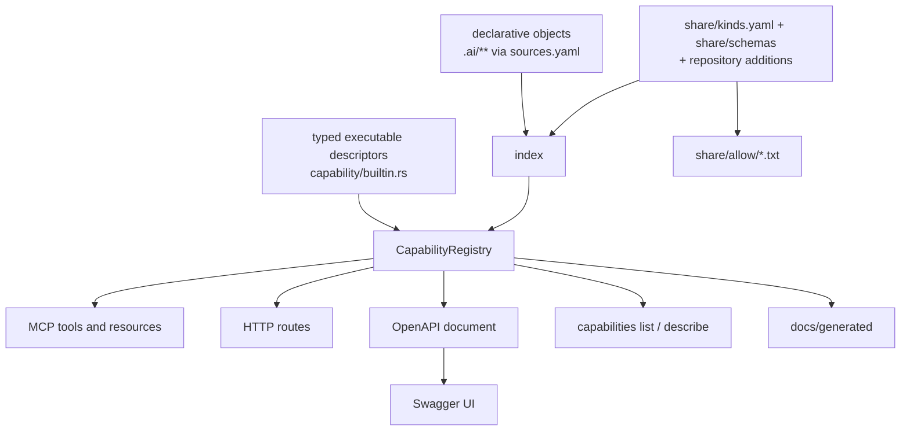

# Capabilities — one definition, every interface derived

How the Rust executable under [`apps/majordomus-cli/`](../apps/majordomus-cli/) exposes
what it exposes: the canonical capability model, the registry built from it, and the
projections (MCP, HTTP, OpenAPI, Swagger UI, the command line, the generated reference)
that are derived from the registry and define nothing of their own. Behaviour as
implemented and tested; where this document and the executable disagree, the document is
wrong and changes in the same commit. The decision is
[`.ai/repo/adrs/0002-canonical-capability-registry.md`](../.ai/repo/adrs/0002-canonical-capability-registry.md);
the rule is `project.interfaces-are-projections`.

## What is canonical, what is derived, what is not authoritative

```text
CANONICAL                                   DERIVED (projections)          NOT AUTHORITATIVE
typed executable descriptors                MCP tools and resources        examples in prose
  apps/majordomus-cli/src/capability/       HTTP routes                    screenshots
  builtin.rs                                OpenAPI document               the committed snapshots
declarative objects of the layer            Swagger UI configuration         under docs/generated/
  .ai/** as sources.yaml maps them          capabilities list/describe       (caches of the registry)
how each kind is read and validated         docs/generated/*
  share/kinds.yaml, share/schemas/*.json    share/allow/*.txt (shell tool)
  .ai/repo/knowledge/kinds.yaml, schemas/
```



A change to one descriptor, one declarative file, one kind or one schema reaches every
projection on the next start or the next `majordomus generate`; nothing is edited twice.

## The model

A **capability** is a descriptor with:

| field | meaning |
|---|---|
| `id` | the canonical identity: a namespace, a dot, an opaque local part (`repository.info`, `rule.majordomus.scope-integrity@1`, `document.docs/CLI.md`); unique across both sources |
| `kind` | `query`: executable, read-only, one typed handler; `resource`: declarative content, read as it is |
| `title`, `description` | the words every projection shows |
| `input`, `output` | canonical JSON Schemas; for a query, derived from its Rust types; for a resource, the object view |
| `provenance` | `builtin` with the module, or `declarative` with the repository-relative path, directory, source class, section and, for a member of a collection file, the member's key path |
| `exposure` | explicit, per projection: `mcp` (tool name and/or resource URI), `http` (method and path under `/api/v1/`), `cli` (the words after `majordomus`); absent means not exposed there, and nothing infers one |
| `stability` | `implemented`, `behaviorally_verified`, `experimental`, `planned`, `unsupported`; a planned or unsupported capability may be listed and is never executable through any projection |

Id grammar: the namespace matches `[a-z][a-z0-9_-]*`; the local part is non-empty with no
whitespace or control character, any other Unicode included; ids are compared as strings,
case-sensitively. Declarative ids are `<kind>.<identity>`, where the identity is what the
kind's identity rule produced: `id@version` for a rule, `name` for a prompt, the
repository-relative path for a kind without identity fields.

## The registry

Built at one place per process, from the builtin executables composed explicitly in
`capability/builtin.rs` and from every object of the index. It refuses to build, naming
every party, on a duplicate id (Rust with Rust, Rust with declarative), a duplicate MCP
tool name or resource URI, a duplicate HTTP route, a duplicate CLI path, a malformed
exposure (a route outside `/api/v1/`, a tool name outside `[a-z0-9_]+`), a query without a
handler, a resource with one, and an executable exposure on a planned or unsupported
capability. Errors are collected, not stopped at the first. `majordomus capabilities
validate` runs exactly this and exits 10 with the list.

## Kinds and schemas, read at run time

Which files are declarative objects, and of which kind, is the repository's:
`.ai/repo/knowledge/sources.yaml` maps pathspecs to kinds. How a kind is read is data
too, in the tool distribution's share directory (`--share`, `MAJORDOMUS_SHARE`, the
repository's own `share/`, or the one beside the executable):

- `share/kinds.yaml` — per kind: the format (`markdown`, `yaml`, `text`), whether front
  matter is required, which JSON Schema the metadata must satisfy, which fields carry
  identity, title and description, a version field with its supported values, and for a
  collection file the list that holds the members. `declared:` names the kinds a Markdown
  file may declare for itself through its front matter (`context` today).
- `share/schemas/<name>.schema.json` — one JSON Schema (draft 2020-12) per contract;
  validated with a JSON Schema validator on every read. A key the schema does not allow is
  the diagnostic `unknown_key`; any other failed constraint is `schema_violation`, naming
  the path and the constraint.

A repository extends both under its `knowledge` section: `.ai/repo/knowledge/kinds.yaml`
adds kinds, `.ai/repo/knowledge/schemas/<name>.schema.json` adds schemas. Adding is the
only operation: a kind or a schema the distribution already declares is an error naming
both files. The shell tool's allow-lists under `share/allow/` are generated from the
schemas that carry `x-majordomus-allow` (`majordomus generate allow`); they are never
written by hand.

## Projections

| projection | derived from | where |
|---|---|---|
| MCP tools | capabilities with an `mcp.tool` exposure; `inputSchema` and `outputSchema` are the canonical schemas; `_meta.majordomus.id` carries the id | `majordomus mcp` |
| MCP resources | capabilities with an `mcp.resource` exposure; a query with one is read as JSON | `majordomus mcp` |
| HTTP routes | capabilities with an `http` exposure; `GET` binds every top-level input property as a query parameter coerced by its schema type, `POST` binds the JSON body; errors map to 400 `invalid_input`, 404 `not_found`, 422 `refused`, 500 `internal`, 405 for another method on a known path | `majordomus serve` |
| OpenAPI 3.1 | the same routes; `operationId` is the id; `x-majordomus-id`, `-kind`, `-stability`, `-provenance`, `-mcp`, `-cli` carry the rest; schemas hoisted into sorted components; the OAS 3.1 base dialect | `GET /openapi.json`, `docs/generated/openapi.json` |
| Swagger UI | a shell page that loads `/openapi.json`; it embeds no specification; its assets come from the pinned `swagger-ui-dist` on unpkg, the one part that is not offline | `GET /docs` |
| command line | `capabilities list` and `describe` dispatch through the registry's `cli` exposure; `schema` and `validate` are views of the registry, not capabilities | `majordomus capabilities …` |
| reference | the builtin capabilities in full; declarative resources described by rule, listed live | `docs/generated/capabilities.md` |
| allow-lists | the schemas | `share/allow/*.txt` |

The three infrastructure routes `/`, `/openapi.json` and `/docs` are the HTTP projection's
own and are not capabilities.

## Lifecycle and failure policy

```text
discover the repository -> locate the share directory -> load kinds and schemas
  -> discover files through sources.yaml -> read and validate each into an object or a diagnostic
  -> build the registry (refuse on any invariant) -> construct the projection asked for -> serve or generate
```

The manifest, `sources.yaml`, the kinds files and the schemas are errors when they cannot
be read: nothing can be discovered without them. Every other file that cannot become an
object is excluded with a diagnostic naming its path and a stable code, the index reports
`degraded`, and the projections still serve; `--strict` refuses a degraded index. A
registry invariant violation is an error: no projection is served from a registry that
does not build.

## Extension

### Adding an object of a known kind

Write the file where the repository's `sources.yaml` class for that kind looks, with the
front matter or YAML its schema allows; track it (or run with `--discovery filesystem`);
restart. It is a resource capability, an MCP resource, a member of `objects.list`, readable
through `objects.get` over MCP and HTTP, and listed by `capabilities list`. No Rust, no
registration, no projection edited. `apps/majordomus-cli/tests/external_extension.rs` adds,
removes and breaks objects between restarts and reads them back through every interface.

### Adding a kind, with its schema, from the repository

```text
.ai/repo/knowledge/kinds.yaml           schema: majordomus-kinds/v1 + one kinds: entry
.ai/repo/knowledge/schemas/note.schema.json   its JSON Schema
.ai/repo/knowledge/sources.yaml         a class mapping a pathspec to the kind
```

Then the objects. The same test proves it for a kind named `note`. A kind needing a new
format or identity rule is a Rust change in `index.rs`; data describes objects, it does
not define how a format is read.

### Adding an executable capability

1. define the typed input and output (`serde` + `schemars::JsonSchema`, doc comments are
   the descriptions),
2. write one function `fn(&Context, Input) -> Result<Output, CapabilityError>`,
3. describe it with `capability! { id, title, description, input, output, stability,
   exposure, tags, handler }`,
4. add it to the list in `builtin::all()`,
5. add a behavioural test.

MCP, HTTP, OpenAPI, Swagger UI, the `capabilities` commands and `docs/generated/` follow
from the exposure; run `majordomus generate` to refresh the committed snapshots.

## Generated projections and synchronization

`majordomus generate [all|openapi|docs|allow]` writes `docs/generated/openapi.json`,
`docs/generated/capabilities.md` and `share/allow/*.txt`; `majordomus generate --check`
derives them again, compares byte for byte, writes nothing, and exits 10 naming every
stale file. CI runs the check. The committed files are caches: reviewable, never edited.

## When something fails

| message | meaning | remedy |
|---|---|---|
| `capability 'x' is defined twice: <a> and <b>` | two sources claim one id | rename one, or delete the duplicate |
| `MCP tool 'n' is claimed by 'a' and 'b'`, `HTTP route GET /p is claimed by …`, `CLI path … is claimed by …` | two capabilities project to one name | change one exposure |
| `invalid HTTP exposure: path '/x' is not under /api/v1/` | a route outside the versioned prefix | move it under the prefix |
| `… is planned and cannot be exposed as executable through MCP tool` | a planned capability declares an executable exposure | drop the exposure until it is implemented |
| `unknown_key … not in schema 'rule': owner` | a declarative file carries a key its schema does not allow | remove the key, or extend the schema in the repository's `schemas/` for a repository kind |
| `schema_violation … class: "fatal" is not one of …` | a value fails a constraint | fix the value |
| `kind 'x' is declared by both share/kinds.yaml and .ai/repo/knowledge/kinds.yaml` | a repository redefines a distributed kind | rename the repository's kind |
| `generated artifact(s) stale: docs/generated/openapi.json (differs)` | a committed projection no longer matches the registry | run `majordomus generate` and commit |
| `no share directory holds kinds.yaml; tried …` | the distribution was not found | pass `--share` or set `MAJORDOMUS_SHARE` |

## Stability

| | status |
|---|---|
| the registry's invariants, both sources, deterministic build | behaviourally verified (`tests/registry.rs`) |
| every declared projection present, no orphan, one id everywhere; a change to one descriptor reaches MCP, OpenAPI and the reference | behaviourally verified (`tests/projections.rs`) |
| HTTP over a real socket, OpenAPI, Swagger shell, typed errors, MCP and HTTP answering the same handler identically, a declarative object reaching HTTP and introspection untouched | behaviourally verified (`tests/http_serve.rs`) |
| repository-defined kind and schema served without a code change; add, remove, break | behaviourally verified (`tests/external_extension.rs`) |
| generate, byte-identical regeneration, `--check` on missing and tampered files | behaviourally verified (`tests/generate_check.rs`) |
| the whole path through the shell tool's own `init` | behaviourally verified (`test/cases/76_capabilities_projections.sh`) |
| the id grammar, URIs, tool names, route paths, diagnostic codes, `kinds.yaml`, the schema files | implemented; pre-1.0 compatibility surfaces, changes documented, never silent |
| Swagger UI assets offline, `/openapi.yaml`, path parameters, POST capabilities, hot reload, mutation over any interface, a second transport | not implemented; restart-based rediscovery is the contract |
