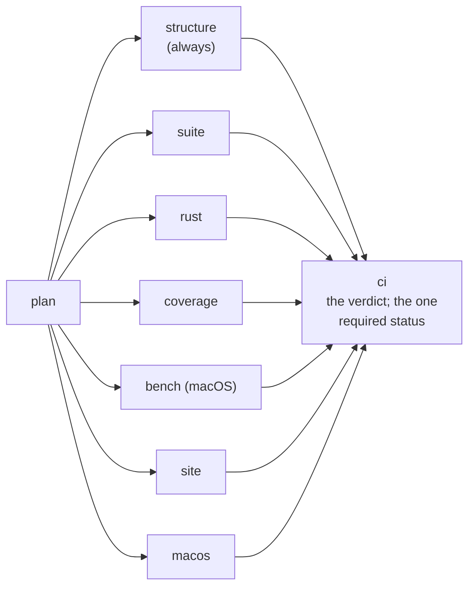

# Continuous integration

How a change is validated: one workflow that is an adapter over repository-owned tooling, a
planner that reads one model of what can affect what, gates that run in parallel and only
when a change can reach them, and one status a branch rule can require. Publication is not
here — [`GITHUB_PAGES_PERFORMANCE.md`](GITHUB_PAGES_PERFORMANCE.md) is the latency-sensitive
path that puts a master commit on GitHub Pages, and it runs beside this workflow rather than
after it. Every number about either lives in the measurements, never here:
`scripts/ci-baseline` records what GitHub observed into `.ai/repo/ci/baseline.json`, and
every run writes its own summary.

## The shape



and beside it, on the same commit, never after it:


`plan` reads the model and decides. `structure` runs the cheap, deterministic gates every
plan has (`scripts/ci/shell-lint`, `scripts/ci/core-check`) and the structural gates the
change needs. The other jobs run when the plan selected a gate they carry, in parallel, each
through the script a person runs. `ci` always runs and turns the plan and the jobs' results
into one verdict.

A job does not list its gates. `scripts/ci/run-plan --plan plan.json --job <job>` reads the plan and runs every
gate the model assigns to that job, in the model's order, skipping the ones the plan did not
select; a job that runs one gate in a step of its own — the rust job's `rust-check`, which
needs a mode and an artifact argument — says so beside that step with `--skip`. The
alternative was tried and failed silently: four gates the model assigned to `structure` were
reported as "run" in every plan summary and executed by nothing, because the job's steps
were written by hand. A gate declared in `.ai/repo/ci/gates.yaml` now runs or is named as
skipped, and nothing in between.

Two workflows, and the split between them is what each decides. `.github/workflows/validate.yml`
decides whether a change may merge. `.github/workflows/pages.yml` decides what the public site
shows: it triggers directly on a master push whose paths can change the site and publishes as
soon as the bytes are proved, without waiting for gates that cannot change a published byte.
Neither repeats the other's work.

## The model: what can affect what

`.ai/repo/ci/gates.yaml` is the one place the dependency map lives. It declares the gates
(each with the job that carries it and the command it runs) and the path classes: a
pattern set and the gates a change under it can affect. `scripts/ci-plan` reads it and
nothing else; the workflow carries no path list of its own. The rules the planner applies
are written at the top of the model. In short: the always gates run in every plan; a
changed path selects the gates of every class it matches, as a union; a class may escalate
the whole plan; a path no class knows escalates it too, and the plan names the path; a
gate brings what it implies and what it requires.

```bash
scripts/ci-plan --check                       # the model resolves: every gate, job and reference
scripts/ci-plan --format text                 # what CI would run for the working tree against master
scripts/ci-plan --base origin/master --head HEAD
printf 'docs/DESIGN.md\n' | scripts/ci-plan --files - --format text
scripts/ci-plan --full "why" | jq .selected   # the full plan
```

Two execution classes, both evidence-driven:

- **affected** — a pull request: the gates of the classes its changed paths fall in. Nothing
  is skipped on a hope; a gate is left out only when no changed path is in a class that
  names it, and the plan says so for every gate.
- **full** — every gate but the on-demand ones: a push to master, the nightly schedule, a
  manual dispatch, a pull request labelled `ci:full`, a change to the pipeline itself (the
  workflow, the actions, `scripts/ci/`, the planner, the model, the runner), or a path the
  model does not know.

A third distinction cuts across both. A gate the model marks `on-demand: true` is planned
only when the plan is asked for it (`scripts/ci-plan --on-demand`), which the nightly
schedule, a dispatch and a `ci:full` pull request do and a routine push does not. Three
gates carry it — `macos`, `rust-bench` and `installer-live` — and what they share is a macOS
runner rather than a subject. The reason is arithmetic, and the model states it: this
repository pushes to master about every seven minutes, the macOS suite runs for about 106
minutes, and three macOS jobs per push is demand no shared runner pool answers. On
2026-09-10 four master runs had every Linux job finished — five of them red — while their
`ci` job had not started, because it needs those three and they had been queued for hours;
master carried the defects overnight with every check apparently green, because a run that
never reported and a run that reported green look identical in the interface. The gates were
not weakened: they run in full every night and on request, which is more often than they
were completing. `ci` still needs their jobs and still turns red when one of them does.

To force full validation of a pull request, add the label `ci:full`; the `labeled` event
re-plans it. To see why a gate ran or did not, read the `plan` job's summary or the
`ci-plan` artifact, or run the planner on the same diff locally.

`test/cases/94_ci_plan.sh` proves the relationships that matter: a Rust change selects the
Rust gates and never the site, a site change the site gates and never a Rust gate, a
document the site and the registry checks, the distribution every implementation, the
pipeline and an unknown path the full plan, an inert path only the always gates; and that
the model refuses a dangling reference. `test/cases/26_ci_wiring.sh` proves the workflow
is an adapter over the model: every gate's job exists, is gated on the plan's output for
that gate, is needed by `ci`, and `ci` always runs.

## The gates

The list, with the command each one runs, is the model: `scripts/ci-plan --full x --format
text` prints it, and `.ai/repo/ci/gates.yaml` explains each. The commands are the ones a
person runs:

```bash
scripts/ci/run-plan --job structure --plan plan.json   # one job's gates of a written plan, as CI runs them
scripts/ci/shell-lint                  # syntax and shellcheck over the tool, the scripts, the cases
scripts/ci/core-check                  # doctor, watch, context, continuity, plan validate, github-sync, references, site data
scripts/ci/providers-check             # one provider declaration, every projection current, no provider list by hand
scripts/ci/worktree-check              # one constant, the guard wired, every document naming the same container
MJ_TEST_JOBS=4 bash test/run.sh        # the behavioural suite, four cases at a time
scripts/rust-check --ci                # every Rust gate but coverage, plus the benchmark check
scripts/rust-check --integration       # the executable built and the registry checks only
just coverage                          # coverage with test code out of the denominator, against
                                      # scripts/rust-coverage-threshold and, for the session/continuity
                                      # domain, scripts/session-coverage-threshold
scripts/site-build && scripts/site-check
SITE_PROBE_JOBS=4 scripts/site-probe   # every route at three widths, four routes at a time
```

`just ci-plan`, `just ci-structure`, `just ci-fast` and `just ci-full` are the recipes.

## The suite in parallel

`test/run.sh` runs the cases through a bounded pool when `MJ_TEST_JOBS` is set: that many
at a time, each with its own log, then the cases that declare `# majordomus-exclusive:
<reason>` one at a time, and the verdicts rendered in name order at the end with a failing
case's whole log before its line. Without `MJ_TEST_JOBS` it runs serially, streaming, as
it always has. The semantics are the serial runner's: a failing case turns the run red, a
filter that matches nothing is a usage error, an empty case directory is a usage error, and
`MJ_TEST_REPORT` writes one row per case (name, result, seconds, phase) for the summary.

The jobs that run the suite check out the whole history: a case that clones the checkout
into a fixture and pushes cannot push a shallow clone. So does the `rust` job, for the
other reason: `generate --check` runs there, and the changelog it checks is composed from
the release records, the decisions and `git log <previous>..<this>`. A checkout one commit
deep has none of that history, so every release record names a commit the clone does not
have, the composer writes the degraded document
`project.release-is-a-projection` requires of it, and the gate reports the committed
artifact stale for a reason no branch caused. A gate reads its inputs; the job fetches
them. A case may read the checkout it
lives in but must not write into it while other cases run;
the parallel phase checks `git status` before and after and fails naming the paths when
something changed. The cases that must write there (the two that build the site into
`site/public`, the one that edits and regenerates a derived document) carry the exclusive
header. The Rust cases drive the executable `MAJORDOMUS_BIN` names when it is set (CI
builds it once per job and hands it to every case), and build it once through cargo
otherwise; the two whose assertions are cargo's own (the crate's HTTP and projection suites,
the doc examples, the benchmark build) keep cargo.

## The browser probe

`scripts/site-probe` measures one route per browser process: the three widths are three
iframes of that route side by side in one page, each measured by the same script as
before (viewport against scroll width, the elements and text runs past the right edge, the
diagrams rendered against the diagrams declared). `SITE_PROBE_JOBS` bounds how many routes
are measured at a time; the findings are rendered in route order whatever the order the
processes finished in, and a finding still names the route, the width, the assertion and
what was measured. The homepage behaviour checks (the mobile menu, the dropdown, the theme
toggle) are unchanged. `--quick` remains the local sample.

## Caches and artifacts

Caches hold reusable dependency and build state; artifacts carry a job's outputs to a
later job or a later phase. Jobs run on isolated runners, so nothing relies on a shared
filesystem.

| cache | holds | key | invalidation | scope |
|---|---|---|---|---|
| npm (`actions/setup-node`) | the npm cache for `npm ci` | OS, `package-lock.json` hash | the lock file changes | restored from master when a branch has none |
| Rust (`Swatinem/rust-cache`, `.github/actions/setup-rust`) | the cargo registry, the git checkouts of dependencies, `target/` | job, OS, toolchain, `Cargo.lock` | the lock file or the toolchain changes; a red job saves nothing | per job, restored from master when a branch has none |

Nothing else is cached: Zola is one download, shellcheck one package, Chrome is on the
runner image. What a cache holds is never a source of truth: every gate reads the checkout.

| artifact | from | for | retention |
|---|---|---|---|
| `ci-plan` | `plan` | the verdict, a person asking why | short |
| `majordomus-cli-<target>` | `rust` | any later job or phase that needs the executable without building it: the debug binary and `majordomus-cli.json` (commit, target triple, rustc, `Cargo.lock` digest, profile) | short |
| `ci-metrics-<job>`, `ci-performance-metrics` | every job, `ci` | the timing rows of a run, gathered | longer |

## The Rust executable as a build output

`scripts/rust-check --artifact DIR` copies the debug executable into `DIR` with its
metadata beside it, and the `rust` job publishes that directory as
`majordomus-cli-<target>`. A consumer downloads it and sets `MAJORDOMUS_BIN`: the launcher
`bin/majordomus-mcp`, the suite and every Rust case honour that variable and never build
when it is set. Within one run the suite does not wait for the `rust` job: measured, the
suite job's own build from a warm cache costs seconds while waiting for the `rust` job
would serialise minutes, so the two run side by side and the artifact serves the phases
that come after a run (a release, a scenario runner over the real binary). Release builds
belong to a release workflow; every gate here uses the debug profile, which is what the
cases and the crate's own suites drive.

## Pages

Publication has its own workflow and its own document,
[`GITHUB_PAGES_PERFORMANCE.md`](GITHUB_PAGES_PERFORMANCE.md). What matters here is the
boundary: this workflow's `site` job builds, checks and probes the site as a gate on merging,
and publishes nothing; `pages.yml` builds and checks the same commit again — cheaply, without
the probe and without a generation — and publishes. The duplication is deliberate and small:
the publication path cannot depend on a job it does not wait for, and what it repeats costs
seconds.

Concurrency: a pull request's runs here are superseded by its next commit; every other run of
this workflow is its own group and neither waits for nor cancels another, so a run held up by
a scarce runner does not hold up the next commit's evidence. Deployments are the opposite —
`pages.yml` cancels a superseded deployment, because the site is a projection of the newest
commit and finishing an older one would publish an older tree.

### The three ways a deploy fails, and who reports each

A deploy that does not put the intended commit in front of a reader has failed, and until
2026-09-11 the three ways that happens were reported with three different volumes.

**The build refuses.** `scripts/pages build` establishes the committed derived data is current
by fingerprint before rendering it, and refuses a stale tree. The run goes red and the
`publication state` step writes `::error title=Not published` on it. This is the loud one, and
it is also by far the most frequent: both failures of 2026-09-11 (runs 34549001300 and
34550274563, the merges of #202 and #203) were this, and both merge parents were already stale
before the merge — the pull request's own `site` gate had been red and the merge happened
anyway, because `master` has no required status check.

**The run is cancelled.** `cancel-in-progress` is a push's privilege and a cancelled run is not
a failure; `gh run list` says `cancelled` whether gh-pages was pushed or not. A run is only
ever cancelled by a newer run of a newer commit starting, so the chain always ends in a run
that publishes or one that goes red — a cancelled run cannot be made red from inside, so what
acts on it is `pages-live` on the next validation of master.

**GitHub's own build errors.** This was the silent one. Publishing is two steps and the second
is GitHub's: `pages build and deployment` turns the pushed branch into the served bytes, and it
can error on a branch that was pushed perfectly. On 2026-09-10 at 17:35:10Z it errored on
gh-pages commit `dfd9c989c` with *Page build failed.*; the push had succeeded, the branch was
right, the workflow reported success, and the site served the previous commit for 27 minutes
with nothing red anywhere. The publication probe above it is `continue-on-error` on purpose —
it waits on a queue, a build and a CDN that this repository does not own, and a gate on
somebody else's latency is a gate that gets waived — but *slow* and *failed* are different
facts and the second one has an API. `scripts/pages built` reads it, in one place, for both
callers: `pages.yml` fails the run on an errored build at the moment it happens, and
`scripts/ci/pages-check` asks the same question afterwards through the same command. A build
that has merely not finished stays a note; only `errored` is a failure.

## Where a gate cannot reach

A gate that never fires is worse than one that fails, because the verdict still reads
complete. Three ways that happens here, all measured on 2026-09-10 rather than reasoned
about, and each of them cost a real outage or a real afternoon.

**The staleness catch cannot run on the path most merges take** — the driver resolving to
ours is a design decision working correctly, and the defect is that the only thing checking
its result runs in a `pre-commit` hook, while no hook of any kind runs for a merge the server
creates. `.gitattributes` sends
derived artifacts to `scripts/merge-derived`, which resolves them to *ours* and exits clean.
That is deliberate: a derived file carries a fingerprint of the tree it was generated from,
so after a merge neither side's value is right and the answer comes from running the
generator, not from a conflict marker. The design leans on `scripts/pages current` in
`.githooks/pre-commit` to refuse the stale result one command later — and **a `pre-commit`
hook cannot run for a merge the server creates.** Merging a pull request on GitHub produces a
commit with `committer=GitHub`, and no client-side hook exists on that path. It is not a
bypass; it is the action this repository tells people to take. With no branch protection
(`gh api repos/<owner>/<repo>/branches/master/protection` answers *404 Branch not protected*)
nothing server-side compensates, and the `site` gate that does check currency is advisory and
reports after the merge. So the first thing in the pipeline that can actually refuse is the
Pages build, and it refuses by failing publication rather than by failing a pull request. The
symptom is always "the site is stale" and never "the branch is red".

The vivid form: a stale recording rides through a merge untouched, so two consecutive master
merges can carry the *same* `source_hash` — nothing regenerated between them. A guard whose
coverage is inverse to its usage is worse than a missing one, because nobody notices it is
absent.

The condition above was observed on 2026-09-10 and then repaired, and the gap it illustrates
is structural rather than a description of how the trunk stands today — so do not test this
by looking at the trunk and concluding the finding expired. The commits carry their own
evidence permanently: `git show <commit>:site/data/generated/source.json` beside
`scripts/pages fingerprint` on that tree, and `git log -1 --format=%cn` for who committed the
merge.

**A check whose input goes empty can vanish instead of failing.** `scripts/site-check`
derives `PREFIX` by stripping scheme and host from `base_url`. At an apex domain the path
component is empty, and the block that uses it is guarded by `if [ -n "$PREFIX" ]` with no
`else` — so it emits neither `ok` nor `bad`. The verdict still reads complete. Note that
simply removing the guard is wrong: the filter it protects would then match everything its
own first stage can emit and print a green `ok` over an empty set. What an empty prefix needs
is a *different* predicate, not the same one ungated.

The tool has vocabulary for this and the doctrine gates use it: `mj_doctrine_skip` prints the
check, says it did not run, and gives the reason — see the blocker and scope gates in
`lib/check.sh`. A gate with only `ok` and `bad` makes silence the path of least resistance
every time an author meets a case they cannot decide.

**Two queries worth running against any new gate.** The first is this document's; the second
came out of the apex case above:

- for every field a validator reads out of a state record, can something write it?
- for every value a check derives, is empty distinguishable from absent?

The first has a mechanical form — `grep` the readers and the writers — and it found that a
task's `requires` had five readers and no writer at all, so `check` reported "the task
declares no obligations" truthfully and forever. In each case the rule existed, the validator
ran, and its answer was *true about the half it could see*.

**One correction for whoever proposes the obvious repair.** The natural fix for stale derived
data is to let the Pages build re-derive rather than refuse. It does not work, and the reason
must be stated precisely or it is refutable in one command. The **input fingerprint is
deterministic** — `scripts/pages fingerprint` three times on one tree gives one value. What is
machine-dependent is the **generated content**: `%h` abbreviates against the local object
store, a depth-1 checkout writes a degraded changelog, a concurrent derive can read a sibling
worktree root. A build that re-derived could therefore publish a third answer matching neither
side. State it as content-dependence, never as fingerprint non-determinism.

One thing the generation guard is not: the digest it compares is taken over `Cargo.toml`,
`Cargo.lock`, `build.rs` and `src` only, with `benches/` and `tests/` deliberately outside
it — which is why a branch that changes no Rust may legitimately use a binary built in
another worktree.

**A note about the plan.** `majordomus plan validate` refuses an issue that names no
milestone. So an area of standing work with no milestone is not merely unfiled — the work in
it cannot be recorded in the plan at all, which is how a repository can land a great deal of
change against a plan that never moves. If a gate finds something worth an issue and no
milestone fits, the milestone is the missing part; do not park the issue under the
least-wrong parent, because status here is derived from the graph and a false parent
propagates into the roadmap and the waves.

## Platforms

Linux is the blocking path for everything that does not depend on the platform: lints,
documentation, coverage, the benchmark runner. macOS runs what does: the behavioural suite
under the stock macOS shell (bash 3.2) and BSD userland, and the crate's own suites there
(files, signals, the lease, the spawned processes). The benchmark check against a committed
baseline runs on macOS, the one platform with a baseline under `.ai/repo/benchmarks/rust/`.
`docs/HARDCODING_LEDGER.yaml` records the platform list as a deliberate decision.

The macOS gates are the on-demand ones (above): the nightly schedule, a dispatch and a
`ci:full` pull request plan them, a routine push does not, because a macOS runner is what
this repository waits hours for and a gate queued behind one reports nothing at all. A
change that is likely to be platform-dependent — the shell tool, the distribution, the
crate's process and file handling — should carry the `ci:full` label rather than wait for
the night, and that is a judgement a reviewer makes, not one the model can.

## Telemetry and budgets

Every job writes a summary (`scripts/ci/summary`): the plan's selection, the cache hits,
the durations of its gates and steps (`MJ_CI_TIMINGS`, `scripts/ci/timed`), the slowest
cases of the suite (`MJ_TEST_REPORT`), the artifact it produced. The `ci` job gathers the
rows of every job into `ci-performance-metrics`. `scripts/ci-baseline` reads recent runs
back through the GitHub API and writes `.ai/repo/ci/baseline.json`: per run, per job and
per step, with the commit, the runner, the event and whether the caches hit, so a later
regression has a table to be compared with. The budgets are those measurements; a budget
written here would be stale the day after.

## Reproducing CI locally

```bash
scripts/ci-plan --format text                       # what would run for this working tree
just ci-structure                                   # the always gates
just ci-fast                                        # the gates the plan selects for this tree
just ci-full                                        # every gate
scripts/rust-check --ci                             # the Rust gate as CI runs it
just coverage
scripts/site-build && scripts/site-check && SITE_PROBE_JOBS=4 scripts/site-probe
MJ_TEST_JOBS=4 bash test/run.sh                     # the suite in parallel
bash test/run.sh                                    # serially
scripts/ci-baseline --runs 10                       # record what GitHub observed
```

`scripts/ci/verdict --plan plan.json --needs needs.json` renders the same verdict CI
renders, from a plan and a `needs` context; `test/cases/94_ci_plan.sh` drives it with
fixtures.
