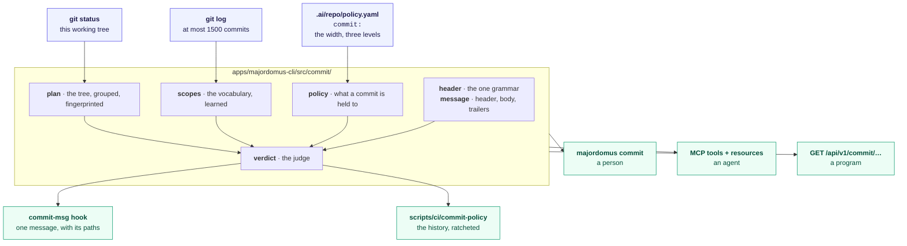

# The commit

A commit message in this repository is a value with a grammar, a policy and a verdict, not a
convention people are reminded of. This page is what that means, what it costs, and where
each half lives.

## The problem it was written for

Two halves of this subject existed and did not know about each other.

The repository could **read** a commit: `release::commits` has parsed conventional subjects
out of the log to build the changelog since the changelog existed, resolving `I1305` and
`M000` against what the layer holds and dropping an id that resolves to nothing.

The repository could not **judge** one. `project.conventional-commits` stated the convention
and its failure behaviour read *"No command decides this rule; a reviewer does."* The
measurement, taken the day this was written: over 1161 non-merge commits, 48 subjects exceed
the width this project declares for a line of anything and 38 carry a type word no
vocabulary contains. Nothing had noticed, because nothing was looking.

The third half was outside the repository altogether. The *procedure* for writing a commit —
derive a scope from the path, link the work, do not invent an issue number, a fix needs a
test — lived in prose that an AI client read and carried out by hand, one file per client,
with a path-to-scope table maintained by a person. A workflow whose semantics live in a
prompt is unversioned, unenforceable, untestable, and true for exactly one tool.

## What there is now



Four capabilities, declared once in
`apps/majordomus-cli/src/capability/builtin/commit.rs`, each projected onto every surface
the exposure policy admits:

| capability | what it answers | CLI | MCP | HTTP |
|---|---|---|---|---|
| `commit.scopes` | which scopes this history uses, how often, about which directories | `majordomus commit scopes` | `majordomus_commit_scopes`, `majordomus://commit/scopes` | `GET /api/v1/commit/scopes` |
| `commit.plan` | what the working tree would commit, divided, fingerprinted | `majordomus commit plan` | `majordomus_commit_plan`, `majordomus://commit/plan` | `GET /api/v1/commit/plan` |
| `commit.validate` | the verdict on one message | `majordomus commit validate` | `majordomus_commit_validate` | `GET /api/v1/commit/validate` |
| `commit.history` | every commit in a range, in one pass | `majordomus commit history` | `majordomus_commit_history` | `GET /api/v1/commit/history` |

Nothing in that table is registered anywhere twice. The MCP tool name, the route and the
command line are fields of the capability declaration; the OpenAPI operation, the Cockpit
payload, the shell completion and `docs/generated/capabilities.md` are derived from it, and
`majordomus capabilities projections --unmet` fails the build when a declaration claims a
command line the executable does not have.

**Making the commit is deliberately not here.** `git commit` is a repository mutation, and
the exposure policy (`command_graph::policy`) stops every machine surface at local mutation.
An agent may ask what a commit *would* be and whether a message passes; a person commits. The
subsystem is shaped to that: the planner and the judge are pure functions of a tree and a
message.

## The grammar

One parser, `commit::CommitHeader::parse`, total and never failing:

```text
  feat(commit)!: the header is parsed once
  ^^^^ ^^^^^^ ^  ^^^^^^^^^^^^^^^^^^^^^^^^
  word scope  breaking            subject
```

The changelog and the judge read the same parse and disagree only about what to *do* with a
header that is not conventional. For the changelog that is not a failure — a commit nobody
spelled conventionally still happened, and a changelog that dropped it would lie about what
the release contains. For the judge it is one finding, `commit.not_conventional`, and the
consequences of it are deliberately not reported as findings of their own: somebody fixing
`update stuff` does not also need to be told its scope is unknown.

The type words are `ChangeKind`'s, which the changelog already renders headings from. There
is no `types:` key in the policy, because a second copy of those words is exactly the
duplication this subsystem removes. `merge` is among them: this repository writes
`merge: bring origin/master into feature/x` by hand for integrations, so those subjects are
held to the same width and the same references as every other rather than exempted from
being checked at all.

## The policy

`commit:` in `.ai/repo/policy.yaml`, whose shape the schema `majordomus.policy/v1` owns and
from which `share/allow/policy.txt` is generated:

```yaml
commit:
  subject_max_chars: 100
  scope_unknown: warning
  fix_requires_test: warning
  reference_unresolved: error
  breaking_unexplained: error
```

`subject_max_chars` is measured, not chosen. The git convention is 72; over 1161 non-merge
commits of this repository the median subject is 73 characters and the 95th percentile is 98.
100 is what this project declares for a line of anything and a width this history can meet. A
limit half the history violates is not a limit — it is noise that teaches people to ignore
the check.

The three levels are the judgements a repository can reasonably disagree about. `off` is a
value, not an absence: a repository that has decided a check does not apply to it has made a
decision, and a decision is worth reading back.

## Findings

| code | severity | what it means |
|---|---|---|
| `commit.not_conventional` | error | the header is not `type(scope): subject` |
| `commit.subject_empty` | error | nothing after the colon |
| `commit.subject_too_long` | error | wider than `subject_max_chars`, measured whole |
| `commit.subject_trailing_period` | error | a subject is a title, not a sentence |
| `commit.unknown_scope` | policy | a scope the history has not used |
| `commit.breaking_unexplained` | policy | `!` with no body and no `BREAKING CHANGE:` |
| `commit.unresolved_reference` | policy | a record id the layer does not hold |
| `commit.fix_without_test` | policy | a `fix` with no test among its files |

Every one is a `Diagnostic` — the same severity, code and message the rest of this executable
reports with, so a finding reaches a terminal, a JSON consumer and an MCP client the same way.

## The scope vocabulary, learned rather than declared

The usual way to answer *"what scope does this change belong to?"* is a table of path
patterns. It is correct on the day it is written; then a directory is added, or renamed, or a
subsystem splits, and the table names a scope the history stopped using months ago, with
nothing to notice — a table has no way to be wrong.

`commit.scopes` reads the answer out of the history instead. Every commit is a worked example
of which scope a set of paths belongs to, decided by whoever made the change and kept by
whoever reviewed it. At most 1500 commits are read; scopes are counted, and each scope's
association with directory prefixes four segments deep is counted with it.

```console
$ majordomus commit scopes
learned from 1161 commit(s), at most 1500
  derive                211  site, site/data, site/data/registry
  site                  134  site, site/data, scripts
  ci                     60  docs, scripts, site
  plan                   44  site, site/data, site/data/generated
  …
```

A scope outside the vocabulary is a **warning**, never a refusal: inference must not refuse
the first commit of a subsystem it has never seen. The vocabulary needs no maintenance — a
subsystem committed today is in it today, and one nobody has touched for a year sinks on its
own.

Four segments is measured too. This repository's source lives at
`apps/majordomus-cli/src/<subsystem>/`; three segments stop one level above the subsystem,
where a dozen scopes all have commits and no path can be told from another.

## The plan

```console
$ majordomus commit plan
branch       feature/the-commit-is-an-intent · no upstream
tree         16 staged, 0 unstaged, 0 untracked
fingerprint  11a032984c6f @ 8998e11fd

commit 1    <type>(release): <subject>
  why        4 file(s) under apps/majordomus-cli/src/release, which 8 prior commit(s) scoped `release`
  …
```

Three things are worth saying about that output.

**The subject is empty on purpose.** What a change *did* is the one thing no evidence in the
tree can state, and a planner that wrote a confident sentence about it would be writing
fiction into the history. The scope and the kind are derived where the evidence decides them;
the sentence is yours.

**The grouping is a recommendation with its reasoning attached**, never an automatic split.
Paths the history scopes alike are one commit and the rationale says how many prior commits
say so. Paths in directories several scopes have equal claim to are one group and the
rationale says that, which is a different situation from a directory the history has never
scoped and leads to a different next step. Nothing is split on low confidence.

**The fingerprint is the multi-agent half.** A plan is derived from a tree at a moment. In a
repository worked by one person that is a detail; in this one, where several workers share a
checkout and more share a repository, a plan computed at one HEAD and executed at another
commits files somebody else staged under a message about work that is no longer what changed.
The fingerprint is the repository (git's common directory), the worktree (this checkout's
path), HEAD, and a hash over every change with its stage and status. Anything acting on a
plan compares it with the tree in front of it first, and what it reports is a sentence:

```text
HEAD moved from a1b2c3d4e to e4f5a6b70 since the plan was made
the plan is of another worktree (/repo-wt/feature/x rather than /repo)
```

It is not a lock and it does not prevent the race. It refuses to be the one that loses it
silently.

## Where it is enforced

| moment | what runs | measured |
|---|---|---|
| `commit-msg` | `.githooks/commit-msg` → `commit.validate` with the staged paths | 806 ms |
| a gate | `scripts/ci/commit-policy` → `commit.history`, twice: the branch and the history | 1720 ms |
| CI | the `commit-policy` gate, in the `structure` job | as above |

Those are debug-build numbers on a loaded machine, which is the worst case a person meets.
The three history-reading commands cost about a second each — `commit scopes` 957 ms,
`commit plan` 926 ms, `commit history` 992 ms over 1788 commits — and **nothing on a hot path
pays any of it**: `env enter` is 38 ms against a 750 ms budget, `completion query` 11 ms,
`--help` 10 ms, none of them touching the log. The history is read only where a person is
already waiting for git.

The hook runs at the one moment the message and the files both exist, which is why
`fix_requires_test` can be asked there and nowhere else: a fix with no test among its files
is worth noticing while adding one is still cheap. The gate reading the history knows no
paths and therefore does not make that finding — a judgement whose evidence is absent is not
made rather than guessed.

The hook is registered under `enforcement:` in `.ai/repo/policy.yaml` as
`commit-policy-on-message`, which is what makes `majordomus doctor` reconcile it: the path
must resolve, be executable, and be invoked by `.githooks/commit-msg` without its exit code
being swallowed.

### The baseline

54 commits of this history do not satisfy the policy. Every one is published, so rewriting
them is not on the table. The count lives in `.ai/repo/commit-policy-baseline.txt`; the gate
fails when it rises and reports when it falls. Commits a branch *adds* are held to the policy
outright with no baseline, because the hook refused those messages while they were being
written — a failure there means the hook was bypassed or the policy moved.

```console
$ scripts/ci/commit-policy
commit-policy: branch 8998e11fd..HEAD, 0 failing
commit-policy: history 54 failing, baseline 54
```

A checkout with no trunk to compare against reports that it measured nothing rather than
reporting a pass.

## Using it

```console
$ majordomus commit plan                          # what this tree would commit, and why
$ majordomus commit scopes                        # the vocabulary, and what it was learned from
$ majordomus commit validate <<'EOF'              # one message, before writing it
feat(commit): a subject
EOF
$ majordomus commit validate --rev HEAD           # the message of a commit already made
$ majordomus commit history origin/master..HEAD   # this branch's commits
$ majordomus commit plan --format json            # the same answer, for a program
```

Everything above works offline. Nothing in this subsystem reaches a network, and nothing
about entering the repository, completing a word or answering `--help` reads the history —
the vocabulary is learned at the moment a commit is being planned or judged, which is a
moment that already involves waiting for git.

## Proof

| what | where |
|---|---|
| rule | `.ai/repo/rules/project/conventional-commits.v2.md` (blocking) |
| unit | `apps/majordomus-cli/src/commit/` — 46 tests beside the code they judge |
| behavioural | `test/cases/274_commit_policy.sh` — real repositories, real worktrees, the real hook |
| gate | `scripts/ci/commit-policy`, declared in `.ai/repo/ci/gates.yaml` |
| declaration | `apps/majordomus-cli/src/capability/builtin/commit.rs` |

```sh
bash test/run.sh 274_commit_policy
scripts/ci/commit-policy
cargo test --manifest-path apps/majordomus-cli/Cargo.toml --lib commit::
```

## What it deliberately does not do

It does not judge whether the subject is a good sentence, whether the change is atomic, or
whether the work was worth doing. A reviewer decides those, and a validator that pretended to
is a validator nobody trusts.

It does not create issues, push, or open pull requests. Those are remote mutations with their
own failure modes, and this subsystem's whole value is that it is a pure function of a tree
and a message: it works offline, it cannot half-succeed, and every answer it gives can be
recomputed and checked.
