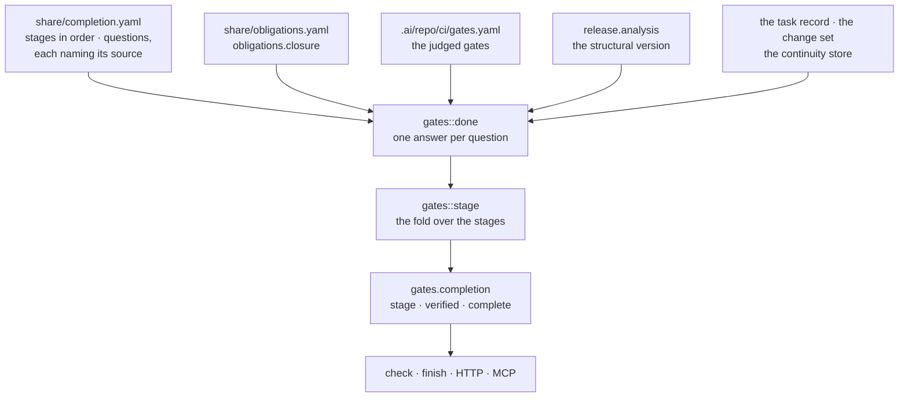

# Completion — done as a state the repository decides, not a word a worker uses

What it takes for a piece of work in this repository to be called finished: one shipped
declaration of the questions, each answered from the subsystem that already holds the
fact, a lifecycle stage folded from those answers and written down by nobody, and one bit
— `complete` — that every surface reads and none recomputes. Behaviour as implemented and
tested; where this document and the executable disagree, the document is wrong and changes
in the same commit. The decision is ADR 57, proposed and not yet in this tree: it also
decides the live verification of a deployment, which arrives with it. The rule it serves
is `project.completion-is-proved` under
[`.ai/repo/rules/project/`](../.ai/repo/rules/project/).



## The lifecycle, and what a session is

A **session** is one execution episode of one worker: it opens, it may touch several
tasks, and it closes into a record that references what the episode produced. A **task**
is the one active unit of work in a checkout — `majordomus start` opens it, `majordomus
finish` closes it, and between those two the worker checkpoints, checks and hands over.
[`CONCEPTS.md`](CONCEPTS.md) holds those nouns; this document is about the last step, and
about why it is the one step a worker may not decide alone.

The failure it exists for is not carelessness. A worker reporting on its own work has no
incentive to say the validation did not run, and until ADR 57 the repository could not
contradict it at the level of the validation pipeline: `gates.completion` answered
`finishable: true` whenever no *recorded* gate run had failed, and no run had ever been
recorded in any checkout, because nothing ran the gates through the verb that records
them. Choosing the outcome `partial` skipped the verification, obligation and gate
validators entirely. `finish --outcome completed` had never been refused by a gate, and
structurally could not be.

**Implementation alone is not done.** Code that exists and is not committed is on one
disk; code that is committed and not pushed is invisible to every other worker; a branch
that is pushed and never lands changes nothing about what the repository ships; a trunk
that lands and never deploys changes nothing about what anybody runs; and a deployment
that "succeeded" while the old revision stayed live is the failure this repository has
paid for twice — on 2026-09-09 the public site served a commit from an unmerged branch for
half an hour, and on 2026-09-10 it sat hours behind the trunk, each time with every
tree-level gate green. Each of those is a separate fact about a separate place, and each
has a subsystem that already knows the answer. What was missing was the question.

## One definition of done

[`share/completion.yaml`](../share/completion.yaml) is the only declaration of what done
means. It is shipped with the tool, beside `share/obligations.yaml` and `share/events.yaml`,
and it carries two lists:

- **`stages`** — the lifecycle in order, each with an id, a title and a summary of what it
  means for that stage to be behind you.
- **`questions`** — each with an id, the stage it belongs to, the question as a person
  would ask it, the **source** its answer is taken from, and the remediation: the command
  that would settle it.

Nothing there is a checklist a person ticks. A checklist is exactly the artifact a worker
learns to tick, and every line of one is a new opinion that can disagree with the
subsystem that already holds the fact. A question names a source, and its answer is taken
from that source and from nowhere else:

| source | what answers it |
|---|---|
| `obligation:<token>` | the token's standing in `obligations.closure`, over [`share/obligations.yaml`](../share/obligations.yaml) |
| `gates` | the aggregate of every gate the change selects, from [`.ai/repo/ci/gates.yaml`](../.ai/repo/ci/gates.yaml) |
| `gate:<id>` | one gate of that model, by id |
| `change:test-path` | the change set itself: whether a test path is among the files the task touched |
| `release:impact` | the structural version analysis, `release.analysis` ([ADR 51](../.ai/repo/adrs/0051-the-minimum-release-version-is-measured-from-the-public-contract.md)) |
| `task:issue` | the task record's own `issue` field, resolved against the plan |
| `session:handover` | a continuation record for this task under `.ai/local/state/handovers/` |
| `elsewhere:<command>` | nothing reachable from the report; the command that answers it |

The reader is
[`apps/majordomus-cli/src/gates/policy.rs`](../apps/majordomus-cli/src/gates/policy.rs),
and it judges nothing. It parses the declaration, resolves every source it names, and
refuses a policy that is structurally wrong — a duplicate id, a question naming a stage
that is not declared, a question with no remediation, a version that is not 1. The
judgement is `gates::done`'s and the fold is `gates::stage`'s.

To see the policy and what it resolves to here:

<!-- majordomus:unrun it answers for the checkout it runs in with the executable built from it; cases 131 and 880 run gates.policy and gates.completion over a fixture -->
```bash
majordomus-cli run gates.policy --input '{}' --format json | jq '.output.problems, .output.unanswered_gates'
```

`problems` names a question whose obligation token `share/obligations.yaml` does not
declare — a defect of the distribution, since both files travel together, and the message
names the question so the fix is one edit. `unanswered_gates` is a different finding and
deliberately not a problem: a `gate:<id>` question whose gate *this repository's* CI model
does not declare is answered `exempt` **by name** in the report, because "the repository
asks no such question" and "the gate never reported" are different things and a reader is
entitled to the difference.

## The stage is a fold, not a field

A lifecycle written as a state a worker sets — `implementing`, `validated`, `deployed` —
is a claim, and the artifact a worker learns to advance. A pile of booleans a report
toggles is the same thing spelled differently. So there is no field to set.
[`gates/stage.rs`](../apps/majordomus-cli/src/gates/stage.rs) folds the answered questions
over the policy's stages in order:

- a stage whose every question passes or is exempt is **complete**;
- a stage with a question still owed — `queued` or `unknown` — is **pending**;
- a stage with a question that *refuses* — a failing gate, evidence gone stale — is
  **blocked**;
- a stage the policy declares and no question of this report reaches is **empty**, which
  neither blocks nor completes on its own.

The stage the task *stands at* is the first blocked one, else the first pending one, else
the last stage of the policy. A refusal anywhere wins over a pending stage in front of it,
because the refusal is what a reader has to act on. No policy at all is no completion: an
empty stage list yields `complete: false`, never a vacuous pass.

## Three words, three different facts

The report carries three booleans and they are not synonyms. Conflating them is how "the
pipeline is green" came to mean "nothing refused" and then, one reading later, "everything
passed".

| word | what it says | what makes it false |
|---|---|---|
| `finishable` | no required gate is known to be failing, stale, or blocked by one that is | a refusal; **absence of a verdict does not make it false** — it fills `unverified` |
| `verified` | `finishable` holds **and** every required gate has reported over this tree | one gate that never ran, or one whose recorded run no longer describes the files it is taken over |
| `complete` | every question of the policy passes or is exempt | any question still owed, anywhere in the lifecycle |

`complete` is the one field that may be read as "done", and no surface computes it a
second time: the shell validator, the HTTP route and the MCP tool are all reading
one execution of `gates.completion`. Absence is never a pass — a question whose
source has not spoken is `queued` (it was asked and nothing answered) or `unknown` (it
could not be asked), and one the change makes irrelevant is `exempt`. Those are three
findings and a reader gets all three.

## The workflow

<!-- majordomus:unrun the task lifecycle writes this checkout's task record, ledger and handovers; case 880 runs start, check, evidence --run-gates and finish inside a disposable repository -->
```bash
majordomus check                                   # where the task stands, and what it owes there
majordomus evidence --run-gates                    # run every gate the change selects; record each exit
majordomus evidence --covers <token> --command '<what proved it>'
majordomus handover < note.md                      # the continuation record
majordomus finish --outcome completed --verify-command '<cmd>'
```

`check` prints one `INFO stage` line naming the stage the fold derived, its state and what
it still owes there, beside the gate and obligation findings it already printed. The stage
is exported for the finish record, so a task closed short of completed carries where it
stopped and not only the word.

`evidence --run-gates` runs every gate the task's change selects, here, with the commands
the CI model names, through
[`scripts/ci/run-plan`](../scripts/ci/run-plan) — the same dispatcher CI runs — with
`MJ_GATE_RECORD` set, so each gate's exit is recorded as a `task.gate` line as it
finishes. The runs are recorded whether they pass or fail; a failing gate refusing
`completed` is the point. It takes no `--gate` and no `--covers`, because it is the
running of the whole selected plan rather than the recording of one fact.

`evidence --covers <token>` records that one obligation has been discharged, and now
accepts a token the *change* implies even when the task did not declare it at `start`: the
completion report derives applicability from each token's own inputs and from the
deployment plan, and a task cannot be restarted to say so. Such a token is added to the
task record's `requires` when it is discharged, so the closure judges it from then on
exactly as one declared at the beginning. A token the change does not imply and the task
did not declare is still refused.

### What the refusal looks like

With `verification.completed_means_complete` on, `finish --outcome completed` is refused
while `complete` is false. The refusal is not a summary: one `FAIL done <question>` line
per question still owed, each carrying the evidence its source gave and the command that
settles it — the `remediation` the policy declares. `finish` writes nothing and exits
`MJ_EX_CONTRACT` (10), the same code every other contract refusal uses.

The weaker outcomes are not refused over it. `partial`, `blocked`, `no_match` and `failed`
are honest statements that the work did not complete, each needing a note saying what
comes next or why, and the `task.finished` ledger line now carries the `stage` the report
derived and the `complete` bit beside the outcome. A derived handover
(`majordomus handover --derive`) gains a `# Completion` section with the stage, the version
impact, the deployment targets the change reaches and each question still owed, so the next
worker does not rediscover which gates ran or that a deployment was never verified.

## Applicability: what a change actually owes

Nothing here holds a task to a question its change cannot reach.

**The deployment plan** ([`deploy/targets.rs`](../apps/majordomus-cli/src/deploy/targets.rs))
says which surfaces a change reaches, derived from what the repository already declares
rather than from a list of deploy commands:

| target | applies when | derived from |
|---|---|---|
| `pages` | the change touches what the site is built from | the CI model's inputs for the `site-build` gate; the origin in `site/config.toml` |
| `release` | the change touches what the public surface is taken over | the CI model's inputs for the `version-surface` gate; the newest release record |
| a deployment's id | the object is `active`, states a `url`, and the change touches its build inputs | the objects under `.ai/repo/deployments/` |

A target that does not apply is in the plan **with the reason**, because "not applicable
because the change touches nothing the site is built from" and "not checked" are different
findings. A deployment object that is `declared` rather than `active` is not asked and not
pretended about.

**Implied obligations.** A task owes `pages`, `deploy` and `verify` when the plan says the
change reaches those surfaces, and `push` and `target` whenever it changed anything,
whether or not it declared them. The report's `obligations` carries each implied token with
an `applicable` flag, a `declared` flag and the reason; a token the change implies and the
task never promised is `queued` — a debt held by nothing — and not a pass.

**Exempt by name.** A `gate:<id>` question whose gate this repository's model does not
declare is `exempt`, with the evidence saying so in words. So is a question the change set
makes irrelevant.

**A repository with no release.** `release:impact` answers `exempt` when there is no
published release to measure against: no baseline exists, so no version is owed yet. The
version question is measured, not guessed, and a measurement without a baseline is not a
failure.

## Overrides

**There is no override for completion.** The weaker outcomes are the override, and they
are the honest statement: a task that is not complete says so with `partial` or `blocked`
and records the stage it stopped at. An escape hatch that let `completed` through over an
owed question would make the whole measurement decorative, which is the same argument
[`RELEASE.md`](RELEASE.md#the-version-two-statements-one-writer) makes about a version
override that could undershoot.

**The version has one**, and it goes one way only.
`majordomus release bump --level major|minor|patch` and `--exact 1.2.3` name a **higher**
version than the contract requires, for the cases where a maintainer means more than the
contract did, reported with its provenance. Neither may name a lower one
([ADR 51](../.ai/repo/adrs/0051-the-minimum-release-version-is-measured-from-the-public-contract.md)).

## Troubleshooting a refused completion

Read the report rather than guessing at it. Four commands, in the order they narrow:

<!-- majordomus:unrun the answers belong to the active task of the checkout they run in; cases 880 and 131 run these capabilities over fixtures -->
```bash
majordomus check
majordomus-cli run gates.completion --input '{}' --format json | jq '.output.stage'
majordomus-cli run gates.completion --input '{}' --format json \
  | jq '.output.questions[] | select(.status != "pass" and .status != "exempt")'
majordomus-cli run gates.policy --input '{}' --format json | jq '.output.problems'
```

| what you see | what it means | what settles it |
|---|---|---|
| `stage.state` is `pending` | a question of that stage has not been answered | the `remediation` on each id in `stage.owing` |
| `stage.state` is `blocked` | a question *refuses*: a failing gate, or evidence gone stale | fix the cause, then `majordomus evidence --run-gates` |
| a question is `queued` with "the change implies this obligation and the task does not declare it" | the change owes a token the task never promised | `majordomus evidence --covers <token> --command '<what proved it>'`, which declares it on the record |
| a question is `unknown` | its source could not be asked here | the `source` field names what would have answered; the `remediation` names the command |
| a question is `exempt` naming a gate | this repository's CI model declares no such gate | nothing; it is reported by name on purpose |
| `problems` is non-empty | the policy names an obligation token the shipped vocabulary lacks | a distribution defect: fix `share/completion.yaml` or `share/obligations.yaml` |

Every question in the report carries its own `evidence` — what was actually read, never a
restatement of the status — its `source`, and its `remediation`. If a refusal cannot be
explained from those three fields, that is a defect in the report and not a reason to work
around it.

## The policy key, and what a fresh repository gets

`verification.completed_means_complete` in [`.ai/repo/policy.yaml`](../.ai/repo/policy.yaml)
is what turns the bit into a refusal. It is **on** here.

It ships **off** in [`share/skeleton/policy.yaml`](../share/skeleton/policy.yaml), with the
reason written beside it: a repository with no CI model and no recorded evidence yet would
be refused every completion on its first day, which is not a discipline, it is an
obstruction. Until it is turned on, `majordomus check` reports exactly the same questions
and refuses nothing — so the answer arrives before the enforcement does, which is the order
that gets a policy adopted rather than disabled. The skeleton's `verification.finish_requires`
now also carries `obligations_met` and `gates_passed`, which it did not.

## Which surface carries what

| | command line | HTTP · MCP | resource |
|---|---|---|---|
| the completion policy | — (read through `check`) | `GET /api/v1/gates/policy` · `majordomus_completion_policy` | `majordomus://gates/policy` |
| the completion report | `majordomus check`, `majordomus finish` | `GET /api/v1/gates/completion` · `majordomus_completion` | `majordomus://gates/completion` |
| the CI model | — | `GET /api/v1/gates` · `majordomus_gates` | `majordomus://gates` |

Neither `gates.policy` nor `gates.completion` declares a command-line exposure of its own,
and that is deliberate: `majordomus check` and `majordomus finish` are already the command
line's answer to this question, and they *read* this report rather than deriving a second
one.

## What proves it

| | |
|---|---|
| `apps/majordomus-cli/src/gates/policy.rs` | the shipped policy parses, resolves against the shipped vocabulary and this repository's gate model, refuses an unknown stage, a duplicate id and a wrong version |
| `apps/majordomus-cli/src/gates/stage.rs` | the fold: `unknown` is pending and never complete, a blocked later stage wins over an earlier pending one, an empty stage neither blocks nor completes, and no policy is no completion |
| `apps/majordomus-cli/src/gates/done.rs` | every question answered from its source and nowhere else; a gate the model lacks is exempt by name; an implied obligation the task never declared is a debt |
| `test/cases/880_completion_is_proved.sh` | `completed` refused over an owed question, the selected gates run and recorded, an implied obligation discharged and declared by doing so, `completed` accepted exactly when the report says complete, and a weaker outcome recording its stage |
| `test/cases/131_completion_gates.sh` | the question set is the policy's, and a gate the model does not declare is exempt by name |

## Related

- [ADR 30](../.ai/repo/adrs/0030-a-task-owes-obligations-and-evidence-goes-stale.md) — a task owes obligations, and evidence goes stale
- [ADR 51](../.ai/repo/adrs/0051-the-minimum-release-version-is-measured-from-the-public-contract.md) — the minimum release version is measured from the public contract
- [`CI.md`](CI.md) — the gate model, the planner, and running the gates locally
- [`EVIDENCE.md`](EVIDENCE.md) — proof as a recorded execution (a different subject that shares an English word)
- [`RELEASE.md`](RELEASE.md) — the version, and the contract phase on the release path
- [`CONCEPTS.md`](CONCEPTS.md) — the vocabulary
- [`.ai/repo/workflows/task-lifecycle.md`](../.ai/repo/workflows/task-lifecycle.md) — the per-task sequence
