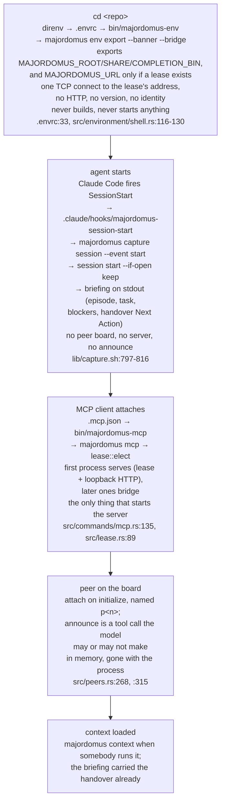
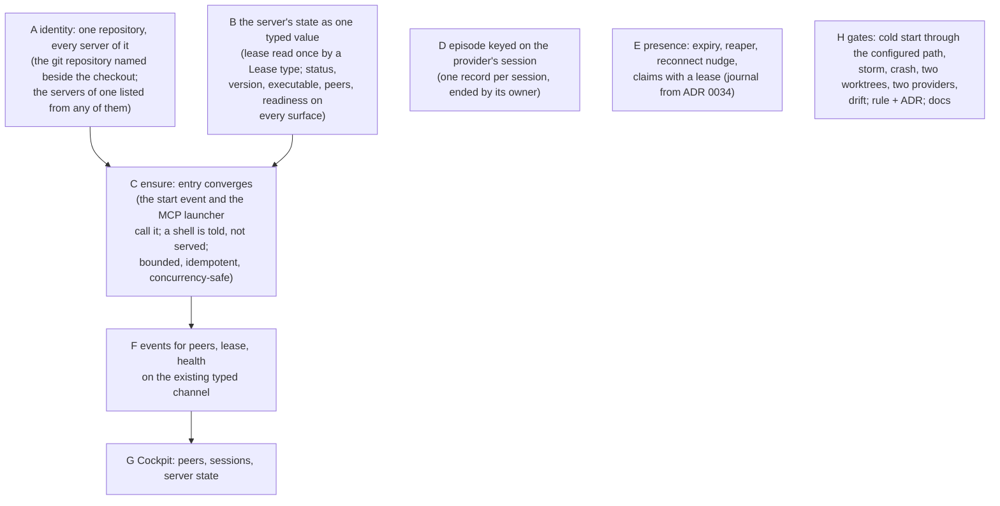

# Repository entry: what is automatic, what is decorative, and where it breaks

A forensic finding, measured on 2026-09-10 against `origin/master` at the merge of PR #147,
in the primary checkout and in one linked worktree. It answers one question: when a person
or an agent enters this repository, what converges on its own — a built executable, a
running shared server, an attached session, a peer on the board, a loaded continuation —
and what still waits for somebody to remember a command.

The target it is measured against is the invariant a prompt pack put to this repository
(the "automatic control plane" pack, `SPEC.md`): entering an enabled repository or starting
a supported agent session converges, idempotently and within bounded time, to one healthy
local server, discoverable surfaces, an attached session, peer presence and loaded
continuity, without a manual start or join. Every finding below names the file and line it
was read from and the command that shows it again. Nothing here is a count the repository
can compute; where a number matters, the command that computes it is given instead.

## Vocabulary

The pack speaks its own language. This repository already has words for most of it
(`CONCEPTS.md`), and this document uses the repository's.

| the pack says | this repository says | where |
|---|---|---|
| control plane | the shared server and the local services | ADR 0003, `ENVIRONMENT.md` |
| runtime desired / observed state | the lease, and what `env` probes | `apps/majordomus-cli/src/lease.rs`, `src/environment/services.rs` |
| service definition / endpoint descriptor | a web surface, discovered from its producer | ADR 0013, `src/web/discover.rs` |
| session identity | an episode (`session`) opened by the provider's event | ADR 0015, `lib/session.sh` |
| agent identity, peer presence | a peer on the board | ADR 0003, `src/peers.rs` |
| work claim | a scope: the task's, or the one a peer announced | `CONCEPTS.md` (claim), `src/peers.rs` |
| handover descriptor | a handover, resolved by worktree and branch | `CONTINUITY.md` |
| provider adapter | a lifecycle adapter in `lib/capture.sh` and the hook shims | ADR 0009, ADR 0015 |
| control-plane snapshot | `RepositoryEnvironment` (services) + `health.report` + `peers.list` + `continuity.state` | four capabilities today, one value nowhere |

## The path from entry to cooperation, as it is

What is genuinely automatic today: the executable is built by the first launcher that needs
it (`bin/majordomus-cli:36-56`); the first MCP client starts the server and every later one
attaches (ADR 0003); the provider's start event opens the episode and hands the model the
last handover's next action (ADR 0015, ADR 0017); a stale lease of every shape is taken over
(`project.shared-server-resilience`); a replaced executable loses its lease
(`tests/shared_units.rs:147`).

What is not: nothing on entry ensures a server; a shell or a non-MCP agent never gets one;
a linked worktree gets a server of its own and never sees the repository's; two sessions in
one checkout share one episode; the board forgets everything on a restart and never expires
anything; no surface shows the server's own state; the one command every worker is told to
run first died on a silent peer.

## Root causes, ranked

**P0 — the invariant cannot hold while these stand**

1. **One server per checkout, not per repository.** The lease lives at the checkout root
   (`src/lease.rs:63-65`), the root is the nearest `.ai/manifest.yaml`
   (`src/repository.rs:146-160`), every worktree has one, and the identity the probe
   compares is a digest of that root (`src/repository.rs:256-261`, `src/lease.rs:264`). So
   a linked worktree elects its own server on its own port with its own board, and
   `context`'s fallback to the primary's lease (`lib/context.sh:344-353`) reads a board that
   belongs to another checkout, whose peers carry no worktree field. ADR 0003, `CLAUDE.md`
   and `docs/MCP.md:50` all say "per repository". The pack's worktree scenario is not
   failing; it is unreachable.
   Reproduce: in a linked worktree while the primary serves,
   `bin/majordomus-cli env status --format json | jq '.services[0].availability'`.

2. **Entry ensures nothing.** `.envrc` watches the lease and evaluates one export
   (`.envrc:24`, `:33`); `bin/majordomus-env` never builds (`bin/majordomus-env:31-50`); the
   SessionStart shim opens an episode and touches no server (`lib/capture.sh:797-816`). The
   server exists only after an MCP client spawns `bin/majordomus-mcp`. A person's shell, a
   Codex or Gemini session without a lifecycle adapter, or a Claude session whose MCP
   handshake failed, all enter a repository that has no server and are told nothing that
   says so. `MAJORDOMUS_URL` is simply absent (`src/environment/shell.rs:116-130`).
   Reproduce: with no lease, `bin/majordomus-env export --shell direnv | grep -c URL`.
   The providers named above are examples of the ones that carry a lifecycle adapter and the
   ones that do not; which is which is not a list this document keeps — it is
   [`docs/generated/providers.md`](generated/providers.md), written from
   `share/providers.yaml` by `majordomus generate providers` (ADR 0024).

3. **The episode is one per checkout, keyed on nothing the provider sent.** `session start
   --if-open keep` returns the open episode whatever `--provider-session` says
   (`lib/session.sh:157-165`); the record has no provider field to write
   (`share/allow/session.txt`), so `continuity.state.provider` is declared and never
   produced (`src/capability/builtin/continuity.rs:157-159`, `:476`); an end event from any
   session closes the episode for all (`lib/capture.sh:860-884`). Seven concurrent sessions
   measured on 2026-09-09 had one record between them. The pack's "session registers
   automatically" is true for the first session and silently false for every other.
   Reproduce: pipe two SessionStart payloads with different `session_id` values through
   `.claude/hooks/majordomus-session-start` in a fixture, then `majordomus session`.

4. **Presence is process memory with no expiry, and the reconnect nudge never arrives.**
   The board dies with the server (`src/peers.rs:4-12`); in the ordinary `majordomus mcp`
   owner path nothing calls `reap()`, so a dead HTTP peer stays `attached: true` until the
   owner leaves (`src/shared.rs:27-71` has no reaper; `src/commands/serve.rs:71-75` is the
   only loop that does); announcements never expire (`src/peers.rs:127-135`); on a bridge
   failover the reinitialize response — the instructions that say "you have not announced
   anything" — is discarded (`src/mcp/bridge.rs:205-221`), so the exact incident
   `src/mcp/protocol.rs:331-343` cites is unfixed on the path it happened on. The journal
   under way on `feature/peer-board-survives-restart` (ADR 0034, allocated on the board,
   unpushed at the time of writing) answers the restart half and none of the rest.
   Since: the server's own reader reaps expired sessions on every path, and the bridge
   replays its client's last accepted announcement after a re-attach and carries it onto
   its own board after a takeover (stage 03, on this branch); expiry on announcements and
   the episode per provider session remain (stage 04).
   Reproduce: `curl -s "$MAJORDOMUS_URL/api/v1/peers" | jq '.peers[] | {id, attached, last_seen_seconds_ago}'`
   after a bridged client has been killed with `SIGKILL`.

5. **The server's own state is on disk and on no surface, and "ready" has three
   definitions.** The lease carries `pid`, `url`, `started_at` and the executable's
   identity (`src/lease.rs:281-291`) and no capability reads it (`grep -rn lease
   apps/majordomus-cli/src/capability/` is empty). `health.report` counts peers and says
   nothing else about the process (`src/capability/builtin/health.rs:416-420`). Readiness is
   decided independently by `Served::ready` (the producer's output exists,
   `src/http/surfaces.rs:152-159`), by `health.ready` (`capabilities > 0`,
   `health.rs:480-486`) and by `env`'s bare TCP connect (`src/environment/probe.rs:74-89`);
   the lease probe uses a fourth question, `GET /` plus the identity digest
   (`src/lease.rs:257-268`), and none of them asks the version. There is no `status`,
   `ensure`, `stop` or `explain` for the server in the executable (`src/cli.rs:31-71`), and
   the shell tool's `doctor` does not know the lease exists (`grep -n mcp lib/doctor.sh`).
   Since: the lease is one type read once and `server.status` serves it, with `serve
   status`/`ensure`/`stop` on the executable (stage 02, 03); `health.report` carries a
   `server` check decided by that same reading, so the report names the address, the
   version and whether what answers is the code on disk, and a stale lease is a finding
   rather than a silence (stage 09, `apps/majordomus-cli/tests/health_server.rs`). The
   readiness answers are named rather than merged: four questions about four subjects, each
   pointed at its owner in `docs/MCP.md` ("Four readings of \"ready\"") and in the module
   doc where the four meet (`src/capability/builtin/health.rs`). The shell tool's `doctor`
   still does not know the lease exists.
   Reproduce: `bin/majordomus-cli --help | grep -c -E 'status|ensure|stop'`;
   `curl -s "$MAJORDOMUS_URL/api/v1/health" | jq '.checks[] | select(.id=="server")'`.

**P1 — the invariant holds only by luck or only for one session**

6. **`majordomus context` died with nothing said whenever the newest peer on the board had
   not announced.** A bare `[ -n "$pscope" ] &&` was the last command of the listing loop
   (`lib/context.sh:398` before the fix); under `set -e` its status was the pipeline's, and
   the command exited 1 with nothing on either stream. The case that covers the section
   never put a silent peer last (`test/cases/106_context_peers.sh`). Fixed on
   `fix/context-survives-a-silent-peer`, case extended.
   Reproduce (before the fix): attach a second MCP client that announces nothing, then
   `majordomus context; echo $?`.

7. **The bootstrap names commands that do not resolve.** `.envrc:20` puts only `bin/` on
   the path, so `majordomus` is the shell tool; `AGENTS.md` and `CLAUDE.md` tell every
   worker to run `majordomus worktree`, `majordomus generate`, `majordomus mcp` and
   `docs/ENVIRONMENT.md:8` says `majordomus env`, and each exits 2 with a redirection to
   `bin/majordomus-cli` (`bin/majordomus:87-105`, `:133-143`). Both bootstraps are generated
   from `.ai/repo/policy.yaml`, so the fix is one template.
   Reproduce: `majordomus worktree; echo $?`.

8. **The election has three races the lease cannot see.** `take_over` removes the file
   unconditionally after a classification that is already old (`src/lease.rs:243-254`); a
   `superseded` takeover leaves the old process serving on its socket beside the new one
   (`src/lease.rs:227-229`, `src/http/server.rs:77-86`); a server whose lease was taken
   over still holds `HELD` and its signal handler unlinks the current server's lease on
   `SIGTERM` (`src/lease.rs:319`, `:383-397`, read, not reproduced); and the fifteen-second
   bind grace starts before `App::load`, so a cold start slower than that makes a waiting
   peer declare the winner abandoned (`src/commands/mcp.rs:169`, `src/lease.rs:130`). Two
   clients at once are tested (`tests/mcp_shared.rs:939`); three are not; the join timeout
   path has no test at all.
   Reproduce: `grep -n JOIN_TIMEOUT apps/majordomus-cli/tests/*.rs` (empty).

9. **Two claim systems that never meet.** A peer's announced scope lives on the board; a
   task's scope lives in `current.yaml` across worktrees; `check --overlap` reads only the
   latter (`lib/start.sh:84-97`), `peers.announce` writes only the former
   (`src/capability/builtin/peers.rs:117`); the one place they cross is the `context` peers
   section, which is advisory and self-disabling on six conditions
   (`lib/context.sh:348-370`) and cannot tell the reader from the peers. `CONCEPTS.md:16`
   defines "claim" as the first and `docs/MCP.md:109` uses it for the second.
   Reproduce: `majordomus check --overlap` while a peer has announced your scope.

10. **The automatic path is not what the tests run.** Case 90 invokes the launcher itself
    with `--http-port 0` and hand-written frames; no test lets a client read `.mcp.json`
    or binds the documented default port (`test/cases/90_mcp_shared_server.sh:31-60`);
    `.envrc` is checked as text (`test/cases/100_environment.sh:24-57`); the peers section
    is proved against a python stub (`106:38-53`); `scripts/cockpit-probe:49-84` measures
    whatever server a client already started; the claim `mcp-lease-resilience` names a case
    that proves one sentence of five (`docs/CLAIMS.yaml:896`, `90:107-114`); the use case
    `serve-the-layer-to-ai-clients` carries four MCP claims and its scenario starts no
    server; `project.shared-server-resilience` names CI jobs `test` and `pages` that
    `validate.yml` does not have. The crate-level suite is strong on crashes
    (`tests/mcp_shared.rs:645`, `:695`, `:734`, `:910`) and is skipped for a change that
    only selects `rust-integration` (`scripts/rust-check:52`).
    Reproduce: `grep -rn "8741" apps/majordomus-cli/tests test/cases`.

11. **The Cockpit shows no peers, no sessions beyond this checkout, and hides two of its own
    areas.** `peers.list` has no page, no nav entry, no area (`grep -n peer
    apps/majordomus-cli/src/cockpit/*.rs`); `continuity` is one worktree, one branch; the
    navigation returns fewer areas than its own doc comment declares, so `/cockpit/executions`
    and `/cockpit/quality` answer but cannot be reached and are outside the probe gate
    that crawls the navigation (`src/cockpit/nav.rs:7-11` against `:85-154`,
    `scripts/cockpit-probe:101-105`); the page list in `tests/cockpit.rs:14-45` and the
    route table in `docs/COCKPIT.md:41-60` are hand-kept and behind.
    Reproduce: `curl -s "$MAJORDOMUS_URL/cockpit" | grep -c '/cockpit/executions'`.

12. **The live channel carries executions and nothing else.** The envelope is typed and
    replayable (`src/execution/event.rs:31-47`, `src/http/events.rs:236-270`) and the only
    publishers are the execution store and the handler sink; a peer attaching, a lease
    changing hands or a health transition is a log line (`src/http/mcp.rs:153`, `:168`,
    `:187`). The Cockpit polls worktrees and activity (`share/cockpit/worktrees.js:4`,
    `activity.js:2`).
    Reproduce: `curl -s "$MAJORDOMUS_URL/api/v1/executions/protocol" | jq '.events[].type'`.

**P2 — drift and duplication that will bite the fix**

13. The lease is parsed by hand in four places with no `Lease` type: `src/lease.rs:204-240`,
    `:73-78`, `src/environment/services.rs:120-131`, `lib/context.sh:356` (`jq`),
    `.just/serve.just:19` (`sed`, which breaks the day the file is pretty-printed).
14. `docs/MCP.md:32` says nothing starts the server but a client; `serve` does
    (`src/commands/serve.rs:53-62`) and on a terminal runs forever with no client
    (`:70-76`). ADR 0003 says Swagger UI is at `/docs`; it is at `/swagger`
    (`src/http/swagger.rs:35`). The `superseded` takeover is documented in a code comment
    and a unit test and in no document. `docs/WEB.md:30-40` omits `/events` while claiming
    nothing in its table is typed twice. `docs/ENVIRONMENT.md:59` omits `--bridge` and
    `:74-75` names `.just/env.just`, which does not exist; `just env` exists only in the
    untracked generated bridge. `lib/capture.sh:709-711` says the start event writes
    nothing to stdout; `:784-796` says the opposite and is what runs.
15. Facts written twice: the lease path in eight files; the default port in the claims
    pages and `docs/MCP.md`; the executable's path composition in `justfile:28-29` and
    `lib/rust_bin.sh:52-66`; the share directory in `justfile:32` and `lib/rust_bin.sh:105`;
    the provider name and its payload keys in two adapter tables (`lib/capture.sh:108`,
    `:137`) and four shims; the build profile default in five files. The list to keep is
    `docs/HARDCODING_LEDGER.yaml`; these rows are not in it.
16. `doctor` never stops on a finding (`lib/doctrine.sh:153-163`, `lib/common.sh:35`) and
    runs over its own budget (`MJ_TIMING=1 majordomus doctor`); the unpushed-branch warning is
    a bare `mj_warn` outside the doctrine registry (`lib/doctor.sh:349`).
17. The workflow fingerprint does not cover the generated bridge
    (`src/environment/resolve.rs:596-615`), and `.envrc` does not watch the executable, so
    a build after entry changes nothing until the lease does.

## The audit matrix

| capability | canonical source | starts / registers itself | CLI | HTTP | OpenAPI | MCP | Cockpit | docs | tests | status |
|---|---|---|---|---|---|---|---|---|---|---|
| executable present and current | `lib/rust_bin.sh` | built by the first launcher; never on entry | — | — | — | — | — | `ENVIRONMENT.md` | cases 33, 107 | working, by design manual on `cd` |
| shared server | `src/lease.rs`, `src/shared.rs` | by the first MCP client only | `mcp`, `serve` | `/` | infrastructure | initialize instructions | — | `MCP.md` | `tests/mcp_shared.rs`, case 90 | partial: per checkout, no status/stop |
| server state (pid, url, started, executable, version) | the lease file | — | — | — | — | — | — | `MCP.md:46` | `shared_units.rs:81` | decorative: on disk only |
| endpoint discovery | `src/web/discover.rs` → `env` services | lease-file only | `env status` | `/`, `/api/v1/environment`, `/api/v1/web/surfaces` | yes | yes | `/cockpit/api` | `WEB.md`, `ENVIRONMENT.md` | `tests/environment.rs`, case 100 | working, with a TCP-connect probe |
| health | `src/capability/builtin/health.rs` | — | — | `/api/v1/health`, `/live`, `/ready` | yes | yes | `/cockpit/health` | `COCKPIT.md` | `tests/http_serve.rs` | partial: three readiness definitions, no runtime facts |
| episode (session) | `lib/session.sh` | by the provider's start event | `session` | `/api/v1/continuity` | yes | yes | `/cockpit/continuity` | `CONTINUITY.md` | cases 54, 55, 60-63 | partial: singleton per checkout |
| peer presence | `src/peers.rs` | attach on initialize; announce by hand | — | `/api/v1/peers` | yes | `majordomus_peers` | none | `MCP.md` | `mcp_shared.rs:247`, case 106 (stub) | partial: memory, no expiry, no page |
| claims | board announcements / task scope | announce by hand; `start --scope` | `check --overlap` | `/api/v1/peers/announce` (refused over HTTP) | yes | `majordomus_announce` | none | `MCP.md`, `CONCEPTS.md` | `peers.rs` units, case 106 | legacy-conflicting: two systems |
| handover / checkpoint | `lib/handover.sh`, `lib/checkpoint.sh` | derived by end and compaction events | `handover`, `checkpoint` | `/api/v1/continuity` | yes | yes | `/cockpit/continuity` | `CONTINUITY.md` | cases 25, 54, `tests/continuity.rs` | working |
| context load | `lib/context.sh`, `lib/derive.sh` | briefing on start | `context` | — | — | — | — | `CONTINUITY.md` | cases 23, 106 | working after the fix; the board is not in the briefing |
| live events | `src/execution/event.rs`, `src/http/events.rs` | — | `executions events` | `/events` | protocol document | yes | executions pages | `EXECUTIONS.md` | `tests/executions.rs`, case 100 | working, executions only |
| provider adapter | `lib/capture.sh` adapter tables, `.claude/hooks/*` | installed by `capture install` | `capture` | — | — | — | — | `CONTINUITY.md` | cases 29, 54 | working for one provider; others `unsupported` |

## Dependency graph

D, E and H carry no edge on purpose. The drawing this replaced ran a single vertical rail
down from C and touched D, F and G with it, which reads as `C → D`; the paragraph below
states the opposite and gives its reason — D "is independent of A–C and blocks the pack's
*session registers automatically* on its own". The rail was a layout device, not a
dependency, and the reasoned sentence is the one that survives.

A must land first: every later step that says "the repository" means the git repository,
and today the code means the checkout. ADR 0035 takes A and B: the election stays per
checkout, because a server serves the layer of the checkout it started in, and what was
missing — that the servers of one repository can be told from the servers of two, and
listed from any of them — is answered by the index route and `server.status`. B before C: `ensure` reports the state it converged
to, so the state must have a type first. D is independent of A–C and blocks the pack's
"session registers automatically" on its own. E depends on the journal branch or replaces
it, and must not be built twice. F, G, H follow.

## Legacy to delete or merge, and owners to preserve

Delete or merge:

- the four hand parsers of the lease (item 13): done for the executable's three by
  `LeaseFile::read`; the two shell readers remain until stage 09;
- `lib/context.sh`'s own lease reader and board fetch (`:344-370`), once the executable
  reports the board and the shell tool asks it — one reader, not two.
- `.just/serve.just:12-20` (`mcp-status`, `open`) parsing the lease with `sed`; the recipes
  stay and call the status command.
- the four independent readiness answers (P0 item 5); one remains and the others call it.
- the `environment` services probe as a bare TCP connect, once a typed status exists.
- the announcements-only claim system or the task-scope-only one — not both; the task's
  scope is the durable, enforced form (`.ai/repo/features/coordination.md`), so the board
  should carry it rather than a second one.

Preserve, and build on:

- the election by one atomic create and a lease of every shape taken over
  (`project.shared-server-resilience`), and its suites;
- the environment snapshot as the one value every surface renders
  (`project.envrc-is-an-adapter`); ensure is a consumer of it, not a rival;
- the provider drawing the episode boundary and the derived briefing (ADR 0015, ADR 0017);
- executions as the typed event channel (ADR 0033) — peers and the lease publish on it,
  they do not get a second socket;
- the capability registry as the only place a surface is declared (ADR 0002, ADR 0004).

## Refused, and why

- **A server started on `cd`.** `project.envrc-is-an-adapter` forbids the entry hook to start
  anything, and ADR 0003 refuses a daemon: there is no process without a client. A shell is
  not a client. Entry by a shell reports the state and names the command; entry by an agent
  (the provider's start event, the MCP launcher) converges, because a client is coming.
- **A PID-only health check.** Already refused by `tests/shared_units.rs:142-146`; kept
  refused.
- **A second event socket for peers.** One typed channel exists; a new scope on it is a
  protocol addition, not a new transport.
- **Ports in more than one place.** `src/cli.rs:898` is the only declaration; the documents
  that restate it are projections to regenerate, not facts to keep.

## The plan, mapped to the pack's stages

| stage | slice | branch | lands |
|---|---|---|---|
| 01 | this audit; the `context` fix | `feature/entry-convergence`, `fix/context-survives-a-silent-peer` | now |
| 02 | ADR 0035: a checkout's server is one of the repository's (`git_repository_id` on the index route, every checkout's server listed by `server.status`); the lease read once by `LeaseDocument`; the server's standing — absent, starting, ready, outdated, stale — served like every other capability | `feature/entry-convergence` | with this document |
| 03 | `serve status` / `serve ensure` / `serve stop` on the executable; the start event calls ensure (`session.ensure_server_on_start`) and the briefing names the server; the idle life of a server no client owns; the election races (the lease kept alive while loading, conditional take-over, publish refused after a take-over, the lease released on loss); the reaper on every path; concurrent ensure at N≥3, a killed server, a stale lease, a taken port | `feature/entry-convergence` | with this document |
| 04 | one episode per provider session; the board reaper on the owner path; expiry on announcements; the reinitialize response reaches the model; claims are the task's scope | `feature/session-per-provider`, on top of ADR 0034's journal branch | parallel to 03 |
| 05 | peers, lease and health on the typed channel; a Cockpit area for peers and the server; the navigation derived from the areas it declares; page lists in tests and docs derived | `feature/entry-surfaces` | after 03, 04 |
| 06 | the Codex and Gemini lifecycle adapters (data in `share/providers.yaml`, not code) | `feature/lifecycle-adapters` | parallel |
| 07 | rule `project.entry-converges` with a gate; `docs/ENTRY.md`; `HARDCODING_LEDGER.yaml` rows for item 15; the bootstrap template names the launcher | `feature/entry-convergence` | with 03 |
| 08 | cold start through `.mcp.json` on the default port as an exclusive case; storm; crash at the shell level; two worktrees, one server; two providers; drift injection into the board | `feature/entry-gates` | after 05 |
| 09 | delete the readers in `lib/context.sh` and `.just/serve.just`; ~~the three readiness answers~~ (named, not merged: `feature/health-names-the-server`, with the `server` check on `health.report`); the documents in item 14 | `feature/entry-convergence`, `feature/health-names-the-server` | last |

## What this audit did not verify

- The signal-handler race (item 8, third clause) was read, not reproduced.
- `feature/peer-board-survives-restart` was read from its worktree, uncommitted; what lands
  may differ.
- Entry timing was measured warm, on one machine, three runs; `bench` is the instrument for
  a claim.
