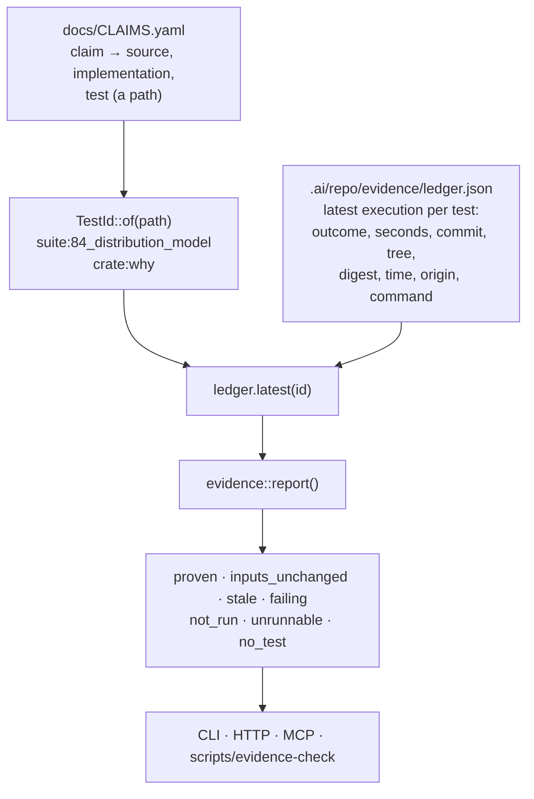

# Evidence — what ran, against which commit, and whether it still proves anything

How this repository knows that a claim is proven rather than merely referenced: a stable
identity for every test, derived from the path a claim already names; a recorded execution
carrying the provenance the run itself did not have; a ledger of the latest execution per
test; and one derivation that joins the two and says, per claim, exactly what can honestly
be said about it. Behaviour as implemented; where this document and the executable
disagree, the document is wrong and changes in the same commit. The decision is
[ADR 40](../.ai/repo/adrs/0040-proof-is-a-recorded-execution-and-inputs-unchanged-is-not-proven.md);
the rules it serves are `project.no-claim-without-test` and
`project.never-reported-is-not-green` under
[`.ai/repo/rules/project/`](../.ai/repo/rules/project/).



## The problem

`docs/CLAIMS.yaml` binds a claim to a test with a **path**:

```yaml
- id: distribution-canonical-model
  claim: Every platform, artifact name and installation URL is derived from one model …
  source: docs/DISTRIBUTION.md
  implementation: apps/majordomus-cli/src/distribution/mod.rs
  test: test/cases/84_distribution_model.sh
  status: guaranteed
```

A path is a declaration that a proof exists somewhere. It is not the proof.
`scripts/generate-site-data --check` verifies that every `source`, `implementation` and
`test` path resolves — a check on the *reference*, not on the *claim*. Until this
subsystem, nobody could answer from the repository whether that case had ever run, against
which revision, with what result, or whether the result still applied, and the sentence was
rendered on the public site as a guarantee on the strength of a file existing.

This is the same defect [ADR 30](../.ai/repo/adrs/0030-a-task-owes-obligations-and-evidence-goes-stale.md)
named one level up: *a test result that cannot go stale is a claim about the past presented
as a claim about the present.*

## The model

Three objects and one derivation, in
[`apps/majordomus-cli/src/evidence/`](../apps/majordomus-cli/src/evidence/).

| | what it is |
|---|---|
| `TestId` | the stable identity of a test: the runner that owns it, and the name that runner knows it by |
| `Execution` | one recorded run of one test, with the provenance the run itself did not carry |
| `Ledger` | the latest execution of every test, as a tracked file under `.ai/repo/evidence/` |
| `report()` | the join: every claim of the matrix against every execution recorded, deriving one `ProofState` per claim |

The join is derived on every read and is never written down. There is no second place where
a claim's proof state is stored, and therefore no place for it to go stale.

### Test identity, derived rather than entered

A test's identity is computed from the path a claim already names. Nothing is entered by
hand, no field is added to the matrix, and no claim had to be migrated:

| path a claim names | identity | the test's own source | the command that runs it |
|---|---|---|---|
| `test/cases/84_distribution_model.sh` | `suite:84_distribution_model` | the same path | `bash test/run.sh 84_distribution_model` |
| `apps/majordomus-cli/tests/why.rs` | `crate:why` | the same path | `cargo test --test why` |
| anything else | none | — | — |

Both spellings already existed: `test/run.sh` names a case by its file stem, and `cargo
test --test <stem>` runs an integration binary by its. `TestId::of` only names the join.

"Anything else" is an answer, not a failure. A claim may name a template, a fixture, a
library or a document — `share/install/install.sh.in`, `test/lib.sh`, a nested path under
`test/cases/` that the runner does not enumerate — and the report says `unrunnable` rather
than counting it as covered. The matrix's own placeholder for nothing, `-`, quoted or not,
reads as no test at all.

A third runner would be a variant of `Runner` and a branch in `TestId::of`. It is
deliberately a code change rather than a configuration one: a runner nothing executes is a
runner whose results nothing can record.

### An execution

Every field is provenance. A result with no commit is an anonymous green, which is the one
thing a badge must never be derived from.

| field | what it holds |
|---|---|
| `test`, `runner`, `source` | which test, whose, and where its own source lives |
| `outcome` | `pass`, `fail`, `skip`, `timeout` or `error` |
| `seconds` | how long it took, whole seconds |
| `commit` | the full object name the run was made against |
| `working_tree` | `clean`, `dirty` or `unknown` — whether that commit describes what ran |
| `digest` | `sha256:<hex>` of the test's own source as it was when the run was recorded |
| `at` | RFC 3339, UTC, to the second |
| `origin` | `local`, `ci` or `release` |
| `command` | the exact command that runs this one test again |

Only `pass` proves anything. The runner's word is read case-insensitively (`ok`, `pass`,
`passed`; `fail`, `failed`; `skip`, `skipped`; `timeout`) and **anything unrecognised is
`error`** — a result nobody can classify is not a pass. There is deliberately no `not_run`
outcome: that is the absence of an execution, not an outcome one had, and encoding it would
let a recorder write "this did not run" and have it counted among the things that did.

`origin` is provider-neutral. A CI adapter records `ci`; nothing in the model knows or
cares which CI it was.

## The seven states

Ranked from strongest to weakest, so a summary that sorts by the state reads as a ranking.
Each state carries its own one-sentence meaning in the model, so every surface says the
same thing rather than inventing a gloss.

| state | derived when |
|---|---|
| `proven` | the latest execution passed, and the diff between its commit and the working tree is empty — excluding the ledger's own row |
| `inputs_unchanged` | the latest execution passed, and **nothing the claim itself names** differs between that commit and the working tree |
| `stale` | the latest execution passed, but something the claim names has changed since — or git could not answer the comparison at all |
| `failing` | the latest execution of this claim's test did not pass |
| `not_run` | the claim names a test a runner owns, and no execution of it has ever been recorded |
| `unrunnable` | the claim names a path no runner in this repository drives, so no execution of it can ever be recorded |
| `no_test` | the claim names no test at all — correct for a `planned` or a `rejected` claim, a defect for any other |

"What the claim itself names" is exactly three paths: its `source`, its `implementation`
and the test's own source. The comparison is `git diff --name-only <recorded commit> --`,
which catches a path committed since, staged, or merely edited in the working tree. It is
run once per distinct commit in the ledger and shared by every claim recorded against it,
which in practice is one subprocess.

When git cannot answer — no work tree, a commit the checkout does not have — the state is
`stale`, not `inputs_unchanged`. Not knowing is not proof.

A `stale` claim names the paths that changed, so a reader is told which of the three
invalidated the run rather than being told to go and look.

### `proven` and `inputs_unchanged` are deliberately not the same state

This is the point of the whole subsystem, and it is the thing to preserve in any change to
it.

**`proven`** means a passing run exists and *nothing has changed since it*: the diff between
the execution's own commit and the working tree is empty. It is proof of the tree in front
of you — the tree the run measured is the tree you are looking at.

The ledger's own row is excluded from that diff, because the evidence is *about* the tree
rather than part of what the tests measure. Without that exclusion `proven` would be
unreachable by construction: recording writes the ledger and so dirties the tree, and
committing the record moves HEAD past the commit the record names. That was a real defect
in the first cut of this design, found in review; `test/cases/124_evidence.sh` now asserts
both halves — that the tree is dirty after a recording, and that every claim is `proven`
anyway — so a regression that made `proven` depend on a clean tree again would fail.

**`inputs_unchanged`** means a passing run exists and nothing the claim names has moved
since it. That is the **absence of a known invalidation** — not proof at HEAD. Something
the claim does not name may have broken the behaviour: a shared library the implementation
calls, a schema it reads, a script the case invokes, a dependency bump, a change to
`test/run.sh` itself. The dependency model is deliberately shallow and non-transitive: it
is the three paths the claim writes down, and nothing computed from them.

Both alternatives to that choice are worse. Treating a passing run as valid until something
anywhere changes is the green badge whose derivation cannot be inspected. Declaring every
result stale the instant anything anywhere changes is sound and useless — it would mean no
claim is ever proven except in the seconds after a full run, on a repository that pushes to
master every few minutes.

So the model reports which of the two it found, and labels the weaker one as weaker
everywhere it is shown. The command line prints them differently and prints the sentence
that explains the second. **A surface that renders both as one tick has reintroduced the
defect**, whatever the underlying data says.

What `inputs_unchanged` does not catch, stated plainly:

- a change to a file the claim does not name that breaks the behaviour anyway;
- a change to the runner, the harness, the toolchain or the environment;
- a claim whose `implementation` field names one file where the behaviour lives in several;
- a behaviour that depends on something outside the repository entirely.

Each of those is a real hole. The answer to all of them is the same and is not a cleverer
dependency graph: record a run against HEAD, and the state becomes `proven`.

## The ledger

`.ai/repo/evidence/ledger.json`, tracked, one entry per test: the latest execution.

It is shaped like the benchmark baselines under `.ai/repo/benchmarks/` on purpose — JSON,
committed, written by a tool, read by a gate, reviewed in a diff. The repository already
had a precedent for recorded, committed, reviewable measurement, and this is the same kind
of artifact for the same reason rather than something new.

**JSON, not the layer's YAML.** This repository reads a deliberately small YAML subset
([`SCHEMAS.md`](SCHEMAS.md)), and a canonical file only our own reader can parse is a trap
it has fallen into before. The ledger is machine-written and machine-read, so it is JSON:
`serde` on both sides, no subset to respect, and `jq` works on it.

**Latest per test, no history.** A run per commit for every test grows without bound, and
the question the ledger answers — *is this claim proven now?* — only ever reads the newest.
A history would be a second thing to maintain in service of a question nobody asked here;
the durable record of what happened over time is git, over this file.

**No captured output.** A log of every case is megabytes per run and belongs where the run
happened — the CI artifact, the terminal. What is kept is the durable semantic part, which
is what a reader needs in order to decide whether to believe the result and how to check it
themselves.

**Merged per test, never rewritten per run.** Recording one test replaces that test's entry
and leaves every other alone. This is what makes `bash test/run.sh 84_distribution_model`
worth recording at all: a whole-ledger write would silently delete the evidence for every
test the run did not include, turning a one-case run into a repository that has proven one
thing — which is worse than one that has proven nothing, because it looks deliberate.

**Ordered and stable.** Entries are sorted by test id and the file is written with a
two-space indent and a trailing newline, so two runs of the same set produce the same file
and a diff shows what changed rather than what moved.

**Versioned, and refused rather than guessed.** The file declares `version: 1`. A reader
that meets a version it does not know refuses with both numbers and says why: a misread
ledger is worse than an absent one, because an absent one reports `not_run` and a misread
one could report a pass.

**A missing ledger and an empty one are the same answer.** Both report every claim as
`not_run`, which is true, and neither is an error — a fresh clone has the first and a
repository mid-adoption has the second. The report's ledger summary says which it was,
along with how many executions it holds, the newest timestamp in it, and the distinct
commits they were recorded against.

## Recording a run

The runs already write their results down. `test/run.sh` writes one TSV row per case —
`name`, `result`, `seconds`, `phase` — when `MJ_TEST_REPORT` is set. `cargo test` prints a
`Running tests/<name>.rs` line and a `test result:` line per integration binary. Neither is
durable, neither carries a commit, and neither is joined to anything.

`evidence record` reads what those runs wrote, stamps each result with the provenance the
run itself did not have, and merges it into the ledger.

```sh
MJ_TEST_REPORT=suite.tsv bash test/run.sh
majordomus evidence record --suite suite.tsv --origin local

cargo test --manifest-path apps/majordomus-cli/Cargo.toml 2>&1 | tee crate.log
majordomus evidence record --crate-output crate.log --origin local
```

Then commit the ledger. A recording that is not committed is a local opinion.

It records; it decides nothing. A case that failed is a case the runner said failed, and a
test that appears in no report is left exactly as it was — the report will say `not_run`
for it, which is true.

**Why the commit is taken at record time rather than by the runner.** The runner is a shell
script that executes each case in a disposable temporary repository and genuinely does not
know which checkout it was invoked from. Taking the commit when the result is recorded
takes it from the tree the run was made against — the same thing, provided the recording
happens in that tree. A dirty tree is recorded as `dirty` for exactly this reason: it is
the one case where the commit does not describe what ran.

Refusals, all of them deliberate:

- **nothing to record** — neither `--suite` nor `--crate-output` was given;
- **not a git work tree with a commit** — a run recorded there would carry no provenance
  and prove nothing;
- **a malformed report line** — refused rather than skipped, because a silently dropped
  case leaves a claim reporting `not_run` after a run that did run it, which is a lie in
  the safe direction and still a lie;
- **a result for a test this checkout does not have** — named in the recording's `unknown`
  list rather than recorded or dropped, because it means the runner and the matrix have
  diverged.

Two shapes in `cargo test`'s output are handled specifically: `Running unittests
src/lib.rs` is the crate's own unit-test binary and is not an integration test a claim can
name, so it is not recorded as one; and a `test result:` line with no `Running` line before
it belongs to no binary and is dropped rather than credited to the previous one.

### In CI

Half the wiring is already there. The `suite` job of
[`.github/workflows/validate.yml`](../.github/workflows/validate.yml) runs
`bash test/run.sh` with `MJ_TEST_REPORT: suite.tsv` and uploads that TSV as the
`ci-metrics-suite` artifact; the `macos` job does the same. The recording step is one line
after the suite step:

```yaml
- if: always()
  run: majordomus evidence record --suite suite.tsv --origin ci
```

What is **not** wired, and is a target rather than a description: nothing runs that step
today, and a ledger written in a CI checkout is thrown away with the runner. Landing CI's
evidence in the repository needs a commit, which a pull-request run must not make; the
shape that works is a push-to-master job that records and commits the ledger in its own
commit, the way the benchmark baseline is written. Until that exists, the ledger is written
by whoever runs the suite locally and commits it, and the states are honest about the
result either way.

## The four capabilities

One declaration in
[`src/capability/builtin/evidence.rs`](../apps/majordomus-cli/src/capability/builtin/evidence.rs);
every surface is derived from it ([`CAPABILITIES.md`](CAPABILITIES.md)).

| capability | command line | HTTP | MCP |
|---|---|---|---|
| `evidence.report` | `majordomus evidence show` | `GET /api/v1/evidence` | tool `majordomus_evidence`, resource `majordomus://evidence` |
| `evidence.claim` | `majordomus evidence claim <id>` | `GET /api/v1/evidence/claim` | tool `majordomus_evidence_claim` |
| `evidence.test` | `majordomus evidence proves <id>` | `GET /api/v1/evidence/test` | tool `majordomus_evidence_test` |
| `evidence.record` | `majordomus evidence record` | — | — |

`evidence show` takes `--state`, `--status` and `--findings` as filters and `--check`,
which exits `10` when any claim declares a guarantee the evidence does not support. The
tallies are computed **before** the filter: a filtered answer says how much of the matrix
it examined, never how much it returned.

None of the four caches. The ledger is a file that changes outside the process, and a
cached answer would be exactly the stale evidence this subsystem exists to name.

**`evidence.record` is the only one that writes, and it is not reachable over the network.**
It declares a command line and nothing else. This executable's MCP and HTTP surfaces are
read-only — a property of the server, not an accident of what has been built — so the
recorder is a developer capability: offered to whoever runs the executable and to nobody
over a socket. It is declared as a capability rather than hand-written as a command so that
it stays inside the registry, the command graph and the generated reference. It is also
waived from the benchmark, with the reason recorded: timing it in a loop would rewrite the
repository's evidence.

## Navigating in both directions

A relation that can only be walked one way is half a relation.

```sh
majordomus evidence claim distribution-canonical-model
majordomus evidence proves suite:84_distribution_model
majordomus evidence proves test/cases/84_distribution_model.sh   # the path resolves to the same test
```

`evidence claim` answers *what proves this claim*: the state and its meaning, the execution
behind it, the paths that changed since, the command that reproduces it, and the other
claims the same test proves — a test shared by twelve claims is a test whose failure is
twelve findings, and a reader of one should be able to see the other eleven without
searching.

`evidence proves` answers *what does this test prove*: its latest execution, whether its
source still hashes to what that execution recorded, the command that runs it again, and
every claim that names it with the state each is in.

Both read the same derivation, so the two directions cannot disagree. A claim the matrix
does not declare is a not-found rather than an empty answer: a typo that read as "this
claim has no evidence" is the one answer these capabilities must never give.

## The gate

[`scripts/evidence-check`](../scripts/evidence-check) renders the executable's own answer
and ratchets it. It derives nothing of its own — a gate with a second opinion about what is
proven would be a second model of proof.

```sh
scripts/evidence-check              # report; 0 clean, 10 with regressions
scripts/evidence-check --json       # the report, from the capability itself
scripts/evidence-check --strict     # every unsupported guarantee fails; the baseline is ignored
scripts/evidence-check --baseline   # rewrite the baseline from what is found now
scripts/evidence-check --repo PATH  # judge that repository instead of this one
```

Only `guaranteed` claims are judged. `advisory` states that enforcement is not observable
from outside, `planned` that nothing implements it, and `rejected` that nothing will;
demanding a current proof of those would be demanding proof of a thing the claim already
says is not there. A `guaranteed` claim in any of the three passing states — `proven`,
`inputs_unchanged` or `stale` — is supported; `failing`, `not_run`, `unrunnable` and
`no_test` are findings, each with the reason and the command that would settle it.

**It is advisory today, and this is a choice with an end.** The ledger starts empty, so on
the day the gate arrives every guaranteed claim is `not_run` — true, and as a blocking gate
it would mean nothing could be merged by anybody until a full suite run had been recorded.
So the debt that existed at that moment is written to
[`.ai/repo/evidence-baseline.txt`](../.ai/repo/evidence-baseline.txt) by `--baseline`,
never by hand.

**What the ratchet refuses is not membership of that list.** It was, and that was a defect
rather than a strictness: a claim written after the baseline is absent from it for the only
reason a claim can be absent from a snapshot of the past — it did not exist yet — and the
gate reported every such claim as having "lost the evidence that supported them", evidence
it had never had. Every newly merged guarantee reddened the trunk for every branch that
merged after it. A ratchet whose alarm fires on growth rather than on regression measures
the wrong thing: it taxes writing claims down, which is what the matrix exists to reward.

So the baseline records the *state per claim* — both halves, a `+` line for a guarantee a
run supported and a bare line for one no run supported — and two things are refused:

| refused | what it is | why membership could not see it |
|---|---|---|
| **lost** | a claim the baseline recorded as supported, and the evidence no longer supports | a claim losing its proof joins the unsupported set in exactly the way a newly written claim does |
| **withdrawn** | a supported guarantee that is no longer a guaranteed claim of the matrix at all | nothing became unproven; the denominator shrank, which is how a ratchet rots without ever going red |

And one thing is deliberately not refused: a guaranteed claim the baseline never knew,
arriving with no recorded run. That is new debt — reported, counted, and not a regression —
because refusing it is the broken behaviour above. It is admitted to the baseline by
`--baseline`, in its own commit, with the reason, and the ratchet holds it from then on.
The limit is stated rather than hidden: a claim promoted from `advisory` to `guaranteed`
without a run is new debt too, and is also only reported.

It still tightens in one direction only. The unsupported half shrinks by recording a run
that proves a claim and rewriting the file — never by adding a line. `--strict` refuses
every unsupported guarantee; it is the end state, and CI switches to it when the
unsupported half is empty.

The gate is named in [`.ai/repo/ci/gates.yaml`](../.ai/repo/ci/gates.yaml) as
`evidence-check`, in the `structure` job, with `always: true` — so the verdict arrives on
every push rather than when somebody remembers to run it, which is the other half of
`project.never-reported-is-not-green`. The `evidence` path class names what can change the
answer: the ledger, the baseline, the gate script, the claims matrix, the generated claim
pages and this document.

### `proven` is rare here, and that is the model working

The ledger is a tracked file, and recording writes it into the tree. So a recording made
at HEAD leaves the tree dirty, and committing the ledger moves HEAD past the commit the
executions name — so a rule that asked for a clean tree at HEAD would never be satisfied
here at all.

That is why the rule is the diff rather than HEAD, and why the ledger's own row is excluded
from it. `proven` is reachable in a repository that tracks its own evidence, which is the
only arrangement in which the evidence is worth anything to anybody but the person who ran
the tests. `test/cases/124_evidence.sh` proves it on a fixture whose ledger is tracked
exactly as this repository's is.

## What this is not

**It is not tamper-proof, and it does not pretend to be.** The ledger is a tracked file. A
person can edit `"outcome": "pass"` into it, and what a reviewer sees is the diff. What the
recorded digest buys is staleness detection that survives a revert — an execution whose
test source no longer hashes to the recorded digest did not run the test that is there now,
whatever the commit says. Cryptographic ceremony against someone who can already commit to
the repository would be ceremony with no threat model. The honest security property is the
one this repository relies on everywhere else: a fabricated result is a reviewable line in
a commit rather than an untraceable green.

Note the exact reach of that digest: it is reported by `evidence proves` as `digest_matches`
and is **not** an input to the proof state, which is decided by the git comparison. A tree
where the two disagree is a tree where something was recorded against a commit that does
not describe it, and the `working_tree: dirty` field is usually the reason.

**It is not the execution control plane.**
[`src/execution/`](../apps/majordomus-cli/src/execution/) and
[`EXECUTIONS.md`](EXECUTIONS.md) are about capability executions of a running server —
in-flight work, progress, typed events, gone with the process. This is about test runs:
durable, committed, and read long after the process that produced them exited. Two
different subjects that share an English word.

**It is not the obligation evidence of `lib/evidence.sh`.** That subsystem
([ADR 30](../.ai/repo/adrs/0030-a-task-owes-obligations-and-evidence-goes-stale.md)) is
about what a *task* owes before it may be called completed, and its ledger is the
append-only task ledger. The two share an idea — evidence that can go stale — and nothing
else. Neither reads the other's records.

**It does not judge results.** Nothing here re-runs a test, re-interprets an outcome, or
decides that a failure was environmental. The recorder records what the runner said.

**It does not make a claim true.** A claim with a `proven` state is a claim whose test
passed against this commit. Whether the test tests the claim is a question for review, and
`project.no-claim-without-test` is the rule that holds it.

## When something fails

| message | meaning | remedy |
|---|---|---|
| `nothing to record: give --suite, --crate-output, or both` | the recorder was invoked with no input | name the report the run wrote |
| `this is not a git work tree with a commit, so a run recorded here would carry no provenance` | recording outside a repository with a commit | record in the checkout the run was made against |
| `line N of the run report has M field(s); it is name<TAB>result<TAB>seconds<TAB>phase` | a malformed TSV row; nothing is written | regenerate the report with `MJ_TEST_REPORT`, do not hand-edit it |
| `unknown  suite:99_ghost (no such test here)` | the run named a test this checkout does not have | the runner and the matrix have diverged; find out which moved |
| `… declares version N and this executable reads version 1` | a ledger of a shape this build does not know | use the executable of that generation, or migrate the file deliberately |
| `… is not a ledger this version can read: <serde error>` | the ledger is not valid JSON of this shape | fix or delete it; a deleted ledger reports `not_run`, which is honest |
| ``  `x` is not a claim of docs/CLAIMS.yaml `` | a claim id that does not exist | `majordomus evidence show` lists every id |
| ``  `x` names no test `` | an argument to `evidence proves` that is neither an identity nor a test path | give `suite:<case>`, `crate:<binary>`, or the path |
| `evidence-check: no majordomus executable` (exit 12) | the gate could not find a build | build the crate, or set `MAJORDOMUS_BIN` |
| `evidence-check: … is absent; run scripts/evidence-check --baseline` (exit 12) | the ratchet has no baseline | write one, in its own commit, with the reason |
| `evidence-check: N guaranteed claim(s) lost the evidence that supported them` (exit 10) | a claim the baseline recorded as supported no longer is | run the named test and record it, or fix what broke |
| `evidence-check: N supported guarantee(s) left the matrix` (exit 10) | a proven guarantee was deleted or renamed, so the repository proves fewer than the baseline records | restore the claim, or rewrite the baseline in its own commit saying why the guarantee went away |
| `evidence-check: N guaranteed claim(s) the baseline does not know` | new debt: a claim written after the baseline, with no recorded run — reported, never fatal | record a run, or `scripts/evidence-check --baseline` in its own commit |
| `evidence-check: N baseline line(s) now supported — tighten the baseline` | debt was paid and the list did not follow | `scripts/evidence-check --baseline`, in its own commit |

## Stability

| | status |
|---|---|
| identity derived from a case path and a crate test path; a path no runner drives names no test | implemented, unit tests in `src/evidence/mod.rs` |
| only a recognised pass proves anything; an unrecognised outcome word is an error | implemented, unit tests in `src/evidence/mod.rs` |
| the seven states rank strongest to weakest, and `proven` and `inputs_unchanged` are never collapsed | implemented, unit tests in `src/evidence/mod.rs` |
| only `guaranteed` is held to its evidence | implemented, unit tests in `src/evidence/mod.rs` |
| merging one test leaves every other test's evidence untouched; the file is ordered and round-trips | implemented, unit tests in `src/evidence/ledger.rs` |
| a ledger of an unknown version or unreadable shape is refused, not reinterpreted | implemented, unit tests in `src/evidence/ledger.rs` |
| a missing ledger and an empty one are both "nothing recorded", not an error | implemented, unit tests in `src/evidence/ledger.rs` |
| a suite report becomes executions with provenance; a later partial run updates only what it ran | implemented, unit tests in `src/evidence/record.rs` |
| a malformed report, a run with no commit, and a result for a test that does not exist are each refused or named | implemented, unit tests in `src/evidence/record.rs` |
| the declaration yields exactly the projections it claims; only the recorder writes, and it is not on the network | implemented, unit tests in `src/capability/builtin/evidence.rs` |
| the whole path end to end in a fixture repository — nothing recorded, provenance, a partial run, `stale` with the path named, `proven` against `inputs_unchanged`, `failing` and the exit code, both directions, the refusals | behaviourally verified (`test/cases/124_evidence.sh`) |
| the gate planned on every push, and the paths that can change the answer | declared in `.ai/repo/ci/gates.yaml`; the planner that reads it is behaviourally verified (`test/cases/94_ci_plan.sh`) |
| CI recording its own runs into the ledger | not implemented; the report is written and uploaded, nothing records it and nothing commits it |
| the site rendering a claim's proof state beside its status | not implemented; the guarantees page still shows the declared status alone |
| tamper resistance, a signed ledger, a run history, captured output | not implemented, and refused — see *What this is not* and ADR 40 |
