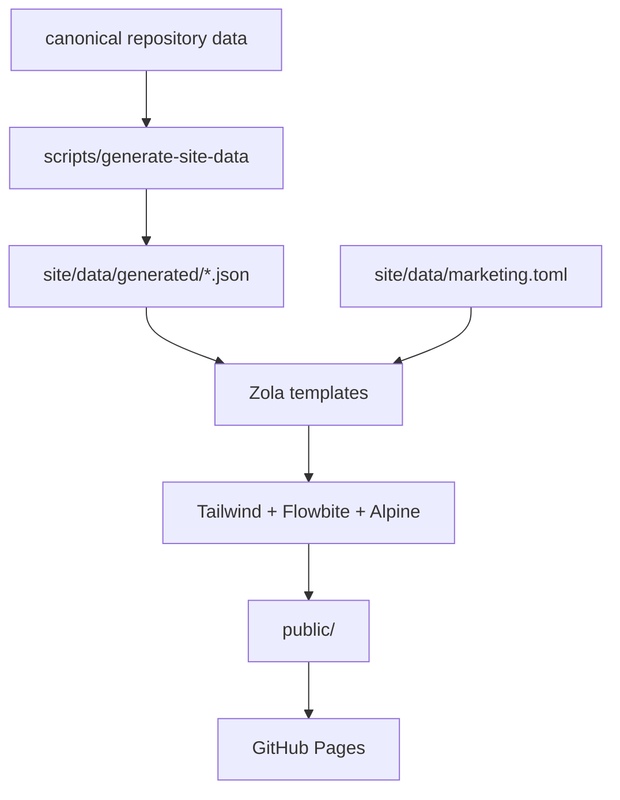

# Site architecture

## Purpose

The public site is not documentation about Majordomus. It is a projection of the
repository, built the same way Majordomus projects a policy into an instruction file:
canonical data in, deterministic output out, with a manifest saying exactly which inputs
produced it.

The rule from `AGENTS.md` applies here without exception. No capability sentence appears
on the site unless `docs/CLAIMS.yaml` names the file that implements it and the test that
proves it, and the build fails if either has gone.

## Canonical sources

Ownership is explicit. Each layer has exactly one writer.

| Layer | Path | Written by |
|---|---|---|
| Product truth | `bin/`, `lib/`, `share/`, `.majordomus/**` | humans and `majordomus update` |
| Public narrative | `README.md`, `docs/**.md` | humans; still reads correctly on GitHub |
| Structured claims | `docs/CLAIMS.yaml`, `docs/RESPONSIBILITIES.yaml` | humans |
| Promotional copy | `site/data/marketing.toml` | humans; no capability claims allowed |
| Derived site data | `site/data/generated/**` | `scripts/generate-site-data` only |
| Derived content | `site/content/**` | `scripts/generate-site-data` only |
| Presentation | `site/templates/**`, `site/tailwind.css` | humans |
| Output | `public/**` | `scripts/site-build` only |

Everything under `site/data/generated/` and `site/content/` is deleted and rewritten on
every build. Editing a file there loses the edit and, worse, hides a missing canonical
source. Both directories are gitignored for that reason.

## Projection pipeline



`scripts/generate-site-data` parses YAML with `lib/common.sh`, the tool's own restricted
YAML reader. The site therefore adds no parser and no dependency of its own, and is read
by exactly the code that reads a policy in production.

## Generated data model

| File | Derived from | Used by |
|---|---|---|
| `project.json` | `MJ_VERSION` in `bin/majordomus` | every page footer |
| `responsibilities.json` | `docs/RESPONSIBILITIES.yaml` joined with the README table and `docs/CLAIMS.yaml` | `/supervises/` and its nine pages |
| `commands.json` | the dispatch table in `bin/majordomus`, the `docs/CLI.md` section for each, and the cases that invoke it | `/commands/` and one page per subcommand |
| `concepts.json` | the vocabulary table in `docs/CONCEPTS.md` | `/concepts/` and one page per term |
| `profiles.json` | `.majordomus/profiles/*.yaml` | `/profiles/` and one page per profile |
| `policy.json` | `.majordomus/policy.yaml` | `/policy/` |
| `capabilities.json` | `docs/CLAIMS.yaml` | `/guarantees/`, homepage counts |
| `lifecycle.json` | the outcome `case` statement in `lib/finish.sh` | the homepage lifecycle diagram |
| `source.json` | every input above, hashed | `/architecture/`, the footer |

Each data file carries a positional `index` map (id to array position). Zola 0.23 removed
the `filter` template filter, and a lookup map keeps the templates doing lookups rather
than searches. It also keeps the normalisation in one place, which was the point.

## Cross-links are derived, never typed

Two relationships on the site are computed rather than maintained:

- a concept's **related responsibilities** — a responsibility whose id equals the term,
  or which owns a file the term's "where it lives" cell names;
- a concept's **related terms** — other entries of the same vocabulary named in this
  entry's own prose.

Adding a row to the vocabulary table adds a page, its links, and its back-links.

## Zola structure

```
site/
├── config.toml            base_url, markdown and highlighting configuration
├── content/               generated; front matter only, except getting-started
├── data/
│   ├── marketing.toml     hand-written promotional copy
│   └── generated/         generated JSON
├── static/                favicon and the three small scripts
├── templates/
│   ├── base.html          head, landmarks, navbar, footer
│   ├── partials/          navbar, footer, breadcrumb, badges, code block, script tags
│   └── *.html             one template per route family
└── tailwind.css           the only stylesheet source
```

Zola 0.23 uses Tera 2, which **removed macros** (`` and `` are
unknown tags) along with the `filter`, `map`, `slice` and `concat` filters. Reusable
markup is therefore an `` partial that reads variables set by its caller;
`site/templates/partials/status-badge.html` is the pattern to copy.

## Tailwind and Flowbite integration

`site/tailwind.css` is the single entry point and holds no bespoke rules. It follows the
Flowbite v3 / Tailwind v4 quickstart, verified against the installed `node_modules/flowbite`
package. `@source` declares `node_modules/flowbite`, `site/templates` and `public`, so a
class reachable only from a template that this build did not render still survives
minification. Dark mode is class-based via `@custom-variant dark`, which is what the
Flowbite theme switcher toggles.

**Flowbite LLM guidance.** There is none in this repository, and `flowbite.com/llms.txt`
returns 404. An earlier comment in `site/tailwind.css` referenced
`.claude/flowbite/llms-full.txt`; that path does not exist here and the reference has been
removed. Component markup is grounded in the installed package's own data attributes
(`data-collapse-toggle`, `data-copy-to-clipboard-target`, `data-dropdown-toggle`,
`data-accordion`, `data-tabs-toggle`) and the official quickstart page.

## Syntax highlighting

Highlighting is static: no highlighter ships to the reader. `[markdown.highlighting]` uses
`style = "class"` with `light_theme` and `dark_theme`, which puts both a light and a dark
class on every token and emits `giallo-light.css` and `giallo-dark.css`. Both are loaded
on every page, so `scripts/site-build` rewrites the dark sheet to scope every selector
under `.dark`. Without that step the dark palette would also apply in light mode, and code
blocks would disagree with the rest of the page the moment a reader overrides their system
preference.

## Alpine.js responsibilities

Alpine is loaded on three routes and does one thing on each: a status filter on
`/guarantees/` and on a responsibility page, and a text filter on `/concepts/`. Every item
those filters hide is present in the HTML, so the pages are complete without JavaScript
and each says so on the page itself.

Copy-to-clipboard is **not** Alpine. Flowbite ships `data-copy-to-clipboard-target`, and
Flowbite comes first.

## Mermaid

Client-side, from a pinned local copy of `mermaid`, loaded only on routes that contain a
diagram, and never blocking. The alternative — rendering to SVG at build time with
`@mermaid-js/mermaid-cli` — was rejected because it pulls a headless browser into the
build for output that is a progressive enhancement anyway. A diagram that fails to render
leaves its source visible; no page depends on Mermaid to navigate.

Diagrams arrive two ways: a `<pre class="mermaid">` written by a template, or a
` ```mermaid ` fence in canonical Markdown, which Zola marks as `<code data-lang="mermaid">`
and `site/static/js/diagrams.js` converts. That is what lets a canonical Markdown file keep
rendering on GitHub and still draw a diagram here. Mermaid runs at `securityLevel: 'strict'`,
and re-renders on a theme change.

## Callouts

`github_alerts = true`. A `> [!NOTE]` block is a styled callout here and an ordinary
blockquote on GitHub. There is no shortcode, so no canonical Markdown file has to choose
between its two readers.

## Responsive strategy

Mobile-first, Tailwind responsive utilities only, no custom media queries. The recurring
patterns are `grid-cols-1` widening at `sm:` and `lg:`, `flex-col` becoming `flex-row`,
and every wide element — tables, code blocks, Mermaid diagrams — inside its own
`overflow-x-auto` container so the page itself never scrolls sideways.

## Accessibility

A skip link, one `h1` per route, `<main id="main">`, a labelled `<nav>`, `aria-current` on
the active navigation item, `aria-pressed` on filter buttons, `aria-controls` and
`aria-expanded` on the mobile menu toggle, visible focus rings that are never removed, and
a `<caption class="sr-only">` on every table. `scripts/site-check` fails the build if any
of the structural ones go missing.

## GitHub Pages deployment

`.github/workflows/pages.yml` runs on `master`: install, `bash test/run.sh`,
`bin/majordomus doctor`, `scripts/site-build`, `scripts/site-check`, then the official
`upload-pages-artifact` and `deploy-pages` actions. Nothing is pushed to a `gh-pages`
branch by hand. `validate.yml` runs the same build and check on every branch, so a pull
request cannot merge a site that does not build.

## Sync guarantee

`scripts/site-check` proves the output matches the inputs it claims. `scripts/generate-site-data --check`
proves the canonical data is internally consistent before anything is generated:
every responsibility matches a README row, every claim's source, implementation and test
exist, every guaranteed claim has a test, every doc anchor is a real heading.

`test/cases/16_site_derivation.sh` proves derivation itself: it copies the repository into
a throwaway directory, changes one canonical value, regenerates, and fails if the derived
output did not change. A generator that exits zero without reading its inputs would pass
every other check and fail this one.

Two of the generator's checks exist to keep the site's own evidence honest rather than to
validate data: a subcommand with no case in `test/cases/` that invokes it, and a profile no
case exercises, both fail the build. CI runs `bash test/run.sh` on Linux and macOS, so
"tested in CI" on a command or profile page is a statement the build refuses to print
unless it is true. `docs/SITE_CLAIMS.md` lists every claim the site makes about itself,
with the check that backs it and the three that are not yet automated.

## Local development

```bash
npm ci
scripts/site-build      # generate, build, vendor, compile CSS
scripts/site-check      # the checks CI runs
scripts/site-serve      # Zola's watcher plus Tailwind in watch mode
```

Zola must be installed; the CLI itself needs none of this.

## Adding new canonical data

1. Put the fact in a canonical file — a policy field, a profile, a claim, a README row.
2. Teach `scripts/generate-site-data` to read it, and to fail loudly if it disappears.
3. Render it in a template. If the template needs a search, add an index map instead.
4. Add a check to `scripts/site-check` if the output could silently go missing.

## Adding new site components

Reusable markup is an `` partial in `site/templates/partials/`, documented
with the variables it expects at the top. Use a Flowbite component before writing one;
use Alpine only for local UI state; write custom JavaScript last, and only for something
neither provides.

## What must never be edited manually

- `site/data/generated/**` — rewritten on every build
- `site/content/**` — rewritten on every build
- `public/**` — build output
- `giallo-light.css`, `giallo-dark.css` — emitted by Zola
