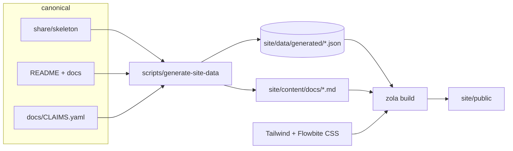

# GitHub Pages architecture

The website at `https://korczis.github.io/prismatic-majordomus/` is a projection of this
repository. It is built the way Majordomus asks projects to build their own instruction
files: one canonical source, generated outputs, and a check that fails when the two drift.

## Purpose

Let a visitor understand in about two minutes what Majordomus is, what it guarantees, what
is only advisory, what is not built, and how to start, without any sentence on the site
being maintained separately from the repository that backs it.

## Canonical sources

| layer | owns | lives in | edited by hand |
|---|---|---|---|
| product truth | policy schema, profiles, the worker instructions, the CLI | `share/skeleton/**`, `bin/majordomus`, `lib/**` | yes |
| public narrative | what it is, why, how, what it refuses | `README.md`, `docs/*.md` | yes |
| claims | every capability with status, source, implementation, test | `docs/CLAIMS.yaml` | yes |
| marketing copy | headline, section leads, button labels; no claims, no numbers, 60-line budget | `site/data/marketing.toml` | yes |
| navigation | five intents, their dropdown items and hrefs | `site/data/nav.toml` | yes |
| claim detail | what each claim means, how it works, how to see it, what it does not cover, why it exists | `docs/claims/<id>.md` | yes |
| case studies | the recognition moments, each with its homepage hook in front matter | `site/content-src/why/*.md` | yes |
| rendering reference | representative Markdown for visual validation | `site/content-src/render-test.md` | yes |
| derived data | stable JSON the templates read | `site/data/generated/*.json` | never |
| derived release artifact | the claims matrix as Markdown | `docs/SITE_CLAIMS.md` | never |
| derived content | canonical Markdown with generated front matter; one page per profile, claim, status, responsibility, command and case study | `site/content/{docs,profiles,guarantees,supervises,commands,why}/`, `render-test.md`, `architecture.md` | never |
| presentation | Zola templates and Tera 2 components | `site/templates/**` | yes |
| styling entry | Tailwind v4 + Flowbite v4 directives | `site/tailwind.css` | yes |
| behaviour | theme toggle, Mermaid init | `site/theme.js`, `site/diagrams.js` | yes |
| output | the static site | `site/public/**` | never |

## Projection pipeline



`scripts/generate-site-data` reads every canonical input, normalises it once, and writes:

| file | from | what |
|---|---|---|
| `project.json` | `bin/majordomus`, `README.md`, `LICENSE` | name, version, tagline, licence, commands, exit codes |
| `profiles.json` | `share/skeleton/profiles/*.yaml` | every profile, every field |
| `policy.json` | `share/skeleton/policy.yaml` | the policy as structure, plus the raw text |
| `capabilities.json` | `docs/CLAIMS.yaml` | every claim; the generator fails on a missing path or an untested guaranteed claim |
| `lifecycle.json` | `lib/finish.sh`, `share/skeleton/ai/repo/workflows/task-lifecycle.md`, `share/standard/majordomus/` | outcome vocabulary, divergence labels, lifecycle steps, the ten principles (the rules tagged `principle`) |
| `diagrams.json` | the files above | Mermaid source projected from data |
| `readme.json` | `README.md` | the sections the homepage renders, by heading; a renamed heading fails the build |
| `docs.json` | `docs/README.md` | the documentation index |
| `source.json` | git and the inputs | version, commit, input hash, generator version, input list |

`site/content/docs/*.md` is written from `docs/*.md` with a generated front matter, links
rewritten to site routes, and the whole body wrapped in a Tera `raw` block so that Tera never
templates canonical Markdown. The tag itself cannot be written out here: a literal closing
`raw` tag in a canonical document would end the wrapper the projection puts around it.

## Markdown rendering

Canonical Markdown must stay readable on GitHub, so the site uses only syntax GitHub renders
natively. `scripts/lib/project-markdown.awk` projects three GitHub-native constructs into site
components, on the derived copy only:

| in the canonical file | on the site |
|---|---|
| ` ```mermaid ` fence | `<pre class="mermaid">`, rendered client-side; the source stays visible without JavaScript |
| `> [!NOTE]`, `[!TIP]`, `[!IMPORTANT]`, `[!WARNING]`, `[!CAUTION]` | Flowbite alert |
| a pipe table | wrapped in `overflow-x-auto` so wide tables scroll inside their container |

Everything else is Zola's Markdown renderer inside a Flowbite Typography container
(`format dark:format-invert`): headings with anchors, lists, task lists, footnotes,
blockquotes, and class-based syntax highlighting (`[markdown.highlighting] style = "class"`,
themes `ayu-light` and `ayu-dark`). Zola writes the two theme stylesheets into `site/public/`;
`scripts/site-build` scopes the dark one under `.dark` so class-based dark mode selects it.
`site/content-src/render-test.md` exercises every construct and is linked from nowhere.

## Mermaid

Client-side, from the pinned npm package, vendored to `static/js/mermaid.min.js` at build.
Chosen over build-time SVG because the Mermaid CLI needs a headless browser in CI and the
site must stay reproducible from bash, Node and Zola alone. `site/diagrams.js` initialises
with `securityLevel: 'strict'`, a restrained palette for light and dark, and re-renders on
the theme toggle. Four diagrams are projected from data, never drawn by hand: the task
lifecycle from the outcome vocabulary, the policy-to-instruction-file graph from the policy's
projections, the site pipeline from the generator's input list, and the core model from the
README. A failed diagram leaves its source visible and never breaks the page.

## Zola structure

```
site/
  config.toml          base_url, class-based highlighting, heading anchors, footnotes
  content/             _index and one stub per page; docs/ and render-test.md are generated
  content-src/         hand-written pages that get the same projection as docs
  templates/
    base.html          head, theme-before-paint, navbar, footer, Flowbite init, Alpine
    components.html    Tera 2 components: badge, code, card, section_head, diagram
    index.html         homepage, twelve sections, all from generated data
    page.html          standalone page with breadcrumb and Typography body
    docs-section.html  /docs/ index from the section's pages
    docs-page.html     document with sidebar navigation
    profiles.html policy.html guarantees.html getting-started.html architecture.html
    404.html
    partials/          navbar, footer, theme-toggle, breadcrumb, profile-cards, mermaid
  data/marketing.toml  the only hand-written prose
  data/generated/      written by generate-site-data, committed, checked
  tailwind.css theme.js diagrams.js
  static/              images copied from assets/; app.css and js/ written at build
  public/              output
```

Zola 0.23 runs Tera 2: components replace macros, `import` no longer exists, array indexing
is `x[1]`, undefined variables are errors, `filter` and `slice` are gone in favour of list
comprehensions and Python-style slicing.

## Tailwind, Flowbite, Alpine

`site/tailwind.css` follows the Flowbite quickstart for Tailwind v4: `@import "tailwindcss"`,
`@import "flowbite/src/themes/default"`, `@plugin "flowbite/plugin"`,
`@plugin "flowbite-typography"`, `@source` for `node_modules/flowbite` and the templates, and
`@custom-variant dark (&:where(.dark, .dark *))` from the dark-mode guide. Flowbite v4's
semantic tokens (`bg-neutral-primary-soft`, `text-heading`, `border-default`, `rounded-base`)
are used throughout. The theme names Inter first; it is not loaded, so the stack falls to the
system font on purpose.

Flowbite JS is vendored from the pinned package. Its bundle exposes `window.initFlowbite` and
does not call it (verified in `node_modules/flowbite/dist/flowbite.js`), so `base.html` calls
it once on `DOMContentLoaded`. The navbar uses `data-collapse-toggle`; nothing else needs
Flowbite JS yet.

Alpine.js is vendored and used for two things: the copy button on code snippets (`x-data`,
`x-on:click`, `x-text`) and the raw-policy disclosure on `/policy/`. Both degrade: the code
and the policy are in the HTML; only the control disappears without JavaScript.

Custom CSS: one rule, `[x-cloak]{display:none!important}`, inline in `base.html`, required by
Alpine's documentation. Inline `style=""` attributes are forbidden and `scripts/site-check`
fails on one.

## Flowbite guidance consulted

The Flowbite LLM entry point (`flowbite.com/docs/getting-started/llm/`) points at `llms.txt`,
which is an index. The pages read and followed, on 2026-09-04: getting-started/quickstart
(Tailwind v4 directives), getting-started/javascript (`initFlowbite`), customize/dark-mode
(`@custom-variant`, toggle markup and script, reproduced in `theme.js`), components/navbar,
components/card, components/badge, components/footer, components/typography. The repository's
installed `flowbite` is 4.0.2, matching the documented token vocabulary.

## Routes

Every tile on the homepage is a link to a page with its own title, description, canonical URL
and Open Graph metadata. The route classes and their sources:

| route | source | template |
|---|---|---|
| `/` | `readme.json`, `marketing.toml`, `lifecycle.json`, `capabilities.json`, `diagrams.json`, the `why` section | `index.html` |
| `/why/`, `/why/<slug>/` | `site/content-src/why/*.md` | `why-section.html`, `why.html` |
| `/getting-started/` | `project.json`, `policy.json`, `lifecycle.json` | `getting-started.html` |
| `/supervises/`, `/supervises/<slug>/` | `readme.json` (What it does rows, cross-linked to commands and claims by keyword) | `supervises-section.html`, `responsibility.html` |
| `/commands/`, `/commands/<name>/` | `commands.json` (each command's section of `docs/CLI.md`) | `commands-section.html`, `command.html` |
| `/profiles/`, `/profiles/<slug>/` | `profiles.json` | `profiles.html`, `profile.html` |
| `/policy/` | `policy.json` including the raw file | `policy.html` |
| `/guarantees/`, `/guarantees/<status>/`, `/guarantees/<id>/` | `capabilities.json`, `docs/claims/<id>.md` | `guarantees.html`, `status.html`, `claim.html` |
| `/limitations/`, `/roadmap/` | `readme.json` sections by heading | `readme-section.html` |
| `/architecture/` | `site/content-src/architecture.md`, `source.json`, `diagrams.json` | `architecture.html` |
| `/docs/`, `/docs/<doc>/` | `docs/*.md` listed in `docs/README.md` | `docs-section.html`, `docs-page.html` |
| `/render-test/` | `site/content-src/render-test.md`, `noindex` | `docs-page.html` |

Navigation is `site/data/nav.toml`: five intents (Why, Get started, Concepts, Trust,
Reference), rendered as Flowbite dropdowns on desktop and as labelled flat lists inside the
collapsed menu on phones. `scripts/site-check` verifies every navigation and homepage link
resolves and every tile class has its page.

## Responsive strategy

Mobile-first: base classes describe the phone layout, `sm:`/`md:`/`lg:`/`xl:` add columns.
Every `<pre>` and `<table>` sits in a scroll container, either an explicit `overflow-x-auto`
wrapper or a Typography container carrying `[&_pre]:overflow-x-auto` and
`[&_table]:overflow-x-auto`. Grid items that hold code carry `min-w-0`. Validation is
measured, not eyeballed: `scripts/site-probe` builds a copy under the deployment prefix, serves
it locally, loads every route in headless Chrome inside iframes of 320, 390 and 1280 px and
asserts `document.scrollWidth == clientWidth`, then exercises the mobile menu, a navigation
dropdown and the theme toggle and counts rendered Mermaid diagrams. It runs in the Pages
workflow and skips with a notice where no Chrome exists. `test/cases/09_site_mobile_first.sh`
lints the built HTML for the structural causes of overflow without a browser.

## Accessibility

One `h1` per page, `<main>`, `<nav aria-label>`, a skip link, `aria-current` on active
navigation, `aria-expanded`/`aria-controls` on the menu toggle, `aria-label` on icon-only
controls, `role="note"` on callouts, visible focus rings (`focus:ring-*`, never removed),
Flowbite's contrast tokens in both themes. Everything except the copy button and the
disclosure works without JavaScript.

## GitHub Pages deployment

`.github/workflows/pages.yml`: checkout → Node 22 → pinned Zola → `npm ci` →
`bash test/run.sh` → `bin/majordomus doctor` → `scripts/generate-site-data --check` →
`scripts/site-build` → `scripts/site-check` → `scripts/site-probe` → upload `site/public` →
deploy. The site never
deploys from a tree whose tests fail or whose derived data is stale.

## Sync guarantee

`scripts/generate-site-data --check` regenerates into a temporary directory and diffs every
generated file and `docs/SITE_CLAIMS.md` against the committed ones; the input hash in
`source.json` covers every canonical file the generator reads and is printed in the footer of
every page. `test/cases/11_site_derivation.sh` changes the version, a profile description and
effort, a principle, a policy value, a claim and a document heading in a scratch copy, and
asserts each change appears in the derived data. `test/cases/10_site_data.sh` proves a missing
path or an untested guaranteed claim fails the generator.

## Local development

```
npm ci                      # Tailwind, Flowbite, Alpine, Mermaid — pinned
brew install zola           # or the release binary; CI pins 0.23.4
scripts/site-serve          # generate, build, serve at http://127.0.0.1:1111/prismatic-majordomus/
scripts/site-build          # production build into site/public/
scripts/site-check          # the static checks CI runs
scripts/site-probe          # the browser-measured checks (needs Chrome; --quick for one page per section)
```

## Adding new canonical data

Add the field to the file that owns it, read it in `scripts/generate-site-data`, render it in
a template, and extend `test/cases/11_site_derivation.sh` with the change-and-assert pair.
Commit the regenerated `site/data/generated/`. Do not add a field to the JSON by hand.

## Adding new site components

Define a Tera 2 component in `site/templates/components.html`, using Flowbite markup from the
component's documentation page, with mobile classes first. Call it as `{{ <name attr="…" /> }}`.
If it needs a class Tailwind cannot see in the templates, it does not belong here.

## What must never be edited manually

`site/data/generated/**`, `site/content/docs/**`, `site/content/render-test.md`,
`docs/SITE_CLAIMS.md`, `site/static/app.css`, `site/static/js/**`, `site/static/images/**`,
`site/public/**`, `CLAUDE.md`, `AGENTS.md`. Change the canonical file; rebuild.
