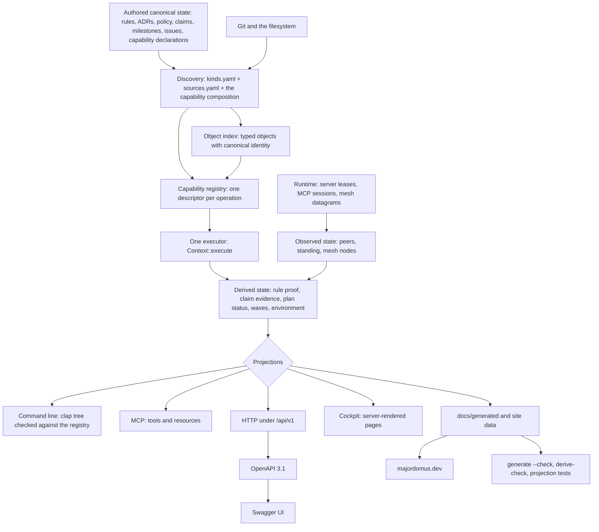
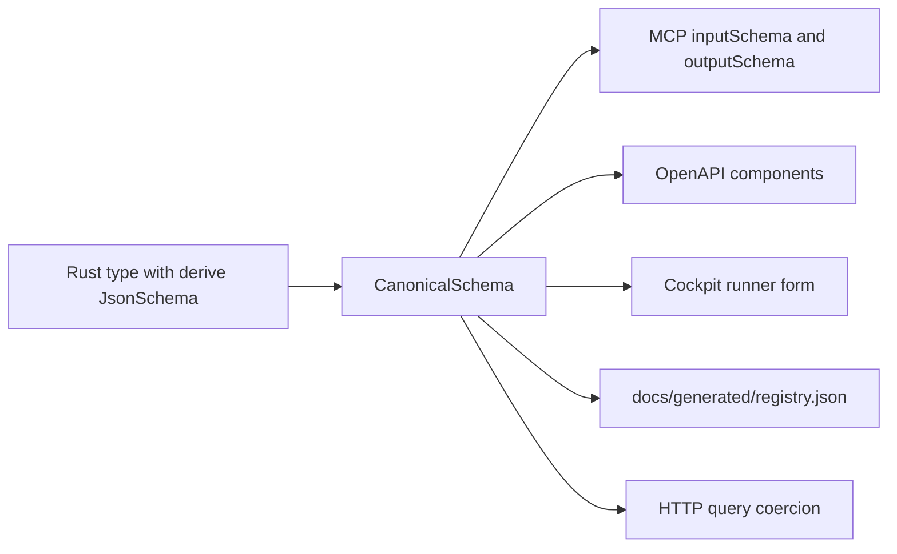
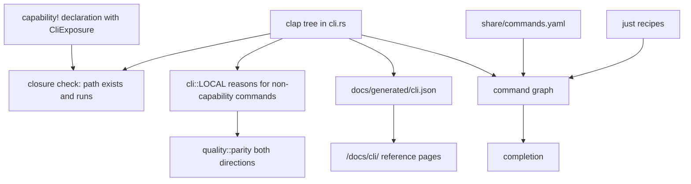
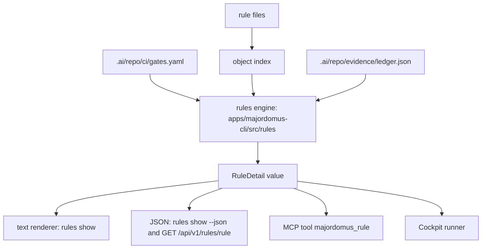
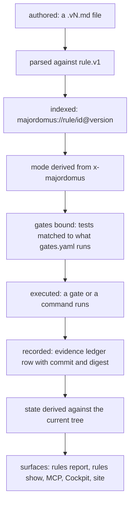
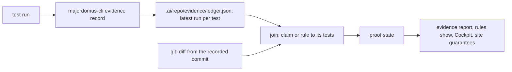
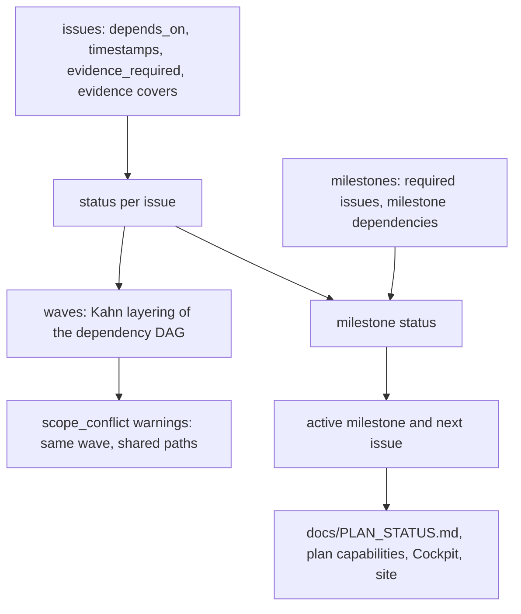
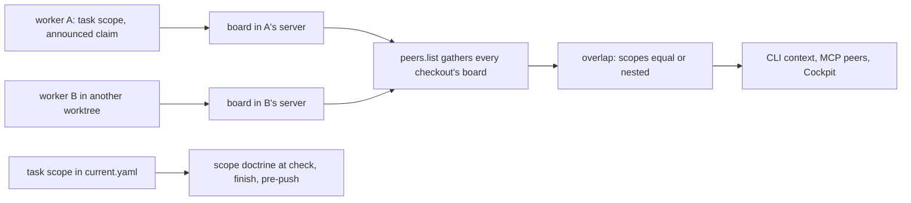
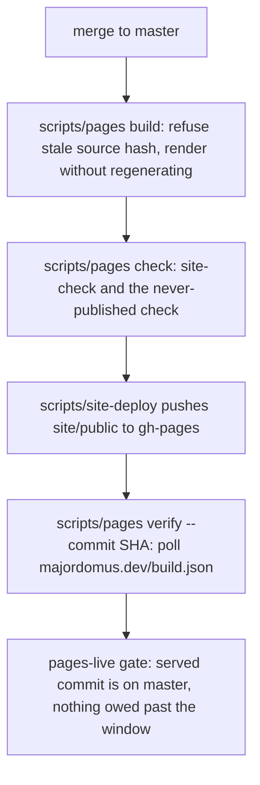
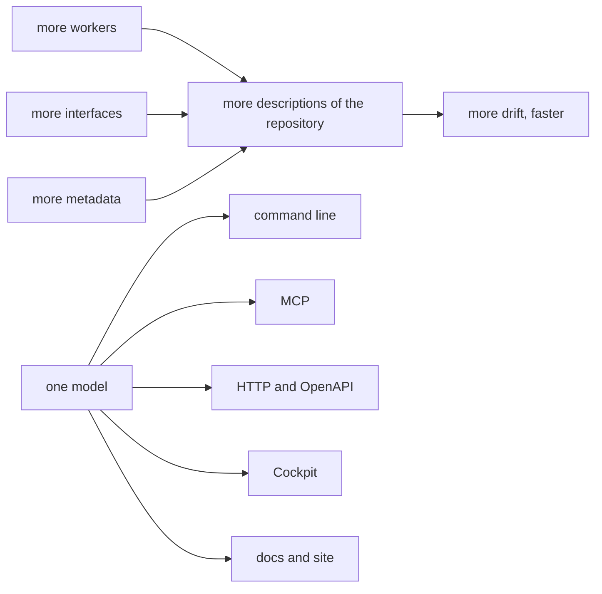

# How Majordomus works — one repository model, many projections

Majordomus is easy to misread as a command-line tool, an HTTP API, an MCP server, a dashboard
and a folder of Markdown rules that happen to ship together. This document explains why that
reading is wrong, and where it is still right. It follows a fact from the file where it is
written, through the index and the typed registry that hold it, through the checks that decide
whether it is true, to every interface that shows it — and it names each place where the
repository does not yet live up to that shape.

Every statement here was checked against the code on the default branch. Where the code and a
design record disagree, the code wins and the disagreement is listed under
[Architecture debt](#architecture-debt). Numbers are not written into this document: each one
is stated as the command that measures it, because a count copied into prose is stale the day
after it is written (`project.no-counts-in-prose`).

## The thesis

> Majordomus should discover and model a fact once, then derive every relevant interface from
> that canonical representation.

That sentence is not a code-reuse preference. It is the mechanism against drift. A repository
worked on by several people and several AI workers at once accumulates descriptions of itself:
a command list in the README, another in the help text, a third in an API schema, a fourth in a
dashboard, a fifth in an agent's tool list. Each is correct on the day it is written, and each
is maintained by whoever remembers it. More workers and more interfaces multiply the copies, and
agentic development only makes the copies diverge faster.

Majordomus goes the other way: one model, many projections. A projection may render a fact
differently, filter it, or join it with others. It may not hold a second opinion about it.

## The architecture in one picture



Read it from the top. Humans and workers author a small set of canonical files. Discovery finds
them through declarations rather than hand-kept lists, the index gives each one a typed identity,
and the capability registry holds every operation the executable can perform. Every surface asks
the same executor. Derived state — whether a rule is proven, what an issue's status is, what a
checkout's environment is — is computed on request from canonical and observed inputs, never
stored as a second copy. The generated files at the bottom are committed and checked, so a
disagreement between the model and its projections fails a build instead of reaching a reader.

## Two programs share one name

Before the model, one fact that shapes everything below. There are two executables, and both
answer to `majordomus`:

| Program | Launcher | Written in | Owns |
|---|---|---|---|
| the shell tool | `bin/majordomus` with `lib/*.sh` | POSIX shell and awk | the task lifecycle (`start`, `check`, `finish`), `handover`, `context`, session capture, `doctor`, doctrine dispatch, the plan engine |
| the Rust executable | `bin/majordomus-cli` | Rust, `apps/majordomus-cli/` | the capability registry, `serve`, `mcp`, HTTP, OpenAPI, Swagger UI, the Cockpit, `generate`, peers, mesh, environment, worktrees, rule proof, evidence, release |

The shell tool forwards a command it does not know by reading `docs/generated/cli.yaml`, the
generated description of the Rust command tree, and naming the executable that owns it. The
two are converging on the Rust side (ADR 0047 and ADR 0052 describe the session cutover; both
are still proposed), and some domains already have a Rust reader held to byte equality with the
shell writer — the plan is the clearest case. The architecture described here is fully true of
the Rust executable and partly true of the shell tool; the difference is recorded where it
matters.

## Six kinds of state

Every value Majordomus shows belongs to exactly one of these kinds. The kind decides who may
write it and whether it can ever overwrite something else.

| Kind | Examples in this repository | Who creates it | Who modifies it | Authority | May overwrite canonical state | Invalidated by |
|---|---|---|---|---|---|---|
| **Authored canonical** | rules under `.ai/repo/rules/`, ADRs under `.ai/repo/adrs/`, `.ai/repo/policy.yaml`, `docs/CLAIMS.yaml`, milestones and issues under `.ai/repo/project/`, `capability!` declarations, `share/design/tokens.yaml` | a person or a worker, in a commit | the same, in a reviewed commit | highest: it is the source | not applicable | a new commit |
| **Discovered** | the object index, the module composition, the git worktree list, the tracked-file set | the executable, reading authoritative structures | nobody: it is re-read | exactly that of its source | never | the source changing |
| **Derived** | rule proof state, claim evidence state, issue status and waves, the environment snapshot, the minimum release version, everything under `docs/generated/` | a deterministic function of canonical and discovered inputs | nobody by hand; the generator rewrites it | none of its own: it is a view | never; `generate --check` refuses a hand edit | any input changing |
| **Observed** | attached peers, server standing (ready, outdated, stale), mesh node presence, a service port answering, the dirty working tree | a probe at a moment | the next probe | true only at its timestamp | never | time: a TTL, a disconnect, the next probe |
| **Inferred** | the `intent` relevance score in development context compilation | a heuristic | the heuristic | advisory, ranked below every declared relation | never | the inputs changing |
| **Local continuity** | handovers, checkpoints, the active task, the open episode, the ledger under `.ai/local/` | the shell tool on behalf of a worker | append-mostly, through commands only | evidence of what a worker did, not of what is true now | never; a stale handover is shown as history | age and git distance |

Two distinctions carry most of the weight.

**Discovery is not inference.** Discovery means the information already exists somewhere
authoritative and Majordomus finds it: a rule file matched by a pathspec, a module named in the
composition, a worktree listed by git. Inference means Majordomus proposes a likely
interpretation. The only inference in the context compiler is keyword relevance, and it is
capped so that it can never outrank a declared relation (see
[Context for a session](#context-for-a-session)).

**Observed is not canonical.** A peer being online is not a declaration anybody made; it is the
current reality, and it expires. Nothing in the peer board or the mesh registry is persisted as
if it were a fact about the repository.

## Discovery

Majordomus prefers finding repository facts in the structures that already own them over
keeping parallel registries. The sources it actually reads:

| Source | What is discovered | Where |
|---|---|---|
| `share/kinds.yaml` | the document kinds the distribution defines: format, schema identity, identity fields, title field | loaded by the index |
| a `kinds.yaml` beside `sources.yaml` | kinds a repository adds, when it has any (it may not redefine distribution kinds) | same |
| `.ai/repo/knowledge/sources.yaml` | which git pathspecs hold objects of which kind | same |
| `.ai/manifest.yaml` | which directory of `.ai/` holds which section, and which are untracked | shell tool and executable |
| git | tracked files, worktrees, branches, HEAD, the common git directory | `apps/majordomus-cli/src/worktree/`, `lib/common.sh` |
| the capability composition | every executable operation | `apps/majordomus-cli/src/capability/builtin/mod.rs` |
| the clap tree | the command line as written | `apps/majordomus-cli/src/cli.rs` |
| `share/commands.yaml` and the `just` recipe dump | the shell tool's commands and the workflow recipes | the command graph |
| `.ai/repo/ci/gates.yaml` | gates, path classes and what each gate runs | `scripts/ci-plan`, rule proof |
| lease files under `.ai/local/state/mcp/` | which checkout has a live server, and at which URL | `apps/majordomus-cli/src/lease.rs` |
| UDP multicast, broadcast, rendezvous (off by default) | other Majordomus nodes | `apps/majordomus-cli/src/mesh/` |
| the `docs/README.md` index | which documents are published and in what order | `scripts/generate-site-data` |

Discovery is explicit where it could have been magical. There is no link-time inventory and no
build script scanning sources: ADR 0004 rejects both, so the composition of modules is an
ordinary Rust expression a reader can open. That choice has a cost — adding a module means
editing that composition — recorded under [Architecture debt](#architecture-debt).

The index is built once per process from those declarations (`apps/majordomus-cli/src/index.rs`).
To see what it holds in this checkout:

```console
$ bin/majordomus-cli serve ensure
$ curl -s 'http://127.0.0.1:8742/api/v1/objects?kind=rule' | jq .
$ curl -s http://127.0.0.1:8742/api/v1/repository | jq .
```

The shared server of a checkout logs its own URL; `serve status` prints it when the default port
is taken.

## Identity

A display name is for a reader. A canonical identity is for every relation. Majordomus never
joins two things by their titles.

| Entity | Canonical identity | Example |
|---|---|---|
| a capability | a dotted id, namespaced by its module | `rules.show` |
| an indexed object | `majordomus://<kind>/<identity>` | `majordomus://rule/majordomus.scope-integrity@1` |
| an indexed object as a capability | `<kind>.<identity>` | `rule.majordomus.scope-integrity@1` |
| a rule | `id` plus `version`, never the file name | `project.derived-once` at version 1 |
| a claim | its `id` in `docs/CLAIMS.yaml` | `scope-enforcement` |
| a test in the evidence ledger | its runner and path | `shell:test/cases/04_start_check.sh` |
| a peer on a board | a position, `p1`, `p2`, reassigned on reconnect; the checkout it carries is the durable half | `p7` in worktree `prismatic-majordomus-wt/feature/x` |
| a mesh node | a digest of its Ed25519 public key | kept in `~/.local/state/majordomus/node.json` |
| a worktree | derived from the branch name: `<repository>-wt/<branch>` | `prismatic-majordomus-wt/docs/how-majordomus-is-derived` |

Identity is what makes the chain rule, validator, test, execution, evidence joinable by machine.
A rule names its tests by path; the proof engine binds those paths to gates by what the gates
run; the evidence ledger records executions by test identity and commit. No step matches text.

## Schemas

There are two schema pipelines, one per kind of thing, and neither is written twice.

**Executable operations.** A capability's input and output are ordinary Rust types that derive
`schemars::JsonSchema`. `CanonicalSchema::of::<T>` turns the type into one JSON Schema 2020-12
value (`apps/majordomus-cli/src/capability/schema.rs`), and that single value is rendered four
ways: inline for MCP (`for_mcp`), as OpenAPI components (`for_openapi`), as the Cockpit runner
form, and into `docs/generated/registry.json`. HTTP query parameters are coerced through the
same schema. There is no hand-written JSON Schema for any capability, no TypeScript interface,
and no separate Swagger definition.



**Repository documents.** Each kind declared in `share/kinds.yaml` names a schema identity of
the form `<vendor>.<name>/v<n>`. The schemas live under `share/schemas/majordomus/<kind>/`.
Markdown kinds — rules, ADRs, skills — are authored as protobuf messages and their JSON Schema is
generated by `majordomus generate`; YAML kinds are authored directly as JSON Schema. The rule
header, for example, is the closed message in
`share/schemas/majordomus/rule/rule.v1.proto`, which is why an unknown front-matter key in a
rule is refused rather than silently kept.

**Generated artifacts** have schemas too, under `share/schemas/generated/`, and `generate`
validates each document it writes against its schema before writing it.

## The capability: the one declaration

Every operation of the Rust executable is declared once, with the `capability!` macro
(`apps/majordomus-cli/src/capability/handler.rs`). This is the real declaration of the
operation that explains one rule's proof, from
`apps/majordomus-cli/src/capability/builtin/rules.rs` (description shortened):

```rust
capability! {
    id: "rules.show",
    title: "What proves this rule",
    description: "One rule with its full proof: ...",
    input: RuleInput,
    output: RuleDetail,
    stability: Stability::BehaviorallyVerified,
    exposure: Exposure {
        mcp: mcp("majordomus_rule"),
        http: get("/api/v1/rules/rule"),
        cli: Some(CliExposure { path: vec!["rules".into(), "show".into()] }),
    },
    tags: ["rules", "governance", "verification", "evidence"],
    cache: CachePolicy::Disabled,
    handler: show,
},
```

What the declaration states, and what the macro fills in by itself:

| Declared by the author | Classified or stamped, never declared |
|---|---|
| `id`, `title`, `description` | `module`, stamped by `module!` when the module is composed |
| `kind` (`Query` by default, or `Command`, `Resource`) | `provenance`, from `module_path!()` |
| `input` and `output` types | `availability`, `visibility`, `execution`, classified from kind and exposure |
| `stability` | the benchmark cases, taken from the input type's `BenchmarkCases` implementation |
| `exposure` for MCP, HTTP and the command line | whether it writes the repository: opt-in with `.writes_repository()`, pinned by a unit test to `plan.transition` and `recover.orphans` |
| `tags`, `cache`, `benchmark`, `handler` | |

Two properties are enforced by the compiler rather than by review: an input type without
benchmark cases does not compile, so every operation is a benchmark target by construction; and
a handler whose signature does not match the declared types does not compile.

### The registry

Modules compose capabilities with `module!`; `compose_modules!` composes modules; the
application builds the registry with
`CapabilityRegistry::builder().with_modules(builtin::modules()).with_index(&index)`.
The second call is where discovery meets the capability plane: every indexed object becomes a
`Resource` capability (`apps/majordomus-cli/src/capability/declarative.rs`), readable over MCP
as `majordomus://<kind>/<identity>`, so a new rule file is readable by an agent without a line
of Rust.

`build()` validates the whole set and collects every error rather than stopping at the first
(`apps/majordomus-cli/src/capability/registry.rs`): id grammar, namespace equal to module,
duplicate MCP tool, duplicate HTTP route, duplicate command path, a malformed HTTP exposure,
an invalid cache policy. A registry that would expose two operations at one route cannot be
built.

There is one executor. `Context::execute` (`apps/majordomus-cli/src/capability/executor.rs`)
is the only caller of the registry's dispatch. The command line, HTTP, MCP and the Cockpit all
go through it, which is what makes "the same operation on every surface" a property of the code
rather than a promise.

To inspect the registry of this checkout:

```console
$ jq '.capabilities | length' docs/generated/registry.json
$ jq -r '.capabilities[] | [.id, .kind, .stability] | @tsv' docs/generated/registry.json
$ bin/majordomus-cli capabilities describe rules.show
$ bin/majordomus-cli capabilities validate
```

## The projections

### HTTP

There is no route table. The router asks the registry: `Router::capability` in
`apps/majordomus-cli/src/http/router.rs` calls `registry.by_http(method, path)`, answers 405
when another method matches and 404 when nothing does, binds a GET's query parameters through
the input schema or takes a POST's JSON body, and calls `Context::execute`. Every HTTP exposure
is forced under `/api/v1/` by `HttpExposure::PREFIX`. Errors map to 400, 404, 422 and 500 in one
place.

The few non-capability mounts — `/`, `/openapi.json`, `/swagger`, `/cockpit`, `/mcp`, `/docs/`
— are declared once in the web surface discovery (`apps/majordomus-cli/src/web/`), which
`docs/WEB.md` describes. A new operation needs no HTTP code at all: `rules.show` has no handler
in the router, only the generic dispatch.

What is written by hand is the business logic behind the handler — `apps/majordomus-cli/src/rules/`
for the rule proof — never route metadata.

### OpenAPI

`apps/majordomus-cli/src/http/openapi.rs` walks the registry and produces an OpenAPI 3.1
document. The `operationId` is the capability id, the schemas are the canonical schemas as
components, the examples are the benchmark cases, and `x-majordomus-*` extensions carry the
kind and identity. It is served live at `/openapi.json` from the same registry that serves the
requests, and committed as `docs/generated/openapi.json` so a change to the contract is visible
in review.

> OpenAPI is derived from the same contracts that serve real API requests. It is not a second
> documentation to keep in step.

### Swagger UI

Swagger UI at `/swagger` is a renderer of `/openapi.json` and nothing else
(`apps/majordomus-cli/src/http/swagger.rs`). It is not a source of truth, holds no definitions,
and cannot disagree with the API because it has nothing of its own to disagree with. Its
browser assets are pinned to one version and loaded from a CDN — the one part of the local
surface that does not work offline, and the module says so.

### MCP

MCP is the agent-facing projection of the same registry
(`apps/majordomus-cli/src/mcp/surface.rs`):

- **Tools** are every capability whose exposure names a tool. `inputSchema` and `outputSchema`
  come from the canonical schema; the read-only hint comes from the kind.
- **Resources** are every capability whose exposure names a resource, plus every indexed object
  as `majordomus://<kind>/<identity>`, read through the same object resolution the HTTP objects
  endpoint uses.
- A tool call resolves with `registry.by_mcp_tool` and runs `Context::execute`.
- The instructions a client reads on `initialize` name the tools that write the repository,
  measured from each capability's declared effect, and OpenAPI publishes the same effect as
  `x-majordomus-effect`; `every_surface_names_what_writes_the_repository_and_nothing_else` in
  `apps/majordomus-cli/tests/shared_units.rs` holds both to the registry.
- Prompts are not advertised and resource templates are empty — deliberately, not by omission.

No MCP tool is hand-written. `majordomus_announce`, which looks like a special coordination
tool, is the ordinary capability `peers.announce`. The one hand-coded behaviour is in the MCP
bridge (`apps/majordomus-cli/src/mcp/bridge.rs`), which recognises that tool so it can replay a
client's announcements onto a new server after a reconnect.

### The command line: a checked second declaration

This is where the model is honest about itself. The command line is **not** generated from the
registry. The clap tree in `apps/majordomus-cli/src/cli.rs` is written by hand, dispatched by a
hand-written match, and rendered by text functions in each command module. The source says so:
`apps/majordomus-cli/src/capability/closure.rs` states that the command line "is declared a
second time, in clap".

What keeps that second declaration from drifting is that it is checked in both directions:

1. **Declared to present.** A capability whose `CliExposure` names a path that does not exist in
   the clap tree, or exists but cannot run, fails `closure.rs` and the projection test.
2. **Present to declared.** Every clap command that does not render a capability must appear in
   `cli::LOCAL` (`apps/majordomus-cli/src/cli/local.rs`) with a typed reason — it renders a
   capability, writes the repository, is an alias, is session-local, or manages a process.
   `quality::parity` checks the list against the tree both ways, and `scripts/ci/projection-check`
   fails a command with no reason.
3. **Same executor.** A command that renders a capability calls `ctx.execute(id, input)`; its own
   code is presentation only (`report_text`, `show_text` in
   `apps/majordomus-cli/src/commands/rules.rs`), and `--json` prints the capability's value
   unchanged.

Help text is clap's. Shell completion is not clap's: `majordomus completion` answers from the
command graph, which composes the clap tree, `share/commands.yaml` for the shell tool and the
`just` recipe dump (ADR 0027, `docs/COMMANDS.md`). The command reference on the website,
`/docs/cli/`, is generated from `docs/generated/cli.json`, which is itself generated from the
clap tree — so the reference cannot list a command the program does not have.



### The Cockpit

The Cockpit is not another application, database or domain model. ADR 0012 calls it a
projection of the registry for a person, and the code holds to that at the data level: every page
asks `Context::execute` (`ask()` in `apps/majordomus-cli/src/cockpit/pages.rs`), and it performs
no discovery of its own. The mesh page renders `mesh.status` and `mesh.nodes` and holds no node
list (`project.mesh-is-observation-not-authority`); the peers view renders `peers.list`.

It is server-rendered Rust with no template engine: a typed HTML tree
(`apps/majordomus-cli/src/cockpit/html.rs`), components in `view.rs`, and browser libraries
vendored as progressive enhancement. Its colours, type and status words are projections of
`share/design/tokens.yaml` (ADR 0036), generated into the stylesheet the pages use.

What is derived and what is written:

| Part | How it exists |
|---|---|
| the capability explorer and runner at `/cockpit/capabilities/<id>` | generic: one page for every capability, with a form generated from the input schema and examples from the benchmark cases; `rules.show` has no page code |
| the object browser at `/cockpit/objects?kind=<kind>` and `/cockpit/object?uri=<uri>` | generic: every indexed kind, including rules, ADRs and claims |
| navigation catalogues | derived from the registry modules, the index kinds and the graph derivations, grouped by the product model's areas and ordered canonically |
| the top-level areas and their routes | hand-written: a match in `apps/majordomus-cli/src/cockpit/mod.rs` and an area list in `nav.rs` |
| specialised pages (release, design, mesh, worktrees, continuity) | hand-written views over typed capability answers |

So there is no `/cockpit/rules/<id>` route. A rule is inspected at its object URI, and its proof
by running `rules.show` in the runner. Every canonical entity is inspectable; not every kind has
a bespoke page.

### Documentation and the website

Three generated layers reach a reader, and each one is produced from a canonical source by a
named generator and checked for drift:

| Output | Source | Generator | Drift check |
|---|---|---|---|
| `docs/generated/` — registry, OpenAPI, command reference, capabilities reference, benchmarks, changelog, design, artifact manifest, graph | the registry and the Rust declarations | `majordomus generate` | `majordomus generate --check`, byte for byte |
| `site/data/generated/` and `site/content/` projections — docs pages, guarantees, doctrines, commands, registry pages, plan status | `docs/*.md`, `docs/CLAIMS.yaml`, rules, `share/commands.yaml`, `.ai/repo/project/`, the generated registry | `scripts/generate-site-data` | `scripts/generate-site-data --check` |
| `site/public/` | everything above | Zola via `scripts/site-build` | `scripts/site-check`, then publication verification |

`scripts/derive` runs the whole graph in order (generate, site data, generate again because
documents are indexed objects, then `.gitattributes`), and `scripts/derive-check` names every
stale file. The artifact manifest `docs/generated/artifacts.md` lists every generated document
with its schema and source, and is itself generated.

This document is an example. It is authored once, here. `scripts/generate-site-data` discovers
it through its row in `docs/README.md` — every file in `docs/` must have a row, or generation
fails — writes `site/content/docs/how-it-works.md` with generated front matter (title from the
first heading, description from the index row, order from the row's position), rewrites its
relative links to site routes, and turns its `mermaid` blocks into rendered diagrams. The docs
page is committed and held to the source by the same `--check`.

### The surfaces compared

| Surface | Consumer | Purpose | Derived from | Written by hand | Format |
|---|---|---|---|---|---|
| HTTP | software | programmatic operation | the registry (routes, binding, dispatch) | business logic only | JSON under `/api/v1` |
| OpenAPI | integrators, generators | the contract | the registry and canonical schemas | nothing | OpenAPI 3.1 JSON |
| Swagger UI | a person exploring the API | interactive contract | `/openapi.json` | nothing | HTML |
| MCP | AI workers | tools and resources | the registry and the object index | the reconnect replay of announcements | JSON-RPC |
| Command line | people and scripts | interactive operation | checked against the registry; renders capability values | the clap tree, text renderers, `cli::LOCAL` | terminal text or `--json` |
| Cockpit | people | visibility and running operations | capability answers; catalogues from registry and index | area list, routes, specialised views | HTML |
| Generated docs and site | readers | reference and explanation | the registry, the index, `docs/` | explanatory prose | Markdown, JSON, HTML |

They are interfaces over the same reality, not independent implementations of it. The
differences are presentation, and the places where presentation is still hand-written are the
places the checks watch.

## Generator and renderer

A generator decides what exists: which entities, their relations, their order, their metadata.
A renderer decides only how that looks. The rule proof shows the split:



No renderer computes whether a rule is proven. The frontend is not an authority over
repository semantics: the Cockpit does not infer rule relationships, issue readiness or
enforcement state, because the engine that owns each of them already answers.

## How drift is prevented

Generation alone does not prevent drift; a generator nobody re-runs is a stale copy with a
script beside it. What prevents it is that each projection is checked against its source.

| Invariant | Mechanism | Where it runs |
|---|---|---|
| every declared projection exists, and no projection lacks a declaration | `every_declared_projection_exists_and_no_projection_is_an_orphan` in `apps/majordomus-cli/tests/projections.rs`: every MCP tool has the capability's id, schema and description; every HTTP exposure has an OpenAPI operation with the same id; every command path exists and runs; no orphan tool, resource or operation; every `$ref` resolves | the crate's test suite in CI |
| a change to a canonical type reaches every projection | `a_change_to_the_canonical_type_or_description_reaches_every_projection`: swapping an input type changes MCP properties, OpenAPI parameters and the reference together; removing HTTP exposure removes the path and keeps the tool | same |
| generated output is deterministic and carries no machine path | `generated_artifacts_are_byte_identical_twice_and_carry_no_absolute_path` and the artifact tracing test | same |
| committed generated files equal a fresh generation | `majordomus generate --check`, `scripts/generate-site-data --check`, `scripts/derive-check` | `scripts/rust-check` and the site job in CI; `scripts/pages current` in the pre-commit hook |
| the capability surfaces agree end to end on a real binary | `test/cases/76_capabilities_projections.sh`: `capabilities validate`, one capability compared across its MCP metadata, OpenAPI operation and generated reference, counts compared both ways, `generate --check` failing after tampering, a new document kind added with data only | the shell suite |
| every command has a reason to exist outside the registry | `scripts/ci/projection-check`, `quality::parity` | CI |
| the command graph is the one source of completion and references | `scripts/ci/command-graph`, `test/cases/101_command_graph.sh` | CI |
| a generated file is not edited by hand | the "GENERATED FILE — DO NOT EDIT DIRECTLY" header plus the byte comparison; `project.derived-files-regenerated` | pre-commit and CI |

Determinism is a requirement, not a nicety: a projection that orders its entries differently on
two runs makes every regeneration a diff and every drift check noise. Generated outputs sort by
canonical identity within semantic groups (`crate::order` in the executable; C-locale sorts in
the shell generators), and the determinism tests generate twice and compare bytes.

## One capability through every surface

`rules.show`, from declaration to evidence. The last column is the point: almost nothing after
the declaration is written per capability.

| Step | File or URL | Authored or derived |
|---|---|---|
| declaration | `apps/majordomus-cli/src/capability/builtin/rules.rs` | authored |
| input type and its benchmark cases | `RuleInput` in the same file | authored |
| domain logic | `apps/majordomus-cli/src/rules/` | authored |
| composition | the `rules` module in `builtin::modules()` | authored, one existing line |
| registry validation | `CapabilityRegistry::build` | automatic |
| HTTP route | `GET /api/v1/rules/rule?rule=<id>` via the generic router | automatic |
| OpenAPI operation `rules.show` | `/openapi.json`, `docs/generated/openapi.json` | generated |
| Swagger UI entry | `/swagger` | rendered |
| MCP tool `majordomus_rule` | `mcp/surface.rs`, generic | automatic |
| Cockpit runner | `/cockpit/capabilities/rules.show`, form from the schema | automatic |
| command `majordomus-cli rules show <id>` | clap variant in `cli.rs`, dispatch and text renderer in `commands/rules.rs`, a runnable example in `cli.rs` | authored, then checked by closure and parity |
| reference docs | `docs/generated/capabilities.md`, `docs/generated/modules/rules.md`, `docs/generated/cli.md` | generated |
| website | `/registry/capabilities/rules-show/`, `/docs/cli/rules/show/` | generated |
| benchmarks | direct, MCP and HTTP transports from the benchmark cases | generated |
| tests | the per-module projection test, `tests/projections.rs`, the CLI example test, `apps/majordomus-cli/tests/rules.rs` | authored once, generic where possible |

## What happens when a capability is added

The honest developer workflow on the default branch today:

1. **Write the domain behaviour** in its own module under `apps/majordomus-cli/src/`.
2. **Declare the capability** with `capability!` in a module under
   `apps/majordomus-cli/src/capability/builtin/`, with input and output types deriving
   `JsonSchema` and an input implementing `BenchmarkCases`. If the module is new, add it to the
   `pub mod` list and to `builtin::modules()` — the one manual composition step.
3. **HTTP, OpenAPI, Swagger UI, MCP and the Cockpit runner appear** with no further code.
4. **If the capability is exposed on the command line**, add the clap variant, dispatch it with
   `ctx.execute`, write the text renderer, and add a runnable example. Closure and parity refuse
   the build until the declaration and the tree agree.
5. **Run `majordomus generate`** (or `just derive`), which rewrites the registry, OpenAPI, the
   references, the benchmark inventory and the site data; commit them with the change. The
   pre-commit hook refuses a commit whose derived files are stale.
6. **Tests.** The generic projection tests cover the new capability automatically; add a
   behavioural case for what it does.
7. **Claim and evidence.** If the capability is a public guarantee, add a claim to
   `docs/CLAIMS.yaml` with its test, and a detail page under `docs/claims/`; record the test's run
   with `majordomus-cli evidence record`.
8. **Version.** The public surface changed, so `majordomus-cli release analyze` now owes a bump;
   `release bump` writes it (see [Publication and versions](#publication-and-versions)).

Nothing is registered separately in HTTP, OpenAPI, Swagger, MCP, the Cockpit or the reference.
The command line is the remaining second declaration, and it is a checked one. The zero-registration
goal — a new canonical entity reaching every relevant surface with no per-surface step — is
met for every surface except the command line and module composition.

## Governance: what each document kind is

The taxonomy as the schemas and loaders implement it:

| Kind | What it is | Authored at | Schema |
|---|---|---|---|
| **rule** | a versioned invariant with a statement, a class (blocking or advisory), dependencies, and optionally a declaration of how it is enforced | `.ai/repo/rules/project/` and the vendored standard under `.ai/repo/rules/vendor/majordomus/rules/` | `majordomus.rule/v1` |
| **doctrine** | not a separate kind: a rule whose enforcement block names a validator that a command runs | derived from rules by `lib/doctrine.sh` | the rule schema |
| **policy** | configurable repository behaviour: profiles in force, required handover sections, freshness thresholds, enforcement wiring | `.ai/repo/policy.yaml` | `policy.v1` |
| **ADR** | an architectural decision with its context, alternatives and consequences; `proposed` until a person accepts it | `.ai/repo/adrs/` | `adr.v1` |
| **claim** | a public statement of what the tool guarantees, with its source, implementation, test and status | `docs/CLAIMS.yaml`, detail in `docs/claims/` | `claim.v1` |
| **profile** | a named set of policy toggles for a kind of work | `.ai/repo/profiles/` | `profile.v1` |
| **skill** | a packaged procedure for a worker | `.ai/repo/skills/` | `skill.v1` |

The doctrine is the part most often misunderstood. A doctrine is not a principle document that
rules point at; it is a rule the tool itself enforces through a named validator. The registry of
doctrines is derived, never written: it is every rule of the effective set whose enforcement
block names a validator (`docs/DOCTRINE.md`). The principles a doctrine serves are themselves
rules — the `majordomus.principle-*` rules — connected by ordinary `depends_on`. There is no
typed doctrine-to-rule field; see [Architecture debt](#architecture-debt).

Doctrines come from a package. The standard rules live in `share/standard/majordomus/`, with a
manifest carrying each file's sha256, and are vendored byte for byte into the repository.
`majordomus doctor` compares the vendored files with the manifest.

### A rule's shape

This is the real header of `.ai/repo/rules/project/rule-is-a-doctrine.v1.md`:

```yaml
id: project.rule-is-a-doctrine
version: 1
kind: rule
title: A new enforced rule is a doctrine, not an inline check
statement: A rule the tool enforces declares an x-majordomus block ...
status: active
class: blocking
depends_on: []
tags: [doctrine]
x-majordomus:
  tests: [test/cases/18_doctrine_wiring.sh, test/cases/125_rule_proof.sh]
```

The body must carry four headings: Rationale, Required behaviour, Failure behaviour,
Verification. The `x-majordomus` block has no `mode` field. The enforcement mode is derived from
what the block names (ADR 0048):

| The block names | Mode | Meaning |
|---|---|---|
| a `validator` | **dispatched** | a command runs `mj_validate_<name>` itself: `check`, `finish`, `doctor`, `watch` — whichever its `enforced_by` lists |
| `tests` and no validator | **gated** | a CI gate runs the tests that prove it |
| only `reviewed_because` | **reviewed** | a person enforces it, and the rule says why no machine can |
| nothing | **declarative** | a stated principle with no enforcement claim |

A half-declared block is refused by the loader.

### The lifecycle of a rule



## A rule existing is not a rule being enforced

This is the central governance idea, and the implementation types it. A rule can stand at any
of these rungs, and each rung is a separate fact:

| Rung | What establishes it |
|---|---|
| declared | the file exists |
| parsed and valid | the loader and the rule schema accept it |
| registered | the index holds it at its URI |
| proof named | its `x-majordomus` block names a validator or tests |
| proof resolves | every named path exists in the tree — otherwise **dangling**, which always fails |
| wired | the validator is dispatched by a command (checked by the doctrine-wiring doctor check), or a gate in `.ai/repo/ci/gates.yaml` runs the named test |
| executed | a run happened |
| recorded | the evidence ledger holds that run, with its commit, working-tree state and digest |
| current | the recorded run's inputs are unchanged in the tree being asked about |

The Rust rules engine (`apps/majordomus-cli/src/rules/mod.rs`) reduces this to one of ten
states, strongest first: `proven`, `inputs_unchanged`, `stale`, `gated`, `failing`, `not_run`,
`reviewed`, `unrunnable`, `dangling`, `unproven`. A rule's state is the weakest state among its
tests. Only the first three count as passing. A finding is raised for a dangling proof, or for a
blocking rule that is unproven, failing or unrunnable; `not_run`, `gated` and `reviewed` are
deliberately not findings, because they describe the absence of a record rather than a defect.

`scripts/ci/rule-proof-check` is the gate: a dangling proof fails; a blocking rule naming no
proof fails, held by a ratchet whose baseline, `.ai/repo/rule-proof-baseline.txt`, is empty.

To see where the repository stands — not to take this document's word for it:

```console
$ bin/majordomus-cli rules report
$ bin/majordomus-cli rules show majordomus.scope-integrity
$ curl -s http://127.0.0.1:8742/api/v1/rules | jq .summary
```

At the time of writing that report says every blocking rule names a proof that resolves and is
bound to a gate, and that few runs are recorded in the ledger, so most rules stand at `not_run`
rather than `proven`. That is the correct reading of the evidence: gates run in CI on every
change, but CI does not yet write its runs into the ledger. "Satisfied" in the report means the
proof is named and resolves, not that a recorded run passed. A green badge anywhere in
Majordomus has to be a projection of a recorded execution, and where no execution is recorded
the surfaces say `not run`.

## Evidence

Evidence is a recorded execution, not a test path that happens to exist (`docs/EVIDENCE.md`).



The ledger is committed and holds the latest execution per test: runner, outcome, seconds,
commit, working-tree state, a digest, the origin (local, CI or release) and the command. A
claim's proof state is derived on request:

| State | Meaning |
|---|---|
| `proven` | the recorded run passed and nothing changed between its commit and the tree being asked about, excluding the ledger row itself |
| `inputs_unchanged` | something changed, but not the claim's own source, implementation or test |
| `stale` | one of those changed, or git could not answer |
| `failing` | the recorded run failed |
| `not_run` | no run is recorded |
| `unrunnable` | the named test is of a kind no runner can execute |
| `no_test` | the claim names no test |

Freshness is therefore not a timestamp but a relation to the tree: a test that passed at one
commit is `proven` at that commit, `inputs_unchanged` at a later commit that did not touch its
inputs, and `stale` at one that did. `proven` and `inputs_unchanged` are never collapsed into one
state, because the second is an inference about relevance and the first is not.

The four evidence capabilities are `evidence.report`, `evidence.claim`, `evidence.test` and
`evidence.record` — the last is the only writer and is command-line only.

## One doctrine traced: scope integrity

`majordomus.scope-integrity` is a doctrine: a vendored rule whose block names a validator.

| Link | Where |
|---|---|
| authored | `share/standard/majordomus/rules/scope-integrity.v1.md`, vendored to `.ai/repo/rules/vendor/majordomus/rules/scope-integrity.v1.md`, sha256 in both manifests |
| principle | `depends_on: majordomus.one-worker-one-scope@1` |
| enforcement block | `validator: scope`, `enforced_by: [check, finish, watch]`, `exit_code: 10`, `claims: [scope-enforcement, scoped-task]`, `tests: [test/cases/04_start_check.sh]` |
| validator | `mj_validate_scope` in `lib/check.sh`: fails files changed since the task's start that fall outside the task's scope |
| dispatch | `mj_doctrine_dispatch check` and `finish`; `finish --check` runs from the pre-push hook |
| wiring verified | `mj_validate_doctrine_wiring` in `lib/doctor.sh`, mutation-tested by `test/cases/18_doctrine_wiring.sh` |
| test | `test/cases/04_start_check.sh`, run by the `shell-suite` and `macos` gates |
| claim | `scope-enforcement` in `docs/CLAIMS.yaml`, detail at `docs/claims/scope-enforcement.md` |
| index and MCP | `majordomus://rule/majordomus.scope-integrity@1`; tool `majordomus_rule` |
| HTTP | `GET /api/v1/rules/rule?rule=majordomus.scope-integrity` |
| Cockpit | `/cockpit/object?uri=majordomus%3A%2F%2Frule%2Fmajordomus.scope-integrity%401` |
| website | `/doctrines/scope-integrity/`, from `site/data/generated/doctrines.json`; `/guarantees/scope-enforcement/` |
| evidence | whatever the ledger holds for `test/cases/04_start_check.sh`, read with `rules show` |

## One rule traced: derived files are regenerated

`project.derived-files-regenerated` is a gated project rule: no validator, tests named.

| Link | Where |
|---|---|
| authored | `.ai/repo/rules/project/derived-files-regenerated.v1.md` |
| proof | `tests:` naming `test/cases/56_derived_current_gate.sh`, `test/cases/51_derived_artifacts_committed.sh`, `test/cases/95_executable_reference.sh` and `scripts/derive-check` |
| enforcement point | the pre-commit hook runs `scripts/pages current`; `.ai/repo/policy.yaml` declares that wiring as `derived-current`, and `doctor` fails if the hook stops running it |
| gates | `shell-suite` and `macos` run the three cases; `scripts/derive-check` is classed as unrunnable by the proof engine and ignored because the others resolve |
| surfaces | `rules show project.derived-files-regenerated`, the object page in the Cockpit, and the rules section of `/features/declare-once/` on the website |
| evidence | read with `rules show`; the proof is named and gated |

## Walkthrough: adding a new rule

Suppose a maintainer adds: *every public capability has at least one executable verification.*
What happens at each step on the default branch today:

1. **Authored.** A file named `every-capability-is-verified.v1.md` under `.ai/repo/rules/project/`, with the
   rule header and the four body headings. Manual, and the only authored step.
2. **Schema.** The rule loader validates the header against `rule.v1`; an unknown key or a
   half-declared enforcement block is refused. Automatic.
3. **Discovery.** The `rule` source class in `.ai/repo/knowledge/sources.yaml` already matches
   the directory, so the index holds `majordomus://rule/project.every-capability-is-verified@1`.
   Automatic.
4. **Relations.** `depends_on` names the principle it serves, by `id@version`; the DAG is
   validated by `doctor`. Authored, then checked.
5. **Enforcement.** The author chooses the mode by what the block names. Much of this rule is
   already true by construction — an input without benchmark cases does not compile, and the
   projection tests run every exposure — so a `tests:` list naming
   `apps/majordomus-cli/tests/projections.rs` and a new case makes it **gated**. Authored.
6. **Gate binding.** The proof engine binds those tests to the gates in
   `.ai/repo/ci/gates.yaml` that run them. Automatic; a path that does not exist is dangling and
   fails `rule-proof-check`.
7. **Command line.** `majordomus-cli rules report` and `rules show` include it. Automatic.
8. **HTTP.** `GET /api/v1/rules/rule?rule=project.every-capability-is-verified`. Automatic.
9. **MCP.** Resource at its URI and the `majordomus_rule` tool. Automatic.
10. **Cockpit.** Its object page and the rules report in the runner. Automatic.
11. **Website.** A project rule gets no page of its own; it appears where a product feature names
    it in its `rule_refs`. A doctrine would get a `/doctrines/` page. Partly automatic.
12. **Execution.** CI runs the gates on the next change that touches their path class. Automatic.
13. **Evidence.** A run reaches the ledger only through `evidence record`. Manual today.
14. **Current state on every surface.** Derived on request from the ledger and the tree.
    Automatic.
15. **Regression.** The gate fails a future change that breaks the invariant; `rule-proof-check`
    fails a future edit that removes the named test. Automatic.

## Sessions, tasks and continuity

Work survives the session doing it through durable records, not transcripts
(`docs/CONTINUITY.md`). The records are written by the shell tool:

| Record | Where | Persistent | Authored or derived |
|---|---|---|---|
| active task | `.ai/local/state/current.yaml` | local | task, scope, profile authored; a `computed from git` block derived |
| open episode | `.ai/local/state/sessions-open/` | local, until close | derived from provider hook events |
| closed session | `.ai/repo/sessions/` when the manifest names that section | committed | derived from the ledger at close |
| checkpoint | `.ai/local/checkpoints/` | local | derived with `checkpoint --derive`, or authored |
| handover | `.ai/local/state/handovers/` | local | body authored; front matter derived |
| ledger | `.ai/local/ledger.jsonl` | local, append-only | derived: one receipt per event |

Provider hooks (for Claude Code, under `.claude/hooks/`) call `majordomus capture session` on
start, compact and end. Start opens or keeps the episode, makes sure the checkout's server is
running and prints a briefing; end derives a checkpoint and a handover and closes the provider's
own session. `.ai/local/` is git-ignored: continuity is local to a machine, and only closed
session records are shared.

The task lifecycle is `start` with a required scope, `check` which dispatches the doctrines
bound to it, and `finish` with an outcome and, when the profile requires, a verify command whose
exit code is recorded. A finish that fails a doctrine is refused with exit 10 and the list of
what is unmet.

### Context for a session

There are two context compilers, and both are deterministic.

**`majordomus context`** (`lib/context.sh`) assembles ordered sections — git, peers, task,
profile, context documents, open questions, decisions, checkpoint, handover, relevant files,
history, prompt — gated by profile toggles and fitted to a line budget. Sections are dropped in a
fixed order, a checkpoint or handover shrinks to a pointer before it disappears, and git, task,
profile and questions are never dropped. Every drop is listed under EXCLUDED; if the output is
still over budget the command exits 10 instead of truncating silently.

**`majordomus context resolve <path>`** (`lib/context_docs.sh`) composes the context documents
that apply to a path: every `context/v1` Markdown file under `.ai/` whose scope covers it —
exact directory, containing subtree, or an explicit path list — ordered by depth, then declared
order, then path, with superseded documents removed and a fingerprint over the chain. Each
document adds to its ancestors; the nearest does not replace them.

**`devcontext.compile`** is the Rust compiler of a ranked working set for a task
(`apps/majordomus-cli/src/devcontext/`). It walks the composed object graph from the task along
typed edges with fixed forward and reverse weights, sorts by authority tier — task, governance,
source, decision, knowledge, history — then relevance, then URI, and spends a token budget first
fit, naming every item it skipped and its cost. Its one inference is intent: words of the task
matched against an object's title, description, identity and tags, scaled so that the resulting
relevance is always below that of a declared relation. The shell `context` command does not use
it yet.

Context is generated because it must be rebuildable. A context that exists only inside an earlier
prompt is lost with that prompt; a context compiled from repository state can be compiled again
by the next worker and explained item by item.

### Handover

`majordomus handover` takes a body on stdin with the sections the policy requires — Objective,
Current State, Next Action — or derives one with `--derive`. The body is authored; the front
matter is derived: repository, worktree, branch, head, working-tree state, changed files,
timestamps. A body that carries identity fields is refused, so a worker cannot claim a head it
is not at.

`handover --resolve` finds the most relevant record: same worktree and branch first, then same
branch, never repository-wide. It labels the relation to the current HEAD as exact, advanced,
diverged or a different context, and prints the freshness verdict from the policy's thresholds,
marking a stale record as history. The session briefing applies the same verdict and does not
quote a stale handover's next action, because an instruction that was true days ago is context,
not an order.

## Planning

Milestones are outcome specifications; issues are execution contracts
(`docs/PLANNING.md`). Both are authored YAML under `.ai/repo/project/`. An issue declares
dependencies, scope, acceptance criteria, validation, the evidence it requires and the timestamps
of its transitions. **It has no status field.** Status is derived:



An issue is done when it is not cancelled, has a completion time, and every evidence token it
requires is covered; otherwise it is the first of verify, active, blocked or ready that its
timestamps and dependencies allow. A status ahead of its blockers is reported as premature
execution. Issues on or downstream of a cycle get no wave and are reported. A milestone blocked
by its dependency blocks its issues.

The engine is `lib/project.awk`; `apps/majordomus-cli/src/plan.rs` is a second reader held to
byte equality by `test/cases/99_plan_capabilities.sh`. The one writing capability,
`plan.transition`, moves an issue only when the derived plan allows it, and refuses to mark it
done when the simulated plan after the move would not derive done. There is no stale second
status to maintain: the status is a function of the records.

## The peer board, overlap and the mesh

Three things are easy to conflate: who else is working in this repository right now, whether
their work collides with mine, and which Majordomus instances exist on the network.

### The board: what peers are doing

Each checkout's shared server keeps a peer board in memory (`apps/majordomus-cli/src/peers.rs`).
An MCP client that attaches becomes a peer with a position id, its client name, transport,
connection time and last activity. With `majordomus_announce` it states an intent and a scope,
optionally under a claim name, and announcing again under the same name replaces that claim.
The board is not persisted: a departed peer that had announced is retained briefly as not
attached, and one that never announced disappears.

`majordomus_peers` gathers the board repository-wide (ADR 0044): it reads this checkout's board
from memory and asks every sibling worktree's server over HTTP, one hop, stamping each peer with
the checkout it came from. `complete: false` means a board could not be read, and `boards` says
which and why — a short board is not proof that nobody is there.

### Overlap: derived, advisory

Overlap is derived from claims, never declared. Two scopes meet when they are equal or one
contains the other on a path boundary. It is computed in three places:

| Where | Compares | Result |
|---|---|---|
| `peers.announce` and `peers.list` | announced scopes on the board | an overlap list; informational |
| `majordomus start` and `check --overlap` (`lib/start.sh`) | the active task scopes of other worktrees | INFO findings; always exit 0 |
| `majordomus context` | board claims against the active task's scope | an OVERLAP line: "a claim is not a lock" |

None of them refuses anything. What refuses is the scope doctrine: files a task changed outside
its own scope fail `check` and a completed `finish`, and `finish --check` runs from the pre-push
hook. `scripts/collision-check` scans pushed branches for paths a new piece of work would create.



### The mesh: who exists

The mesh answers a different question: which Majordomus nodes exist and can be reached
(`docs/MESH.md`, `apps/majordomus-cli/src/mesh/`). A node has an Ed25519 identity kept per user;
an instance is one run of a process. Discovery providers send one signed, bounded envelope over
UDP multicast, UDP broadcast or an HTTP rendezvous endpoint. The registry holds nodes by identity
with a presence TTL and a retention window; trust is deny-unknown and changes only labels —
nothing can be executed remotely.

| Field | Kind of state |
|---|---|
| node identity (public key digest) | persistent, per user |
| instance, address, last seen | observed; expires |
| trust label | authored policy applied to an observation |

The declaration `.ai/repo/mesh/majordomus.yaml` ships with the mesh disabled and no rendezvous
endpoints, so a default checkout opens no discovery socket. There is no Tailscale or mDNS
provider; ADR 0050 lists them as future providers, and a rendezvous endpoint reachable over a
tailnet is the supported way to span machines. Data flow is the same as every other surface:
`mesh.status` and `mesh.nodes` capabilities, served over HTTP and MCP and rendered at
`/cockpit/mesh`.

**The board is projected into the mesh.** The board still gathers the checkouts of one machine
through lease files, and that remains the machine-local view. Above discovery, cooperation links
the runtimes of one repository — a server per checkout, on this machine or another — over
authenticated links (ADR 0067): every heartbeat a runtime's board sessions become mesh sessions
and their announcements advisory claims, in one signed journal that every linked runtime
replicates and folds the same way. So the peer board and the claims replicate across runtimes;
a link needs an enabled mesh and a trusted key. The mesh does not orchestrate agents.

## The repository environment

`RepositoryEnvironment` (`apps/majordomus-cli/src/environment/mod.rs`) is one typed snapshot of
what a checkout is: project, repository, version control, toolchains, layer, workflows, provider
projections, local services and diagnostics, with a provenance entry for every value
(`docs/ENVIRONMENT.md`). It resolves fast from a cache under `.ai/local/` or fully from the index.

The model is the architecture; the banner is one renderer of it. The same value is rendered as
the shell banner through direnv (`environment/render.rs`), as `majordomus-cli env` text and JSON,
as `GET /api/v1/environment`, as the MCP resource `majordomus://environment`, and explained by
`environment.explain`. A local service is observed with a single bounded TCP connect, which
proves a port answers and nothing more.

## Publication and versions

### From a merge to a public page



The publication path (`.github/workflows/pages.yml`, modelled in `.ai/repo/ci/pages.yaml`) does
not regenerate: the committed projections are already checked, so publishing renders them. Three
facts are kept separate because they fail separately: the build succeeded, the deployment was
pushed, and the public site serves the new commit. Only the last is verified against the public
endpoint — `build.json` on `majordomus.dev` carries the commit it was built from — and the
`pages-live` gate, run at finish, checks that the served commit is on master and that no
publication has been owed longer than the deploy window
(`share/standard/majordomus/rules/publication-currency.v1.md`).

### The version has one writer

The version is stated in three sites — the crate manifest, the crate's lock entry and the shell
tool's `MJ_VERSION` — and written by one command, `majordomus-cli release bump`
(`apps/majordomus-cli/src/release/version.rs`), which reads all three back and refuses when they
disagree. The minimum bump is measured, not chosen: `release analyze` compares the public
capability surface — ids, exposures and schemas, with input and output compatibility judged in
opposite directions — against the last release (ADR 0051). Conventional commits are evidence,
not the authority. The same analysis is `GET /api/v1/release/analysis`, an MCP tool and
`/cockpit/release`. After a bump, `just derive` rewrites every generator stamp, the changelog,
`docs/INSTALL.md` and the site's version data.

A tag starts the release workflow: build the platform matrix from
`docs/generated/distribution-matrix.json`, publish, write the release record under
`.ai/repo/releases/` from the real artifact digests, open a pull request with it, and smoke-test
the public installer once the record is on the default branch.

## What doctor checks

`majordomus doctor` is read-only and dispatches every doctrine bound to it (`lib/doctor.sh`).
Among them: the vendored rule package against its manifest hashes; the doctrine wiring chain from
validator to dispatch to failure propagation to test, claim and CI; provider instruction files
against their generation stamps (unstamped or hand-edited fails); the wiring of every
enforcement entry in the policy, including the pre-commit derivation check; schema integrity,
layout, budgets, retention, the rule DAG, ADRs, skills and prompts. The Rust `health.report`
adds a comparison of the committed registry with an in-process render.

Doctor detects; it does not repair. Regeneration is `majordomus generate` and `just derive`;
repair of a hand-edited projection is `majordomus update`. A generator is not self-healing
merely because it exists, and none of these runs by itself.

## Circular dogfooding

Majordomus is supervised by Majordomus. The rules that forbid hand-kept registries are rules in
this repository's own `.ai/`; the proof engine that says whether they are enforced reads this
repository's gates; the generators that write the reference are checked by the gates those rules
name; the evidence ledger records runs of the tests that prove the generators deterministic; and
the Cockpit renders that proof from the same registry it proves. When a generator breaks, a rule
about generators turns red on the surface the generator produces. The loop is only as strong as
its weakest recorded link — today, recording executions — which is why that link is named below.

## What is not generated

Majordomus generates mechanical projections. It does not generate human judgment and then
quietly call it canonical truth.

| Authored by people, never generated | Derived by the machine from it |
|---|---|
| intent: why a milestone exists, what done means | status, waves, readiness |
| a decision and its trade-offs, in an ADR | the ADR's index entry, links from rules and files |
| acceptance of a decision | nothing: an extracted ADR may not call itself accepted |
| the statement of a rule and why it exists | its mode, gates, proof state, surfaces |
| a claim about what the tool guarantees | its evidence state |
| explanatory prose, including this document | its site page, links, order and description |
| a handover's objective and next action | its repository, branch, head and changed files |

If a person records *OAuth must use PKCE*, the machine may derive the rules it touches, the
context that should carry it, the links from documentation and whether the implementation is
tested. It may not rewrite the decision because a heuristic found it unlikely. The inference in
the context compiler is capped below every declared relation for exactly that reason.

## Generation matrix

| Entity | Authored | Discovered | Derived | CLI | HTTP | MCP | Cockpit | Website |
|---|---|---|---|---|---|---|---|---|
| capability | `capability!` | module composition | availability, visibility, execution, benchmarks | only where a clap command renders it | yes, when exposed | tool or resource, when exposed | explorer and runner | `/registry/` pages |
| command | clap tree, `share/commands.yaml` | `just` recipes | command graph, completion | yes | through its capability | through its capability | `/cockpit/commands` | `/docs/cli/`, `/commands/` |
| document object | any indexed file | `sources.yaml` | URI, kind | `objects` | `/api/v1/objects` | resource | object page | only kinds with a projection |
| rule | rule file | index | mode, gates, proof state | `rules report`, `rules show` | `/api/v1/rules` | `majordomus_rules`, `majordomus_rule` | object page, runner | doctrines only; project rules via features |
| doctrine | a rule with a validator | doctrine loader | doctrine registry | shell `doctrine` | via rules | via rules | via rules | `/doctrines/` |
| claim | `docs/CLAIMS.yaml`, `docs/claims/` | index | evidence state | `evidence claim` | evidence endpoints | evidence tools | object page, runner | `/guarantees/` |
| ADR | ADR file | index | none | objects | objects | resource | object page | no section |
| issue, milestone | YAML | index | status, waves, next | shell `plan`, `plan` capabilities | plan endpoints | plan tools | runner | plan status |
| peer | announcement | MCP attach | overlaps | none of its own | `/api/v1/peers` | `majordomus_peers` | runner | none |
| mesh node | mesh declaration | providers | presence, trust label | `mesh` | mesh endpoints | mesh tools | `/cockpit/mesh` | none |
| environment | policy, manifest | git, toolchains, services | snapshot with provenance | `env` | `/api/v1/environment` | `majordomus://environment` | not on the overview | none |
| design token | `share/design/tokens.yaml` | none | stylesheets, logo, design data | none | design report | design tools | `/cockpit/design`, all styling | all styling |
| version | the three version sites, written by `release bump` | the last release record | the minimum bump | `release analyze` | `/api/v1/release/analysis` | release tool | `/cockpit/release` | changelog, install |

## Architecture debt

Where the repository is not yet the model this document describes, measured on the default
branch. None of this is hidden by the surfaces; it is listed here so a reader does not have to
find it.

**Declared twice or registered by hand**

- The command line is a second declaration in clap, checked by closure and parity but not
  generated. So are the text renderers and runnable examples.
- Adding a capability module edits the `pub mod` list and `builtin::modules()`.
- The Cockpit's areas and routes are a hand-written match and list, although its catalogues are
  derived; the route table in `docs/COCKPIT.md` omits several areas the code serves.
- The shell tool keeps its own dispatch table, and `rules`, `bench` and `evidence` exist in both
  programs with different meanings — shell `rules show` prints a rule file, Rust `rules show`
  explains its proof.
- The MCP bridge special-cases the announce tool for reconnect replay.
- `docs/HARDCODING_LEDGER.yaml` lists every known place a fact is written twice, with the command
  that reproduces each; several open entries remain.

**Not derived**

- The pipeline diagram on the website's architecture page is a fixed sequence written in the
  generator, although the page says it is drawn from the inputs the generator read, and it omits
  the executable's own generation stages.
- The doctrine-to-principle relation is ordinary `depends_on`; there is no typed field. Rule-to-claim
  links exist on vendored doctrines only; claims do not point back at rules.

**Not exposed everywhere**

- No per-kind Cockpit pages for rules, doctrines, ADRs or claims — the generic object page serves
  them. No website page for project rules outside features, and no ADR section.
- The Cockpit overview does not render the repository environment.
- `plan evidence` has no capability; the shell lifecycle commands (`start`, `check`, `finish`,
  `handover`, `context`) are not capabilities, so they have no HTTP or MCP projection.
- Swagger UI's assets come from a CDN.

**Not evidenced**

- Executions are recorded in the ledger only by `evidence record`; CI runs every gate but does not
  yet write its runs back, so most rules and claims read `not_run` rather than `proven`. Recording
  CI evidence is work on an unmerged branch.
- Declarative rules name no proof and stand at `unproven`; they are advisory, so they are not
  findings.

**Not enforced as documented**

- `project.derived-files-regenerated` says `scripts/derive-check` runs in CI; its three halves run
  separately, and the composed script does not.
- `project.no-counts-in-prose` is enforced by review for documents; it is mechanised only for the
  site's marketing copy.

**Not built**

- Cross-machine cooperation over the mesh, and a connection between the mesh and the peer board.
- Tailscale and mDNS discovery providers.
- The Rust side of the session lifecycle is a read model; the cutover is proposed.
- Many ADRs that the code already follows remain `proposed`, because acceptance is a person's act.

## Claim audit

Each strong statement in this document, with how to check it.

| Statement | Check |
|---|---|
| HTTP, OpenAPI, MCP and the Cockpit runner need no per-capability code | read `Router::capability` in `apps/majordomus-cli/src/http/router.rs` and `mcp/surface.rs`; `grep -rn '"rules.show"' apps/majordomus-cli/src` finds only the declaration and tests |
| OpenAPI is derived from the registry that serves requests | `apps/majordomus-cli/src/http/openapi.rs`; `bin/majordomus-cli generate --check` |
| every projection has a declaration and vice versa | `cargo test --test projections` in `apps/majordomus-cli` |
| the command line is a checked second declaration | `apps/majordomus-cli/src/capability/closure.rs`, `apps/majordomus-cli/src/cli/local.rs`, `scripts/ci/projection-check` |
| a doctrine is a rule with a validator | `lib/doctrine.sh`; `bin/majordomus doctrine list` |
| enforcement mode is derived, not declared | ADR 0048; `rule.v1.proto` has no mode field |
| a rule's state is the weakest of its tests | `apps/majordomus-cli/src/rules/mod.rs`; `bin/majordomus-cli rules report` |
| issue status is derived with no stored status | an issue YAML has no status key; `lib/project.awk`; `bin/majordomus plan status` |
| overlap is advisory | `lib/check.sh` returns 0 after `--overlap`; `peers.rs` documents informational overlaps |
| the mesh is off by default and has no Tailscale provider | `.ai/repo/mesh/majordomus.yaml`; `ls apps/majordomus-cli/src/mesh` |
| the board is in memory only | module comment of `apps/majordomus-cli/src/peers.rs` |
| publication is verified against the public endpoint | `scripts/pages verify`; `curl -s https://majordomus.dev/build.json` |
| the version has one writer with three sites | `apps/majordomus-cli/src/release/version.rs`; `scripts/ci/release-check` |

## Why this matters



Majordomus is not a collection of commands, dashboards and agent integrations. It is a
repository-native model from which those surfaces are derived.

The command line, the HTTP API, MCP, OpenAPI, Swagger UI, the Cockpit and the documentation are
meant to be projections of one typed repository reality — and where one of them is still written
by hand, a check holds it to that reality and this document names it.

Rules and doctrines are not valuable because they are written down. They become valuable when
their relationship to validators, gates, executions and evidence is machine-inspectable — and
when the surfaces say `not run` rather than a green badge until a run is recorded.

The peer board and the mesh are not agent orchestration. They make workers, their presence and
their claims visible enough for people and coordination mechanisms to reason about them.

Generation and derivation are how Majordomus tries to keep one repository from slowly
accumulating seven incompatible descriptions of itself.
