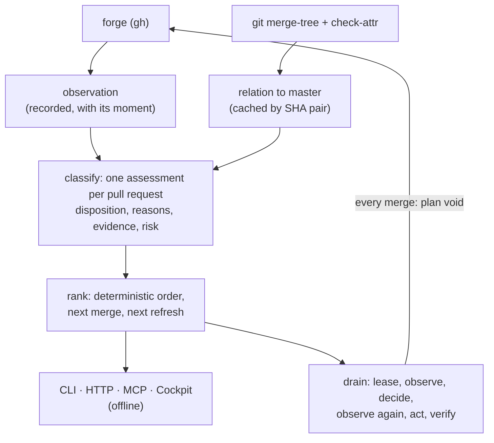

# Pull-request integration

Majordomus does not merge a list of pull requests. It integrates the next provably safe
change into the current master, verifies that it landed, discards what it assumed, and
decides again from what is there now. The decision is recorded in ADR 0101, the rule is
`project.integration-follows-the-current-master`, and the code is `crate::integration`.

## The pipeline



The forge's `mergeable` flag is never read. This repository resolves derived files with a
per-clone merge driver (`merge=derived`) that the forge cannot run, so the forge calls nearly
every pull request conflicting. The relation to master is decided by git: `git merge-tree
--write-tree` with the drivers, and `git check-attr merge` for which paths are derived,
according to master's own `.gitattributes`.

The relation is decided on exactly the head the forge reported, the one the assessment names
as evaluated. A head that moved during the refresh is not in the clone, and its relation is
`unknown` until the next refresh. It is never decided on whatever a fetched ref holds now.
When git cannot say which paths are derived, because `git check-attr` failed, the relation is
`unknown` too, never "nothing is derived". A relation is cached only under a pair of full
commit ids, and an `unknown` is never cached.

Where the merge would conflict, or would change only derived output, `git cherry` is asked as
well. When every commit the head has and master lacks is on master already as an equal patch,
the relation is `patch_ids_upstream`: the change landed, by a cherry-pick say, and master moved
past it. A partial match never gives it. Neither does a head with a merge commit of its own in
that range, because a merge's resolution has no patch to compare, nor a clean merge that
changes authored paths: there master lacks something the head carries, such as a landed change
that master has reverted since.

## Dispositions

Every open pull request has exactly one. They are decided in the order below, so an earlier
answer wins. `ready` is reached only after every other question is answered in its favour.

| Disposition | Lane | When | Next |
|---|---|---|---|
| `other_base` | held | targets a branch other than the base, and no open pull request's head | — |
| `waiting_for_dependency` | waiting | stacked on another open pull request of this repository, or declares a dependency on an open one (see below) | land that one first |
| `draft` | held | a draft | mark it ready |
| `obsolete` | cleanup | carries a label that marks it obsolete (owner decision D3; see the label policy below); checked before the hold labels, after `draft` | a person closes it, or removes the label |
| `blocked` | held | carries a label that holds it (see the label policy below) | remove it |
| `unsafe` | held | the forge has auto-merge armed on it, so the forge would merge it on its own | disarm it: `gh pr merge <n> --disable-auto` |
| `superseded` | cleanup | a declared successor landed: it is not open, and master contains its head (see supersession markers below); `superseded_by` names it | `prs cleanup --apply` closes it |
| `waiting_for_dependency` | waiting | a declared successor is still open | land the successor; this one is then closed, never merged |
| `possibly_redundant` | cleanup | a declared successor was closed without its head landing | a person decides |
| `unknown` | held | a declared successor is not open and could not be read | `prs refresh` |
| `redundant` | cleanup | its head is an ancestor of master, merging it changes no file, or every one of its commits is on master as an equal patch | `prs cleanup --apply` closes it |
| `possibly_redundant` | cleanup | merging it changes only derived artifacts | a person decides |
| `unknown` | held | its head is not fetched, git failed, the branch protection could not be read, or a check run of an app-bound context names no app | `prs refresh` |
| `conflicting` | repair | the merge conflicts on an authored path | the author resolves it |
| `blocked` | held | the repository's settings allow no merge commit (see the merge method below) | allow merge commits |
| `waiting_for_review` | waiting | a required review is missing or changes were requested (see below) | a reviewer |
| `needs_repair` | repair | a required check failed on its head, or it is behind master from a fork | the author |
| `needs_refresh` | waiting | merges cleanly but does not contain master | `prs drain --refresh`, or `prs repair <n> --apply` for one |
| `waiting_for_checks` | waiting | contains master; a required check is pending or missing on this head | wait |
| `ready` | ready | contains master, and every required check passed on this head | `prs drain` |

A required check that is pending, missing, skipped or unreadable is not passed. The required
checks are read from the base's branch protection and rulesets, each with the app bound to
it, never listed here. A green check that is not required proves nothing.

A check bound to an app is only that app's check run. A commit status of the same name is
not it, and neither is another app's check run of that name: it cannot pass the check, fail
it or hold it pending. A context two sources bind to two apps is required of both. `gh pr
list` does not say which app wrote a check run, so when a context is bound the refresh asks
the forge who wrote each one: one GraphQL read (`gh api graphql`, a query, never a mutation)
for every 50 open pull requests, and one more for each page of a head that carries more
than 100 checks. A base that binds nothing asks nothing more. A writer read that fails
fails the refresh, as a failed list does.

A check run of a bound context whose app was not read is never taken for the bound app's:
the check is `unknown` (`required_checks:unknown`), never passed, and the queue says which
pull requests carry one. This happens when the head moved between the list and the writer
read, which the next refresh clears, and when a check suite names no app or a head carries
more than 1000 checks, which no refresh clears: a person looks. An observation recorded
before writers were read has none, so every bound check reads `unknown` until one `prs
refresh`.

The binding names the app, not the workflow. Every workflow of a repository writes as the
same app (GitHub Actions is one app), a workflow a pull request's own head defines or
rewrites included: a head that changes `.github/workflows/` decides what its own check
named `ci` runs. The binding keeps another app out. It does not prove which workflow ran.

### Gates, reasons and evidence

The order above is a list of gates, and every gate is asked whatever the others answer:

| Gate | Passes when | A failure's reasons |
|---|---|---|
| `base` | it targets the base | `stacked_on:#N`, or `base_is:BRANCH` |
| `draft` | it is not a draft | `draft` |
| `label` | no label that holds it | `label:NAME`, one per label |
| `auto_merge` | the forge has no auto-merge armed on it | `auto_merge_armed` |
| `supersession` | no successor is declared | `superseded_by:#N`, `successor_open:#N`, `successor_not_landed:#N`, `successor_unread:#N`, one per successor |
| `relation_to_master` | its merge is clean and changes something | `head_reachable_from_master`, `merge_changes_nothing`, `patch_ids_upstream`, `only_derived_artifacts_differ`, `relation_unknown:WHY`, `conflicts_on:COUNT` |
| `merge_method` | the repository allows a merge commit | `merge_commit_not_allowed` |
| `dependency` | every declared dependency landed | `depends_on:#N`, one per open dependency |
| `review` | the review policy is satisfied on the head | `review:STATE`, or `review_policy_unread` |
| `no_failing_check` | no required check failed | `required_check_failed` |
| `freshness` | the head contains master | `behind_master:COMMITS`, with `fork_head` for a fork |
| `required_checks` | every required check passed | `required_checks:STATE` (`pending`, `missing`, or `unknown` when a check run of an app-bound context names no app), `no_required_checks`, `required_checks_unread` |

The assessment's `gates` lists every gate with whether it passed. Its `reasons` hold every
failing gate's reasons in this order, and the first is the decisive one: the disposition is
the first failing gate's. A draft that also conflicts and fails its check is `draft`, with
`draft`, `conflicts_on:1` and `required_check_failed`. A gate that fails only because an
earlier one did, such as `freshness` when the merge conflicts, adds no reason of its own. A
ready pull request has `contains_master` with `required_checks_passed` or
`required_checks_skipped`. The reasons are typed (`ReasonCode`), but on the wire they are the
same strings as before. A code that an older trail line carries and this list does not name
is kept verbatim.

Each piece of evidence has a `kind`, a `status`, a `detail` and a `source`. The source is the
forge observation at its moment, or git on the named master and head. Evidence for `base` and
`draft` is always there. So is `required_checks`, with one `required_check` per context the
base requires, and `review` and `relation_to_master`. `dependency` appears per declared
dependency, `label` per label that holds it, `auto_merge` whenever the forge has auto-merge
armed, `repository_settings` when the settings allow no merge commit, and `supersession` per
declared successor (`open`, `landed`, `not_landed` or `unread`; that one `landed` is git's, on
master and the successor's head). `freshness` is a reserved kind. `evaluated_against` names the master, the head and the moment of the
observation; two decisions are the same when the master and head are.

### Label policy

The labels that have an effect are one table, `LABEL_POLICY` in
`src/integration/classify.rs`. Each label has an effect; the policy in force copies the table
(`policy.labels` in `prs status --json` and `integration.queue`) and the classifier reads that
copy. No other list of labels exists. A label is compared case-insensitively.

| Label | Effect |
|---|---|
| `do-not-merge` | hold |
| `do not merge` | hold |
| `blocked` | hold |
| `hold` | hold |
| `on-hold` | hold |
| `wip` | hold |
| `manual-merge` | hold |
| `obsolete` | obsolete |

`hold` makes the pull request `blocked`, with `label:NAME`. `obsolete` makes it `obsolete`,
with `label_obsolete:NAME` in the forge's spelling (owner decision D3): a person's mark is the
only evidence that reaches the word — age, shared paths and a similar title never do — and it
is never closed automatically. A pull request carrying both is `obsolete`, since a person acts
on it either way; a draft carrying it stays `draft`, because the draft gate is asked first.
There is no label that opts a pull request out of the executor's refresh (owner decision D11).


### Auto-merge and the merge method

A pull request on which the forge has auto-merge armed is `unsafe`. The forge would merge it
on its own once its own conditions hold, outside the executor and against whatever master is
then, and refreshing it would only hand the forge a head to merge. Nothing acts on it until a
person disarms it, and the queue lists every such pull request in a diagnostic.

The executor merges only with a merge commit, because the derived-file driver resolves merges
and a squash or a rebase would replay commits it never saw. The merge method
(`policy.merge_method`) is `merge` when the repository's settings allow a merge commit
(`allow_merge_commit`, read with `gh api repos/OWNER/NAME`), and none otherwise. With none,
every pull request the relation to master does not already decide is `blocked` with
`merge_commit_not_allowed` and `repository_settings` evidence, and the queue says why. The
executor never falls back to a squash or a rebase. The `merge_method` gate comes after
`relation_to_master` because closing work that is already on master does not depend on the
merge setting: a `redundant` pull request stays `redundant`, lists
`merge_commit_not_allowed` after its own reason, and `prs cleanup --apply` still closes it. So
does a `superseded` one.

### Review states

The forge's review decision comes first, and the branch protection's requirement second:

| The forge says | The protection requires a review | Review | Disposition, if nothing earlier decided |
|---|---|---|---|
| `CHANGES_REQUESTED` | any | `changes_requested` | `waiting_for_review` |
| `APPROVED` | any | `approved` | goes on to the checks |
| `REVIEW_REQUIRED` | any | `pending` | `waiting_for_review` |
| nothing | yes | `pending` | `waiting_for_review` |
| nothing | no | `not_required` | goes on to the checks |
| nothing | unread | `unknown` | `unknown` |

`REVIEW_REQUIRED` is pending even when the branch protection requires no review. A ruleset or
code owners can require one that the protection does not, and the forge's word is that a
review is still owed.

### Dependency markers

A pull request depends on another when a line of its body opens with one of these markers,
in any case, followed by one or more numbers:

- `Depends on #N`
- `Stacked on #N`
- `Requires #N`
- `Land after #N`

Only a bullet (`-`, `*`, `+`, `1.`), quote marks (`>`) and emphasis (`*`, `_`) may come before
the marker, so `- **Depends on:** #7` declares a dependency. More numbers follow with commas,
`and` or `&`: `Stacked on #644 and #645`. The same words anywhere else in a line are prose:
`a regression introduced after #540` and `thereafter #5` declare nothing, and neither does a
bare `After #N`.

A dependency is satisfied only when that pull request **merged**. The refresh reads every
declared dependency that is not open (`gh pr view`, with the successors), so the queue knows
what became of it:

| The dependency | The pull request | Reason |
|---|---|---|
| open | `waiting_for_dependency` | `depends_on:#N` |
| merged | not held by it | — |
| closed without a merge | `blocked`: its work never landed, so a person reopens it or removes the declaration | `dependency_closed_unmerged:#N` |
| not open, and the forge could not say — refused, or not a pull request at all | `unknown`, never satisfied | `dependency_unread:#N` |
| part of a cycle of declared dependencies between open pull requests | `blocked`: none of them can land first | `dependency_cycle:#N`, one per other member |

A cycle is said before anything else about the dependencies, then a closed one, then an
unread one, then an open one. Git also implies dependencies: a pull request whose observed
head contains another's observed head carries its commits, so landing it lands both. Each
such pair is an `inferred` dependency with `inferred` evidence — never a block, never a
change of disposition or rank; only a declaration holds a pull request back. The refresh lists
at most 500 open pull requests; a forge with as many says so in the queue's diagnostics,
because a dependency on one beyond them would read as unread.

### Supersession markers

A pull request is replaced by another when a line of a body declares it, read by the same
line-anchored parser as a dependency:

- `Superseded by #N` in its own body names N as its successor;
- `Supersedes #M` in N's body names N as the successor of M, from the other side.

The `supersession` gate is asked before `relation_to_master`, because a pull request whose
successor landed usually conflicts with what the successor brought, and it is superseded, not
conflicting. What became of the successor decides:

| The successor | Disposition | Reason |
|---|---|---|
| is no longer open, and master contains its head: it landed | `superseded`, with `superseded_by: N` | `superseded_by:#N` |
| is still open | `waiting_for_dependency` | `successor_open:#N` |
| is no longer open, and master does not contain its head (closed unmerged, or merged by a squash or a rebase) | `possibly_redundant` | `successor_not_landed:#N` |
| is not open and could not be read | `unknown` | `successor_unread:#N` |

Of several successors, one that landed decides, then one still open, then one that did not
land. On the wire the disposition stays one word, and `superseded_by` (present only with
`superseded`) is its successor. A successor that is no longer open is not among the open pull
requests, so the observation also reads the closed pull requests whose body declares a
supersession (one search, newest 200) and each named successor that is not open (`gh pr view`),
and fetches their heads; git, not the forge's `merged`, says whether a head landed. The search
index can lag a merge by a moment: until it catches up, the replaced pull request is decided by
its relation alone, which after its successor's merge is no longer `ready`.

A pull request that targets another branch is stacked on the open pull request whose head is
that branch. Only branches of this repository count. A fork's branch says nothing about a
branch here, whatever it is called, so a fork whose branch is named `master` stacks nothing.

### Issue and milestone

Each assessment names the issue its head branch names, when it names one, and that issue's
milestone: `issue` and `milestone`, absent otherwise. The branch is the link, in the form
`majordomus worktree create --issue <id>` gives it (`feature/<id>-<slug>`): a path component
equal to an issue id of `.ai/repo/project/issues/`, or the id followed by `-`, and nothing
else counts — a branch `feature/I10030` does not name `I1003`. The milestone is the one the
issue's record declares. Both are derived on every read of the queue from the recorded
observation and this checkout's project model, never stored beside them; neither decides a
disposition or a rank. `prs explain` prints them (`issue:        I0810 · milestone M003`),
the Cockpit shows them beside the title, and `prs status --format json`, the HTTP API and MCP
carry them on each assessment.

## What a change touches

Beside each head's relation, from the same pair of commits and cached under the same key in
`relations.json`, the queue reads what its merge changes by kind (`change_shape` on the
assessment): its authored paths, its derived paths, and `version_bump`, the version it
declares in `apps/majordomus-cli/Cargo.toml` when that is not the one its merge base declares.
The authored paths are the whole change, a conflicting head's included, and they decide:

| What two open pull requests share | `overlaps[].kind` | Risk factor |
| --- | --- | --- |
| both raise the crate's version | `version_bump` | `overlapping_version_bump:#N` |
| both change a record under `.ai/repo/releases/` | `release` | `overlapping_release:#N` |
| an authored path | `authored` | none |

Risk is low, medium or high from the paths touched. A head that raises the version
(`version_bump:V`), a shared version bump or release, and a relation git could not decide
(`paths_unknown`) are high: whichever of two version bumps lands second has to be
re-derived on the first, and a change nobody could read is never "documentation only".

## The rank

The queue is ordered by lane, disposition, risk (low, medium, high, as above), how many
other ready or refreshable pull requests it overlaps (fewer first, because landing it
invalidates less), how many open pull requests declare that they wait for
it and are not yet satisfied (more first, because landing it unblocks them), how many
authored paths it changes (fewer first: a smaller change is cheaper to land and to undo), age
(older first, so new easy work cannot starve old work) and number. Every key is a value of
the assessment or of the queue around it, so the order is total and does not depend on the
order the forge listed them; `src/integration/tests.rs` proves this as a property. Each
assessment carries the factors it was ranked by (`rank_factors`), and `prs explain` prints
them, so a rank is never a number without its reasons.

## Waiting and starvation

Every `ready` or `needs_refresh` pull request carries how long it has been the executor's to
act on, and how often the executor chose another instead (`wait` on the assessment). Both
are folded from the audit trail (`crate::integration::wait`) and from nothing else:

- each executor step records the transitions since the trail's last word, as
  `became_actionable` and `left_actionable` (with the disposition it has now, or that it is no
  longer open);
- each selection records the other actionable pull requests it `passed_over`.

A pull request passed over three times in its current wait is listed as `starving`. That
shows on `prs status`, `prs explain`, the Cockpit and the briefing, and it never changes the
rank. The age tie-break already prefers the older of two otherwise equal candidates, and a
long wait is never a reason to merge something less safe sooner. A dry run records neither
the transitions nor the selection, so a dry run still leaves no trace. A wait starts when the
executor first sees the pull request as actionable, not when the forge was first observed.

## One merge at a time

`prs drain` loops over one step and holds nothing between steps:

1. observe the forge, fetch every open head, and build the queue;
2. take the first `ready` pull request;
3. observe again and rebuild the queue;
4. act only if the second decision names the same master and head and still says `ready`,
   and otherwise record `stale_decision` and start again;
5. merge with a merge commit (`--merge`) and `--match-head-commit <head>`, never `--admin`,
   a squash or a rebase;
6. verify that the forge shows it merged and that the fetched master contains its head;
7. record the merge with the master before and after.

A merge moves every other pull request behind master, so the next step always starts from a
new observation.

When nothing is ready, `prs drain --refresh` brings master into the first `needs_refresh`
pull request. It uses a scratch worktree under the common git directory, runs `git merge
--no-commit` with the derived driver (rerere off, so no remembered resolution decides a path
nobody looked at), runs `scripts/derive`, commits with the hooks running, and pushes a
fast-forward to the pull request's branch with a plain push, never a forced one. It first
checks that what it pushes descends from the head it observed, and that origin still serves
that head (`git ls-remote`): a branch its author moved since, forward, sideways or back, is
refused and nothing is pushed. Between that check and the push, git itself refuses a branch
moved forward or sideways, since the push is then no fast-forward. A rewind in that window,
the author force-pushing the branch back to an ancestor of the observed head, is the one move
that slips through: the push is then a fast-forward that restores the commits the author
removed. That window is accepted; no history is ever overwritten. That is a merge commit and
never a rewrite, as `project.land-and-publish` prescribes. The pipeline is one deep: while a
refreshed pull request waits for its checks, no other is refreshed, because merging the first
would put the second behind again. Throughput is therefore one pull request per run of the
required check, which is the true cost of this repository's mechanics.

Only a run the executor started holds the pipeline: the required check of the head a
`refreshed` event recorded as pushed (`head_after`), while it is *pending* or *missing*. Both
count, because the forge creates no check run for an aggregate job such as this repository's
`ci` until every job it needs has finished, so the executor's own head reads as `missing` for
most of its run. A `missing` check holds the pipeline only for `REFRESHED_HEAD_REPORTS_WITHIN`
(four hours) after that event. Past it, the check is taken never to report and the next pull
request is refreshed, so one silent check cannot stop every refresh. A check running on a head
the author pushed holds nothing. A `refreshed` event recorded before `head_after` existed names
no head, so a pull request refreshed by an older executor does not hold the pipeline.

## Repair

The `repair` lane is a person's. Most pull requests here go `CONFLICTING` on the forge within
minutes of any merge to master, and nearly always over `merge=derived` files the forge cannot
resolve, because the derived driver is per-clone configuration. `prs repair <n>` (or the head
branch's name) brings master into one named pull request, whatever lane it waits in, by the
same act as `prs drain --refresh`. It replaces `scripts/unblock`, which did this outside the
integrator, without the lease or the trail.

It decides nothing of its own. It reads the named pull request's assessment and acts only
when the classification says the head lacks master and git's merge with the derived
attribute conflicts on no authored path, the relation `behind`. Every conflict the forge
reports is then on a `merge=derived` path, which the regeneration settles.

| The assessment says | `prs repair` |
|---|---|
| relation `behind` | eligible: master is merged in, derived, committed and pushed |
| relation `conflicting` | refused with exit 10, naming every authored file that conflicts: they are the owner's to settle |
| relation `up_to_date` | nothing to repair: the head already contains master |
| `redundant`, `superseded`, relation `contained`, `superseded`, `patch_ids_upstream` or `derived_only` | nothing to repair: cleanup's lane, or a person's |
| relation `unknown`, a fork's head, armed auto-merge, another base, not open | refused with exit 10 |

Without `--apply`, which is the default and is also spelled `--dry-run`, it is a read. It
decides on the queue of the last recorded observation, as `prs status` and `prs explain` do.
It reaches no network, takes no lease, writes nothing to the trail, and exits 10 when nothing
was ever observed. `prs refresh` observes again. With `--apply` it follows the drain's rules:

1. it takes the base branch's integration lease and holds it until the act is over, so a
   drain cannot race it, and a second executor started meanwhile is refused (exit 12);
2. it observes the forge again, exactly as a drain step does, and decides again on that;
3. it records `repair_selected` and then `repair_attempted` before anything reaches the
   remote, and does nothing when either line cannot be written;
4. in a scratch worktree under the common git directory, never the branch's own, it merges
   the master it decided on, runs `scripts/derive`, and commits with the hooks running;
5. it pushes a fast-forward of the head it observed, with a plain push and only while origin
   still serves that head, then records `repaired` with the
   head it pushed, or `repair_refused` with the failure's class.

A merge, derive, commit or push that fails leaves nothing on the branch and is
`repair_refused`. A branch that moved is classed `stale`. It never merges into master, never
asks the forge to merge, and never touches a person's checkout. A refusal decided from the
classification is recorded too when `--apply` was given, so the trail says why a requested
repair did not happen.

## Cleanup

Closing a pull request requires more evidence than merging one. `prs cleanup` lists the
`redundant` and `superseded` ones and closes them only with `--apply` (`--dry-run` spells
out the default), with a comment that names the reason that decided it, the base, and the
master and head that proved it; a superseded one's comment opens with its successor
(`Superseded by #N, which landed.`). A closure is taken the way a merge is: the forge is
observed again first, and the pull request is closed only if the second decision still says
the same thing against the same master and head, or the trail records a `stale_decision` and
nothing is closed. The forge is asked for the pull request's state and head just before, and
a head that moved is never closed. `possibly_redundant` is listed and left for a person,
whether its evidence is derived output or a successor that did not land. Age, shared paths
and similar titles are not evidence of anything.

Before 0.13 (owner decision D2) the word `superseded` meant what `redundant` means now, and its
closure was recorded as `closed_superseded`. The strong case is `redundant` now, closed as
`closed_redundant`; `superseded` and `closed_superseded` mean only a declared successor that
landed. Older trail lines still read: a `closed_superseded` line written before carries
`head_reachable_from_master` or `merge_changes_nothing`, never `superseded_by:#N`.

### Branches merged pull requests leave behind

Branches are never deleted here: the forge's `delete_branch_on_merge` decides that (owner
decision D4), so the executor holds no write that removes a branch. What the forge left
behind is reported instead, by `prs cleanup` alone: it reads origin's branches
(`git ls-remote --heads`) and the newest 1000 merged pull requests on demand, and keeps every
branch of this repository that origin still serves at the exact head that merged. `prs
refresh` never asks — the executor runs it before every decision, and a report-only fact
that decides no merge stays off that path; it reads only the setting, from the repository
settings it already asks for. A branch whose tip moved after its merge carries newer work and
is never listed; neither is a fork's branch, whatever it is called, or the base. Cleanup
prints the list after the pull requests and records it as `left-branches.json` beside the
observation, with when it was read, so the surfaces that never reach the network render the
last report with its age:

```text
merged branches left on origin (2); the forge decides deletion, so none is deleted here:
  fix/left                                         #1     3f2a9c1d0b7e  left_for_a_person
  fix/here                                         #3     9c0d4e5f6a7b  kept: checked out at /…/here-wt
  next: the forge keeps merged branches: enable delete_branch_on_merge, and delete this one with git push origin --delete fix/left
```

A branch checked out in a worktree of this repository is listed as `kept`, with its path:
somebody may still be standing on it. A read that fails leaves the list unread
(`merged branches: unread`), recorded as unread and never as empty. `prs cleanup --format
json` stays the list of pull requests to close.

## Safety

- One executor per base branch: `drain`, `cleanup --apply` and `repair --apply` hold an
  exclusive lease at `<git-common-dir>/majordomus/locks/integration-<base>.lock`, with the
  holder recorded. Holding it is holding an exclusive `flock` on that file for the
  executor's life, so the kernel decides who holds it: of executors started at the same
  instant, in one checkout or in several worktrees of the repository, exactly one holds it
  and no pull request is merged twice. The integration unit tests race eight executors per
  round, and cases 855 and 856 race separate processes through the command line. A holder
  that ends, even by a crash, releases the lease at once; a live holder is never taken over.
  A record untouched for 30 minutes is reported stale to observers (`prs brief`,
  `prs status`), which never take the lease. The executor renews its record before every
  observation, and a refresh keeps it fresh while the branch's derive runs. When the path no
  longer names the file the executor locked, or the record names another holder, the lease
  is lost: the drain stops as on any systemic failure (`prs drain` exits 12) and acts on
  nothing. The lease is taken for the base the forge was last observed to name, observed
  first when this checkout never asked, never for a guessed `master`.
- One executor per repository, across machines: the lease guards one clone, since every
  worktree shares its common git directory and another clone has its own. When this
  checkout's shared server runs the repository's mesh (ADR 0067), the executor first takes
  an exclusive mesh claim on `integration/<repository>/<base>` as its checkout's session, and
  every linked runtime admits against it: a second machine's `prs drain` exits 12 naming the
  holding session and what it said it was for, before it takes its own lease. The claim's key
  is in the lease record; it is released after the lease. Where no mesh runs, the lease alone
  guards, and `prs brief` and the Cockpit say "per-clone guard only". An executor killed
  outright leaves its claim held — its session belongs to its checkout, which the mesh never
  refuses to itself — and the next executor of that checkout releases the leftover, so a
  crash costs other machines a wait, never a claim nobody can give back
  (`integration::exclusive`, `tests/integration_across_machines.rs`, case 924).
- Every act is appended to the audit trail before it happens. The trail is one file per
  repository, `<git-common-dir>/majordomus/integration/events.jsonl`, beside the lease, so
  every worktree writes the same trail and `prs events`, `prs brief`, `prs status`, the
  `integration.*` capabilities and the Cockpit read it from any of them. The last queue's
  summary (`summary.json`) sits beside it. The observation and the relation cache stay in
  the checkout, under `.ai/local/state/integration/`.
- A read writes nothing. `prs status`, `plan`, `explain`, the `integration.*` capabilities
  and the Cockpit build the queue from the recorded observation and leave the checkout as
  they found it; only `prs refresh` and the executor, which have just observed the forge,
  keep the relations they decided and the summary a briefing reads. An observation older
  than an hour is said in the queue's diagnostics, and every reading of a queue with a
  diagnostic — `status`, `plan` and `explain` alike — exits 10.
- The trail is written first. A merge is asked of the forge only after `merge_attempted` is
  on the trail, a refresh is pushed only after `refresh_attempted`, a repair only after
  `repair_attempted`, and a pull request is closed only after `close_attempted`. When that
  line cannot be written, the act is not taken: the step reports `trail_unwritable`, the
  drain stops, and `prs drain` exits 12 (`prs repair --apply` exits 12 too). A lease the
  trail cannot record is given back and refused. Any other write the trail refuses ends the
  run with the error rather than continuing unrecorded.
- The events, each a typed `action` on one JSON line:

  | Event | When |
  |---|---|
  | `lease_acquired`, `lease_released` | the executor takes and gives back the base branch's lease |
  | `continuous_started`, `continuous_stopped` | a continuous drain starts, and stops with its reason |
  | `observed` | `prs refresh`, or an executor step, observed the forge |
  | `became_actionable`, `left_actionable` | the two transitions a wait is folded from |
  | `selected` | the first ready pull request is chosen, with those passed over |
  | `refresh_selected` | the first refreshable one is chosen, with its evidence |
  | `stale_decision` | master or the head moved between the decision and the act |
  | `merge_attempted` | before the merge, with its evidence |
  | `merge_succeeded`, `merge_failed`, `verification_failed` | after it |
  | `failure_acknowledged` | a person looked at a merge that could not be verified (`prs drain --resume-after-failure`) |
  | `refresh_attempted` | before master is merged into the branch and pushed |
  | `refreshed` (with the head it pushed), `refresh_failed` | after it |
  | `repair_selected`, `repair_attempted` | `prs repair --apply` chose the named pull request, and is about to merge master into it and push |
  | `repaired` (with the head it pushed), `repair_refused` (with its class) | after it, or when the classification refused it |
  | `close_attempted` | before a redundant or superseded pull request is closed |
  | `closed_redundant`, `closed_superseded` (with its evidence), `close_failed` | after it |
  | `idle` | nothing was ready |
  | `observe_failed` | a continuous drain's cycle met an outage short enough to wait out |

  An event may also carry `evidence` (the assessment's, on the acts named above as carrying it),
  `class` (why it failed, once classified) and `merge_commit`. Each is left out when empty,
  and a line written before they existed reads with them empty.
- A checkout that kept its own trail under `.ai/local/state/integration/events.jsonl` has
  it appended to the repository's trail the first time the trail is read while the
  repository has none. The marker `events.moved-from` beside the trail keeps that from
  happening twice. Old trails of other worktrees are left in place, because appending one
  after another would fold their lines out of order.
- A dry run observes and decides and changes nothing. It records only what it observed
  (`observed`).
- A refused merge and a stale decision are specific to the candidate: the next step
  re-plans. A verification failure stops the drain.
- Every failed act on the trail carries its `class`: `stale`, `conflict`,
  `new_failing_check`, `review_revoked`, `transient` or `policy_violation` are one
  candidate's, and the drain goes on with the next; `verification_failed` and `unreadable`
  stop it. A pull request the forge refused to merge, or whose refresh failed, is shown as
  `needs_repair` with `executor_merge_refused:<head>` or `executor_refresh_failed:<master>`
  for as long as its head and master are the ones that were refused, so the next ready
  change merges instead of the same refusal repeating. A push to the branch or a new master
  clears it; a transient failure never holds a change back.
- A signal stops a one-shot drain as it stops a continuous one: the step in progress
  finishes, and no other starts. A continuous drain waits out a short outage of the forge
  (`observe_failed`, at most three consecutive cycles) before it ends.
- A merge is verified where it landed, not where the forge says it is. The base is fetched,
  and the commit right after the decision's master on master's first-parent line must be
  this merge: its first parent the master the decision was taken against and, for a merge
  commit, its second parent the head that was decided on. A merge that landed on top of
  another one, onto a master nobody tested with it, fails as `unexpected_master` even
  though the forge calls it merged. The commit is recorded as `merge_commit` on
  `merge_succeeded`. This is the executor's half of the guard; the forge's half is the
  protection's "require branches to be up to date" (`required_status_checks.strict`). The
  queue's policy says whether the base requires it (`up_to_date_required`), and `prs status`
  and the Cockpit show it; it decides no disposition, and turning it on is the owner's act
  (decision D8).
- A merge whose answer was lost (a timeout, a dropped connection) is asked whether it
  landed, never asked to merge again: landed and proved, it is `merge_succeeded`; not
  landed, `merge_failed`.
- An executor that stopped between asking for a merge and verifying it leaves a
  `merge_attempted` with no end. The next drain verifies that merge first and records how
  it ended, before it decides anything.
- A verification failure holds every later drain (owner decision D7). Until a person has
  looked and run `prs drain --resume-after-failure`, which records `failure_acknowledged`,
  a drain merges nothing, says why, and exits 10; `--continuous` stops. A dry run still
  plans.
- Transient failures of the forge are asked again (`crate::integration::retry`): a timeout,
  a 5xx, a rate limit or a dropped connection, at most four attempts with waits of 2, 4 and
  8 seconds. Anything else, such as a refusal, a 401, a 404 or a moved head, is the answer and
  is returned at once. The observation, the fetch and the post-merge verification are
  retried. The merge itself is never retried: a merge that timed out may have landed, and
  the verification is what finds out. A drain that decides again after a refused merge is
  taking a new decision from a new observation, within its step bound, and is not retrying.

## Commands

| Command | Network | What |
|---|---|---|
| `majordomus prs` / `prs status` | no | the ranked queue; exit 10 when the observation is stale or absent |
| `majordomus prs plan` | no | the next merge, the next refresh, and the other lanes |
| `majordomus prs explain <n>` | no | one pull request's gates, reasons, evidence and rank |
| `majordomus prs events` | no | the repository's audit trail, the same from every worktree |
| `majordomus prs brief` | no | one line for a briefing: the last queue built in the repository, the lease and how far it reaches, the last merge, the last refresh, failure or stale decision; nothing in a checkout that never observed the forge |
| `majordomus prs refresh` | yes | observe the forge and fetch every open head |
| `majordomus prs drain [--max N] [--dry-run] [--refresh]` | yes | integrate, one merge at a time |
| `majordomus prs drain --resume-after-failure` | yes | record that a person looked at an unverified merge, then drain |
| `majordomus prs drain --continuous [--interval S] [--max N] [--refresh]` | yes | drain, wait, drain again until stopped |
| `majordomus prs cleanup [--apply]` | yes | close what is provably on master, or superseded by a successor that landed; list what is a person's (possibly redundant, obsolete) and the branches merged pull requests left on origin |
| `majordomus prs repair <n\|branch>` | no | whether master may be brought into that pull request, from the last observation (a dry run) |
| `majordomus prs repair <n\|branch> --apply` | yes | bring master into it, under the lease, as `drain --refresh` does |

The same queue is `GET /api/v1/pull-requests` (MCP `majordomus_pull_requests`), with the
lease and the last merge beside it. One pull request is
`GET /api/v1/pull-requests/explain?number=` (`majordomus_pull_request_explain`), and the
trail is `GET /api/v1/pull-requests/events` (`majordomus_integration_events`). What cleanup
would do is `GET /api/v1/pull-requests/cleanup` (`majordomus_pull_requests_cleanup`): the plan
decided offline from the recorded observation — `would_close` or `left_for_a_person` for each
pull request, the same table `prs cleanup` acts on — beside the branch report `prs cleanup`
last recorded, with its age. It closes, deletes and asks the forge for nothing. All four are
declared once in `capability/builtin/integration.rs`.

The Cockpit renders those two answers at `/cockpit/integration`. It shows the counts by lane,
the executor's throughput over the last seven days (merges, merges per day, the median wait
from actionable to merged, CI rounds per merge, the median cycle, stale decisions, failed and
unverified merges — a median nothing measured is said, not shown as zero), the master every
decision was taken against, the next merge, who holds the lease and how far it reaches, the
last merge, a table per lane with each pull request's reasons, next action and wait, and the
executor's recent actions. With nothing observed, it says so and names `prs refresh`.
`majordomus context` carries `prs brief` under `INTEGRATION`, and a handover derived with
`majordomus handover --derive` carries the same line under `# Current State`, so a session
that continues drain work starts knowing what was merged, what remains, how the last step
went, and whether an executor is running.

## Continuous mode

`prs drain --continuous` drains, waits `--interval` seconds (300 by default, 30 to 900),
and drains again. It holds the base branch's lease for the whole run, so a second executor is
refused while observers are not. The ceiling keeps the wait well inside the 30 minutes after
which a lease is called stale. Every cycle is an ordinary bounded drain: `--max` merges, each
from a fresh observation, and nothing is carried between cycles. Ctrl-C or SIGTERM lets the
step in progress finish, then the drain stops and releases the lease. A second signal ends
it at once. A verification failure stops it for a person, and so does a forge or git that
cannot be read after its retries. It never runs with `--dry-run`, and it does not start before
the rollout's record allows it (see below).

## Rollout

1. **Dry run.** `prs refresh && prs status && prs drain --dry-run` against the real
   repository. The classification was checked on 2026-09-30 against 70 open pull requests.
2. **One merge.** `prs drain --max 1` once a pull request is `ready`.
3. **Bounded.** `prs drain --refresh --max 3`.
4. **Continuous.** `prs drain --continuous` is refused, with exit 10 and before the lease,
   the base or the forge is touched, until the audit trail holds five verified merges
   (`ROLLOUT_MERGES_BEFORE_CONTINUOUS`) since the last merge that could not be verified. A
   merge that could not be verified starts the count again, even after
   `--resume-after-failure`, because the record it ends was the evidence. The gate reads
   the trail and nothing else: stages 2 and 3 are what fill it (ADR 0101 §13).
