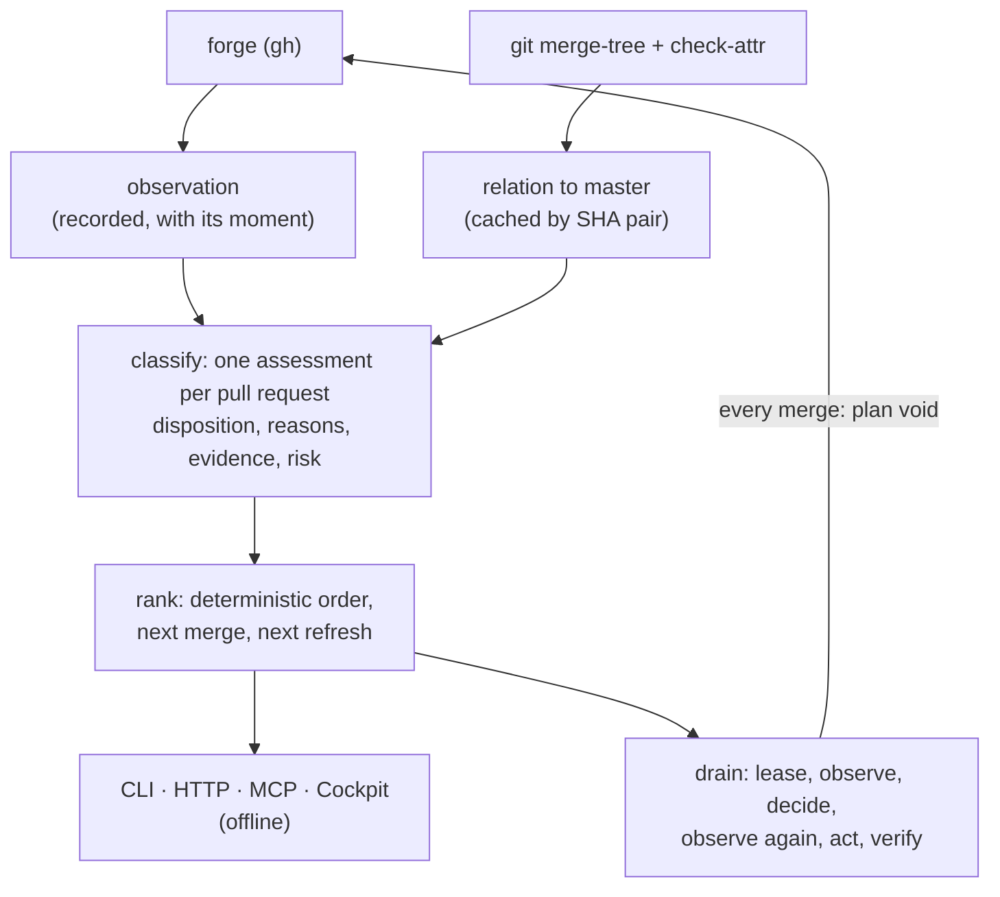

# Pull-request integration

Majordomus does not merge a list of pull requests. It integrates the next provably safe
change into the current master, verifies that it landed, discards what it assumed, and
decides again from what is there now. The decision is recorded in ADR 0101, the rule is
`project.integration-follows-the-current-master`, and the code is `crate::integration`.

## The pipeline

The forge's `mergeable` flag is never read. This repository resolves derived files with a
per-clone merge driver (`merge=derived`) that the forge cannot run, so the forge calls nearly
every pull request conflicting. The relation to master is decided by git: `git merge-tree
--write-tree` with the drivers, and `git check-attr merge` for which paths are derived,
according to master's own `.gitattributes`.

The relation is decided on exactly the head the forge reported, the one the assessment names
as evaluated. A head that moved during the refresh is not in the clone, and its relation is
`unknown` until the next refresh. It is never decided on whatever a fetched ref holds now.
When git cannot say which paths are derived, because `git check-attr` failed, the relation is
`unknown` too, never "nothing is derived". A relation is cached only under a pair of full
commit ids, and an `unknown` is never cached.

## Dispositions

Every open pull request has exactly one. They are decided in the order below, so an earlier
answer wins. `ready` is reached only after every other question is answered in its favour.

| Disposition | Lane | When | Next |
|---|---|---|---|
| `other_base` | held | targets a branch other than the base, and no open pull request's head | — |
| `waiting_for_dependency` | waiting | stacked on another open pull request of this repository, or declares a dependency on an open one (see below) | land that one first |
| `draft` | held | a draft | mark it ready |
| `blocked` | held | carries a blocking label (`do-not-merge`, `blocked`, `hold`, `on-hold`, `wip`, `manual-merge`) | remove it |
| `superseded` | cleanup | its head is an ancestor of master, or merging it changes no file | `prs cleanup --apply` closes it |
| `possibly_redundant` | cleanup | merging it changes only derived artifacts | a person decides |
| `unknown` | held | its head is not fetched, git failed, or the branch protection could not be read | `prs refresh` |
| `conflicting` | repair | the merge conflicts on an authored path | the author resolves it |
| `waiting_for_review` | waiting | a required review is missing or changes were requested (see below) | a reviewer |
| `needs_repair` | repair | a required check failed on its head, or it is behind master from a fork | the author |
| `needs_refresh` | waiting | merges cleanly but does not contain master | `prs drain --refresh` |
| `waiting_for_checks` | waiting | contains master; a required check is pending or missing on this head | wait |
| `ready` | ready | contains master, and every required check passed on this head | `prs drain` |

A required check that is pending, missing, skipped or unreadable is not passed. The required
checks are read from the base's branch protection, never listed here. A green check that is
not required proves nothing.

### Review states

The forge's review decision comes first, and the branch protection's requirement second:

| The forge says | The protection requires a review | Review | Disposition, if nothing earlier decided |
|---|---|---|---|
| `CHANGES_REQUESTED` | any | `changes_requested` | `waiting_for_review` |
| `APPROVED` | any | `approved` | goes on to the checks |
| `REVIEW_REQUIRED` | any | `pending` | `waiting_for_review` |
| nothing | yes | `pending` | `waiting_for_review` |
| nothing | no | `not_required` | goes on to the checks |
| nothing | unread | `unknown` | `unknown` |

`REVIEW_REQUIRED` is pending even when the branch protection requires no review. A ruleset or
code owners can require one that the protection does not, and the forge's word is that a
review is still owed.

### Dependency markers

A pull request depends on another when a line of its body opens with one of these markers,
in any case, followed by one or more numbers:

- `Depends on #N`
- `Stacked on #N`
- `Requires #N`
- `Land after #N`

Only a bullet (`-`, `*`, `+`, `1.`), quote marks (`>`) and emphasis (`*`, `_`) may come before
the marker, so `- **Depends on:** #7` declares a dependency. More numbers follow with commas,
`and` or `&`: `Stacked on #644 and #645`. The same words anywhere else in a line are prose:
`a regression introduced after #540` and `thereafter #5` declare nothing, and neither does a
bare `After #N`. A dependency is satisfied once that pull request is no longer open.

A pull request that targets another branch is stacked on the open pull request whose head is
that branch. Only branches of this repository count. A fork's branch says nothing about a
branch here, whatever it is called, so a fork whose branch is named `master` stacks nothing.

## The rank

The queue is ordered by lane, disposition, risk (low, medium, high, from the paths touched),
how many other ready or refreshable pull requests share an authored path (fewer first,
because landing it invalidates less), age (older first, so new easy work cannot starve old
work) and number. Every key is a value of the assessment, so the order is total and does
not depend on the order the forge listed them. `src/integration/tests.rs` proves this as a
property.

## Waiting and starvation

Every `ready` or `needs_refresh` pull request carries how long it has been the executor's to
act on, and how often the executor chose another instead (`wait` on the assessment). Both
are folded from the audit trail (`crate::integration::wait`) and from nothing else:

- each executor step records the transitions since the trail's last word, as
  `became_actionable` and `left_actionable` (with the disposition it has now, or that it is no
  longer open);
- each selection records the other actionable pull requests it `passed_over`.

A pull request passed over three times in its current wait is listed as `starving`. That
shows on `prs status`, `prs explain`, the Cockpit and the briefing, and it never changes the
rank. The age tie-break already prefers the older of two otherwise equal candidates, and a
long wait is never a reason to merge something less safe sooner. A dry run records neither
the transitions nor the selection, so a dry run still leaves no trace. A wait starts when the
executor first sees the pull request as actionable, not when the forge was first observed.

## One merge at a time

`prs drain` loops over one step and holds nothing between steps:

1. observe the forge, fetch every open head, and build the queue;
2. take the first `ready` pull request;
3. observe again and rebuild the queue;
4. act only if the second decision names the same master and head and still says `ready`,
   and otherwise record `stale_decision` and start again;
5. merge with the repository's merge method and `--match-head-commit <head>`, never `--admin`;
6. verify that the forge shows it merged and that the fetched master contains its head;
7. record the merge with the master before and after.

A merge moves every other pull request behind master, so the next step always starts from a
new observation.

When nothing is ready, `prs drain --refresh` brings master into the first `needs_refresh`
pull request. It uses a scratch worktree under the common git directory, runs `git merge
--no-commit` with the derived driver, runs `scripts/derive`, commits with the hooks running,
and pushes a plain fast-forward to the pull request's branch. That is a merge commit and never
a rewrite, as `project.land-and-publish` prescribes. The pipeline is one deep: while a
refreshed pull request waits for its checks, no other is refreshed, because merging the first
would put the second behind again. Throughput is therefore one pull request per run of the
required check, which is the true cost of this repository's mechanics.

Only a run the executor started holds the pipeline: the required check of the head a
`refreshed` event recorded as pushed (`head_after`), while it is *pending* or *missing*. Both
count, because the forge creates no check run for an aggregate job such as this repository's
`ci` until every job it needs has finished, so the executor's own head reads as `missing` for
most of its run. A `missing` check holds the pipeline only for `REFRESHED_HEAD_REPORTS_WITHIN`
(four hours) after that event. Past it, the check is taken never to report and the next pull
request is refreshed, so one silent check cannot stop every refresh. A check running on a head
the author pushed holds nothing. A `refreshed` event recorded before `head_after` existed names
no head, so a pull request refreshed by an older executor does not hold the pipeline.

## Cleanup

Closing a pull request requires more evidence than merging one. `prs cleanup` lists the
`superseded` ones and closes them only with `--apply`, with a comment that names the master
and head that proved it. `possibly_redundant` is listed and left for a person. Age, shared
paths and similar titles are not evidence of anything. Branches are not deleted. The
repository's own setting decides that.

## Safety

- One executor per base branch: `drain` and `cleanup --apply` hold an exclusive lease at
  `<git-common-dir>/majordomus/locks/integration-<base>.lock`, with the holder recorded. A
  lease untouched for 30 minutes is reclaimed. Observers never take it.
- Every act is appended to `.ai/local/state/integration/events.jsonl`: `selected`,
  `stale_decision`, `merge_attempted`, `merge_succeeded`, `merge_failed`,
  `verification_failed`, `refresh_selected`, `refreshed` (with the head it pushed),
  `refresh_failed`,
  `closed_superseded`, `idle`, and the two transitions of a wait, `became_actionable` and
  `left_actionable`.
- A dry run observes and decides, and changes and records nothing.
- A refused merge and a stale decision are specific to the candidate: the next step
  re-plans. A verification failure stops the drain.
- Transient failures of the forge are asked again (`crate::integration::retry`): a timeout,
  a 5xx, a rate limit or a dropped connection, at most four attempts with waits of 2, 4 and
  8 seconds. Anything else, such as a refusal, a 401, a 404 or a moved head, is the answer and
  is returned at once. The observation, the fetch and the post-merge verification are
  retried. The merge itself is never retried: a merge that timed out may have landed, and
  the verification is what finds out. A drain that decides again after a refused merge is
  taking a new decision from a new observation, within its step bound, and is not retrying.

## Commands

| Command | Network | What |
|---|---|---|
| `majordomus prs` / `prs status` | no | the ranked queue; exit 10 when the observation is stale or absent |
| `majordomus prs plan` | no | the next merge, the next refresh, and the other lanes |
| `majordomus prs explain <n>` | no | one pull request's evidence and rank |
| `majordomus prs events` | no | the audit trail |
| `majordomus prs brief` | no | one line for a briefing: the last queue built here, the lease, the last merge; nothing where the forge was never observed |
| `majordomus prs refresh` | yes | observe the forge and fetch every open head |
| `majordomus prs drain [--max N] [--dry-run] [--refresh]` | yes | integrate, one merge at a time |
| `majordomus prs drain --continuous [--interval S] [--max N] [--refresh]` | yes | drain, wait, drain again until stopped |
| `majordomus prs cleanup [--apply]` | yes | close what is provably on master |

The same queue is `GET /api/v1/pull-requests` (MCP `majordomus_pull_requests`), with the
lease and the last merge beside it. One pull request is
`GET /api/v1/pull-requests/explain?number=` (`majordomus_pull_request_explain`), and the
trail is `GET /api/v1/pull-requests/events` (`majordomus_integration_events`). All three are
declared once in `capability/builtin/integration.rs`.

The Cockpit renders those two answers at `/cockpit/integration`. It shows the counts by lane,
the master every decision was taken against, the next merge, who holds the lease, the last
merge, a table per lane with each pull request's reasons, next action and wait, and the
executor's recent actions. With nothing observed, it says so and names `prs refresh`.
`majordomus context` carries `prs brief` under `INTEGRATION`, so a session that continues
drain work starts knowing what was merged, what remains, and whether an executor is
running.

## Continuous mode

`prs drain --continuous` drains, waits `--interval` seconds (300 by default, 30 to 900),
and drains again. It holds the base branch's lease for the whole run, so a second executor is
refused while observers are not. The ceiling keeps the wait well inside the 30 minutes after
which a lease is called stale. Every cycle is an ordinary bounded drain: `--max` merges, each
from a fresh observation, and nothing is carried between cycles. Ctrl-C or SIGTERM lets the
step in progress finish, then the drain stops and releases the lease. A second signal ends
it at once. A verification failure stops it for a person, and so does a forge or git that
cannot be read after its retries. It never runs with `--dry-run`.

## Rollout

1. **Dry run.** `prs refresh && prs status && prs drain --dry-run` against the real
   repository. The classification was checked on 2026-09-30 against 70 open pull requests.
2. **One merge.** `prs drain --max 1` once a pull request is `ready`.
3. **Bounded.** `prs drain --refresh --max 3`.
4. **Continuous.** `prs drain --continuous` exists and is gated by its own explicit flag;
   it is to be run only after the audit trail shows several verified bounded cycles. It
   has not been run against this repository yet.
