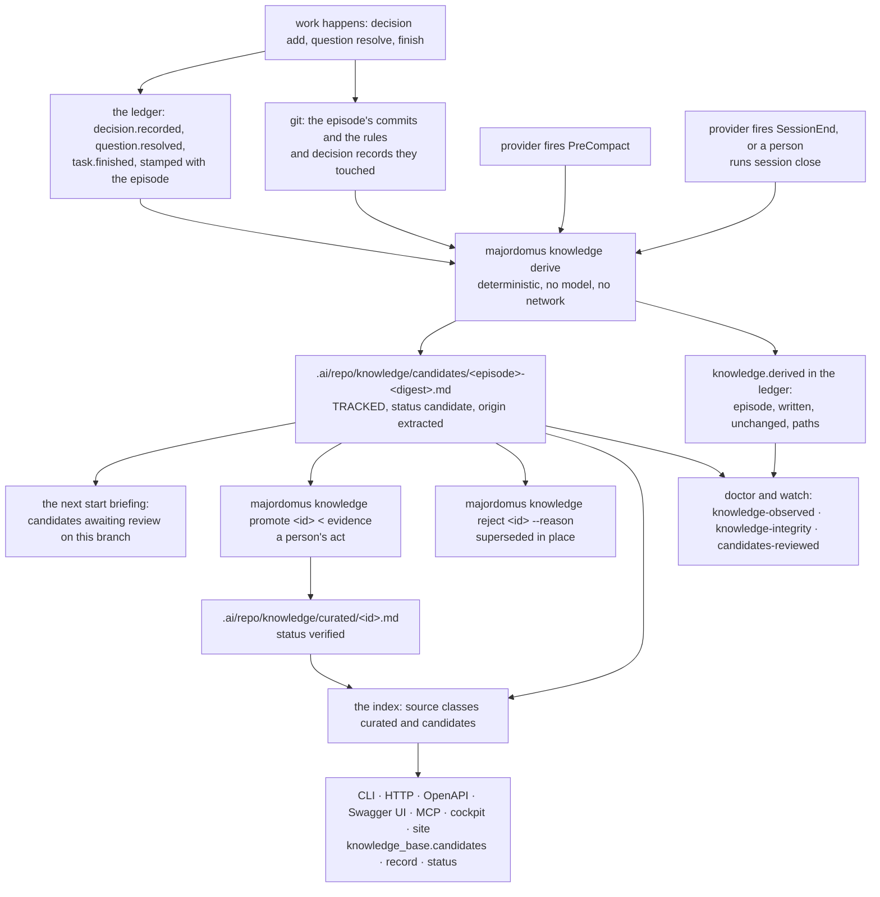

# Knowledge — what an episode learned, derived at its boundary and promoted by a person

An episode records decisions, resolves questions and finishes tasks, and every one of those
is a typed line in the ledger of one machine. The ledger is retention-capped and local; the
note a blocked task leaves is local; a decision is visible in `majordomus history` until the
cap removes it. Each is evidence of something true about the repository, and until this
subsystem none of it reached the tracked tree, another checkout or a surface the registry
feeds.

Majordomus derives it. At the moment what the episode knows stops being reachable — the
provider's end event and its compaction event — the ledger lines the episode stamped are
turned into candidate knowledge records under `.ai/repo/knowledge/candidates/`, from the
ledger and git, deterministically, without a model and without reading a conversation. A
person reviews the queue and promotes what deserves it. Nothing about it depends on a worker
remembering a command, and a repository in which episodes close and no knowledge advances is
reported as a stopped writer. `.ai/repo/adrs/0058-knowledge-is-derived-at-the-episode-boundary-and-a-person-promotes-it.md`
is the decision.

## What a record is

The knowledge base is the `knowledge` kind, schema `knowledge/v1`, under
`.ai/repo/knowledge/`, and nothing else: no new kind, no second store, no memory service, no
agent (ADR 0010, `project.no-new-nouns`). A record is one assertion about the repository, in
one line, with:

| Field | Values | Meaning |
|---|---|---|
| `class` | `fact`, `convention`, `constraint`, `memory`, `lesson` | what kind of thing is asserted |
| `status` | `candidate`, `verified`, `superseded` | who has stood behind it: the deriver, a person, or nobody any more |
| `epistemics` | `observed`, `inferred`, `decided` | how it is known |
| `provenance.origin` | `authored`, `extracted` | a person wrote it, or the tool derived it |
| `provenance.derived_from` | `session:`, `decision:`, `task:`, `commit:`, `issue:`, `file:`, `test:` | the evidence, as typed references that resolve |
| `relations` | `relates_to`, `documents`, `supports`, `contradicts`, `supersedes`, `depends_on` | what it stands in relation to, never what it restates |

A record is never a summary of a conversation and never quotes a prompt or a turn; the check
that keeps `project.never-store-transcripts` applies to its title, its description and its
body. An ADR, a rule and a document are sources of their own: a record relates to them and
never restates them. `SCHEMAS.md` has the file format with an example.

`curated/` and `candidates/` hold records, one status apart. `curated/` is what this repository chose to
write about itself, `status: verified`. `candidates/` is what the tool derived and nobody has
reviewed, `status: candidate`; it is tracked, for the reason every closed session record is
tracked: a record only one machine can read is a record nobody reads (ADR 0014). Both are
source classes in `.ai/repo/knowledge/sources.yaml`, discovered through the git index like
every kind, and both carry a `README.md` contract.

## What is derived, from what

The evidence is the ledger lines the episode stamped and the commits it made. The mapping is
this table and the deriver implements exactly this table.

| evidence | record | class | epistemics | derived_from |
|---|---|---|---|---|
| `decision.recorded` | the decision text | `convention` | `decided` | `session:<episode>`, `decision:<task-id>`; the session alone when the line carries no task |
| `question.resolved` | the answer, stating the question it answers | `fact` | `observed` | `session:<episode>`, `task:<task-id>` |
| `task.finished` with outcome `blocked`, `failed` or `no_match` | the outcome and the first line of the task note's `# Reason` | `lesson` | `inferred` | `session:<episode>`, `task:<task-id>` |
| `task.finished` with outcome `completed` and a `verify` command | the verification that passed | `fact` | `observed` | `session:<episode>`, `task:<task-id>` |
| commits of the episode touching `.ai/repo/rules/` or `.ai/repo/adrs/` | no record; each record of the episode gains `commit:<sha>` in `derived_from` and `relates_to file:<path>` in `relations` | — | — | — |

Every derived decision is a `convention`. Reading the wording to decide whether a decision
binds would be a kind inferred from prose, which the knowledge compiler refuses everywhere
else, and it is exactly the judgement promotion exists to record: `--class` at promotion is
where a person makes it a `constraint` or a `lesson`. A `task.finished` with any other
outcome, or `completed` without verification, yields no record. A handover's Next Action is
continuation state, not knowledge, and is never derived from.

**Same ledger, same git, same bytes.** The record id is the episode id followed by a digest
of the canonical evidence string, so the same fact always lands in the same file and two
worktrees never write one name for different content. The `date` is the day of the evidence
line, never the clock, and no random value enters the file. A ledger line's free text is
unescaped once when read and escaped once when the record is composed, so a quotation mark
inside a decision neither cuts the record short nor changes its identity. A line whose text
carries a transcript marker yields no record; it is reported as skipped rather than written
for the integrity check to refuse. No network, no model, no `eval`
(`project.no-network-no-eval`).

## The two moments

The deriver runs when the checkpoint runs, for the checkpoint's reason: the provider's end
event and its compaction event are the moments at which what the episode knows stops being
reachable.

The close path is one. `mj_session_close` in `lib/session.sh` runs the deriver after the
session record is published and before `session.closed` is appended, whenever
`session.knowledge_on_end` is not off. Every close — the provider's end adapter, `majordomus
session close` typed by a person, any future caller — is therefore followed by its
`knowledge.derived` line, and the derivation precedes the close in ledger order. The end
adapter in `lib/capture.sh` reads the close's outcome and reports a derivation failure through
`mj_capture_session_failed`; it does not derive a second time.

The compaction adapter has no close to ride on, so it calls the deriver itself, switched by
`session.knowledge_on_compact` and independent of `checkpoint_on_compact`: a compaction that
skips its checkpoint still derives.

It runs whether or not a task is active. The lifecycle is the episode's (ADR 0052), and a
task is an optional relation a record names when it has one. On demand, `majordomus
knowledge derive` does the same for the open episode or the one named with `--episode`.

The switches live beside the ones that exist, with the reason each is there written as its
comment:

| Key | Default | Why |
|---|---|---|
| `session.knowledge_on_end` | `true` | the evidence the episode produced is about to stop being reachable; derive what it says before the handover |
| `session.knowledge_on_compact` | `true` | a compaction discards the conversation while the work continues; the ledger lines it produced are still there and are derived now |
| `knowledge.candidates_max_files` | `40` | more candidates than this awaiting review is a `WARN`: the queue is measured, never emptied by a machine |
| `knowledge.candidate_max_age_minutes` | `20160` | a candidate this old was not reviewed, it was ignored; `doctor` names it |

`.ai/repo/policy.yaml` and `share/skeleton/policy.yaml` carry them; the policy schema and the
regenerated allow-list accept them; `mj_validate_policy_defaults` and
`mj_validate_policy_completeness` see them as they see every key.

## The evidence that it ran

Every derivation is a ledger line, registered in `share/events.yaml` before it is ever
written, because an unknown event name is an error.

| event | extra fields | written by |
|---|---|---|
| `knowledge.derived` | `episode`, `written`, `unchanged`, `paths`, and `skipped` when a line was refused | every non-dry-run derivation that resolved an episode, even when it wrote nothing |
| `knowledge.promoted` | `id`, `path` | `knowledge promote` |
| `knowledge.rejected` | `id`, `reason`, and `by` when `--by` was given | `knowledge reject` |

A derivation that fails inside a provider hook is recorded as `provider.event.failed` through
`mj_capture_session_failed`, and the hook exits 0: the provider is never blocked and a failure
is never silent. A switch that is off is said on stderr and leaves no derivation line, which
is what the stopped-writer check treats as deliberate.

## The promotion act

`verified` is written by an act, never by the deriver.

`majordomus knowledge promote <id> [--class <c>] < evidence.md` moves the candidate to
`curated/`, sets `status: verified`, sets the class the person chose, dates it today, keeps
`derived_from` and adds the promoting episode when one is open, appends the evidence under
`# Evidence`, removes the candidate, appends `knowledge.promoted` and prints the curated path
last. An empty stdin is refused, because an act without evidence is an assertion; stdin that
carries a transcript marker is refused for the reason a record may not carry one.

`majordomus knowledge reject <id> --reason "<why>" [--by <id>]` rewrites the candidate in
place as `superseded`, names `superseded_by` when `--by` gives the record that replaces it,
appends the reason under `# Rejected`, appends `knowledge.rejected` and prints the path last.
A superseded record stays under `candidates/` as the rejection a person made, and counts
toward neither the cap nor the age.

A person editing the file is the other act. The deriver skips an id that has been promoted or
superseded, so neither act is undone by the next episode boundary.

## What the next worker is told

The start briefing (ADR 0017) gains one bounded section, after the open questions and before
the handover: the candidates awaiting review on this branch, the count on one line and the
ids beneath it, bounded the way the open-questions block is and inside
`session.briefing_budget_lines`. A candidate's branch is the branch of the episode its
`derived_from` names, read from the tracked session record or, while that record is not yet
written, from the ledger. A candidate whose episode this checkout cannot resolve is named on
a distinct line as unattributed rather than hidden, because a record the briefing cannot
place is still a record somebody has to review. Absence is printed rather than omitted.

## The commands

`majordomus knowledge` is no longer read-only; `share/commands.yaml` says so and `CLI.md` has
the prose. Every write is atomic — a temporary file in the same directory, renamed over the
target — never staged, and prints the path written on the last line, the way `handover` and
`checkpoint` do.

| Command | Reads | Writes | Exit codes |
|---|---|---|---|
| `knowledge derive [--episode <id>] [--dry-run] [--json]` | the ledger window of the episode, the task notes under `.ai/local/state/completed/`, the sessions store, git (the episode's commits and the paths they touched), the policy, both record directories | `candidates/<id>.md` per record; `knowledge.derived`; nothing under `--dry-run` | `0` (also with no episode or nothing changed), `2` usage, `10` the policy does not parse, `13` write failure |
| `knowledge candidates [--json]` | `candidates/` on disk (tracked or not, so a candidate the hook just wrote is listed), the sessions store, the ledger | nothing | `0`, `2` usage |
| `knowledge promote <id> [--class <c>] < evidence` | the candidate, stdin, the open episode | `curated/<id>.md`; removes the candidate; `knowledge.promoted` | `0`, `2` usage, `10` empty or transcript stdin, status not candidate, class outside the enumeration, `12` no such candidate, `13` write failure |
| `knowledge reject <id> --reason "<why>" [--by <id>]` | the candidate, both directories for `--by` | the candidate rewritten in place; `knowledge.rejected` | `0`, `2` usage or empty reason, `10` status not candidate or `--by` names no record, `12` no such candidate, `13` write failure |
| `knowledge check [--json]` | both record directories, `share/allow/knowledge.txt`, the sessions store, the ledger, git | nothing | `0` no failure, `2` usage, `10` any failure |
| `knowledge sources`, `nodes`, `edges` | unchanged; `edges --type derived_from` now lists a record's provenance edges | nothing | unchanged |

The output of `derive` is one line per record — `written <path>`, `unchanged <path>`,
`skipped <path> (promoted|superseded|transcript)`, or `would write <path>` under `--dry-run` —
then a summary line naming the counts and the episode; with no episode to derive from it says
so and exits 0 without a ledger line. `--json` on every subcommand is one object with the
same content as the text.

The Rust executable serves the read side: `bin/majordomus-cli knowledge candidates`,
`knowledge record <id>` and `knowledge status`, each the command-line projection of a
capability declared once in `apps/majordomus-cli/src/capability/builtin/knowledge_base.rs`
and served identically over HTTP, OpenAPI, MCP, the cockpit's catalogue and the benchmark
inventory (`CAPABILITIES.md`). `record` resolves every reference the record names to an
object of the index, an external fact of the ledger or git, or missing; `status` reports the
last derivation, the newest close, the freshness against the policy and the stopped-writer
judgement. It writes nothing and reports absence as absence.

## Enforcement

The rules below belong to the standard package, vendored into every repository the tool
initialises and dispatched from the doctrine registry (`DOCTRINE.md`). They ship with the tool rather than as
project rules because `doctor` refuses, in every repository, a validator no rule of the
effective set declares, and a disposable test repository carries only the vendored package;
ADR 0052 met the same constraint and answered it the same way.

| Rule | Class | Validator | Enforced by | Finding |
|---|---|---|---|---|
| `majordomus.knowledge-observed` | blocking | `mj_validate_knowledge_lifecycle` | `doctor`, `watch` | the newest `session.closed` names an episode no `knowledge.derived` names and is older than `session.freshness.stale_minutes`; or the switch is on and the lifecycle source never calls the deriver |
| `majordomus.knowledge-integrity` | blocking | `mj_validate_knowledge_integrity` | `check`, `doctor` | a record that is not schema-valid, uniquely identified, evidenced when verified, fully resolved, correctly superseded, or that is a candidate claiming `verified`, or that carries a conversation |
| `majordomus.candidates-reviewed` | advisory | `mj_validate_knowledge_accumulation` | `doctor` | more candidates than the cap, a candidate whose review age exceeds the policy age, or a candidate version control does not track |

The stopped-writer judgement is gated the way ADR 0052 gated its own: a checkout whose ledger
holds no `knowledge.derived` line at all is reported as a skip, so the day the deriver
arrives no checkout turns red, and the first derivation ends the skip. Its reproduce is
read-only — `majordomus history --event session.closed` and `majordomus history --event
knowledge.derived` — and the remedy follows `fix:` in the message. The blocking
validators span the shell writer and the Rust reader: the freshness half of the judgement is
made on both sides from the same ledger and the same policy numbers, and the wiring half is
the shell validator's alone, because only the shell tool can read its own source.

The advisory rule measures the queue and empties nothing. Review age is the age of the queue
entry — the oldest `knowledge.derived` line naming the file, then the commit that added it,
then the record's `date` — and the finding says which source it used. It is dispatched from
`doctor` only: under `watch` an advisory finding is drift, and a full review queue must not
turn `watch` red in a hook.

Each rule names its tests and its claims; `scripts/ci/rule-proof-check` and
`scripts/ci/claim-proof-check` refuse a rule whose proof is missing and a claim whose test
does not name it. `CLAIMS.yaml` carries one claim per enforced behaviour.

## From evidence to surface

## What it does not do

It does not call a model, a network or `eval`, and it does not read a conversation, a prompt
or a handover. It does not add a kind, a directory family, an agent, a role or a registry;
the `knowledge` kind with a class and a status carries the meaning. It does not gate on a
task being active, finished or handed over. It does not write `verified`, does not stage and
does not commit. It does not decide which candidates deserve promotion; the advisory rule
exists so that the queue is seen, not so that it is emptied by a machine.

## Related

[`CONTINUITY.md`](CONTINUITY.md) for the episode and the records that survive it ·
[`CLI.md`](CLI.md) for every command · [`SCHEMAS.md`](SCHEMAS.md) for the record format and
the events · [`DOCTRINE.md`](DOCTRINE.md) for how the three rules are dispatched and proved ·
[`CAPABILITIES.md`](CAPABILITIES.md) for how the Rust reader reaches every surface ·
[`CLAIMS.yaml`](CLAIMS.yaml) for the claims and their tests.
