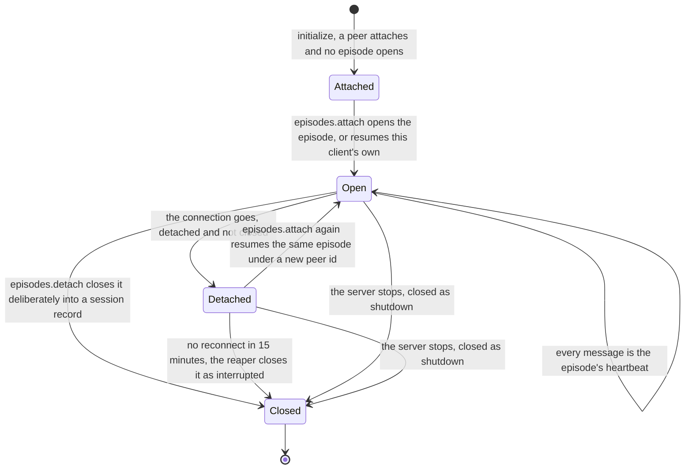

# MCP surface — `majordomus mcp`

What the Rust executable under [`apps/majordomus-cli/`](../apps/majordomus-cli/) serves
to an MCP client, where it comes from, and what it refuses. Behaviour as implemented and
tested; where implementation and this document disagree, the document is wrong and
changes in the same commit as the fix. The developer-facing detail (architecture, every
option, the kind schema) is in the application's own
[`README.md`](../apps/majordomus-cli/README.md).

## What it is

A process the client starts, speaking the Model Context Protocol on its stdin and stdout,
serving the repository's AI layer read-only, and joining the repository's one shared
server: the first such process in a repository binds the loopback HTTP projection beside
its stdio session (a home page listing every surface, this repository's documentation, Swagger UI, the OpenAPI document, every capability route, MCP over
HTTP) and says where; every later one attaches to it.

```bash
cargo build --manifest-path apps/majordomus-cli/Cargo.toml
apps/majordomus-cli/target/debug/majordomus mcp --inspect    # what would be served, and every diagnostic
apps/majordomus-cli/target/debug/majordomus mcp              # serve until the client goes; the first one is the server
apps/majordomus-cli/target/debug/majordomus mcp --standalone # this client alone: no port, no lease, no peers
bin/majordomus-mcp                                           # the same, built first when needed: what a client configuration names
```

The log on stderr names it the moment it is up:

```
shared server listening on http://127.0.0.1:8741 — 7 surface(s): api http://127.0.0.1:8741/api/v1, cockpit http://127.0.0.1:8741/cockpit, docs http://127.0.0.1:8741/docs, home http://127.0.0.1:8741/, mcp http://127.0.0.1:8741/mcp, openapi http://127.0.0.1:8741/openapi.json, swagger http://127.0.0.1:8741/swagger; the one server of this checkout ...
```

It is not a daemon: nothing starts it but a client, nothing keeps it alive but clients,
and it ends when its own client is gone and the last attached one has left. It keeps no
state beyond its memory, needs no database, and writes one file: the lease under
`.ai/local/state/mcp/`, the checkout-local half the layer reserves for operational state,
removed when the server stops. It is one projection of the executable's capability
registry ([`CAPABILITIES.md`](CAPABILITIES.md)): the same capabilities are the HTTP routes
and the `capabilities` commands, and every tool and resource here is derived from a
registry entry, none declared in the MCP code. The decision is
[`.ai/repo/adrs/0003-shared-mcp-server-peers-and-client-autostart.md`](../.ai/repo/adrs/0003-shared-mcp-server-peers-and-client-autostart.md).

## One server per checkout

| | |
|---|---|
| election | the first process to create `.ai/local/state/mcp/server.json` (atomically) is the server; it binds, writes its URL into the file, and logs it |
| port | `--http-port` (default `8741`) on `--http-host` (default: the interface `MAJORDOMUS_HTTP_HOST` names on this machine, and `127.0.0.1` when it names none — [below](#the-machine-names-the-interface)); a taken port is replaced by a free one and both are logged, so a second repository or a stray process never stops a client from starting |
| attaching | a later `majordomus mcp` reads the lease, checks that the server answers for this root, and bridges its stdio to `/mcp`: one HTTP request per message, a ping every twenty seconds, no index and no registry of its own, so it starts in milliseconds |
| stale lease | a lease whose server does not answer for this root (the process was killed), a file that is not a lease document, an empty one, or one whose owner published no URL within the **bind grace** is taken over by the next process, and the log says which of these it was; nothing a client leaves behind can lock the others out |
| lifetime | the server serves while its own client is attached or any peer is; when the owner's client goes first, the log says `serving until the last peer leaves`; when the last peer goes, the server stops, closes the port and removes the lease |
| freshness | the server follows the repository it serves: before a request is answered it compares a fingerprint of the git control files (`HEAD`, the staging index, `packed-refs`, the reflog, the merge and rebase markers — one `stat` each) with the one its current reading was built at, and the request that finds them different rebuilds the layer. A commit made while the server runs is visible through the API, through MCP and in the Cockpit with no restart; a client attached before the commit keeps its session and its place on the peer board. No poll, no thread, no watcher. `project.the-server-sees-the-current-tree` |
| signals | `SIGTERM`, `SIGINT` or `SIGHUP` (a client killing its server, Ctrl-C in a terminal) removes the lease inside the handler before the process dies of the signal; `kill -9` cannot be caught, and the next process takes the stale lease over |
| takeover | a bridged peer whose server died elects again on its next message: it becomes the server itself, carrying its client's `initialize` across so that the client never notices, or attaches to whichever process won first (`re-attached to the shared server`); when it can serve neither way (its own `--strict` refuses a degraded layer) the client gets a JSON-RPC error naming why, never silence |
| refusal | a bridged peer whose server is serving and will not take a request — one sent before `initialize` is answered 400 `session_required` — relays that refusal to its client as a JSON-RPC error and elects nobody; an election is for a server that cannot be reached, that lost the session and will not re-open it (404), or that says it lost the lease (409 `lease_lost`) |
| options | the server's `--discovery` and `--strict` apply to every session it serves; a bridge inherits them and the log says which server it attached to |
| `--standalone` | the first version's behaviour: this client alone, no port, no lease, no peers, nothing written anywhere |
| degraded | when the lease cannot be written or replaced, or the shared server cannot start, the client is served alone exactly as `--standalone` would, and the log says `cannot use the shared server` with the path and the reason |
| `serve` | the same shared server without a stdio session of its own; when one already runs it logs the URL and exits 0 |

### One repository, every server of it

A server serves a checkout. A linked worktree is a checkout of its own — it has the
manifest, so it has a root, a lease and a server of its own — and until ADR 0035 nothing
said that two such servers belonged to one repository. Now the index route (`GET /`) names
the git repository the checkout belongs to beside the checkout's own identity:
`commit` is the commit the executable answering was built from, in full or `unknown`, and
`dirty` whether its tree carried uncommitted changes (`null` when the build did not know) —
the same two fields `GET /api/v1/live` and `GET /api/v1/ready` answer; `stale` is `null`
while the executable the process was loaded from is still the file on disk, and says why
once a rebuild has replaced or removed it — the process is then serving code that no longer
exists, and `GET /api/v1/ready` answers `ready: false` with the same reason (I1502);
`repository_id` is the checkout's (a digest of its root, what the lease probe compares),
`git_repository_id` is the repository's (a digest of the git directory every worktree
shares; absent where git cannot be asked), `linked_worktree` says whether this is the
primary checkout, and `leaseholder` says whether the process answering is still the one
(below). `GET /api/v1/server` — the tool `majordomus_server`, the resource
`majordomus://server` — lists every checkout git registers for the repository, the primary
first, each with its lease, where its server stands and how many peers it holds, and says
where this checkout's own server stands measured against what this executable would serve:

| standing | meaning |
|---|---|
| `absent` | no lease: nothing serves this checkout |
| `starting` | a lease without an address, young enough that its owner is still binding |
| `ready` | the server the lease names answers for this checkout, from the file on disk, at this executable's version |
| `outdated` | it answers, but from another version, or from a file replaced since it started: everything it says is yesterday's |
| `stale` | the lease names a server that does not answer, or is not a lease at all; the reason says which |

The list is what a caller gets by asking nothing, and it costs a lease read and a probe per
checkout — on a machine with a hundred worktrees registered, a hundred of each. A caller
that only wants to know about the checkout it is in says so — `checkouts=this` on the query
string, in the tool's input, or `--checkouts this` on the command line — and that reading
enumerates no other checkout, reads no other lease and probes no other server. The default
is the whole list, because that is the answer this capability gave before the field existed.

The lease itself is one type, read once (`lease::LeaseDocument`, `lease::LeaseFile::read`):
the election, the read-only `serving`, the environment snapshot and the status all parse it
through the same reading, and it carries the server's `version` beside the executable it
was started from. `.ai/local/state/mcp/server.json` is still where a person reads it with
`cat`; the status is where a program does.

### The server that is no longer the one

A lease can be taken over while the process that held it is still running and still healthy
— most often because its executable was replaced by a rebuild, which the election reads as
"it is serving code that is no longer on disk". The superseded process is not killed. It
keeps its socket, its peer board and the generation of the layer it loaded, and it goes on
serving the sessions it already had until they end. That is deliberate: a client mid-answer
should not lose its server because somebody ran `cargo build`.

What it must not do is go on being *the* server. From the moment its own reader finds the
lease no longer carries its token:

| | |
|---|---|
| its index says so | `GET /` answers `leaseholder: false`; every other field — `repository`, `repository_id`, `git_repository_id` — is as true of it as of the current server, which is exactly why one field has to separate them |
| the probe refuses it | `lease::probe` asks three questions, not two: a Majordomus server, this checkout, still the leaseholder. A client holding an address from before the takeover is told there is no server there rather than served a board nobody else can see |
| it takes on nobody new | an `initialize` with no session gets `409 lease_lost`, naming the launcher as the way to the current server |
| its open sessions continue | they are its own until they end, and the process ends with them |

A server too old to answer the third question is accepted by the probe. It cannot be told
from a current one on that endpoint, and refusing it would be the worse failure: a live
server taken for dead is taken over, which is how one checkout comes to have two.

This was measured before it was written: on 2026-09-10 this repository had two servers, one
lease, and a session whose environment carried the older address read a peer board with one
peer on it while the board everybody else shared had two.

### Four readings of "ready"

This executable answers "ready" four times, and the audit that prompted ADR 0035 counted
three of them as an accident (`docs/ENTRY_AUDIT.md`, root cause 5). They are not one
question badly split: they are four questions about four subjects, and merging any two
would lose the one thing that reader needs. Each is named here with its owner, so that the
next reader does not have to rediscover which one they are looking at.

| the question | the answer | who asks it |
|---|---|---|
| Is a **surface's** producer's output on disk? | `http::Served::ready(surface_id)` — the directory a producer writes into has files in it; a route this executable answers is always ready | the home page (`GET /`), which renders a surface with no output as `not built` rather than serving a 404 |
| Can **this process** answer a request? | `health.ready` — `GET /api/v1/ready`: the registry and the index it built at start-up, how the layer read, and whether the executable it was loaded from is still on disk — a replaced one makes it not ready, with the reason in `stale`. Local initialisation only | a hosting platform's readiness probe. It contacts nothing outside this process on purpose: a readiness check that probes a dependency fails a deployment for something that is not this process |
| Does **anything** accept a connection at the address the lease published? | `environment::ServiceAvailability` — one TCP connect with a hard budget and no name resolution (`environment::probe::reachable`) | the environment snapshot, which runs on a shell prompt (`majordomus env`, `.envrc`) and may not spend an HTTP round trip or reach DNS to say what it knows |
| Is what answers there **current**? | `ServerStanding` — `server.status`, from `lease::probe` (this checkout's identity, over HTTP) and the version and executable the lease carries | anyone who has to trust what the server says: `serve ensure`, `serve stop`, the `server` check of `health.report`, and the session briefing |

Read down the column and the ladder is plain: the third asks whether a socket is open, the
fourth whether the process behind it is this checkout's, from the file on disk, at this
build. A stale server answers the third and fails the fourth, which is exactly the class
that has cost this repository a day before now.

`health.report` carries the fourth and only the fourth. The first is per surface and
belongs on the page that renders surfaces; the second is a statement about the process
answering the report, which cannot be false where the report is being produced; and the
third cannot tell a live server from a socket somebody else holds. The check delegates to
`capability::builtin::server::standing_at` — the same reading `server.status` answers from
— so the health report and the status cannot say two different words about one lease.

### Ensuring a server, and stopping it

```text
majordomus serve status [--checkouts this|repository] [--format json]
                                            where this checkout's server stands, and every server of the repository
majordomus serve ensure [--idle S] [--wait S] [--port P]
                                            a ready server for this checkout, started if it must be
majordomus serve stop [--wait S]            end the server this checkout's lease names
```

`serve ensure` reads the lease and probes the server it names, exactly as the election
does, and converges: `ready` is printed and nothing is started; `starting` is waited for;
`absent` and `stale` start a server as a process of its own — this executable, `serve
--fallback --idle S`, its log at `.ai/local/state/mcp/server.log`, in its own process group
so that it outlives the shell that asked — and wait until it is ready; `outdated` starts one
only when the election would take the lease over (the same executable, replaced on disk)
and is otherwise reported with the remedy, because a server of another build that answers
is not this command's to end. Run twice, it starts nothing the second time; run by three
shells at once, the election lets one of the three servers bind and the others defer. The
call is bounded by `--wait`; a server that did not become ready in time is reported with
the standing it reached and exit 10.

A server `ensure` starts has no client of its own. It ends when no peer has been attached
for `--idle` seconds (fifteen minutes by default), which is what keeps ADR 0003's line —
there is no process without a client — true in time rather than at every instant: an
agent's entry is owed a server before its first attach, and a checkout nobody works in
does not keep one.

`serve stop` signals the server the lease names, when that server answers for this
checkout, and waits for *that server's* lease to go — the document it read, by its token,
not merely the path. A `serve ensure` still waiting in the election takes the freed path
within milliseconds, so waiting for the path would report a server that would not stop
when it had already stopped; the take-over is named in the answer instead. A lease that
names a server of another checkout, or one that does not answer, is left alone and said
so; nothing here kills a process that was not asked for by name.

**Who calls `ensure`.** The provider's start event does (`session.ensure_server_on_start`
in the policy, on by default): the one moment a server nobody has started yet is owed one is
when an agent arrives, and the briefing the event writes carries one line — `Shared server:
ready http://127.0.0.1:8741 pid 123` — so that a worker knows before its first tool call
whether the board it is told to read exists. The event never builds the executable: one
that is missing or older than its sources is named in that line and left alone, because a
hook is not the place to start a compiler and a server from stale code would answer with
yesterday's tree. An MCP client's launcher (`bin/majordomus-mcp`) has always converged the
same way through the election; a shell entering the repository (`.envrc`) is told and not
served, because `project.envrc-is-an-adapter` forbids the entry hook to start anything and a
shell is not a client.

**An announcement outlives the server it was made to.** The bridge sees every frame its
client sends, so it keeps the arguments of the last announcement the server accepted and
says them again wherever the client lands next: after a re-attach, once the session is
re-opened; after a takeover, onto the board of the server the bridge's own process has
become. A worker that announced once is on the board of every server that serves it,
without being asked to announce again; the instruction to announce again after a
reconnect stays in the bootstrap for the one case a bridge cannot cover, a client whose own
process is the server and restarts.

**What the election now guards against.** An owner keeps its lease young while the layer
loads (`Lease::keep_alive`), so a cold start slower than the bind grace is never taken for
an abandoned one; a take-over removes only the file it judged, never one that arrived in the
meantime; an owner whose lease was taken over while it was binding refuses to publish and
degrades, rather than writing over the winner's address; and a server whose lease is taken
over later stops claiming it — its signal handler no longer unlinks the file, which is
somebody else's — serves the peers it has, and ends with them. The server's own reader also
forgets the HTTP sessions that stopped pinging on every path, not only while the owner
waits for peers to leave, so a dead peer never stays `attached` on the board.


### The machine names the interface

A local server binds loopback. That default does not move: the layer, its diagnostics, its
peers and the two tools that answer about `.ai/local/` are not for every host on the
network a laptop happens to be on.

One machine may still want to be reached — a second machine attaching over the LAN, a mesh
peer dialing in, a phone opening the Cockpit — and until 0.14 the only way to say so was
`majordomus serve --host 0.0.0.0`, typed by hand. That lasted exactly as long as the
process: `serve ensure`, which is what a session start and a shell entry run, starts a
server with no host at all, so the next idle stop or the next session put the checkout back
on loopback without a word, and `serve status` had been reporting `desired 127.0.0.1` the
whole time.

So the interface is read from one place every starter inherits:

```sh
export MAJORDOMUS_HTTP_HOST=0.0.0.0     # every interface; or one address of this machine
```

| who starts the server | what it binds |
|---|---|
| `majordomus serve` | `--host` when given; else `MAJORDOMUS_HTTP_HOST`; else `127.0.0.1` |
| `majordomus mcp` (a client electing itself) | `--http-host` when given; else `MAJORDOMUS_HTTP_HOST`; else `127.0.0.1` |
| `majordomus serve ensure` (session start, shell entry) | it passes no host; the server it starts inherits the variable |
| `majordomus serve --deployment <id>` | the deployment object's `listen` block, and nothing else: a declared address is not overridden by a machine's environment |

Four things follow from it being a variable and not a setting:

- **It is the machine's, never the repository's.** Nothing tracked can set it. A key in
  `.ai/repo/policy.yaml` would make every clone of a public repository listen on whatever
  network it woke up in.
- **The command line wins**, a blank value is no value, and a value nothing can bind
  refuses to start, naming the address.
- **The warning stands.** A bind the variable chose still logs that every host reaching the
  interface can read the layer; the log line before it says the variable named the address,
  so a bind is never untraceable. Only a deployment object *declares* an exposure, and only
  a declared one is silent.
- **`server.status` answers for the environment it is asked in.** `desired.host` is what a
  server started from that environment would bind, so the address a server binds and the
  address the status calls desired are one resolution (`cli::resolve_http_host`) and cannot
  disagree. A running server answers `serve status`, and it answers for the environment it
  was started in.

Set it where every starter will see it — the shell's own startup file (`~/.zshenv`,
`~/.profile`). `.envrc.local` is too late for one of them: `.envrc` evaluates
`majordomus-env enter`, which ensures the server, *before* it sources `.envrc.local`, so
the server a first `cd` starts would not have the variable while everything started from
that shell afterwards would.

A server already running keeps the address it bound. After setting the variable,
`majordomus serve stop` and the next `serve ensure` — or the next session — brings it up
on the named interface.

There is no authentication on this surface. Binding beyond loopback hands every reachable
host the read surface and the commands the registry declares as writing; do it on a
network you would hand that to, or reach the loopback server through an SSH tunnel
instead (`ssh -L 8741:127.0.0.1:8741 <machine>`).

### What a contest is judged by

Four numbers decide which process owns the lease, and a fifth keeps the owner able to
answer. They are **declared**, in `.ai/repo/policy.yaml`'s `server:` block, and read once
when the repository is opened:

| key | what it decides |
|---|---|
| `probe_timeout_seconds` | how long a probe waits for the current owner to answer before that silence counts as evidence. Too low and a live but slow owner is judged stale and taken over **while it is still serving**; too high and a wedged one holds the checkout's server for that long |
| `bind_grace_seconds` | how long a lease naming no URL yet is left alone — a server writes its lease before it can serve, so a fresh lease without a URL is a *starting* owner, not a dead one |
| `join_timeout_seconds` | how long a process waits to join or create the lease file before refusing rather than waiting forever |
| `busy_grace_seconds` | how long a live owner that does not answer is waited on, and asked again, before its lease is taken over. The election gives a busy owner this long, and so does `serve ensure` before it starts anything: a probe that times out against a live process is not a dead server, but one that stays silent this long is wedged and replaced. A server that `ensure` started after waiting out this grace is told which lease it judged, so its election does not wait on it a second time |
| `read_deadline_seconds` | how long the server lets a connection go without a request read in full on it — waiting for a head, kept alive between requests, or reading a body — before it closes the connection. A client sending one byte a second would otherwise hold a request thread forever, and enough of them would leave the probe above unanswered. A connection whose request is being answered, or that was upgraded to the live channel, is never closed by it. Each close is counted in `server.status` (`connections.closed_by_deadline`), beside the requests refused `503` because all 64 request handlers were busy (`connections.refused_busy`); the probe, `GET /`, is answered even then. The HTTP library keeps a thread on each connection while it lives and can queue a connection that arrives in a burst until one is free; the deadline is also what bounds that wait (I2156) |

Until 2026-09-15 all of them were compiled constants in `apps/majordomus-cli/src/lease.rs`:
unchangeable without a rebuild, stated nowhere a reader would look, and invisible to every
projection — while `probe_timeout` is precisely the number that decides whether a live owner
keeps what it owns. That is a decision about how a repository is supervised, not an
implementation detail.

The schema (`share/schemas/majordomus/policy/policy.v1.schema.json`) owns the block with
`additionalProperties: false`, so a misspelt timing is **refused** rather than read as absent;
`test/cases/354_a_lease_contest_is_judged_by_a_declaration.sh` holds that, and
`lease::Timings::from_policy` carries the doc test proving a declared value is the one used
and that a key the policy omits keeps its constant. The values shipped are the constants they
replaced, so declaring them changed no behaviour — deliberately: a change to how a contest is
judged should be visible as a change, not arrive inside a refactor.

## Starting it from a client

The root of this repository carries the configuration each client reads, all naming the
same launcher, so that the first client to open the repository becomes the server and the
others attach:

| client | file | what it names |
|---|---|---|
| Claude Code | [`.mcp.json`](../.mcp.json) | a stdio server, `bin/majordomus-mcp`; Claude Code asks once whether to trust a project server |
| Gemini CLI | [`.gemini/settings.json`](../.gemini/settings.json) | the same launcher under `mcpServers.majordomus` |
| Codex | [`.codex/config.toml`](../.codex/config.toml) | `[mcp_servers.majordomus]`, loaded when the project is trusted |
| bb | nothing of its own | an orchestrator: the agent it starts (Claude Code, Codex, an ACP agent) reads its own file above, so a bb thread attaches through the agent, not through bb (ADR 0024). Claude Code under bb runs with `settingSources: project`, which loads `.mcp.json`; a server loaded from a settings file gets two seconds before the first turn, so a cold checkout that has to build the executable shows it `pending` at init and connected afterwards |

The rows are the providers whose declaration names a client configuration; the whole set,
with what each reads and where it keeps its scratch checkouts, is
[`docs/generated/providers.md`](generated/providers.md), generated from the same declaration.
| anything speaking Streamable HTTP | the running server's `/mcp` | `initialize` answers with an `Mcp-Session-Id`; every later request carries it; `DELETE /mcp` ends the session; an idle session expires and the client re-initialises on the 404, as the transport prescribes |

`bin/majordomus-mcp` builds the executable when it is missing or older than its sources
(`MAJORDOMUS_BUILD_PROFILE=release` for a release build; `MAJORDOMUS_BIN` names an
executable and never builds; `MAJORDOMUS_NO_BUILD=1` refuses to build and exits 12 with the
command to run), sets `MAJORDOMUS_SHARE` to the distribution's `share/` beside it, writes
nothing to stdout, and passes every argument to `majordomus mcp`. `just mcp`, `just serve`
and `just inspect` at the root do the same for a person; `just docs-ui` opens the running
server's Swagger UI. The same document, with its tags, examples and statuses, is the API
reference on the site at `/docs/api/` and is served raw at the site's `/openapi.json`; the
`initialize` instructions, the OpenAPI `info` and `GET /` open with the one summary from
`about.rs` ([`CAPABILITIES.md`](CAPABILITIES.md)).

## Peers

Every session is a peer: the server's own stdio client, every bridged `majordomus mcp`,
and every client speaking `/mcp` directly. A peer is named by what its client sent in
`initialize` (`clientInfo.name` and `version`: `claude-code`, `codex`, `gemini-cli`, or
whatever the client calls itself), numbered `p1`, `p2`, ... in attachment order, with the
transport, when it attached and when it was last seen. The `initialize` result's
`instructions` tell a client the server's URL, its own peer id and every other peer with
what it announced, before its first tool call.

| tool | capability | arguments | answers |
|---|---|---|---|
| `majordomus_peers` | `peers.list` | `checkouts?` | every worker of the repository with the checkout it is on, the caller's own id, each peer's announcement, every pair of claims that meet, and which checkouts the answer covered |
| `majordomus_announce` | `peers.announce` | `intent`, `scope?` | the calling peer's record, and the peers whose claimed scope it collides with |

An announcement is one line of intent and the repository-relative paths the peer expects
to touch. The board lives in the server's memory and is gone with the process;
`peers.announce` is the one capability of kind `command`, because it changes that memory,
and it is announced to MCP clients as not read-only. Over plain HTTP there is no caller,
so `POST /api/v1/peers/announce` is refused (422) and `GET /api/v1/peers` answers without
a `caller`.

### The board is the repository's (ADR 0044)

A server serves a checkout, so a repository worked on through linked worktrees has one
board per worktree — and until ADR 0044 `peers.list` answered with one of them while the
bootstrap in `CLAUDE.md` and `AGENTS.md` told every worker it had seen the repository.
Measured on 2026-09-11: seven live servers, one `git_repository_id`, seven boards, nine
agents across sixty worktrees each reading a board that held itself.

`peers.list` now gathers. It enumerates the checkouts git registers and reads the lease of
each — the same readers `server.status` uses — takes its own board from this process's
memory, and asks every other checkout whose server answers for **its own board alone**
(`checkouts=this`). That parameter is what keeps the gather one hop deep: a server asked
for `this` enumerates no checkout and probes no server, so it can never ask back. There is
no retry without it, because a server too old to know the parameter would answer its whole
board and a cycle is the one failure this must not have; such a checkout is reported unread
with the reason instead.

| field | what it says |
|---|---|
| `peers[].checkout` | the checkout a peer is on — its id, worktree, branch, and whether it is this one. Not decoration: `p1` is the first session of *every* board, so a merged listing without it holds several `p1`s |
| `overlaps` | every pair of claims that meet, now across checkouts as well as within one, each naming the checkout the other worker is on |
| `boards` | one entry per checkout the answer covered, reached or not, with its standing and the reason it was not read |
| `complete` | whether every board covered could be read. `false` means a checkout could not be asked — a short board is never to be mistaken for an empty repository |
| `checkouts` | `repository` (the default) or `this`: this checkout alone, enumerating nothing, probing nothing, reading one board out of memory |

A peer id is a **position on one board**, handed out in attachment order and reassigned
after a reconnect — a session that was `p3` this morning is `p1` once its bridge
re-attaches. Nothing may correlate a worker across time by it; the checkout a peer carries
is the durable half of its identity. An announcement likewise belongs to a connection: the
bridge repeats its client's last one after a re-attach or a takeover, and a worker whose
bridge process is replaced announces again.

Costs one lease read per registered checkout, one probe per checkout whose lease names an
address, and one round trip per server that answers. On this repository on 2026-09-11 —
118 registered checkouts, 7 live servers — the enumeration and probing `server.status`
already performs took 3.0s wall.

**A claim is answered, not merely recorded.** `peers.announce` compares the scope it is
given against every other announcement and returns the peers whose claims meet it, with
the pairs of paths that meet: two claims meet when they are equal or one is inside the
other (`apps` contains `apps/majordomus-cli`; `app` does not, because a claim is a path
and not a prefix of a string). `peers.list` reports the same collisions across the whole
board, each pair once. It is still not enforcement, and neither is the shell tool's
`check --overlap`, which reports other worktrees' task scopes and exits 0. What refuses is the
task's own scope from `start --scope`, at `check`, at `finish` and in the pre-push hook — but a
collision is now known at the moment it is created rather than discovered afterwards in
the history of a branch.

**The board reaches a worker that never asks for it.** Reading it was voluntary, and
voluntary co-operation failed: a session announced, its transport was re-established under a
new peer id, and it was invisible to eight others for three hours; two sessions built the
same subsystem because neither looked first. So `majordomus context` — the command the
bootstrap tells every worker to run before working — carries a `PEERS` section between `GIT`
and `TASK`: who else is attached, what each of them claims, and specifically which of those
claims meets the current task's scope. It reads the lease of the shared server (which is
repository-scoped, so a linked worktree finds it through `--git-common-dir` in the primary
checkout) and asks `GET /api/v1/peers`. The hint is never load-bearing: no lease, no `jq` or
`curl`, a server that does not answer within two seconds, or a board holding nobody leaves
`context` exactly as it was, because a repository with one worker in it must not grow a
section about being alone. `test/cases/106_context_peers.sh` holds all of it.

**An announcement outlives the connection that made it.** A session that reconnects used
to lose everything it had said, silently, to itself and to everyone else; the board now
keeps a departed peer's announcement and lists it with `attached: false`, so what a
session said it was working on survives a dropped socket. A peer that never announced
leaves nothing behind, the newest 32 departed peers are kept so that a server which ran
all day is not a museum, and an attached peer is never evicted to make room for one that
left. `peers.list`'s `count` is the peers actually attached; the `peers` array is longer
when the board is holding what somebody said before they went.

## Episodes

A peer is a connection. An **episode** is a sitting of work, and for a client with no
provider hooks of its own the connection is the only thing that can draw its boundary
([ADR 0103](../.ai/repo/adrs/0103-every-client-gets-an-episode-and-every-provider-capability-cites-its-evidence.md)).
Until it, drawing the boundary below the model was wired for Claude Code alone, and the
repository's claim to do so was a claim about one vendor.

| tool | capability | arguments | answers |
|---|---|---|---|
| `majordomus_session_attach` | `episodes.attach` | `external_id` | the episode this connection now holds, whether it was resumed, and the reattach grace |
| `majordomus_session_detach` | `episodes.detach` | `external_id?` | the episode as it was closed, and what the repository's end event reported |
| `majordomus_episodes` | `episodes.list` | none | every episode this server holds, open and detached, and the caller's own |



**`initialize` opens nothing.** A client that opens the server to read one rule is not a
worker and leaves no record; attach is a call, made by the client that knows it wants an
episode. That is also what keeps the guarantee `test/cases/90_mcp_shared_server.sh` holds —
serving changes the repository not at all.

**The identity is the client's, never the peer id.** `external_id` is what the client
durably calls the sitting it is in — its conversation or thread id — and its whole job is to
survive a reconnect. A peer id is handed out per connection and is a different string every
time the client comes back; treating one as durable is what made a session invisible to
eight others for three hours on 2026-09-09.

**A dropped connection detaches; it does not close.** Two clocks govern a client's
disappearance and they answer two questions. `SESSION_IDLE_TIMEOUT` (90s) decides when a
socket is forgotten. `episodes::REATTACH_GRACE` (15 minutes) decides when the *work* is
over. A reader of the logs will see a connection reaped long before the episode it carried,
and that is intended.

**Nothing here writes a session record.** The board runs `majordomus capture session
--provider generic --event start|end` — the same command a provider hook's shim runs, with
the same payload shape, through the same reader — and reports what it said, verbatim, in the
episode's `repository` field. A second writer of the record the hooks already write would be
the repeated semantic definition [`CAPABILITIES.md`](CAPABILITIES.md) forbids. The
repository's own store is also what recovers an episode across a *server* restart: a killed
server writes no end event, the episode stays open in `.ai/local/state/sessions-open/`, and
the next `attach` under the same identity is `session start --if-open keep`, which keeps it.

**Raw prompt capture is not here and is declared not to be.** An MCP server is handed
`initialize`, tool calls and notifications; the person's prompt is never among them, in any
version of the protocol. `share/providers.yaml` says `prompts: none` for the generic
provider, with that reasoning in its evidence field, and there is no `connection` value under
`prompts` for anybody to reach for. What each provider *can* do, and where it was verified,
is `majordomus product providers` and `majordomus capture status`.

## What decides what is served

The executable names no repository file except the two conventions the layer itself
documents, `.ai/manifest.yaml` and `sources.yaml` under the `knowledge` section, and reads
how each kind is read from the tool distribution at run time. The rest is data:

| decides | read from |
|---|---|
| where the layer is | the nearest ancestor holding `.ai/manifest.yaml`; `.git` and `.majordomus/` are not markers |
| which sections exist | `sections:` in the manifest |
| which files are sources, of which kind | `.ai/repo/knowledge/sources.yaml`, one pathspec and kind per class, through the git index |
| how a kind is read and which keys it may carry | `share/kinds.yaml` and `share/schemas/<kind>.schema.json` in the distribution, plus a repository's own under `.ai/repo/knowledge/` |
| which tools exist | the executable capabilities with an MCP tool exposure, composed under `apps/majordomus-cli/src/capability/builtin/` |

Consequences a repository can rely on:

- a new rule, prompt, profile, milestone, issue, claim or document is served as soon as
  `git add` has put it in the staging index, with no change to the executable and no
  restart: staging moves a file the server watches, so the next request rebuilds the layer
  (`project.the-server-sees-the-current-tree`);
- a new class in `sources.yaml` naming a known kind, or a new kind with its schema under
  `.ai/repo/knowledge/`, is served the same way;
- `.ai/local/` is never served, tracked or not;
- the YAML read is the subset [`SCHEMAS.md`](SCHEMAS.md) defines, so a file the shell tool
  refuses is refused here with the same line named.

## Resources

| URI | content |
|---|---|
| `majordomus://repository` | JSON: root, layer schema, sections, git state, discovery mode, kinds present, every diagnostic |
| `majordomus://scope` | JSON: the repository scope as read, its origin, and every tracked file tallied against it ([`SCOPE.md`](SCOPE.md)) |
| `majordomus://<kind>/<identity>` | the file as read, `text/markdown` or `application/yaml` |

A URI is resolved once, by one function, wherever it is asked for: `resources/read`,
the `majordomus_get` tool and `GET /api/v1/object` answer the same URI alike. A URI the
registry does not know is not found on every one of them. `majordomus://repository` is a
query (`repository.info`) with a resource exposure: read as a resource it is the report
as JSON text; read through `majordomus_get` it is the report as data (`answer`) with the
same text beside it (`content`). The registry refuses a query exposed as a resource whose
input requires anything, because a read supplies none.

An object also has an *address*, which the URI is not: `majordomus://rule/project.x@1` is an
identity and `/cockpit/objects/rule/project-x-1` is where a reader is sent. The address is
derived from the kind and the identity by one function, so it exists for every object and is
the same on every surface; `majordomus_entity` answers to either spelling, and
`majordomus_kinds` reports any two identities of one kind that reduce to one address.
`majordomus_entity` also names the object's public documentation page (`documentation`:
the projection, `route`, `url`, or the `reason` its kind is not published), read from the
repository's `site/data/publication.toml` and the site's `base_url` — null when the
repository declares no publication.

Identity is the kind's identity fields joined with `@` — `majordomus.scope-integrity@1`
for a rule, `continue` for a prompt, `implementation` for a profile, `M001` for a
milestone — or, for a kind with no identity fields (policy, document), the
repository-relative path. Every listed resource carries `_meta.majordomus` with the kind,
the identity and the provenance: path, directory, the class that discovered it, the
manifest section it falls under, and its size.

## Tools

| tool | capability | arguments | answers |
|---|---|---|---|
| `majordomus_list` | `objects.list` | `kind?`, `tag?` | the objects, summarised |
| `majordomus_get` | `objects.get` | `uri` | tagged by `source`: `declarative`, a file of the layer with metadata, provenance, media type and content; or `builtin`, a query the URI projects (`majordomus://repository`) with its `answer`, the capability's provenance and the same text as `content` |
| `majordomus_search` | `objects.search` | `query`, `kind?`, `limit?` | case-insensitive substring hits with one snippet line each |
| `majordomus_entity` | `entity.show` | `uri?`, `kind?` + `slug?` | one object as an addressable node: its derived route, the references it declares, the references that resolve to it, the surfaces that answer for it, the state of the executable artefacts it names, and its public documentation page |
| `majordomus_kinds` | `entity.kinds` | none | every kind the index holds with the route of its listing, how many objects are addressable, and every route collision there is |
| `majordomus_repository` | `repository.info` | none | the `majordomus://repository` document |
| `majordomus_scope` | `repository.scope` | none | the `majordomus://scope` document: the declaration, its origin, the tally |
| `majordomus_scope_classify` | `repository.scope_classify` | `path` | whether a repository-relative path is in or out of the scope, the reason, and the rule that decided |
| `majordomus_capabilities` | `capabilities.list` | `kind?`, `exposure?` | every capability with its projections |
| `majordomus_capability` | `capabilities.describe` | `id` | one capability: schemas, provenance, every projection |
| `majordomus_peers` | `peers.list` | `checkouts?` | every worker of the repository, gathered from the board of every checkout (above) |
| `majordomus_announce` | `peers.announce` | `intent`, `scope?` | records what the calling peer is working on (above) |
| `majordomus_mcp` | `mcp.projection` | `effect?` | the projection described (below): server, protocol versions, transports and attached sessions, methods served, every tool with its effect and hints, the writers, the resources, and where each declared client's configuration stands here |
| `majordomus_perf` | `perf.counters` | none | this process's work counters and phase timings: what happened once at startup, what happens per call |
| `majordomus_worktrees` | `worktree.topology` | none | the `majordomus://worktrees` document: the container, the trunk, every worktree with its standing and diagnostics, every branch, the tallies |
| `majordomus_worktree_status` | `worktree.status` | `path?` | one worktree — the repository's own, or the one holding `path` — with its standing, canonical path, uncommitted work and whether it is where it belongs; a path in another repository is refused |
| `majordomus_worktree_inspect` | `worktree.inspect` | `branch` | the canonical path of a branch, whether it exists, what occupies the path, the worktree holding it |
| `majordomus_worktree_migration_plan` | `worktree.migration_plan` | none | every misplaced worktree with where it belongs, how it would move and what blocks it; the exceptions; changes nothing |

The table above is the core set and not the whole of it: the tool list is a projection of
the capability registry, it grows whenever a module is composed, and a list in prose that
claimed to be complete would be wrong the next time one is. `majordomus_capabilities` and
`docs/generated/capabilities.md` are the derived, total reference; what is written here is
what a reader needs before opening it.

### Sessions and continuity

Two of the tools answer about `.ai/local/` — the half of the layer that names this machine —
and they are the reason the server binds to the loopback interface. They are served and
never published: no generator writes them into `docs/generated/` and no site page carries
one.

| tool | capability | answers |
|---|---|---|
| `majordomus_continuity` | `continuity.state` | what a worker resuming *here* would be handed: the episode the pointer resolves to, the active task, the handover and checkpoint that resolve for this worktree and branch with their labels, the blockers |
| `majordomus_lifecycle_episodes` | `lifecycle.episodes` | every open episode of the store — not only the one the pointer follows — with its provider session, its standing (`current`, `open`, `foreign`, `stranded`) and the last ledger line stamped with it |
| `majordomus_lifecycle_recovery` | `lifecycle.recovery` | episodes that can no longer close themselves and the command that clears each, temporary files a killed close left in the tracked sessions section, the pointer's layout, and the started-against-closed arithmetic |
| `majordomus_lifecycle_runtime` | `lifecycle.runtime` | the commit this process's index was built at, against the commit the repository is on right now, and whether they agree |
| `majordomus_lifecycle_providers` | `lifecycle.providers` | per provider: the lifecycle events its adapter declares, whether it can archive prompts, and the enforcement entries this repository wires to its hook |
| `majordomus_lifecycle_closed` | `lifecycle.closed` | the tracked records a clone receives: how many, how many on this branch, and the newest twenty |

The first answers the worker's question and the rest answer the operator's, which is a
different question and not a superset: `continuity.state` follows
`state/session-current.yaml`, and that pointer is a symlink the most recent start event
re-aims. [`CONTINUITY.md`](CONTINUITY.md) has the model and the whole path.

### The projection, described

`mcp.projection` — the tool `majordomus_mcp`, the resource `majordomus://mcp`, the route
`GET /api/v1/mcp`, the Cockpit page `/cockpit/mcp` and the first lines of
`majordomus mcp --inspect` — answers what this document would otherwise have to list and
keep true by hand:

```bash
majordomus mcp --inspect    # its lines beginning server, protocol, effect, writes and client are this answer
curl -s http://127.0.0.1:8741/api/v1/mcp | jq '{server, protocol_versions, effects, writers, clients}'
curl -s 'http://127.0.0.1:8741/api/v1/mcp?effect=repository_mutation' | jq '.tools[].name'
```

| field | what it is | where it comes from |
|---|---|---|
| `server`, `protocol_versions` | who answers `initialize`, and with which versions | the constants the server answers with; the version is the executable's |
| `transports` | `stdio` and `http`, and the sessions attached over each right now | this process's peer board at the moment of asking |
| `serving` | the methods a request may name; that prompts and notifications are not served | the list the dispatcher consults before looking at a request |
| `tools`, `tool_count`, `effects`, `writers` | every tool (or those of one `effect`) with its capability, effect and hints | the registry; the effect is the capability's classification |
| `resources` | how many capabilities answer a URI, how many objects the layer holds, the URI shape | the registry and the index |
| `clients` | each client the distribution declares a configuration for, and whether the file here is `wired`, `foreign` or `absent` | `share/providers.yaml` and one read of each file |
| `findings` | a configuration that exists and does not name the launcher; no client configured at all | derived from `clients`, each with its remedy |

Nothing in it is a list of its own, so it cannot disagree with `tools/list`: a capability
that gains a tool is in the answer, on the Cockpit page and in the generated reference at
the next request, with no other file edited.

### What a tool may change

A tool's annotations are not written in the MCP code: they are the capability's
classified hints (`ExecutionPolicy::hints`), which follow from its effect, and the effect
itself is carried in `_meta.majordomus.effect`.

| effect | what a call changes | `readOnlyHint` | `destructiveHint` | `idempotentHint` | `openWorldHint` |
|---|---|---|---|---|---|
| `read` | nothing | `true` | `false` | `true` | `false` |
| `process_state` | this process's memory and nothing outside it (a peer announcing itself) | `false` | `false` | `false` | `false` |
| `repository_mutation` | the repository's own files | `false` | `true` | `false` | `false` |

The classification is conservative in the direction a caller can survive: nothing that
changes something is announced as safe to repeat, because no handler has declared that a
second call is a no-op, and anything that writes the repository is announced as able to
overwrite or remove. `openWorldHint` is `false` throughout because no handler reaches
beyond the machine: observing the forge and consulting an advisor are commands a person
runs, not capabilities. Which tools write the repository is never a list in this document:
the `initialize` instructions name them, derived from the registry, and so does
`majordomus mcp --inspect`. Each tool carries the canonical id in `_meta.majordomus.id` and
its `inputSchema` and `outputSchema` from the canonical schemas. A refused call is a result with
`isError: true`, the reason as text, and the category as one word in
`_meta.majordomus.error.code` — `invalid_input`, `not_found` or `refused`, the same word the
HTTP route answers as `error.code`, because both read it from the error itself. A
refused result carries no `structuredContent`: the output schema describes a success. An
unknown tool, method or resource is a protocol error.

## Failure behaviour

| state | what happens |
|---|---|
| no `.ai/manifest.yaml` above the working directory | exit `12`, the start directory named |
| project data under `.majordomus/` and no manifest | exit `12`, naming `majordomus migrate` |
| manifest or `sources.yaml` malformed, unknown key, unsupported schema | exit `10`, the path and the key or line named |
| one file that cannot become an object | excluded; an error diagnostic names its path and a stable code; the index is `degraded` and still serves; `--strict` exits `10` instead |
| `git` unusable | `--discovery vcs` (the default) exits `13` naming `--discovery filesystem`; the git block of `majordomus://repository` reads `unavailable` with the reason |
| no share directory (kinds and schemas) found | exit `12`, every directory tried named, and `--share` / `MAJORDOMUS_SHARE` named as the remedy |
| a kind schema or a schema file invalid, or a repository redefining a distributed kind | exit `10`, both files named |
| client closes its pipe | the process ends with `0`, after the last attached peer has left when it was the server |
| the port is taken | a free port is bound instead; both are logged |
| the lease names a server that does not answer for this root | it is taken over; `stale lease` is logged with the URL |
| the shared server a bridge is attached to dies | the bridge takes over on its next message, or re-attaches to the process that did; the client never re-initialises |
| a bridge cannot take over (its `--strict`, a broken layer) | the client's request is answered with a JSON-RPC error (`-32603`) naming why; the stdio session stays open |
| the lease file is corrupt, empty, or has had no URL for longer than the bind grace | it is taken over; `corrupt lease`, `empty lease` or `abandoned lease` is logged with the path |
| the lease cannot be created, joined or replaced (a filesystem refusing writes under `.ai/local/`), or the shared server cannot start | the client is served alone, as `--standalone` would: `cannot use the shared server` is logged with the path and the reason, then `serving this client alone`; no port, no lease, no peers; the layer's own errors still exit as above |
| the server gets `SIGTERM`, `SIGINT` or `SIGHUP` | the lease is removed inside the handler and the process dies of the signal; its bridges elect again on their next message |
| `--http-host`, `--host` or `MAJORDOMUS_HTTP_HOST` names an address that is not loopback | served, with a warning that every host reaching that interface can read the layer, its diagnostics and its peers; when the variable supplied it, the line before says so |
| `MAJORDOMUS_HTTP_HOST` names an address nothing can bind | the process exits non-zero with `cannot bind <address>`, and leaves no lease behind |
| an HTTP client leaves without `DELETE /mcp` | its session expires after ninety seconds of silence; a server whose owner has already left ends then, never later |

Two files of one kind claiming one identity are both excluded and both named, as the
rules contract requires. Nothing is repaired, defaulted or rewritten.

## Not served, on purpose

- **MCP prompts.** The repository's prompt assets render `{{CONTEXT}}` from checkout-local
  state the shell tool owns; served unrendered they would read as finished. They are
  resources (`majordomus://prompt/<name>`), not prompts.
- **The hierarchy of bootstrap files.** Root `README.md`, `AGENTS.md` and the other
  provider files are served as documents with their directory recorded; nothing merges
  or ranks them, because the repository defines no merge semantics. Recorded in
  [`.ai/repo/adrs/0001-rust-cli-and-stdio-mcp.md`](../.ai/repo/adrs/0001-rust-cli-and-stdio-mcp.md).
- **A mutation of the repository that is not a capability.** A tool writes the repository
  only when its capability declares `.writes_repository()`; the handler is the one the
  HTTP route and the command line reach, so a refusal there is the same refusal here, and
  MCP adds no writer of its own.
- **Subscriptions, list-change notifications**, and a server-initiated stream on `/mcp`
  (this server sends nothing unasked). The HTTP
  projection of the same registry is served by the shared server and by `majordomus
  serve`; see [`CAPABILITIES.md`](CAPABILITIES.md).
- **Persistent coordination.** A peer board is one process's memory, and the gathered board
  is a read of several of them at the moment of asking: what a peer is working on across
  sessions and machines is the shell tool's task record and scope, not this. A branch
  pushed before a session started carries no announcement and no less of a claim;
  `scripts/collision-check` is the reader for that.

## What proves it

`test/cases/72_rust_mcp.sh` builds the executable and speaks to it over pipes inside a
repository the shell tool's `init` wrote, and reads `majordomus://repository` through the
tool and the resource read to see one answer; `76_capabilities_projections.sh` reads one
capability back through every interface; `90_mcp_shared_server.sh` starts two clients
through `bin/majordomus-mcp` in such a repository and checks that one server serves both,
that each sees the other, that the lease comes and goes with the server, and that the
three client configurations name the launcher. The crate's own suite
(`cargo test --manifest-path apps/majordomus-cli/Cargo.toml`) covers the command line,
root selection, the metadata contract, determinism, the protocol round trip, protocol-only
stdout, non-mutation, the add–remove–break sequence of external extension, and, in
`tests/mcp_shared.rs`, the shared server over real pipes and sockets: the election, the
bridge, `/mcp` sessions, the fallback port, `serve` deferring, `--standalone`, the takeover
after a kill, the re-attachment, the refusal when the taker cannot serve, a corrupt, foreign,
empty or abandoned lease being taken over, two clients starting in the same instant, an
unwritable lease directory degrading to a standalone session, `SIGTERM` removing the lease,
malformed traffic on `/mcp`, and the bridge's transparency: a bridged session and a
restarted server answer byte for byte what the first server did. The doctrine behind the
failure table is the rule `project.shared-server-resilience`. `tests/server_status.rs` holds
the two-worktree case and the stale-lease case; `tests/health_server.rs` holds the `server`
check of `health.report` against a real server, a checkout nobody serves and a lease naming
an address nobody answers at, and asserts that the check and the status say one word about
one lease. `test/cases/992_the_local_bind_is_the_machines_to_name.sh` holds the interface:
loopback when nothing names one, the variable followed by `serve`, by the server
`serve ensure` starts and by the one `mcp` elects, the flag winning, a blank value ignored,
the warning kept, `desired.host` agreeing, and an unbindable address refused without a
lease; `85_deployment_bind.sh` holds the declared address beside it. `tests/hot_path.rs` sends
hundreds of frames and requires the startup counters (`majordomus_perf`) unchanged;
`majordomus bench` times every tool through a real child process
([`CAPABILITIES.md`](CAPABILITIES.md)). The claims are in [`CLAIMS.yaml`](CLAIMS.yaml)
under `mcp-`, `hot-path-no-rebuild` and `benchmark-coverage-derived`.
