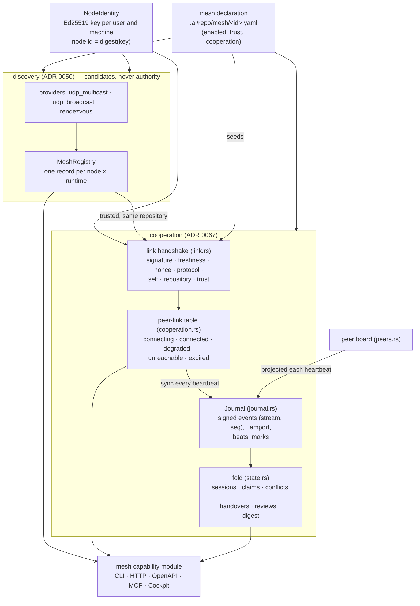

# Majordomus Mesh

How Majordomus runtimes of one repository — on one machine or several — find each other,
decide whether to cooperate, and share the state of their work. The decisions are ADR 0050
(discovery) and ADR 0067 (cooperation); the invariants are the rules
`project.mesh-is-observation-not-authority` and `project.mesh-cooperation-is-authenticated`;
the implementation is `apps/majordomus-cli/src/mesh/`. This document is the operator's and
contributor's view: what runs, what travels, what is guaranteed and what is not, how to
operate it, and how it is tested.

Two sentences govern everything here:

> Discovery creates awareness, not authority.
>
> A link is admitted by a handshake, and everything cooperative is a signed event of one
> journal that every runtime folds the same way.

## What it is, and what it is not

**It is** how several AI coding sessions — in several terminals, worktrees and machines —
work one repository without colliding: each runtime sees the others' sessions, an exclusive
claim made anywhere refuses an overlapping claim everywhere, a handover written on one
machine is consumed on another, a review asked on one is answered on another, and a runtime
that disappears stops holding anything, everywhere, on its own.

**It is not** a lock service with strong consistency (a partition lets both sides claim; the
conflict is named after healing), a file synchroniser (git owns source), a remote execution
facility (nothing a peer sends runs anything), an encrypted transport (there is no TLS in the
executable), or a WAN federation (no NAT traversal; rendezvous and seeds need reachable
addresses).

## The shape



## Identity

| identity | what it names | derived from | survives |
|---|---|---|---|
| node | a machine's Majordomus key | digest of the Ed25519 public key in `$XDG_STATE_HOME/majordomus/node.json` | restarts, re-addressing; lost with the file |
| runtime | one checkout's server on a node | digest of the checkout id | server restarts; two worktrees are two runtimes |
| instance | one process run of a runtime | OS entropy at start | nothing — a restart is a new instance |
| stream | what writes events: `node-runtime-instance` | the three above | nothing — a restart is a new stream of the same runtime |
| session | one worker's session within a stream | named by the caller (`board-p2` for an MCP session, anything for the CLI) | the stream |
| repository | the repository being cooperated on | digest of its root commits, or `cooperation.repository` | clones, paths, machines |

An address, a port, a host name or a PID is never identity. Two worktrees of one machine
share the node key and are two runtimes; a restarted server keeps its runtime and changes
its instance, so its peers list it once with `restarts` counted.

The repository identity is what isolation rests on. The git directory's path — what
`server.status` digests to tell checkouts of one machine apart — differs between machines and
cannot be it. Root commits are shared by every full clone and by no unrelated repository. A
shallow clone's "root" is where its history was cut, so a shallow clone must declare
`cooperation.repository`, and so must a fork that should not cooperate with its origin; the
doctor says which applies.

## Discovery

Discovery finds candidates. Every datagram heard — multicast (preferred; group, port and TTL
declared), broadcast (a declared fallback), or a rendezvous answer — passes one verification
path in `mesh::manager` (size → shape → version → bounds → staleness → signature → own-runtime
skip → trust policy) into one registry keyed by node and runtime. Envelopes are at most 1200
bytes, signed, and carry the key, runtime, instance, endpoints, transports, repository
identities and version; never a secret, a path or repository content.

Discovery protocol **2** added the runtime slot. A version-2 reader reads version 1 (as the
node's unnamed runtime); a version-1 reader refuses version 2 and counts it as `version`, so
a mixed fleet shows the mismatch instead of going quiet.

Multicast sockets are bound with `SO_REUSEADDR` and `SO_REUSEPORT`, so every runtime of a
machine hears the group. A server bound to `0.0.0.0` advertises its interfaces' addresses,
physical and overlay interfaces before container bridges; a server bound to loopback
advertises loopback, which only its own machine can dial.

## Trust

Trust is decided by the declared policy, and the default is that no one is trusted:

| policy | a valid unknown key is | notes |
|---|---|---|
| `deny_unknown` (default) | observed, listed, trusted for nothing | with `trust.allow`, the recommended shape for a fleet |
| `allowlist` | observed; listed keys are trusted | the same as `deny_unknown` plus `allow` |
| `tofu` | trusted on first use | a development convenience for a network you control: under TOFU **every** key on the segment that knows the repository identity is trusted and can link, claim and publish; every listing says `tofu`, and TOFU-trusted records are evictable |

This machine's own key is trusted as itself, which is what lets two worktrees link. A node id
reappearing under a different key is rejected under every policy. Trust is a precondition of
a link, not a link: discovery never admits one.

## The handshake

A dialer — the runtime with the lower runtime key, or either one when only one can reach the
other, or any runtime with a declared seed — posts a signed **hello** to
`POST /api/v1/mesh/link/hello`: its runtime card (key, runtime, instance, repository, name,
version, features, endpoints), a 32-hex nonce, a timestamp and its link protocol range. The
answerer admits it only if, in order:

1. the message is within 900 KiB and has the shape of a hello;
2. the Ed25519 signature verifies under the hello domain (a signature over another message
   kind can never be replayed as a hello);
3. the timestamp is within ±300 s of its clock;
4. the nonce has not been answered before;
5. the protocol ranges meet (link protocol 1..1 today; the highest common version is chosen);
6. the peer is not this runtime;
7. the peer's repository identity equals its own;
8. the peer's key is trusted by its policy.

It then answers with a signed **welcome** — its own card, a link id, its marks, the echoed
nonce — and the dialer applies the same checks to the welcome (signature, echoed nonce,
timestamp, protocol, self, repository, trust). Every failure on either side is a typed
refusal (`malformed`, `oversized`, `signature`, `stale`, `replay`, `protocol_unsupported`,
`self_link`, `repository_mismatch`, `untrusted`, `capacity`; a sync can also be refused
`not_active` or `unknown_link`, and an operation `feature_unsupported`),
counted in `refused_in`/`refused_out` and listed with its detail on `mesh.cooperation`.

## Transport

The link protocol posts `Signed` messages through `LinkTransport`. The shared server's
transport is plain HTTP/1.1 through the crate's one minimal client (ADR 0032: no HTTP client
dependency, no TLS, no async runtime); unit tests put runtimes behind an in-process transport
that runs the same protocol. Authenticity is the protocol's; confidentiality is the network's
— run links on a private network or an overlay (a tailnet, WireGuard).

## Presence, heartbeats and expiry

Two layers, deliberately separate:

- **Links** are this runtime's connections. Every heartbeat (`cooperation.heartbeat_seconds`,
  default 5) the dialer runs one sync round. A link is `connected` with an exchange within
  two heartbeats plus one second, `degraded` beyond that, `unreachable` beyond half the expiry, and `expired`
  — dropped — beyond `cooperation.expiry_seconds` (default 30, at least three heartbeats).
  A failed round backs off exponentially, capped at the expiry, so a returning peer is dialed
  again within one expiry; an unknown link id (the peer restarted) re-handshakes at once, into
  the same table row.
- **Streams** are alive while their beat rises. Each runtime raises its own beat every
  heartbeat; sync rounds carry every stream's beat with how long ago the sender saw it rise,
  so a runtime reached only through a relay is alive, and a crashed runtime stops beating for
  everyone at once. A beat is signed by its origin's key, so a relay can carry a beat but
  never mint one, and the age it reports is clamped to the expiry. Freshness is computed on each runtime's own monotonic clock — no two
  machines' wall clocks are compared. A reloaded journal restores events but no freshness,
  so a restart resurrects nobody's ownership.

## Events, ordering and deduplication

Everything cooperative is an event of the journal: `session_opened`, `session_closed`,
`claim_acquired`, `claim_released`, `handover_published`, `handover_consumed`,
`review_requested`, `review_answered`. An event carries its stream, a dense sequence, a
Lamport stamp, its origin's wall clock (informational), the repository identity, the origin
key, a body and an Ed25519 signature over the canonical JSON of all of it.

The guarantees, exactly:

- **Identity:** `(stream, seq)`.
- **Authenticity end to end:** a relay forwards bytes; a consumer verifies the origin's key
  and the key-to-stream binding. A relay can withhold an event; it cannot forge or alter one.
- **Delivery:** at-least-once. **Application:** idempotent — a duplicate is counted and changes
  nothing. Not exactly-once.
- **Order:** within a stream, sequence order; an early arrival waits (up to 256 per stream) for
  its gap. Across streams the fold orders by `(lamport, stream, seq)`. Arrival order never
  changes state (a property test permutes and duplicates deliveries).
- **Forward compatibility:** an event of a kind this executable does not know is stored and
  relayed, not interpreted. An event of a known kind out of bounds is refused.
- **Bounds:** 48 KiB per event, 32 KiB per handover body, 64 paths per claim, 64 streams per
  node. Streams expired longer than 15 minutes (and holding no handover) are compacted away
  when the journal passes 20 000 events or 768 streams, and a node's own such streams when
  it holds 48 — every worktree of a machine signs with the machine's key and every server
  restart is a new stream, so a machine would otherwise fill its quota by running and its
  later runs would be refused. A stream never heard beating counts as silent from when the
  journal learned of it, so the streams a restart reloads are not taken for dead at once;
  compaction forgets the ended sessions and claims of what it drops, never a live one.

## State synchronisation

Replication is a comparison of marks, not a flood. A sync request carries the dialer's marks
(per stream: high-water sequence, beat, beat age) and the events the answerer's last marks
lack; the answer carries the answerer's marks and the events the request's marks lack. One
round replicates both ways. A runtime joining late — or rejoining after a partition — gets
exactly what its marks lack in its first rounds (600 KiB per round), which after compaction is
the live state plus retained handovers, not an unbounded history. Once marks agree, rounds
carry no events: replication stops rather than loops.

`mesh.state` folds the journal: every runtime with the same events and the same liveness
verdicts computes the same state and the same `digest`.

## Claims and leases

A claim is a scope — repository-relative paths — held by a session, `exclusive` (the default)
or `advisory`. Paths meet by `peers::claims_meet`, the peer board's own predicate: `apps`
meets `apps/majordomus-cli`; `app` does not.

- A claim **holds** while it is unreleased, its session is open, and its stream's beat rose
  within the expiry. That is the lease: it is renewed by the holder's heartbeat and expires on
  every runtime on its own when the holder stops beating. There is no separate lease table.
- **Admission:** `mesh.claim` refuses an exclusive claim that meets a live exclusive claim of
  another session known to this runtime — `claim_conflict`, naming the claims it meets.
- **Concurrency:** two exclusive claims made where neither runtime could see the other (a
  partition, or the same heartbeat) both enter the journal. The fold names one winner — the
  lowest `(lamport, stream, seq)` of acquisition — on every runtime, and lists the other as
  `conflicted` with the winner's key. Never "last packet wins".
- **Release:** only the holder's current run releases a claim (`not_own` otherwise); a dead
  holder's claim expires instead.
- **Advisory** claims report overlaps and refuse nothing. The peer board's announcements are
  projected as advisory claims of the announcing MCP session.

## Handovers

`majordomus handover` writes a record under the checkout's `.ai/local/state/handovers/`.
`mesh handover publish` (newest record, or `--path` under that directory — nothing else is
ever read) turns it into a journal event: task, branch, head and time from its front matter,
the `--issue`/`--milestone` given, and the Markdown body, identified by the body's digest. No
path of the publishing machine travels. On another runtime, `mesh handover consume <id>
--session <s>` records the consumption and writes the handover as a record of the same schema
into that checkout's handovers directory — once, however often consumed — naming the local
repository and `mesh:<origin runtime>` as its worktree, so `majordomus handover --resolve` on
the same branch finds it as another checkout's handover.

## Sessions and the peer board

The peer board stays the machine-local view (ADR 0003, ADR 0044). Every heartbeat,
cooperation projects it: an attached MCP session becomes the mesh session `board-<peer>` with
its client, intent, checkout, branch and head; each announcement becomes an advisory claim;
a changed announcement releases and re-claims; a detached session is closed. An MCP call to
`majordomus_mesh_claim` without a `session` acts for the caller's own `board-<peer>` session.
Branch and head are read when a session changes, never on a heartbeat.

What a session shares is metadata — intent, issue, task, milestone, branch, head, dirtiness,
a context revision identifier. Context bodies are not replicated; a handover is the
referenced artifact a peer materialises.

## Failure and recovery

| event | what each runtime does | what converges |
|---|---|---|
| a peer's process is killed | its links go degraded → unreachable → expired; its stream stops beating; its sessions and claims expire | on restart it is the same runtime, new instance; it re-handshakes into one table row and syncs; its previous run's claims stay expired |
| the network partitions | each side expires the other's streams and may claim what the other held | on healing, one round each way; concurrent exclusive claims resolve to one named winner; digests agree |
| a peer restarts while linked | the answerer refuses the old link id as `unknown_link`; the dialer says hello again | the table row is kept, `restarts` counts |
| a relay dies in a line A–B–C | A and C expire each other's streams through lost beats | when B returns, marks re-align and nothing is duplicated |
| hostile or broken input | typed refusal, counted, listed; the runtime keeps serving | nothing enters the journal |

## Security model

What the mesh defends against, and how:

| threat | answer |
|---|---|
| forged advertisement, hello, welcome, sync or event | Ed25519 over canonical bytes under per-message domains; the node id is derived from the key, never carried |
| replayed hello or sync round | nonce cache; per-link rising counter; per-instance sequence for advertisements and events |
| a runtime of another repository | `repository_mismatch` at the handshake, `repository` rejection at ingest |
| an unknown or untrusted key on the network | observed by discovery, refused `untrusted` at the handshake; its relayed events refused `untrusted` at ingest |
| a relay that alters or invents events | the origin's signature fails at every consumer |
| flooding | bounded datagrams, messages (900 KiB), events, streams (1024, at most 64 per node), events per node (20 000), pending events (256 per stream, 4096 in all), peers (256), dial targets (8 per node, the present runtimes before the stopped ones), listed refusals (128), registry (256; only allowlisted records are never evicted) |
| a forged or replayed liveness report | beats are signed by their origin and only a higher signed beat counts; a relayed age is clamped to the expiry; a stream is created from a mark only when the mark verifies, its origin is trusted and its beat is fresh |
| a hostile handover consumed here | every front-matter field is single-line at ingest; the record's file name keeps only timestamp digits, hex and `[A-Za-z0-9_-]`, and a path outside the handovers directory is refused |
| a web page driving the server (DNS rebinding) | a state-changing request from a browser is accepted only from the server's own origin and only when addressed by an IP literal or `localhost` |
| a stranger's hellos | the replay cache and the refusal list hold only what a trusted key of this repository sent, or are capped |
| a stale peer holding a scope forever | claims live only while the holder's beat rises |
| publishing arbitrary files | handover publication reads only `.ai/local/state/handovers/` |
| a future protocol | `protocol_unsupported` with both ranges, not a dropped connection |

What it does not defend against: an observer on the network sees that a Majordomus runs, its
advertisements and — for linked peers — session intents, claim scopes, review subjects and
published handover bodies, because nothing is encrypted; run it on a private network or an
overlay. A holder of an allowed node key is that node. A compromised trusted peer can publish
misleading claims and handovers under its own identity — they are attributed to it and expire
with it, but they are believed until then. The committed default, `enabled: false`, exists for
environments where presence disclosure is unacceptable.

## Configuration

```yaml
# .ai/repo/mesh/majordomus.yaml
schema: mesh/v1
kind: mesh-declaration
id: majordomus
enabled: true                 # nothing opens without it
multicast: { enabled: true, group: 239.255.77.77, port: 7741, ttl: 1, interval_seconds: 15 }
broadcast: { mode: disabled }
rendezvous: { endpoints: [], interval_seconds: 60 }
trust:
  policy: deny_unknown
  allow:                      # `majordomus mesh identity` on each machine
    - 5b0f…e1
    - 9a41…07
cooperation:
  enabled: true               # default once the mesh is enabled
  heartbeat_seconds: 5
  expiry_seconds: 30          # at least three heartbeats
  seeds: [http://10.0.0.12:8741]   # dial these whether or not discovery hears them
  # repository: my-project    # required for a shallow clone; separates a fork
```

The declaration is the one place mesh behaviour is configured; there are no environment
variables for it. To be dialed from other machines, the server must listen beyond loopback:
`majordomus serve --host 0.0.0.0` (or a deployment object). A server on loopback can still dial
out, and a link, once dialed, replicates both ways.

## Operating it

```sh
majordomus mesh doctor            # prerequisites on this machine, each failure with impact and remedy
majordomus mesh identity          # this machine's key, for trust.allow
majordomus mesh status            # discovery: providers, tallies, refusals
majordomus mesh nodes             # discovery: one row per node × runtime
majordomus mesh peers             # machines → runtimes → sessions → claims, each link's state
majordomus mesh peer <runtime>    # one runtime; exits 10 when unknown
majordomus mesh state             # sessions, claims (held/conflicted/expired), handovers, reviews, digest
majordomus mesh events --after 0  # the journal
majordomus mesh verify            # a live round with every dialed peer, convergence; exits 10 on failure
majordomus mesh session open --session s1 --client codex --issue '#184'
majordomus mesh claim apps/majordomus-cli --session s1 --issue '#184'   # exits 10 on claim_conflict
majordomus mesh release <claim-key>
majordomus mesh handover publish --issue '#184'
majordomus mesh handover consume <id> --session s2
majordomus mesh review request feature/x --session s1 --reviewer <runtime>
majordomus mesh review answer <request-key> --session s2 --verdict approved
```

Every command has `--format json`, which prints the capability's answer unchanged.

**HTTP and OpenAPI.** `GET /api/v1/mesh`, `/nodes`, `/identity`, `/doctor`, `/cooperation`,
`/peers`, `/peer?runtime=`, `/state`, `/events?after=&limit=`; `POST /api/v1/mesh/register`,
`/verify`, `/sessions`, `/sessions/close`, `/claims`, `/claims/release`, `/handovers`,
`/handovers/consume`, `/reviews`, `/reviews/answer`, `/link/hello`, `/link/sync`. The schemas
are in `/openapi.json`, generated from the capability declarations.

**MCP.** `majordomus_mesh`, `_nodes`, `_identity`, `_doctor`, `_register`, `_cooperation`, `_peers`,
`_peer`, `_state`, `_events`, `_verify`, `_session_open`, `_session_close`, `_claim`,
`_release`, `_handover_publish`, `_handover_consume`, `_review_request`, `_review_answer`. An
agent claims work with `majordomus_mesh_claim` instead of inventing a coordination channel;
without a `session` the call acts for the agent's own board session.

**Cockpit.** `/cockpit/mesh`: this node, cooperation (runtime, repository identity, endpoints,
heartbeat and expiry, protocol, counters, digest), machines → runtimes (liveness badge, "last
heartbeat Ns ago", link state, work counts) → sessions (intent, issue, branch, claims), claim
conflicts, handovers, reviews, refused candidates, discovery providers and nodes. Actions run
the same capabilities from their Capabilities pages.

## Troubleshooting

1. **`mesh doctor`** on each machine. A failed `declaration`, `identity`, `trust`,
   `repository`, `udp` or `multicast` check names its impact and remedy.
2. **`mesh status`** — discovery. No nodes: multicast is not routed between the machines;
   declare `cooperation.seeds` or a rendezvous. Rising `signature` refusals: a broken or
   hostile sender. `version` refusals: a peer runs an executable older than discovery
   protocol 2.
3. **`mesh peers`** / **`mesh.cooperation`** — links and refusals. `repository_mismatch`: the
   runtimes serve different repositories, or one is a shallow clone or fork with a different
   identity — compare `mesh doctor`'s repository line on both. `untrusted`: add the key to
   `trust.allow`. `protocol_unsupported`: upgrade the older executable. A link stuck in
   `connecting` with a `last_error` of "connection refused": the peer listens on loopback.
4. **`mesh verify`** — a live round with every dialed peer, and whether both hold the same
   marks afterwards. `NOT converged` right after a burst of events is one round of lag; a
   persistent one with `journal pending > 0` is a peer relaying a partial stream.
5. Server logs carry `runtime_id`, `peer`, `link_id`, `session_id`, `repository_id` and the
   refusal `code` on every link event.

## Testing and evidence

| level | what | where | runs |
|---|---|---|---|
| unit & property | journal dedup, gaps, hostile events, beats; fold order/duplicate independence and exclusivity; handshake refusals; three-runtime relay; partition reconciliation; board projection; handover materialisation; repository identity | `cargo test --lib mesh` | CI `rust` |
| multi-process integration | separate `majordomus serve` processes with separate keys over TCP: two-runtime cooperation (sessions, claims, conflicts, reviews, handover, CLI parity, verify), repository isolation, untrusted key, SIGKILL expiry and restart, three runtimes in a line, hostile messages over HTTP, two worktrees under one key | `cargo test --test mesh_cooperation` | CI `rust`, `macos` |
| network lab | four Linux containers on one docker bridge: multicast discovery with no seeds, full-mesh handshake, repository isolation, cross-node claim and conflict, cross-node handover, three-node convergence, network partition and healing, process crash and restart, `mesh verify` in a node | `test/mesh-lab/run` → `target/mesh-lab/evidence.json` | CI `mesh-lab` |
| physical machines | the procedure below | manual | recorded when run |

### Physical multi-machine verification

On two machines A and B on one network, each with a checkout of the same repository built
from the same commit:

```sh
# on each machine
majordomus mesh identity                      # note the public key
# in the repository, on both: enabled: true, trust.allow: [keyA, keyB],
# cooperation.seeds on B: [http://<A's address>:8741]
majordomus serve --host 0.0.0.0 --port 8741 --idle 0 &
majordomus mesh doctor
# A and B
majordomus mesh peers                         # each lists the other: connected, trusted
majordomus mesh claim apps --session a1       # on A
majordomus mesh claim apps/x --session b1     # on B: exits 10, claim_conflict naming A's claim
majordomus handover --derive | …              # on A, then:
majordomus mesh handover publish              # on A
majordomus mesh state                         # on B: the handover is listed
majordomus mesh handover consume <id> --session b1   # on B: a local record
majordomus handover --resolve                 # on B, on the handover's branch
# failure: stop A's server with kill -9, watch B's `mesh peers` go unreachable → expired and
# A's claim expire; start A again and watch it reconnect with restarts: 1
majordomus mesh verify                        # on both: ok, converged
```

**Recorded run, 2026-09-15.** A MacBook Pro (Darwin arm64, node `9ce70581…`) and `lundra`
(Linux x86_64, node `94713da7…`) on one /24 LAN, each with its own checkout, its own state
directory and `cooperation.repository` declared, allowlisting each other's key, seeds both
ways, heartbeat 2 s, expiry 10 s. Measured: the Mac heard lundra by UDP multicast on the
first poll; lundra dialed the Mac and the link was connected (round trip 11 ms); a claim
written on the Mac was held on lundra 500 ms later and lundra's overlapping exclusive claim
was refused with 422; a handover published on lundra was consumed into the Mac's checkout;
both reported one digest; lundra's server was killed with `kill -9` and the Mac expired the
link after 10 s with lundra's claim `expired: its runtime stopped beating`, after which the
Mac could claim that scope; lundra restarted as the same runtime and reconnected, listed once
with `restarts: 1`; `mesh verify` passed on both (lundra: round trip 9 ms, converged). An
earlier attempt the same evening failed because the procedure's stop step orphaned the Mac's
first server (`$!` named a subshell), which kept an empty allowlist and refused every link as
`untrusted` — the refusal was visible on both sides, and `mesh verify` now fails when a runtime
is refused as untrusted, protocol-incompatible or mis-signed, and when the declaration names
seeds and no peer is connected, instead of reporting `ok`.

## Guarantees, and what is not guaranteed

Guaranteed and tested: authenticated links with typed refusals; repository isolation;
cross-runtime exclusive claims with deterministic conflict resolution; liveness and expiry
without clock agreement; reconnection without duplicate peers; convergence through relays with
each event held once; at-least-once delivery with idempotent application; handovers and reviews
across runtimes; one state across every surface.

Not guaranteed: exactly-once delivery; strong consistency or linearisable claims; availability of
a claim during a partition beyond each side's view; confidentiality on the wire; WAN operation,
NAT traversal or routed multicast; compatibility with executables older than discovery protocol 2
and link protocol 1; replication of anything but session metadata, claims, handovers and reviews.

## Extending it

A new discovery mechanism implements `mesh::provider::MeshProvider` and needs no other change.
A new transport implements `mesh::link::LinkTransport` inside `src/mesh/`. A new kind of
cooperative event is a variant of `mesh::journal::EventBody`, a case of `mesh::state::fold`
and a capability of the mesh module; older runtimes relay it untouched. A change to the link
messages raises `LINK_PROTOCOL_MAX` and keeps the previous version readable until the fleet has
moved, or it is a deliberate break recorded in an ADR.
