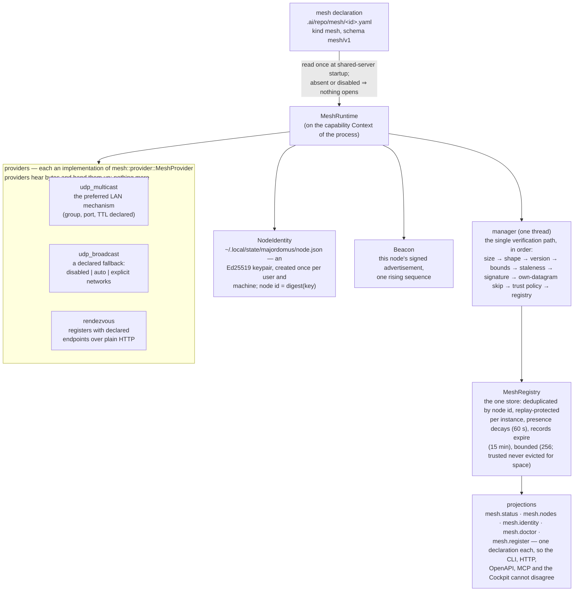

# The mesh: discovery of running Majordomus instances

How one running Majordomus learns that others exist, and proves which one it is. The
decision is ADR 0050; the invariants are `project.mesh-is-observation-not-authority`;
the implementation is `apps/majordomus-cli/src/mesh/`. This document is the operator's
and contributor's view: what runs, what travels, what is trusted, and what can go wrong.

The one sentence that governs everything here:

> Discovery creates awareness, not authority.

## The shape



## Identity

A node is a key, not an address. The keypair lives in the user's state directory
(`$XDG_STATE_HOME/majordomus/node.json`, else `~/.local/state/majordomus/node.json`),
mode 0600, created the first time a mesh activates on the machine; `majordomus mesh
identity` prints the public half and the path. The node id is a digest of the public
key, so carrying somebody else's id is impossible — the id is never carried at all,
only derived by the verifier. A process run is an *instance*: a machine that restarts
keeps its node id and changes its instance, which is how the registry tells "the same
node came back" (one record, `restarts` incremented) from a duplicate.

Losing the file is losing the identity: a new key is a new node, and allowlists that
named the old key must be updated. Nothing else is stored; the registry itself is
process memory.

## The envelope

One protocol over every transport (`mesh/protocol.rs`): a JSON envelope of at most
1200 bytes, versioned (`v: 1`), carrying the public key, instance, display name,
sequence, timestamp, up to four `host:port` endpoints, transport names, repository
digests and the executable version — signed with Ed25519 over the advertisement's
canonical bytes. Parsing is written for hostile input: bounded before it is read,
refused before it is trusted, and no input of any shape panics (a property test feeds
it arbitrary bytes). Every refusal is counted by reason — oversized, malformed,
version, bounds, stale, signature — and `mesh.status` shows the counters, because a
mesh that hears garbage should say so instead of being quietly empty.

What an advertisement never carries: secrets, credentials, tokens, environment values,
paths, repository content. Repositories appear as the same 32-hex digests
`server.status` already serves; a digest can be recognised by someone who serves the
same repository and inverted by no one.

## Trust

Trust is decided above the protocol, by declared policy, and the default is that no
one is trusted:

| policy | a valid unknown node is | notes |
|---|---|---|
| `deny_unknown` (default) | observed, listed, trusted for nothing | the safe resting state |
| `allowlist` | observed; listed keys are trusted | `trust.allow` holds Ed25519 public keys (hex) |
| `tofu` | trusted on first use | a development convenience; every listing names `tofu` as the reason |

Under every policy, a node id that reappears under a different key is rejected and
stays listed as rejected — an operator debugging a mesh needs to see what was refused.
And under every policy, trust changes *labels and candidate-sharing only*. There is no
remote execution in this executable for a trusted node to gain; the HTTP surface a
node advertises is the same read-only projection it always served. Whoever builds
remote operations later must bring their own authorization decision (ADR 0050
forecloses inheriting one from discovery).

## Transports

**Multicast** is the preferred LAN mechanism: one socket joined to the declared group
(default `239.255.77.77:7741`, TTL 1 — the local segment and no further), a listener
thread and a jittered announcer. Multicast does not work on every network, and the
provider assumes nothing: a socket that cannot bind (typically another local server
already listening) or a group that cannot be joined is a `Failed` provider status with
the reason, and every other provider runs on.

**Broadcast** is a declared fallback, never on by default: `disabled` | `auto` (the
limited broadcast address) | `explicit` (the directed broadcast addresses listed). The
same envelope, the same port; it transmits, and listens only when it is the sole UDP
provider (two sockets cannot share the port).

**Rendezvous** crosses the segments multicast cannot. Every Majordomus server *is* a
rendezvous: `POST /api/v1/mesh/register` verifies a presented envelope exactly as a
datagram, records it as a rendezvous observation, and answers with its own envelope
and up to 32 candidates — each carried verbatim as signed, so a candidate verifies
end-to-end at the consumer and a poisoned rendezvous can withhold nodes but cannot
invent one. The client registers with each declared endpoint on its interval, backs
off exponentially (up to ×8) when one is unreachable, and never hammers. The transport
is plain HTTP through the same sixty-line client the MCP bridge uses: there is
deliberately no TLS in this executable, so rendezvous endpoints belong on a private
network or an overlay (a tailnet, a WireGuard mesh) that provides the transport
security itself.

## Lifecycle

The mesh runs inside the shared server (ADR 0003) and nowhere else: it starts after
the lease and the router — discovery never delays serving — and dies with the process.
Startup is idempotent (a second activation is a no-op), never blocks on the network,
and a disabled or malformed declaration leaves the runtime inactive with the reason on
`mesh.status`. Multiple shells attaching to the repository share the one server and
therefore the one mesh; no daemon exists, no per-terminal socket is ever opened.

A record's life: observed → (trust verdict) → present while advertisements arrive →
absent after 60 s of silence → expired out of the registry after 15 min. Sequence
numbers are per instance; a replayed datagram is dropped and counted.

## Operating it

```
majordomus mesh doctor        # every prerequisite on this machine, and the running server's verdict; exit 10 on a failed check
majordomus mesh identity      # this machine's node id and public key (for allowlists)
majordomus mesh status        # the running server's mesh: providers, tallies, refusals
majordomus mesh nodes         # the observed nodes, one row each
```

Enable it by editing the repository's declaration (`.ai/repo/mesh/majordomus.yaml`):
set `enabled: true`, choose the trust policy — `deny_unknown` plus `allow:` keys from
`mesh identity` on each of your machines is the recommended shape — commit, and
restart the server (`majordomus serve stop && majordomus serve ensure`). The skeleton a
fresh repository starts from ships `enabled: false`: the "nothing leaves the machine"
posture holds until a person decides otherwise, and that decision is a reviewed commit,
not an environment variable. This repository has decided (ADR 0059; the section below).

Troubleshooting is `mesh doctor` first (it names the broken prerequisite), then
`mesh status` on each machine: a provider's `Failed` detail says what its socket could
not do; the refusal counters say what arrived and why it was dropped (a rising
`signature` count is somebody malformed or hostile; `stale` is clock skew beyond
300 s; `self_heard` is normal — a node hears its own multicast); `trust` on a node
row says what the policy decided and why.

Two of the doctor's checks are verdicts on decisions rather than on the machine:

| check | holds when | fails when |
|---|---|---|
| `trust` | every `trust.allow` entry is a 64-hex Ed25519 key and, under an allowlist, this machine's own key is among them | a key is malformed, or this machine is not on its own repository's allowlist — the mistake that makes a node visible everywhere and trusted nowhere |
| `runtime` | the shared server activated the mesh (`active as <node> since …`, providers running, nodes known); or the declaration is off and the server says `off, as declared`; or no server runs in the process asked and there is nothing to judge | the declaration is enabled and the server's mesh is not active — the check carries the server's reason and the restart that follows fixing it, and the command exits 10 |

`mesh doctor` asks this checkout's running server for the report when one serves it,
because the `runtime` verdict is the server's; with no server it runs here and says so.
The same report is `GET /api/v1/mesh/doctor` and the `majordomus_mesh_doctor` tool.

## This repository's mesh

The declaration is committed enabled since ADR 0059, because the fleet this repository
is developed on is one operator's machines — a laptop, a desktop and a build board on
one private network and one tailnet — and a checkout whose server did not see the
others is the failure the mesh exists to prevent. Three things hold it on:

**The declaration** (`.ai/repo/mesh/majordomus.yaml`): `deny_unknown` with an allowlist
of the three machines' keys, multicast on for the segment a machine is on, and
rendezvous endpoints naming the two hubs on both networks. A change to it is a reviewed
commit; a test (`test/cases/290_the_mesh_is_declared_and_held.sh`) refuses a tree whose
committed declaration is disabled, untracked, without an allowlist or without a hub,
because on 2026-09-12 three machines each ran an uncommitted `enabled: true` while
master said `false`, and the one that was reset was silently alone.

**The session start.** The provider's start event ensures the shared server and the
briefing it injects carries one line about the mesh whenever a declaration exists:

```
Mesh: active — 2 of 2 provider(s) running; 2 node(s) known, 2 trusted, 2 present
Mesh: off, as declared
Mesh: DECLARED ENABLED BUT NOT ACTIVE — the declaration is enabled and this server's mesh is not active — not active: …
```

The third line is the one the mechanism exists for: a worker is told before its first
tool call, in the same block that names the server, and `mesh doctor` exits 10 on the
same fact. The line comes from the executable's own `mesh doctor`; the hook library
sends no request of its own (SECURITY.md).

**The hubs.** Multicast does not cross the tailnet, and the macOS application firewall
drops inbound datagrams and connections to the unsigned executable, so the laptop can
be heard by nobody and registers outward instead. The two Linux machines run their
shared server as an always-on hub bound beyond loopback — `scripts/mesh-hub install`
writes and starts a systemd user unit; `scripts/mesh-hub deploy` fast-forwards the
checkout, rebuilds, restarts and waits for the mesh to be active — and every node
registers with every hub it can reach. Any Majordomus server is a rendezvous; these two
are the ones the declaration names.

| node | machine | role | address in the declaration |
|---|---|---|---|
| `5d81b5c9` | Tomass-MacBook-Pro | primary checkout; registers outward | — (firewall) |
| `9d652b2c` | jetson (aarch64) | hub | `192.168.100.30:8791`, `100.92.246.32:8791` |
| `25c9758f` | lundra (x86_64) | hub | `192.168.100.10:8741`, `100.65.22.118:8741` |

A machine that joins the fleet: `majordomus mesh identity` there, its key into
`trust.allow`, commit; `scripts/mesh-hub install` if it is to be a hub, and its address
into `rendezvous.endpoints`. A machine whose key is lost gets a new identity and the
same two edits; `mesh doctor` on that machine fails `trust` until they land.

What this does not do. One multicast socket per machine: a second server on the same
machine (a linked worktree's) reports its `udp_multicast` provider `Failed` and rides
the rendezvous, which the doctor names as a degraded runtime that still holds. Every
server on a machine advertises the same node id with its own instance, so a machine
with several servers is one record whose instance and sequence move between them;
`replayed` counts the datagrams that lost that race, and it is not a fault. The
skeleton a fresh repository starts from declares no `mesh-declaration` source class
yet, so a fresh repository sees no declaration until its `sources.yaml` says where one
lives — this repository's does.

## Threat model

| threat | answer |
|---|---|
| forged advertisement | Ed25519 signature over the advertisement; an unsigned or mis-signed packet is a counted refusal |
| spoofing a known node id | the id is derived from the key by the verifier, never carried; a different key is a different id, and a registry that somehow held the id already rejects the key change |
| replay | per-instance sequence numbers; at-or-below the highest seen is dropped and counted |
| stale/future packets | a ±300 s timestamp window |
| oversized / malformed / wrong-version packets | bounded before parsing; refused by shape and version; the parser never panics (property-tested) |
| flooding the registry | bounded table (256), longest-unseen untrusted evicted first, trusted records never evicted for space — a flood cannot flush your fleet |
| poisoned rendezvous | candidates travel as signed envelopes and verify at the consumer; a rendezvous can withhold, not invent; its failure backs off and stops nothing else |
| a LAN attacker advertising MCP/HTTP endpoints | endpoints are advisory hints, identity is the key, and no endpoint is ever contacted with credentials — there are none to send; connecting to an advertised endpoint yields the same unauthenticated read-only surface as any loopback probe |
| discovery as a foothold | discovery grants nothing: no execution, no authorization, no write surface exists behind it (`project.mesh-is-observation-not-authority`, held by `scripts/ci/mesh-check` and the tests it names) |
| exfiltration via advertisements | the envelope's fields are enumerated and bounded; no secret, path, environment or content field exists; repositories are digests |

What the mesh does **not** defend against: an attacker on the same segment can see
that a Majordomus exists, its display name, its advertised endpoints and its
repository digests (presence disclosure is inherent to discovery — the off-by-default
declaration exists exactly for environments where that is unacceptable); and it does
not encrypt traffic (there is no TLS in the executable; run rendezvous over an
overlay that encrypts, or stay on multicast within a trusted segment).

## Extending it

A new discovery mechanism — mDNS, a tailnet's API, Consul, a cloud registry —
implements `mesh::provider::MeshProvider` (start, status, raw bytes up the channel)
and is handed to the runtime. That is the entire registration: the manager verifies,
the registry converges, and every surface shows the new source's observations without
a line of change — the test
`a_synthetic_provider_reaches_the_registry_with_zero_registration` holds exactly this.
