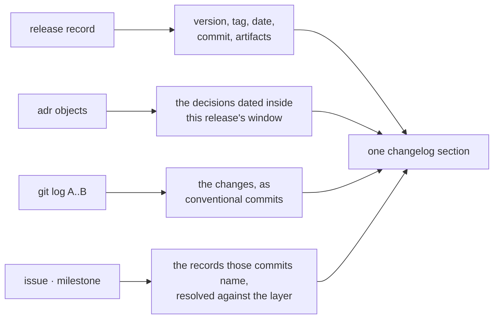
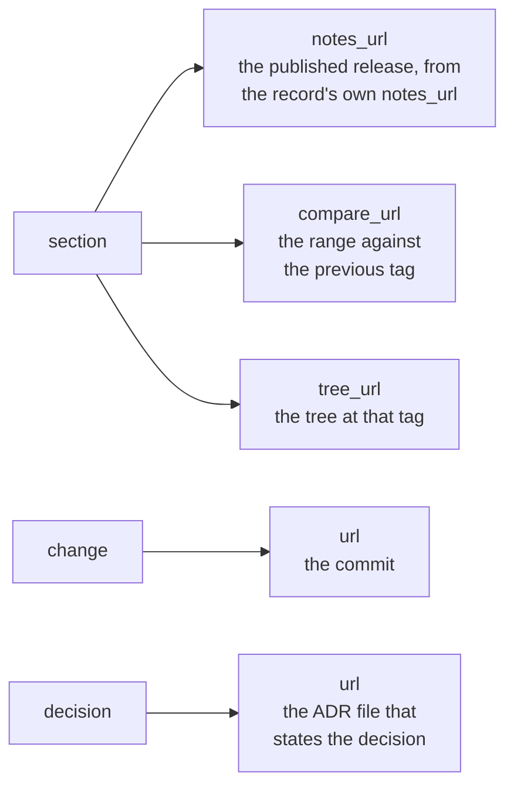
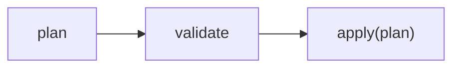

# The release — a changelog nobody writes, and one writer for the version

What this project has shipped, what it would ship next, and the changelog that says so are
one typed value, `release::Changelog`, composed by one module under
[`apps/majordomus-cli/src/release/`](../apps/majordomus-cli/src/release/). Every surface
that states any of it renders that value: `majordomus release` on the command line, the HTTP
route `/api/v1/changelog`, the MCP tool `majordomus_changelog` and the resource
`majordomus://changelog`, and the generated document under `docs/generated/`. Nothing in it
is authored. There is no `CHANGELOG.md` in this repository and there is not meant to be.
Behaviour as implemented and tested; where this document and the executable disagree, the
document is wrong and changes in the same commit.

The commands, their arguments and their executable examples are in the generated reference
([`generated/cli.md`](generated/cli.md), under `majordomus release`); the capabilities, their
routes and their benchmark cases in [`generated/capabilities.md`](generated/capabilities.md),
module `release`. Neither is restated here.

## The version is measured, not claimed

The bump a release takes is decided by comparing the public surface of the last release
with this tree, not by the words in the commit messages. `feat:` meaning minor and `fix:`
meaning patch describes what the author believed; it says nothing about what a caller can
still call. Between `v0.3.1` and `0.4.0` the command `majordomus scope classify` left the
command line and every gate stayed green, because no gate was looking at the surface.

The surface is the capability registry — one declaration of which MCP, HTTP, OpenAPI and
the command line are projections — and `docs/generated/registry.json` is committed at every
commit and every tag, so two releases can be compared without building either. What a
caller can hold is a public capability's identity, its kind, the MCP tool and resource it
answers to, the HTTP method and path it is bound to, the command-line path that dispatches
it, **and both of its schemas**.

```text
something a caller held is gone    major implied   a caller who held it is broken
a contract narrowed under a caller major implied   a required field, a removed value, a type
something arrived                  minor implied   nothing broke, something is new
a contract widened                 minor implied   every existing caller still works
the surface is equal               nothing owed    most commits are here
```

Schemas are compared **as contracts, in both directions**, which is the comparison a textual
diff of two schemas gets wrong. An input is what a caller sends, so accepting more is
compatible and demanding more is breaking; an output is what a caller receives, so promising
more is compatible and promising less is breaking. The same edit — `x` becoming required —
is a minor in an output and a major in an input. Descriptions, titles and examples are
normalised away before anything is compared, so rewording a doc comment is not a release; a
constraint the comparator has no rule for, changed, is counted **breaking** rather than
guessed at, because a false major is an argument someone can win and a false patch is a
caller who finds out by breaking.

```bash
majordomus release analyze                     # the tree against the last release
majordomus release analyze --explain           # every movement, and why each counts
majordomus release analyze --format json       # the canonical VersionPlan every surface renders
scripts/ci/version-matches-surface             # the gate: the same thing, mapping exit codes
majordomus release bump                        # raise the one authored version to the measured minimum
```

There is **one** engine and it lives in `apps/majordomus-cli/src/release/compat.rs`, reading
`release/surface.rs`. The gate is an adapter over it; so is the Cockpit panel, the HTTP
route, the MCP tool and the writer. Until [ADR 0051](../.ai/repo/adrs/0051-the-minimum-release-version-is-measured-from-the-public-contract.md)
there were two answers — a shell comparison in CI and a commit-subject inference inside
`release bump` — and the inference won, because the writer runs before the gate does.

**Below 1.0.0 the floor is a minor release** for any surface change, gone or new. Semantic
versioning grants `0.y.z` a blanket exemption — anything may change — and Elm refuses that
exemption by starting every package at 1.0.0. This project has earned neither answer, so it
takes the strongest signal 0.x has rather than demanding 1.0.0 for a single removal. When
the major reaches 1 the shift ends and the implied bump is the required one.

**A removal is named whatever the verdict is.** Below 1.0.0 it does not refuse the release,
and it is still stated as a breaking change: a caller who held what is gone otherwise finds
out by breaking. The rule is `project.the-version-is-measured@2`; the gate is `version-surface`,
selected by the `rust`, `rust-generated` and `distribution` path classes so that it runs
before a change lands rather than only on a full plan.

### Where a removal is written down

Neither of the two documents that would hold it is authored, so the answer is not "write it
in one of them".

The **release record** cannot hold it at all today. `release/v1`
(`share/schemas/majordomus/release/release.v1.schema.json`) is `additionalProperties: false`
and declares no field for a breaking change, and a record is written by the release workflow
from the artifacts it published and by nobody else
([`.ai/repo/releases/README.md`](../.ai/repo/releases/README.md)) — so an unreleased version
has no record for anything to be written into. The smallest field that would close this is a
proposal, not a change made here: a schema change does not belong inside a documentation
change.

The **changelog** can, through the one authored input it has. Nothing in it is written by
hand, and the only authored text it reads *about a change* is the commit message.
`release/commits.rs` marks a change breaking on `type(scope)!:` or a `BREAKING CHANGE:`
trailer in the body, and `release/changelog.rs` renders such a change with a leading
`**BREAKING**`. So a removal is named in the **subject** of a commit inside the release that
carries it — the subject, because that is the text a reader of the changelog sees; the
trailer marks it and is not rendered.

Two consequences follow from `compose_published`, and both are intended:

- `majordomus release changelog` states it immediately, under `## Unreleased`;
- `docs/generated/changelog.*` does not, and will not until the version ships. The committed
  artifact carries only published releases, because a file inside a commit cannot describe
  the commit it is in. When the pipeline writes the record for that version, the section's
  changes are the commits in `<previous>..<this>` — the marked one among them — and the
  published changelog states the removal with nobody writing it there.

The consequence worth naming is that the mark has to be on a commit *inside* the release,
and cannot be added to a commit that has already landed. A removal noticed after the fact is
therefore stated by a later commit in the same window saying what left. That is what
`v0.3.1..0.4.0` needed: the atom `command scope classify` left the surface in
`427b73248d9`, whose subject marked nothing, and it is named by the commit that carries this
section.

## The gap it closes

Every other public fact in this repository has one canonical declaration and a set of
projections derived from it — a command, a capability, a schema, a page. The release did
not, and it failed in two different ways.

**The changelog did not exist.** What changed in a version lived in GitHub's release notes,
outside the repository that produced it, written by whoever cut the release and read by
nobody afterwards. The facts it would have contained were already in the tree, unread:

```text
  .ai/repo/releases/*.yaml   what shipped, when, from which commit   (kind release-record)
  .ai/repo/adrs/*.md         the decisions, dated                    (kind adr)
  git log <commit>..<commit> everything that has no object of its own
```

**Nothing raised the version.** It was stated in two files — `apps/majordomus-cli/Cargo.toml`
and `bin/majordomus` (`MJ_VERSION`) — and `scripts/release-version --check` compared them and
exited 10 when they disagreed. A check with no writer behind it verifies a person's memory:
it can say the two disagree, and it can say so only after someone has already edited one of
them and forgotten the other. (The version has since lost its second statement altogether;
see [The version](#the-version-authored-once-written-by-one-command).)

Neither gap needed a new source of truth. The changelog needed a join; the version needed a
writer.

## What a section is composed from

One section per release record, newest first by the date the record carries, with the
unreleased work leading:



The window of a release is the same interval said in the two vocabularies its two sources
have. An ADR carries a date and no commit; a commit carries no date the layer indexes. So
the decisions of a release are those dated in `(previous release's date, this release's
date]`, and its changes are the commits in `previous..this`. The first release's range is
everything up to its commit — a clone that does not carry that history yields nothing, and
says so rather than showing an empty section.

Dates are compared as the strings they are: both sources write ISO-8601, where lexicographic
order is chronological order. A record's `published_at` carries a time and an ADR's `date`
does not, so the comparison is made on the day the two share.

A section's artifacts are the record's own evidence — the target, the file name and the
SHA-256 that `scripts/release-record` read off the file that was published. The changelog
copies them; it does not compute them and it does not reach the network.

### The unreleased section

Everything after the newest record, as `<last release's commit>..HEAD`. It leads the
document when it has any changes and is absent when it has none, because an empty
"Unreleased" heading says nothing a reader can use. A repository that has never published
has no records at all, and its whole history is one unreleased section — the right answer
for a project before its first release rather than an error.

## Conventional commits, read totally

The parse is small and deliberately total:

```text
  feat(commands): one canonical command graph
  ^^^^ ^^^^^^^^   ^^^^^^^^^^^^^^^^^^^^^^^^^^^
  kind scope      subject

  feat(api)!: the route moved      `!` marks it breaking
  BREAKING CHANGE: <why>           so does this trailer, in the body
```

A subject that does not parse is kind `Other` and still appears, with its subject kept
whole rather than split at a colon that was part of the sentence. This is the one design
decision in the parser worth arguing about, and it goes the other way from most changelog
generators: a changelog that silently drops what it cannot classify lies by omission, and
the commits it drops are exactly the ones nobody was paying attention to when they landed.
`project.conventional-commits` is blocking since version 2 and the `commit-msg` hook
refuses a subject that does not parse, so new commits arrive conventional. The history still
holds 54 that predate the policy — recorded in `.ai/repo/commit-policy-baseline.txt`, every
one of them published, none of them rewritable — and those are what the parser is lenient
for. See [COMMIT.md](COMMIT.md).

The kinds and the headings they render under, in the order a reader of a changelog wants
them — what is new, what is fixed, what is faster, then the rest:

```text
  feat      Added            docs           Documentation
  fix       Fixed            test           Tests
  perf      Performance      ci             Pipeline
  refactor  Changed          chore          Housekeeping
                             anything else  Other
```

A heading with no entries is absent; nothing is hidden. Merge commits are not read at all
(`git log --no-merges`), because a merge's subject describes the integration and its
contents are already in the range.

### The order is in the document, not in each renderer

A section does not carry a flat list of changes. It carries `groups` — one per kind that has
any change at all, each with its `kind`, the `heading` it is shown under, the `rank` it sorts
by, and its own `changes` — and the groups are already in rank order when the document is
composed:

```json
{ "groups": [
  { "kind": "feat", "heading": "Added",         "rank": 0, "changes": ["…"] },
  { "kind": "fix",  "heading": "Fixed",         "rank": 1, "changes": ["…"] },
  { "kind": "docs", "heading": "Documentation", "rank": 4, "changes": ["…"] }
] }
```

That order used to exist in exactly one place a projection could not reach: `ChangeKind::rank()`,
a Rust function the Markdown renderer called. The website cannot call a Rust function, so it
grouped what it was given alphabetically instead, and the same changelog was read in two
different orders depending on which surface showed it. The order is in the value now. Every
renderer reads `heading` and `rank` rather than deciding either — `site/templates/changelog.html`
neither groups nor sorts, and the Markdown renderer walks `groups` in the order it was handed
them. A presentation order stated once and carried is the only kind that survives a projection.

The ranks are the kinds' own and are not contiguous: a section with no refactors simply has no
group of rank 3. A group's absence means nothing of that kind happened in the range, never that
something was hidden.

## Where a fact can be read

Every address the changelog carries is derived from `about::REPOSITORY` — the crate manifest's
own `repository`, which the compiler passes in as `CARGO_PKG_REPOSITORY`. None of them is a
literal, so a fork or a move carries every link with it and nothing has to be told where the
project now lives:



`forge()` in `changelog.rs` recognises one shape — `https://github.com/<owner>/<repo>` — and
returns nothing for anything else. When it returns nothing, **no links are produced at all**
rather than links guessed from a pattern that might hold. A wrong link cannot be told from a
right one until it is followed, so a reader with no link knows they have none and a reader with
a plausible wrong one does not.

Two of the section addresses are not simply the tag's. A record that names its own `notes_url`
keeps it, because the published release is where the record says it is; the fallback is the
tag's release page. The first release has no predecessor to compare against, so its
`compare_url` is the forge's list of commits up to the tag rather than a range. The unreleased
section compares the last tag against `master` and points at the tree there.

`Decision.route` was removed under the same argument. It named `/decisions/<id>/`, and nothing
publishes such a page: the honest destination for a decision is the ADR file in the repository,
which is what `url` now carries. The Markdown rendering keeps the plain shape it always had —
the addresses are in the value for the surfaces that can use them, and the site page renders
every one of them.

### The document names its own producer

`produced_by` is the capability that answered — its id, the command line that renders it,
the HTTP route, the MCP tool and the MCP resource — read off the registry entry by one
function, `capability::builtin::release::produced_by`, which the handler that serves the
document and the generator that commits it both call. So the committed
`docs/generated/changelog.json` and the live answer name the same surfaces, and a reader who
has one of them can find the others. A page that points at the same value elsewhere resolves
those names against the datasets the registry generates (`executable.json`, `cli.json`)
rather than typing a route: the site's changelog page does exactly that, because
`site-check`'s `registry` and `cli` assertions refuse a template that names a capability or a
command route by hand — and did, on the first draft of that page.

## What a commit names, resolved

A commit's subject and body are scanned together for the ids this repository's plan uses — an
`I` and four digits for an issue, an `M` and three for a milestone — and every id found is then
*looked up* in the layer. An id that matches the shape and names no object is dropped. What is
carried is a reference with the kind, the id, and the title from the record it resolved to, so
an entry reads as the issue it belongs to rather than as a code only its author can expand.

The resolution half is what makes the inference safe. Matching alone would put a link on every
string that looks like an id, including the ones nothing answers to, and that is the failure the
links above are built to avoid. The scan reads the body as well as the subject because a commit
that explains itself in its body is the one most worth linking, and a word that merely begins
with the letter (`Interesting`, `M1`) is not an id.

Counts of what that yields go stale; measure them instead:

```text
  majordomus release changelog --format json \
    | jq '[.sections[].groups[].changes[].references[]?] | length'
```

## The tree's version and the one a reader can obtain

They are two facts and the site needs both. The tree's version runs **ahead** of the newest
release by design: the policy is surface-measured, so work that moves no public surface owes
no bump and the tree sits where the last bump left it. On 2026-09-15 the tree declared 0.7.0
while the newest obtainable release was v0.6.0 — correct on both counts, and 55 commits apart.

What was not correct is that the navbar badge rendered `project.version`, **the tree's**, beside
the install command. A visitor read it as *what I am about to get* and could not get it. The
badge had also just been changed to render at every width instead of `sm:` and up, so the wrong
number was made more prominent and that change was recorded as a fix.

Nothing caught it, and the reason is worth keeping: `scripts/ci/version-matches-surface` asks
whether the **declared** version covers what the surface **owes** — declared-versus-owed. Nobody
asked **shown-versus-shipped**. Both questions are about the version; only one was ever posed.

So `generate-site-data` writes `release` beside `version`, read from the newest record under
`.ai/repo/releases/` — the same records the changelog, the baselines and `/releases/latest.json`
read. The badge renders `project.release`, guarded: a repository with nothing released shows no
badge rather than falling back to the tree's version, because that fallback *is* the defect. The
tree's own version stays visible to anyone auditing a build, in `/build.json`.

`scripts/site-check` refuses a published tree whose offered version has no release document, so
this stops a publication rather than being found by a reader. It is scoped to what the site
**offers**, not to every version string it prints: the first draft scanned every page and refused
four — v0.1.0, v0.2.0 and v0.4.0 out of the changelog, where naming an old version is the page
doing its job. Every one of those findings was true and none was what the check claimed.
`test/cases/352` holds it, including the state that draft could not express — a repository with
no release at all must not be refused.

## The version: authored once, written by one command

The version is authored in exactly one place, the `[package] version` of
`apps/majordomus-cli/Cargo.toml`, and every other statement of it is derived
([ADR 0085](../.ai/repo/adrs/0085-the-version-is-authored-once-and-shipped-as-a-projection.md),
`project.release-is-a-projection` v2):

```text
  apps/majordomus-cli/Cargo.toml   authored    the one place; `release bump` writes it
  crate::VERSION                   compiled    everything the executable prints
  share/version.txt                projected   `majordomus generate`; bin/majordomus reads it
  apps/majordomus-cli/Cargo.lock   derived     cargo's record; the writer keeps it in step
  generator stamps, the changelog  generated   `majordomus generate`
  .ai/repo/releases/*.yaml         records     the release pipeline, after publication
```

The shell tool cannot read the manifest where it is installed — an installed tree has no
`Cargo.toml` — so it reads `share/version.txt`, a typed generated artifact that ships in
every archive beside it; [`DISTRIBUTION.md`](DISTRIBUTION.md#one-version-and-one-projection-of-it)
covers the distribution side. There is one reader of the authority per language:
`release::version::declared` in Rust and `scripts/release-version` in shell.

`majordomus release version` answers what the manifest declares, whether the projection the
tool prints is current, and whether anybody wrote a version down by hand where the tool's own
files live. It exits 10 when anything is wrong — the same exit code
`scripts/release-version --check` gives — and it is what the `version-authored-once` gate
runs. The findings come from `release::version::diagnose`, and `release analyze` carries the
same ones in its plan:

| diagnostic | severity | when |
|---|---|---|
| `version-stated-by-hand` | error | an assignment to a name ending in `version` (shell, TOML, JavaScript or Python), a `version:` or `"version":` member, or `majordomus X.Y.Z`, written by hand in `bin/`, `lib/`, `scripts/` or `share/` outside a generated artifact |
| `projection-stale` | warning | `share/version.txt` is behind the manifest or missing — the state every bump leaves until `scripts/derive`, refused by `generate --check` |
| `writers-disagree` | error | `share/version.txt` is ahead of the manifest or unrelated to it — a version no derivation writes |

**What the next version is, `release version` answers with the contract.** Its `next` is
the `required_version` of the same analysis `release analyze` makes against the last release
([ADR 0051](../.ai/repo/adrs/0051-the-minimum-release-version-is-measured-from-the-public-contract.md)):
the declared version when it already satisfies the contract, otherwise the smallest one the
contract allows, and `decided_by: contract` says so. Both halves measure from one baseline —
the highest version the layer records — so the contract and the commit evidence describe the
same window. The bump the conventional commits since that release imply is carried beside it
as evidence — `bump`, and `commits_imply`, the version it would produce from the last release
rather than from the already-declared version, so a version raised for the window is never
raised again by the same commits. The text form prints the contract's `next` and, separately,
`commits imply <bump> (evidence; the contract decides)`.

The contract's answer is a minimum, and when only behaviour behind the public boundary
changed that minimum is the release already made. `next` is then never the last release: if
the commits carry anything, it is the smallest release above it, a patch, labelled
`decided_by: contract_and_commits` — however much the subjects claim — and if they carry
nothing, `next` is absent and nothing would be released. When the contract cannot be
measured — no published release carries a registry, a version is not three numbers and the
analysis could only guess, or any other error diagnostic makes the plan unsound (a baseline
whose record and tag name different commits, a version stated by hand) — nothing decides: an
unmeasurable baseline is refused, not guessed.
`next` is absent, `decided_by: undecided`, the reason is in `contract_unreadable`, and the
commit inference stays where it always is, evidence beside it, never the answer in the
contract's place. The way out is an explicit target, `release bump --level` or `--exact`.

`release version`'s `next` and the version `release bump` writes when no target is named are
one answer, made once: both take it from `release::version::select` — the analysis and the
report decided from it — and the writer raises to exactly the report's `next`
(`release::version::default_target`). The plan is sound for one test in both: any error
diagnostic (`VersionPlan::has_errors`) leaves the report `undecided` with every error's
message, and is the plan `release bump` refuses to write from. They cannot disagree because
there is nothing left for either to decide on its own.

The contract measures the capability registry's surface, of which every interface is a
projection, so a behavioural breaking change the registry cannot see needs an explicit higher
target: `release bump --level major` (or `minor` below 1.0), named by
the person who knows what changed.

A stale projection is a warning rather than an error on purpose: a writer that refused its
own un-derived state could not correct a bump it had just made.

`majordomus release bump` is the writer, and it **computes nothing**. It reads the same
`VersionPlan` that `release analyze`, the HTTP route, the MCP tool and the gate read, and
applies it:



With no argument the version becomes the report's `next`: the measured minimum — the
baseline raised by what the contract requires, or the declared version when it already
satisfies it — and the patch above the last release when the contract requires none over it
and the commits carry changes. When the contract cannot be measured there is no `next`, and a
bump with no argument refuses with the report's reason and exit 12, writing nothing; a named
target is still written, because that is how a first release is cut.
`--level major|minor|patch` and `--exact 1.2.3` name a **higher** version than that, for the
cases where a maintainer means more than the contract did — reported with its provenance
rather than silently. Neither may name a lower one:

```text
  required minor, --level patch    REFUSED, nothing written
  required minor, --exact 0.4.0    REFUSED, a version does not go down
  required minor, --level major    allowed; "required 0.6.0, selected 1.0.0, explicit override"
```

An override that could undershoot would not be an override — it would be the hole that makes
the measurement decorative. `--dry-run` prints what would change and writes nothing.

Two properties of the write matter:

- **It is byte-narrow.** Only the `version` line inside `[package]` of the manifest and the
  `version` line of the lock's own `majordomus-cli` entry are rewritten — the one line cargo
  would rewrite, kept in step because a lock left behind fails every `--locked` build,
  including the launcher the git hooks and the MCP server use. A dependency pinned at the
  same version is untouched, in either file. `share/version.txt` and every generator stamp
  are not the writer's: `scripts/derive` builds and then projects them, and the bump says so.
- **It checks its own work.** After writing, the bump re-reads both files and reports a
  disagreement with exit 10 — so a bump that half-applied is caught by the thing built to
  catch it rather than by the release three commits later.

Zero-major is not special-cased in the *arithmetic* — `Version::raised` is arithmetic and
nothing else. Whether a breaking change below 1.0 costs a major or a minor is a policy
question, and this repository answers it in exactly one place: `compat::Policy`, carrying the
schema id `majordomus/version-policy/v1` and a mode decided by the baseline version alone. A
second answer in the arithmetic is the shape this subsystem was built to remove.

The version the crate declares is also the `current` field of the changelog, so a bump that
was made and a changelog that was not regenerated disagree, and `generate --check` says so.

## Which surface carries what

| | command line | `generate` | HTTP · MCP | Cockpit |
|---|---|---|---|---|
| the changelog | `majordomus release [changelog [VERSION]]` | `docs/generated/changelog.{json,yaml,md}` | `GET /api/v1/changelog` · `majordomus_changelog` · `majordomus://changelog` | through the registry |
| the version report | `majordomus release version` | — | `GET /api/v1/release/version` · `majordomus_release_version` | through the registry |
| the compatibility analysis | `majordomus release analyze` | — | `GET /api/v1/release/analysis` · `majordomus_release_analysis` | through the registry |
| raising the version | `majordomus release bump` | — | withheld | withheld |

Nothing configures that last row. `release bump` writes tracked files, which
`command_graph/semantics.rs` annotates as `RepositoryMutation`, and the exposure policy of
[ADR 0027](../.ai/repo/adrs/0027-a-command-is-declared-once-and-every-surface-is-a-projection.md)
keeps repository mutations off every machine surface. No capability declares it, and
`majordomus commands explain executable.release.bump` prints the reason each surface
withholds it. The read half is two capabilities, and the command line renders them by
*executing* them rather than by calling the code underneath, so the terminal and the API
cannot drift apart.

Neither read capability declares a `cli` exposure, and that is deliberate: `majordomus release
changelog` is a *local* command that renders the capability for a person at a terminal, and
`cli::LOCAL` says so once — `RendersCapability("release.changelog")` — beside the reason it
is local. A capability that declared the same path would be the same command accounted for
twice, which `tests/quality.rs` refuses as `OPERATION_CLASSIFICATION_CONFLICT`. What reads
that one declaration is `produced_by` below, so the document can name its command line
without the crate stating it a second time.

The generated document is a generated artifact like any other — one value written as JSON
for a program, YAML beside it and Markdown for a reader, each declaring its schema
(`majordomus/changelog/v1`) and its source. That is the point of generating it at all:
`generate --check`, run by `scripts/rust-check`, is what notices that the changelog has
stopped describing the tree, so nobody has to remember.

## What could not be read

The changelog says what it could not read instead of hiding it. Every such finding appears
in `diagnostics` and, in the Markdown, under a final "What could not be read" heading:

| finding | cause |
|---|---|
| a release record names no commit | the record is malformed; its section cannot be composed and is omitted |
| no commit was readable for a version | the clone does not carry that history — a shallow clone, or a rewritten range |

A `git log` that fails is not an error here: it yields no commits, and the caller reports
the gap. That is what lets the changelog render at all in a shallow CI checkout, where
refusing would make the document unavailable exactly where it is read from a machine.

## Accepted work advances the version

The contract measurement above answers a compatibility question, and it is silent about most
work: a fix, a document, a test and a refactor behind the boundary move no contract, so a
trunk could take a hundred of them and stay on one version while the version stopped naming
what is served. [ADR 0106](../.ai/repo/adrs/0106-integrated-work-advances-the-version-by-at-least-the-cadence-over-the-trunk.md) adds
a second requirement beside it, the **completion cadence** (`release.cadence` in
`.ai/repo/policy.yaml`): a change set that carries work advances the trunk's version by at
least that much. Neither requirement replaces the other; the obligation is the greater:

```text
  contract floor  = last release raised by what the public contract requires   (ADR 0051)
  cadence floor   = trunk version raised by the cadence, when the change carries work
  minimum         = max(trunk version, contract floor, cadence floor)
```

| the change set | contract | cadence | from 1.5.0 the version must reach |
|---|---|---|---|
| internal work only | none | minor | 1.6.0 |
| a compatible public addition | minor | minor | 1.6.0 |
| a breaking public change | major | minor | 2.0.0 — the major wins |
| a release record, a projection refresh, an advance alone | — | none | 1.5.0 — nothing is owed |

Below 1.0.0 a breaking change costs a minor (ADR 0051's zero-major rule), so on this
repository the contract and the cadence agree on a minor until the first major.

`majordomus release obligation [--base <trunk>]` answers the question without writing —
the trunk, the declared version, what the change set carries and why, both floors, the
minimum, and a state of `satisfied`, `not-owed`, `owed`, `behind` or `unverified` (exit
0, 0, 10, 10, 12). `majordomus release advance` writes the minimum through the one writer the
bump uses, and does nothing when the obligation is already met. `finish --outcome completed`
judges its whole contract first and, only when nothing else is unmet, runs the advance,
re-reads the obligation and records `release.advanced` before `task.finished` — so a
completion that is refused advances nothing. The gate `version-obligation` refuses a pull
request whose merge carries work without its advance.

### What carries work

The obligation is owed by a change set, never by a conversation, and an episode that ends —
a provider's session closing, a terminal dying — owes nothing; only an accepted completion
or an integration does. Every path the change set touches is classified by what makes it
machine output: a path the trunk's `.gitattributes` marks `merge=derived` is a projection, a
file under `.ai/repo/releases/` is publication evidence, and the manifest and lock are a
version advance when they differ from the base exactly as the writer would have written them.
Anything else is work. That classification is what ends the release pipeline's own follow-up
commits: a release record landing after publication carries no work and raises nothing, so a
merge, its advance, its derived refresh and its record terminate after one advance.

### Two branches, one trunk

Two branches that start from 1.10.0 each advance to 1.11.0, and only one of them can land
with it. The obligation is therefore measured against the trunk a branch is merged into, not
the one it started from, and a branch is brought up to date the same way every time
(`majordomus prs drain --refresh`, `scripts/unblock`): merge the trunk in, `release advance`
against it, derive, commit. The version line is taken out of that merge by the driver
`merge=version` on the manifest and the lock (`majordomus release merge-version`): it
rewrites the base and both sides to the greater of the two declared versions and merges the
rest with git's own three-way merge, so a dependency edit still merges or conflicts as it
always did, and the number is then decided by the advance. So:

| | the trunk | the branch | the branch after its refresh |
|---|---|---|---|
| A advances from 1.10.0 and lands | 1.11.0 | 1.11.0 | — |
| B also advanced from 1.10.0 | 1.11.0 | 1.11.0, `owed` against the trunk | 1.12.0 |
| C owes a major (a breaking change) | 1.12.0 | 2.0.0 | 2.0.0, `satisfied` |

A branch is never left claiming a number another branch already landed with, and a major one
side owed is never lowered by the merge.

The driver is declared per clone, like the derived one, and git merges the version line as
text, silently, wherever it is not. `just derive-merge-driver` declares both; `core-check`
declares both in CI; `doctor` refuses a clone without either. The declaration it writes is:

```console
git config merge.version.name "the version line: merged version-neutrally, decided by release advance"
git config merge.version.driver 'MAJORDOMUS_NO_BUILD=1 bin/majordomus-cli release merge-version %O %A %B %P; s=$?; [ $s -le 1 ] && exit $s; git merge-file %A %O %B'
```

It never builds, and where the executable cannot answer — an older one without the
subcommand — it falls back to git's own text merge, so it changes nothing in a checkout that
predates it. `prs drain --refresh` and `scripts/unblock` do not depend on it: each names the
driver with its own executable for the merge it makes, and asks for the advance only where
the merge policy marks a file `merge=version`. The refresh records the version it advanced to
in the integration trail as a `version_advanced` event.

### A retry advances nothing

The advance is idempotent by construction: it writes the minimum only when the declared
version is below it, and once written the obligation reads `satisfied`. A second `finish`, a
rerun of a workflow, a provider end hook firing twice and a redeploy after a failed one all
find the obligation satisfied and write nothing. A deploy that fails therefore leaves the
version, the integration and the record of both where they were; the retry publishes the
same version.

### The served version is the declared one

Publication is verified from outside: `majordomus served observe` reads the build identity
the site serves and judges it against the commit that was meant to be there, and
`scripts/ci/pages-check` (the `pages-live` gate `finish` runs) asks it. Since the
version obligation, the judgement also holds the stated version to the one the served commit
declares: a site that serves the right commit while telling its reader another version —
what a deploy of stale derived data publishes — is `mismatched`, a measured no, never a pass.

### When work is done

`finish --outcome completed` judges its whole contract first — scope, verification, state,
blockers, continuity, the at-finish gates — and pays an owed obligation only when nothing
else is unmet: it runs `release advance` and `generate distribution`, reads the obligation
again (it must now hold), and records `release.advanced` before `task.finished`. A refused
completion advances nothing, so the ledger never carries an advance for work that was not
accepted. The at-finish gates (`publication_current`) are what make a completion wait for
the served site: completed means the work is integrated and published, not that it was
intended to be.

### Version, deploy, tag, record

Four things are kept apart, and an advance is only the first of them:

| | what it is | who makes it |
|---|---|---|
| the declared version | the trunk's `[package] version`, raised by the obligation | `release advance`, at finish or at the landing's refresh |
| the deployment | the site built from a master push that owes a publication | the pages workflow; verified by its commit and its `source_version` |
| the tag | `v<version>`, the decision to publish a binary release | a person, or the lander (`docs/DISTRIBUTION.md`) |
| the release record | `.ai/repo/releases/v<version>.yaml`, evidence of a publication | the publish job, after publication, and nothing else |

The changelog composes one section per record, so the minors advanced between two records
are listed as unreleased until the next record ships them.

### Recovery

| what failed | what the tree says | what to do |
|---|---|---|
| the version line conflicts in a merge | `merge=version` was not declared in this clone | `just derive-merge-driver`, merge again, then `majordomus release advance` |
| a branch went stale | `release obligation` says `owed` or `behind`; the `version-obligation` gate refuses | merge the trunk (`majordomus prs drain --refresh`, `scripts/unblock <branch>`), which advances against it |
| the merge failed | nothing advanced on the trunk | retry the landing; the obligation is recomputed against the trunk as it is |
| the deploy failed | the version is unchanged; `pages-check` reports a publication owed | rerun the pages workflow; no advance is owed again |
| the public verification failed | `served observe` says `stale` or `mismatched`, `scripts/pages verify --commit` refuses | rerun the deploy and verify again; the version is never bumped to recover |

## Releasing

The release procedure itself — the tag, the pipeline, the build matrix, the record written
from what was published, and recovery from a bad release — is
[`DISTRIBUTION.md`](DISTRIBUTION.md#releasing). This document owns only the version and the
changelog it produces. The first step of that procedure is `majordomus release bump` followed
by `scripts/derive`, and `scripts/release-version --check` still runs after it: it proves that
the shell tool prints the version the manifest declares, which `generate --check` — proving
only that the projection file is current — does not.

### Who runs the writer

Until 2026-09-15, nobody. The measurement worked, the gate worked, the writer worked and
`test/cases/112` drove all of it against a real fixture — and a search of the repository found
`release bump` **only inside error messages advising a person**. So a surface could move, the
gate would correctly refuse the next pull request that happened to notice, and in between the
tree carried a version its own contract called too low, for as long as nobody looked.

`test/cases/112`'s own header names the older form of that defect: *"the writer runs when a
person raises the version and the gate ran afterwards, if at all."* ADR 0051 made the gate
agree with the writer. Nobody then arranged for the writer to run — a complete, tested,
working mechanism with no starter, which in CI is **indistinguishable from a wired one**,
because a green tick on 112 says *it can bump*, never *somebody will*.

[`.github/workflows/version.yml`](../.github/workflows/version.yml) is that starter. It asks on
every push that can move the surface **and on a clock** — a run cancelled or failed for an
unrelated reason must not skip the question silently — runs `release analyze`, and when the
required version differs from the declared one runs `release bump`, derives, and opens a pull
request. It does not raise a second proposal for a version already proposed.

**It does not tag and does not release.** `release.yml` triggers on a `v*` tag, and creating
that tag is a decision; an automation that made it would turn a decision into a side effect, on
a schedule, without anybody choosing it. `test/cases/353` asserts exactly that, and the
assertion is a mutation rather than a description: a variant of the workflow with `git tag`
appended is refused, naming the tag.

## What proves it

| | |
|---|---|
| `apps/majordomus-cli/src/release/commits.rs` | the parser: the conventional shapes, both spellings of breaking, an unknown lowercase type, and a subject that is not conventional kept whole; and the resolution: an id the layer holds becomes a reference carrying that record's title, an id of the same shape that names nothing does not, a name mentioned twice is carried once, and a word that merely starts with the letter is not an id |
| `apps/majordomus-cli/src/release/version.rs` | the contract decides `next`, and an unmeasurable one decides nothing — `next` absent, `undecided`, with the reason; the report's `next` and the writer's default target are one selection; a contract that requires no release never answers the last release; the commit inference raises the last release, not the declared version; the bump is a total function of the changes, raising zeroes what it supersedes, a version that is not three numbers is refused, writing touches only the manifest's line and the lock's own entry, the projection round-trips through the generated file, a stale projection warns and one nothing derives is refused, and a version written by hand is found where a generated one is not |
| `apps/majordomus-cli/src/release/changelog.rs` | a decision belongs to the release whose window contains its date, the unreleased window opens after the last release, a timestamp and a date compare on the day they share, and the groups reach the renderer in rank order whatever order the commits arrived in |
| `test/cases/103_release_projection.sh` | the whole surface against the real executable, in a disposable repository with a real history: which commits fall in which range, which decision belongs to which window, a record added with nothing else edited, a subject that follows no convention carried rather than dropped, a fixture whose repository is not a forge the tool knows producing no link rather than a guessed one, a commit naming one id the layer holds and one it does not, and every exit code above |
| `test/cases/743_release_version_answers_with_the_contract.sh` | on a fixture whose commits say BREAKING and whose surface only grew, `release version`'s `next` is `release analyze`'s required version, decided by the contract, with the commits' major shown as evidence, and `release bump --dry-run` raises to that same 0.11.0; with no published baseline `next` is absent, `decided_by: undecided` with its reason, a bump with no target refuses with exit 12 and a named one is still written, the manifest raised to 0.11.0; a version stated by hand in `lib/` leaves the plan unsound, so `next` is absent, `decided_by: undecided` with the `version-stated-by-hand` message, and `release bump --dry-run` refuses with exit 12 and that same message; a version already raised to the requirement is not raised again; a manifest with no version line is not passed off as the contract's answer and a bump with no target refuses it; after a published release with only a `fix:` since and an unchanged surface, `next` is a patch above it and not the release itself, and `release bump --dry-run` raises to that same 0.11.1; and with a version declared above the minimum the commit inference still raises the last release |
| `test/cases/484_the_version_is_authored_once.sh` | the shell tool states no version; it prints the authority because it reads its own projection, generated from the manifest and never from `MAJORDOMUS_SHARE`; a hand-edited projection is refused by `generate --check`; the writer writes the manifest's line and the lock's own entry and nothing else; a version written by hand in `lib/` is refused — each section first shown to fail against the tree before ADR 0085 |
| `scripts/ci/release-check` | the manifest the writer names is the one the release script reads, the shell tool prints what it declares on every plan rather than only at publication, the lock records it, no hand-kept changelog has appeared, and the tree is not behind the newest release the layer records |
| gate `version-authored-once` | `bin/majordomus-cli release version`: the projection is current and no version is written by hand where the tool's files live |
| `scripts/rust-check` (gate `rust-check`) | `generate --check`: the committed changelog and `share/version.txt` still describe the tree |
| `scripts/release-version --check` | the shell tool prints the version the manifest declares — the question `generate --check` leaves open |
| `apps/majordomus-cli/src/release/reconcile.rs` | the version driver: two advances from one trunk merge to the greater with no conflict, a major one side owed survives the merge, a dependency edit still merges and two competing edits of one dependency still conflict with the version line outside the conflict, the lock merges the same way, a side whose version cannot be read is merged as git would with no number invented, and the driver writes over `%A` and reports a conflict by its exit |
| `test/cases/873_concurrent_branches_never_share_a_version.sh` | two branches advanced from 1.10.0: A lands 1.11.0 and B, refreshed by merging the trunk and advancing against it, lands 1.12.0, never A's number; a branch advanced once against a trunk that advanced twice is merged by the driver alone — without it the version line conflicts, which the case is shown to fail on — and goes one past the trunk with its dependency edit; a branch below the trunk's version is `behind` |
| `test/cases/872_an_episode_end_is_not_a_completion.sh` | a provider's episode ending with work on the bench hands the task over and advances nothing; a completion refused by its own verification leaves the version and the ledger as they were; the same work, accepted, advances 1.4.0 to 1.5.0 once |
| `test/cases/874_the_release_pipeline_does_not_advance_itself.sh` | one piece of work merged with its advance takes the trunk to 1.5.0, and a projection refresh, the release record and the two together each leave it there with the automation's advance run after every merge; the next piece of work takes it to 1.6.0 — and a record written where the classification does not recognise evidence makes the case fail at that step |
| `test/cases/875_a_failed_deploy_is_retried_on_the_same_version.sh` | integrated work at 1.5.0 is `stale` while the deploy has failed, the retry writes nothing, half a deploy (the new commit with the old version) is `mismatched`, and only the integrated commit at 1.5.0 is `served` |
| `test/cases/876_unblock_reconciles_the_version.sh` | a branch at 1.11.0 against a trunk that reached 1.12.0 conflicts under git alone; `scripts/unblock` merges it through the version driver, advances it to 1.13.0, commits that as a release advance and pushes it as a fast-forward of the branch, leaving the checkout it ran from untouched |
| `test/cases/384_a_deployment_is_evidence.sh` | the served build is held to the version its commit declares: agreeing is `served`, stating another is `mismatched` (exit 10), and a build stating none keeps the commit's verdict |

The behavioural case builds its own repository rather than reading this one, because every
question it asks is a question about a history. A fixture whose history is real is the only
thing those answers can be checked against.

## Related

- [ADR 0029](../.ai/repo/adrs/0029-the-changelog-is-a-projection-and-the-version-has-one-writer.md) — the decision behind this document, and the four alternatives it rejected
- [`DISTRIBUTION.md`](DISTRIBUTION.md) — how the tool is packaged, published and installed, and the release pipeline that writes the records this reads
- [`COMMANDS.md`](COMMANDS.md) — the effect model and the exposure policy that withhold `release bump`
- [`CAPABILITIES.md`](CAPABILITIES.md) — the registry the two read capabilities are declared in
- [`DYNAMICITY.md`](DYNAMICITY.md) — the ownership rule this is an instance of
