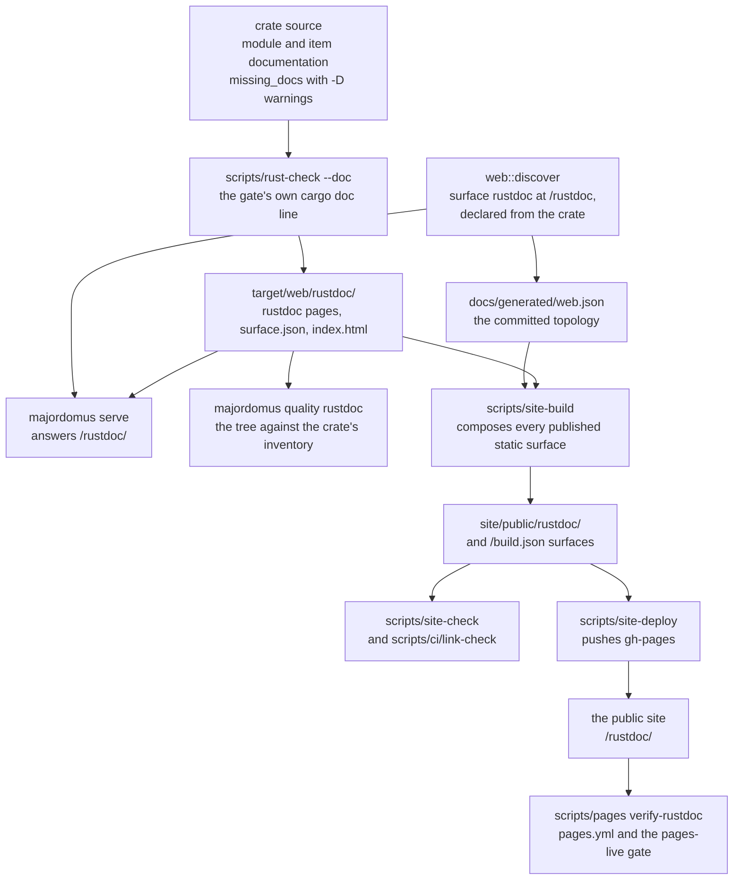

# The crate's reference — rustdoc, published at `/rustdoc`

The Rust crate `apps/majordomus-cli` documents every item it exports in its own source, and
rustdoc renders that documentation into a reference: one page per exported item, the source
each page was built from, and a search over all of it. This document is how that reference
is produced, served, checked, published and verified — and what to do when one of those
stages fails.

The decision is
[ADR 86](../.ai/repo/adrs/0086-the-crates-rustdoc-is-a-published-surface-produced-by-its-gate-and-verified-live.md);
the rule is `project.the-crate-reference-is-published`. Behaviour as implemented and tested;
where this document and the scripts disagree, the document is wrong and changes in the same
commit.

## Purpose

The reference is the crate's own account of itself, at a commit: what each public module,
type, function and constant is for, the examples `cargo test --doc` runs, and the source
beside every page. It is published at `https://majordomus.dev/rustdoc/` and served by any
running `majordomus serve` at `/rustdoc/`, from the same bytes.

It is generated reference documentation, and it is held to documentation closure: the
source, the generation, the surface, the routes, the links, the tests, the deployment and the
public URL are each decided by an executable check. A `cargo doc` that succeeded proves the
first two and nothing after them — for as long as this repository had the crate, the gate
rendered the reference on every run and threw it away, and every route a reader might have
tried answered 404.

What it is not:

- **Not a compatibility promise.** The crate is `publish = false`. Its public contract is the
  capability registry, which ADR 51 measures; its Rust items may change in any release. The
  landing page at `/rustdoc/` says so.
- **Not a second inventory.** Nothing here lists the crate's modules or items. The published
  tree is the inventory a reader browses, and `majordomus quality rustdoc` prints the one the
  check measured. A list of either written into this document would be stale the first time
  the crate gained a module.

## Architecture



**Source.** The documentation is the `//!` and `///` comments of the crate. Coverage is the
existing policy and nothing new: `#![warn(missing_docs)]` in `lib.rs` with `-D warnings` in the
gate makes an undocumented export a build failure, and the `rust-quality` gate holds examples
and thin documentation to `project.rust-public-api-quality` ([`QUALITY.md`](QUALITY.md)).

**Producer.** `scripts/rust-check --doc` runs the `cargo doc -D warnings` step — the same line
the full and CI modes of that script run, and the only `cargo doc` line in it, which case 77
holds — and hands the output off. It asks cargo where its target directory is rather than
guessing (a shared `CARGO_TARGET_DIR` or a `.cargo/config.toml` can move it), empties
`target/web/rustdoc/` so that nothing of an earlier copy survives in it, copies the pages in,
and writes two files of its own:

- `surface.json`, the declaration (`web-surface/v1`): id `rustdoc`, mount `/rustdoc`, the
  producer, availability `both`, category `documentation`, visibility `public`, and
  `built_from`, the commit of the checkout that built it — the same commit the build is handed
  as `MAJORDOMUS_BUILD_COMMIT`, so that the crate's `COMMIT` constant page names it too;
- `index.html`, the landing page, because rustdoc writes an index per crate and none at the
  root of its output. It names the version and the full commit it documents. Every link into
  the tree on it is relative, so the same bytes work on the published site and on a running
  server; the one link out of the tree is the site's public address, read from
  `site/config.toml`, because a relative `../` would leave the tree and `quality rustdoc`
  refuses that on any page of it.

The library is documented through its public items, and the executable as cargo documents any
binary target — its own items, since a binary exports nothing — with rustdoc's own source pages
kept for both. There is no `--document-private-items` and no second invocation for
publication: what is published is what the gate proved.

**Surface.** The surface is declared by discovery from the crate, the way the served
documentation is declared from `site/config.toml`: it is in the topology whenever the crate is,
whether or not the producer has run, so the home page, `majordomus web list` and the committed
`docs/generated/web.json` never depend on the state of one checkout. `built_from` is read from
the producer's `surface.json` and is omitted from the committed projection for that reason. The
mount is its own top-level one; [`WEB.md`](WEB.md) explains why `/docs`, `/api` and
`/reference` could not hold it.

**Serving.** `majordomus serve` answers `/rustdoc/` from `target/web/rustdoc/` through
`web::files`, the same guarded static server `/docs/` uses. It never runs cargo: when the tree
is absent, `/rustdoc/` answers `503` naming `scripts/rust-check --doc`, and the home page shows
the surface as not built rather than offering a link that is certain to fail.

**Integrity.** `majordomus quality rustdoc` reads the rendered tree against
`quality::source::Inventory`, the crate's syntax-tree measurement of its own exported items —
the inventory the quality rule already uses, not a list kept for this check. Every exported
item must have its page at the route derived from its path and kind; no item page may exist
without its item; the tree must carry its `surface.json`, and its `built_from` must be `HEAD`;
the library's index must carry its identity
(`<title>majordomus_cli - Rust</title>`); the index's assets must be present; every internal
link must resolve; and no page may name a machine path or a secret. The executable's pages are
judged by the same walk over the binary target's own inventory. It exits `0` clean, `10` with
findings, and `12` when there is no tree to judge.

Two kinds of unresolved reference are rustdoc's rather than the crate's. Each is a named class
(`RustdocLinkClass`), decided by where the reference sits, counted under
`counts.accepted_links` with its links, its pages and every distinct reference as written, and
never a finding:

- **`inherited-documentation`**: a relative link inside a docblock that rustdoc copied from
  another crate — the documentation of an implementation listed under *Auto Trait
  Implementations* or *Blanket Implementations* of a trait no page of this tree documents (the
  implementation's header links no trait page of the tree). The text is the other crate's,
  written relative to that crate's own pages — tracing's `dispatcher#setting-the-default-subscriber`,
  `super::Subscriber`, `crate::Span`, `super::Span::current()` — so it resolves nowhere under
  `/rustdoc`, and nothing in this crate can change it. The same link anywhere else on the page,
  in an implementation the crate writes itself, or under an implementation of one of this
  crate's traits, is a `link` finding. On the tree of 2026-09-24: 4705 links on 941 pages.
- **`unwritten-implementors`**: the implementors script a trait's page loads —
  `trait.impl/<crate>/<path>/trait.<Name>.js`, for the very trait the page documents — when
  rustdoc wrote none. rustdoc references it from every trait page and writes it only when the
  documented crates have implementors to list; the page renders its own crate's implementors
  inline and is complete without it. Any other absent script, stylesheet or file is a finding.
  On the tree of 2026-09-24: one, `majordomus_cli/capability/handler/trait.Handler.html`.

Both are visible on the public site, and are acknowledged here rather than hidden: following
one of the inherited links answers `404`, and the trait page's request for its unwritten
implementors script answers `404` in the browser's network log. Neither loses anything of this
crate's documentation, and the counts in the report say how many there are, so a change in
either is seen.

**Composition.** `scripts/site-build` copies every published static surface other than the site
itself into its output at the surface's mount, after Zola and after the site's accessibility
pass. The list is read from `docs/generated/web.json` (`mj_web_composed` in `lib/common.sh`),
so no line names this surface. A published surface whose artifact is absent refuses the build
with exit `12` and names its producer; a mount the site itself already fills is refused with
exit `10`, because one path has one owner. The build also records every composed surface with
the commit its producer declared under `surfaces` in `/build.json`, the one identity file the
site serves.

**Judgement of the composed tree.** The site's page contract in `scripts/site-check` judges the
pages Zola renders. Pages under a composed surface's mount — derived from the same topology —
are pruned from it, because their markup is the toolchain's; `quality rustdoc` judges them. A
link from a site page into `/rustdoc/` is decided by `scripts/ci/link-check` against the
composed tree, as an internal file like any other.

## Local usage

```bash
scripts/rust-check --doc                 # produce target/web/rustdoc (or: just rustdoc)
majordomus quality rustdoc               # the integrity check over that tree
majordomus quality rustdoc --tree DIR    # the same check over another copy of it
majordomus web explain rustdoc           # the surface: mount, producer, built_from, provenance
majordomus serve                         # then open /rustdoc/ on the URL it logs
scripts/site-build                       # the site, with the reference composed at /rustdoc
scripts/site-check                       # the static checks over the composed site
```

`scripts/site-build` refuses to run until the producer has, and says so with the command to
run. That is deliberate: a site built without a surface the topology publishes is the silent
loss this design exists to prevent.

The tree is ignored and never committed. It embeds the commit it was built from, so it is
stale after any commit, and the check says so.

## Validation

| what | where it runs | what it refuses |
|---|---|---|
| the `rust-check` gate (`scripts/rust-check --ci`) | the `rust` job of the validation workflow | a documentation warning, at the `cargo doc -D warnings` step that also produces the tree |
| the `rustdoc` gate (`majordomus quality rustdoc`), which requires `rust-check` | the `rust` job | any integrity finding over the tree that run produced, and no tree at all |
| `web-topology` (`majordomus web validate`) | the `rust` job | the surface colliding with, or nesting inside, another |
| `site-build` gate: `scripts/site-build` | the `site` job, and the publication | a published surface whose artifact is absent; a mount the site itself fills |
| `site-build` gate: `scripts/site-check`, section 13m | the `site` job, and the publication | a composed surface missing from the build, carrying no `surface.json`, declaring another id or mount than the topology, or built from another commit than the build; `/build.json` disagreeing with it |
| `scripts/ci/link-check` | run by `site-check` | a link from a site page into `/rustdoc/` that the composed tree does not hold |
| cases 486–490 | the shell suite | each stage broken on purpose, and its refusal observed |
| `quality::rustdoc` and `web::discover` tests, `tests/http_serve.rs` | `cargo test` | one fixture per way of failing; the declaration present before the producer runs; the tree served whole over a real socket |

The five cases, one stage each:

| case | stage | what it breaks |
|---|---|---|
| `486` | composition | the site build without the reference's artifact, and with it |
| `487` | staleness | a tree built from another commit, at the check and at the public verification |
| `488` | discoverable and reachable | the surface before the producer runs; `/rustdoc/` over a served socket |
| `489` | deployment | the composed site deployed to a bare remote, and what the published branch carries |
| `490` | completeness | a module added to a fixture crate, which becomes a required page with nothing listed |

```bash
bash test/run.sh 486_rustdoc_composition 487_rustdoc_staleness 488_rustdoc_discoverable \
  489_rustdoc_deploy 490_rustdoc_new_module
cargo test --manifest-path apps/majordomus-cli/Cargo.toml quality::rustdoc
cargo test --manifest-path apps/majordomus-cli/Cargo.toml web::discover
cargo test --manifest-path apps/majordomus-cli/Cargo.toml --test http_serve
```

## Deployment

The tree is produced in CI and composed at build time; it is never committed, and the deploy
job carries no Rust toolchain.

A publication starts on a push whose paths can change the published bytes, and those paths are
derived by `scripts/pages paths` from the gate model, never written into the workflow. For the
reference they must include the crate's sources, manifest, lock file and build script, the
toolchain pin, the producer and its action; `scripts/pages paths` is the command that says
whether they do.

- **The `rustdoc` job of `.github/workflows/pages.yml`** is a job of its own, which the deploy
  job needs. It produces the tree through the composite action `.github/actions/rustdoc` — the
  same action the validation workflow's jobs that build the site use, so the two workflows
  cannot build it differently — from the commit being deployed, and hands it to the deploy job
  as an artifact of the same run. The two run one after the other: the site's build composes
  the tree and the site's checks judge the composed output, so neither can start before it
  exists. The job's wall time and the fetch of its tree are the `rustdoc` row of the phases the
  deploy job measures.
- **Composition.** The deploy job fetches that tree into `target/web/rustdoc/` before
  `scripts/pages build`, whose `scripts/site-build` composes it at `/rustdoc` exactly as it does
  locally, and `scripts/pages check` runs every static check over the composed output.
- **Publication.** `scripts/site-deploy` pushes the composed `site/public` to `gh-pages`, the
  same single deploy path as before. Nothing about the mechanism changed; the tree it pushes
  now carries the reference.
- **Public verification, enforced.** Once the site serves the deployed commit,
  `scripts/pages verify-rustdoc --commit SHA` reads the public reference: `/build.json` and
  `/rustdoc/surface.json` must name that commit, the landing page must name it, the library's
  index must be rustdoc's with its stylesheets and scripts answering, a module page and the
  search index must answer, and the crate's own `COMMIT` constant page must name that commit.
  It is a hard step of the deploy job, run only once the site is known to serve the commit, so
  a deployment whose public reference is absent, broken or stale fails the run.
- **Afterwards.** `scripts/ci/pages-check`, the `pages-live` gate, carries a section that asks
  the same question of the live site on every full validation and at `finish`, because a run
  that was cancelled before its verification step could not report anything.

## Troubleshooting

### An item has no page, or a page has no item

```bash
majordomus quality rustdoc               # names the item, the route it expected, and why
jq -r .built_from target/web/rustdoc/surface.json; git rev-parse HEAD
```

When the two commits differ, the tree predates the item: run `scripts/rust-check --doc`. When
they match and the finding stands, the item is exported but rustdoc gives it no page at the
derived route — usually `#[doc(hidden)]`, a re-export that renders inline, or a toolchain
bump that moved rustdoc's route convention. Decide whether the item should be public
(`majordomus quality report` shows what the policy sees). A route rule that is wrong for the
pinned rustdoc is corrected in `quality::rustdoc`, in the same change as the pin in
`rust-toolchain.toml` when a bump moved it — never excepted item by item.

### A link is broken

```bash
majordomus quality rustdoc               # a link inside the reference that does not resolve
scripts/ci/link-check                    # a link from a site page into /rustdoc/
```

Inside the reference, a broken intra-doc link in a `///` comment is already a warning that the
`cargo doc -D warnings` step turns into an error. A link that survives it is usually a doc
comment linking a repository file by a path relative to the source file: that resolves on a
forge and nowhere under `/rustdoc`. Link the published page or the forge URL instead, at the
source. From a site page, the finding names the page and the target; correct the link in the
canonical document it was projected from, never in `site/content/`.

### The docs are stale

```bash
majordomus web explain rustdoc           # built_from, beside the checkout's HEAD
majordomus quality rustdoc               # refuses a tree built from another commit or none
```

Run `scripts/rust-check --doc`. It empties `target/web/rustdoc/` before copying, and it empties
cargo's own documentation directory before the build when cargo's target directory is this
checkout's: rustdoc writes into that directory over whatever an earlier run left, and keeps the
source page of a file the crate no longer has and every search-index shard it ever wrote —
measured on 2026-09-24 with rustdoc 1.98.1, 489 shards in a reused directory against 430 in a
fresh one. When the target directory is shared with other checkouts (`CARGO_TARGET_DIR`), it is
not the producer's to empty, so `--doc` refuses with exit `12` and names the command that gives
this checkout a directory of its own; the full modes of the script run their gates and say that
nothing was handed off. An `orphan-page` finding from `quality rustdoc` after a local build
from a shared directory is removed the same way, or by emptying it yourself when no other
checkout is using it:

```bash
cargo clean --doc --manifest-path apps/majordomus-cli/Cargo.toml && scripts/rust-check --doc
```

### Assets are missing

```bash
majordomus quality rustdoc               # names every asset the index links and the tree lacks
```

The search index, the stylesheets, the scripts and the fonts are rustdoc's own files, beside
the pages. A tree that lacks them was copied partially or taken from another directory than the
one cargo wrote. Rebuild it from a clean documentation directory, with the same
`cargo clean --doc` line as above; the producer asks cargo for its target directory rather than
guessing, so it copies what cargo wrote.

### The source revision is wrong

```bash
jq -r .built_from target/web/rustdoc/surface.json
grep -o '[0-9a-f]\{40\}' target/web/rustdoc/majordomus_cli/constant.COMMIT.html | head -n 1
curl -fsS https://majordomus.dev/build.json | jq '{commit, surfaces}'
scripts/pages verify-rustdoc --commit "$(git rev-parse HEAD)" --timeout 0
```

Two values name the revision a tree was built from: `built_from`, which the producer writes, and
the crate's `COMMIT` constant, which rustdoc renders on its page. The producer writes both from
one value: it hands the build the commit it records, as `MAJORDOMUS_BUILD_COMMIT`, because
`build.rs` reads the commit only when the crate's sources, manifest, lock file or that variable
change, and after a commit that touches none of them a plain `cargo doc` keeps the earlier
commit compiled in. So the two disagree only when a tree was assembled from two builds — a copy
of another run's output, or pages copied by hand rather than by the producer. Rebuild it with
the producer; a caller that must document another commit than `HEAD` sets the variable itself,
and `built_from` then names that commit too:

```bash
scripts/rust-check --doc
MAJORDOMUS_BUILD_COMMIT="<sha>" scripts/rust-check --doc
```

On the public site, `commit` in `/build.json` is the commit the site was built from and
`surfaces[].built_from` the commit each composed surface's producer declared. When they
differ, the deploy composed a tree from another build — a restored cache or an artifact of
another run. The `rustdoc` job must produce the tree from the commit it deploys; re-run the
publication with a dispatch of the pages workflow once the cause is fixed.

### Public verification fails

```bash
sha="$(git rev-parse HEAD)"
scripts/pages verify --commit "$sha" --timeout 0           # is the site serving it at all?
scripts/pages verify-rustdoc --commit "$sha" --timeout 0   # and is its reference whole?
scripts/ci/pages-check                                     # what the pages-live gate sees
```

Read them in that order. If `verify` fails, the site is not yet serving the commit — the Actions
queue or GitHub's own Pages build, which [`GITHUB_PAGES_PERFORMANCE.md`](GITHUB_PAGES_PERFORMANCE.md)
covers — and the reference is not the problem. If `verify` passes and `verify-rustdoc` fails,
the finding names what is wrong: the reference absent at `/rustdoc/` (the deploy log has no
`== compose rustdoc` line, so the tree was not obtained), an index or the constant page
answering with another identity or another commit, or a page missing. Fix the cause and re-run
the publication; a verification is never waived to make a run green.
