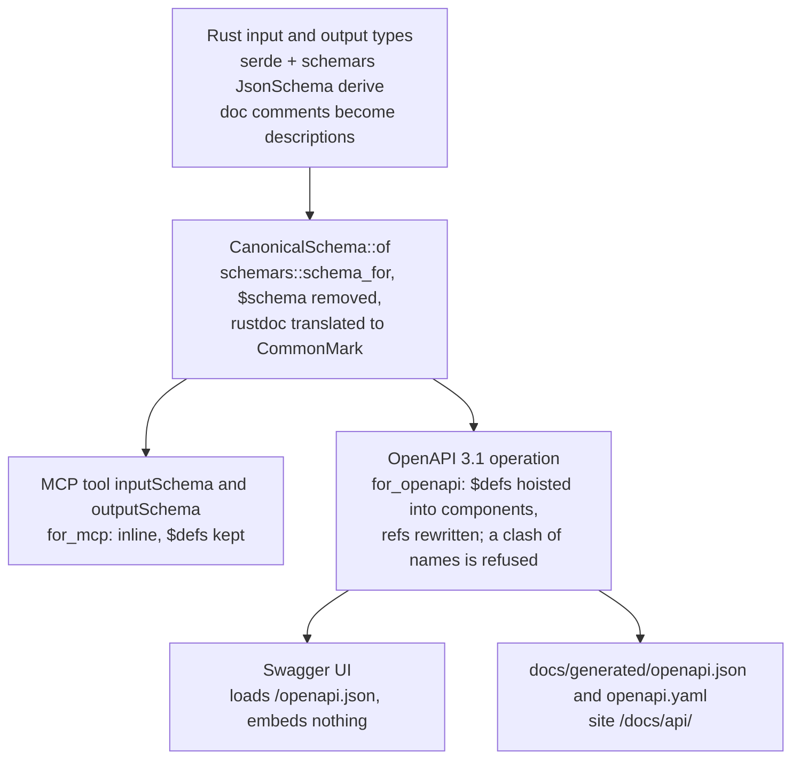
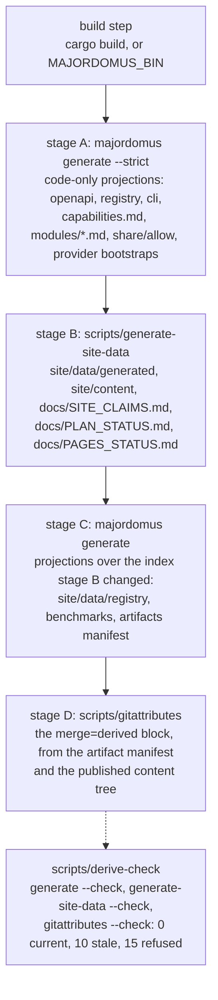
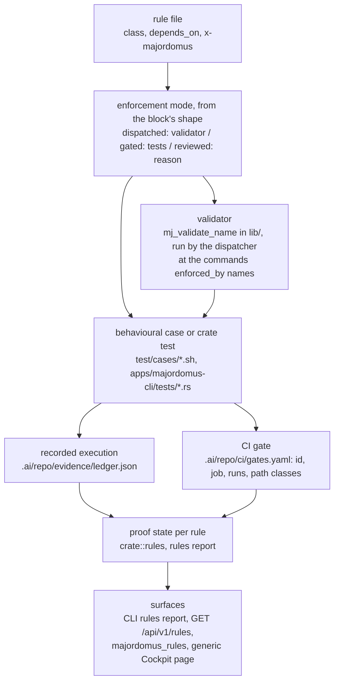
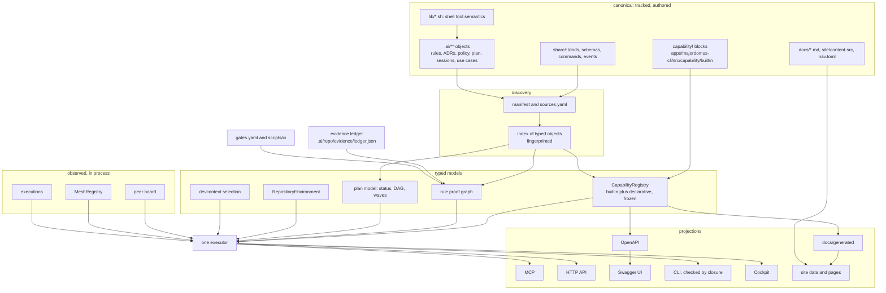
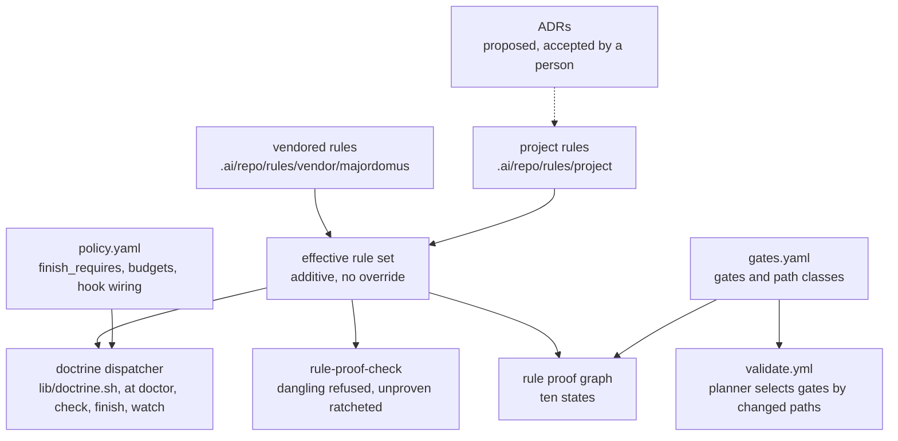
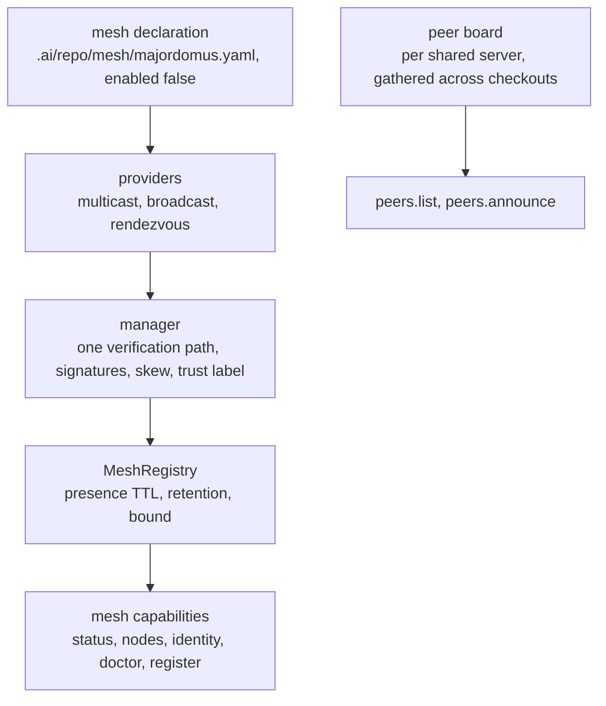

# How Majordomus derives its surfaces — one typed reality, many projections

Majordomus is a control plane that lives inside the repository it governs. This document
explains it as one system, not as a list of features. Facts are written down, discovered
or observed. They become typed models. Those models are validated and checked against
evidence. Then every interface a person or an agent uses is derived from them: the command
line, the HTTP API, the OpenAPI document, Swagger UI, MCP, the Cockpit and this website.

Most of what follows is already described somewhere else, one subsystem at a time:
[`CAPABILITIES.md`](CAPABILITIES.md) covers the operation model,
[`DYNAMICITY.md`](DYNAMICITY.md) covers where a fact lives,
[`DEVELOPMENT_RUNTIME.md`](DEVELOPMENT_RUNTIME.md) covers where a semantic lives,
[`DOCTRINE.md`](DOCTRINE.md) covers rules and proof,
[`EVIDENCE.md`](EVIDENCE.md) covers recorded executions,
[`GITHUB_PAGES_ARCHITECTURE.md`](GITHUB_PAGES_ARCHITECTURE.md) covers the website,
[`MESH.md`](MESH.md) covers discovery, and [`PLANNING.md`](PLANNING.md) covers the plan.
This document connects them, and it says plainly where the code does not do what the
design wants yet.

**How to read the claims.** Every structural claim was checked against the code and
against the running executable, at the commit this document was written on. Claims carry
labels in brackets, such as [C4], which point into the [claim audit](#appendix-e-claim-audit).
The audit gives the file and line, or the command, that proves each one. Some statements
are qualified with a word:

- **partial**: only part of the statement is implemented;
- **not implemented**: nothing in the tree does it;
- **debt**: the repository knows about the gap. It is listed in
  [Architecture debt](#appendix-f-architecture-debt).

No numbers about the repository's contents appear here (`project.no-counts-in-prose`).
Wherever a count matters, the command that measures it is given.

## Contents

1. [The invariant](#1-the-invariant)
2. [Two programs share one name](#2-two-programs-share-one-name)
3. [Where the truth is: five kinds of fact](#3-where-the-truth-is-five-kinds-of-fact)
4. [Discovery, and how it differs from inference](#4-discovery-and-how-it-differs-from-inference)
5. [Typed registries, canonical ids and display names](#5-typed-registries-canonical-ids-and-display-names)
6. [Schemas: from a Rust type to OpenAPI and MCP](#6-schemas-from-a-rust-type-to-openapi-and-mcp)
7. [The surfaces are projections](#7-the-surfaces-are-projections)
8. [The generation pipeline](#8-the-generation-pipeline)
9. [Governance: doctrine, rule, policy, ADR](#9-governance-doctrine-rule-policy-adr)
10. [A rule existing is not the same as a rule being enforced](#10-a-rule-existing-is-not-the-same-as-a-rule-being-enforced)
11. [Evidence, freshness and claim drift](#11-evidence-freshness-and-claim-drift)
12. [Publication: built, deployed, verified](#12-publication-built-deployed-verified)
13. [Doctor and drift: detect, repair, regenerate](#13-doctor-and-drift-detect-repair-regenerate)
14. [Tests that hold the surfaces together](#14-tests-that-hold-the-surfaces-together)
15. [Sessions, context, handover, planning, environment](#15-sessions-context-handover-planning-environment)
16. [Mesh and the peer board](#16-mesh-and-the-peer-board)
17. [Walkthroughs](#17-walkthroughs)
18. [What is not generated](#18-what-is-not-generated)
19. [Zero registration: the ideal and its exceptions](#19-zero-registration-the-ideal-and-its-exceptions)
20. [Why generation matters, and the theses](#20-why-generation-matters-and-the-theses)

Appendices: [A architecture map](#appendix-a-architecture-map),
[B surface map](#appendix-b-surface-map),
[C generation matrix](#appendix-c-generation-matrix),
[D governance and mesh maps](#appendix-d-governance-and-mesh-maps),
[E claim audit](#appendix-e-claim-audit),
[F architecture debt](#appendix-f-architecture-debt).

## 1. The invariant

> Discover and model a fact once, and derive every interface from it.

This is the mechanism that keeps the interfaces from drifting apart. A repository that
describes itself in several places builds up descriptions that disagree: a README, an API
reference, a tool list for an agent, a dashboard, a website. Each can be correct on the day
it is written, and each goes stale on its own schedule. Majordomus avoids this by keeping
one declaration and generating the other descriptions from it. Where it cannot generate a
description, it checks that description against the declaration.

The repository names this invariant several times. It is `project.interfaces-are-projections`
and `project.rust-canonical-declaration` in `.ai/repo/rules/project/`. It is ADR 2, ADR 4
and ADR 5 for operations, and ADR 40 for development semantics. What matters is how far
the code actually honours it:

- **Operations** (capabilities) honour it best. MCP tools and resources, HTTP routes, the
  OpenAPI document, the benchmark targets, the generated reference and the site's registry
  pages are built by walking one registry [C1, C5, C6, C7].
- **The command line** is declared a second time, in clap. It is checked against the
  registry rather than derived from it [C8, C9].
- **The Cockpit** is partial. Its generic capability, object and graph pages are driven by
  the registry. Its area pages and the areas themselves are written by hand [C12, C13].
- **Development semantics** (tasks, sessions, handovers, checkpoints, ADR allocation) are
  still mostly owned by shell code under `lib/`. For the mutating half there is no
  capability at all, and a ratchet file records that debt [C30].

## 2. Two programs share one name

`majordomus` is two executables. This fact is easy to miss, and every later section
depends on it.

| Program | Entry | Implementation | Owns |
|---|---|---|---|
| the shell tool | `bin/majordomus` | `lib/*.sh`, dispatched per command | `start`, `check`, `finish`, `context`, `handover`, `session`, `doctor`, `update`, `adr`, the plan writes, the doctrine dispatcher |
| the Rust executable | `bin/majordomus-cli` (a launcher that builds when needed) | `apps/majordomus-cli/` | the capability registry, `serve`, `mcp`, `generate`, `rules`, `evidence`, `devcontext`, `mesh`, `env`, `worktree`, the Cockpit |

For a command it does not know, the shell tool points you at the Rust executable. The
registry, and so every derived surface, belongs to the Rust executable. Anything owned only
by `lib/` reaches no HTTP route, no MCP tool and no Cockpit page, unless a Rust capability
reads its files. `DEVELOPMENT_RUNTIME.md` is the measured inventory of that boundary, and
`scripts/development-semantics-check` enforces its ratchet.

## 3. Where the truth is: five kinds of fact

The source of truth is the tracked tree. The `.ai/` layer is named by `.ai/manifest.yaml`
and classified by `.ai/repo/knowledge/sources.yaml`. The Rust sources under
`apps/majordomus-cli/src/capability/builtin/` declare the operations, and `share/` holds
kinds, schemas and vocabularies. Everything else is one of the following:

| Kind of fact | Examples | Who creates or changes it | Authority | Can it overwrite canonical state? | How it is invalidated |
|---|---|---|---|---|---|
| **authored** | a rule file, an ADR, `policy.yaml`, a `capability!` block, `docs/*.md`, `site/data/nav.toml`, an issue record, a handover body | a person, or an agent acting for one, in a commit | canonical | it *is* canonical state | by the next commit that edits it |
| **discovered** | the index of `.ai/**` objects, the git worktree topology, the effective rule set, the environment snapshot's tool versions | the executable, reading tracked files and git on each run | as authoritative as its inputs; never stored as a separate truth | no | recomputed on each read; the index carries a fingerprint, and the shared server rebuilds it when the tree moves |
| **derived** | `docs/generated/**`, `site/data/**`, `site/content/**`, `.gitattributes`' managed block, `AGENTS.md`/`CLAUDE.md`, issue status, waves, rule proof states | generators (`majordomus generate`, `scripts/generate-site-data`, `scripts/gitattributes`, `majordomus update`), or a pure function at read time | none of its own: it is a projection | no; a hand edit is refused or reported (`generate --check`, `update`'s stamp) | an input hash or a byte comparison (`scripts/derive-check`, the pre-commit `scripts/pages current`) |
| **observed** | the peer board, mesh nodes, a service answering on a port, an execution in progress, a recorded test run in the evidence ledger | a running process: the shared server, a mesh provider, `majordomus evidence record` | awareness only; the ledger is the exception because it is committed | no; `project.mesh-is-observation-not-authority` says so for the mesh, and the peer board "enforces nothing" | TTL and session timeout for presence; the evidence ledger's digest and diff checks for runs |
| **inferred** | the intent match in `devcontext`, a derived handover body, the implied release bump, a proposed ADR from `adr propose` | a deterministic heuristic, never a model call | the lowest; always marked | no; an extracted ADR that claims `accepted` fails validation | recomputed; confidence is carried in the value |

Two consequences follow, and the rest of this document depends on them.

- **Derived output never feeds back as input.** `scripts/derive` states that no stage reads
  its own output [C15]. The shell dataset generator leaves its own documents out of its
  input list [C16].
- **Observation never becomes permission.** A peer's claim is advisory. A mesh node's
  trust verdict changes labels, not permissions [C40, C42].

## 4. Discovery, and how it differs from inference

Discovery is enumeration governed by a declaration. The Rust executable finds the
repository root. It reads the manifest, loads the kinds and schemas (`share/kinds.yaml`,
`share/schemas/`, and repository additions under `.ai/repo/knowledge/`), and then enumerates
files through `sources.yaml` classes, from the version-control index by default
(`--discovery vcs`). Each file becomes a typed object or a diagnostic with a stable code.
An unreadable manifest or kinds file is an error. An object that does not validate is
excluded, the index reports `degraded`, and the surfaces still serve; `--strict` refuses a
degraded index. `CAPABILITIES.md` ("Lifecycle and failure policy") describes this, and
`test/cases/76_capabilities_projections.sh` adds a repository-defined kind and asserts that
it appears on every surface.

Inference is different. It guesses at relevance or intent. It lives in a few named places
and marks itself:

- `devcontext` selection. Every selector except `IntentMatch` is `declared()` and carries
  confidence 1.0. The intent match scores the share of intent terms found in an object's
  title, description, identity or tags, and never in its body [C45].
- Derived handover bodies. They are built from git, the ledger and open questions, and they
  end with a footer saying that no model wrote them [C47].
- `adr propose`. It writes `proposed` and refuses any other status. Acceptance is a person's
  act [C34].

No surface runs a language model to produce a fact.

## 5. Typed registries, canonical ids and display names

Every addressable thing has a canonical identity that is not its display name.

- **Capabilities.** The id is `namespace.local` (`rules.report`). The title ("Every rule
  against the proof there is for it") is display text. The registry refuses duplicate ids,
  MCP tool names, MCP resource URIs, HTTP routes and CLI paths, stores entries in `BTreeMap`s
  and iterates by id [C4].
- **Declarative objects.** The id is `<kind>.<identity>`, and the identity comes from the
  kind's identity rule: `id@version` for a rule (`project.english-only@1`), a number for an
  ADR (`adr-0044`). The MCP resource is `majordomus://<kind>/<identity>`.
- **Rules** are referenced as `id@version` in `depends_on`. A new version is a new file
  (`conventional-commits.v2.md`).
- **Worktrees** are identified by their branch. The path `<repo>-wt/<branch>` is derived
  from git and never registered ([`WORKTREES.md`](WORKTREES.md)).
- **Peers** get a board position (`p1`, `p2`) that is reassigned on reconnect. It is not an
  identity: the durable half of a peer's identity is the checkout it carries (ADR 44).

Ordering is canonical too. `apps/majordomus-cli/src/order.rs` defines one total order:
group, rank, label compared naturally, then identity. `scripts/ci/order-check` refuses
case-folded comparators outside it, sort keys that render, and unpinned shell `sort`. It
also ratchets the remaining crate sort sites in `.ai/repo/order-baseline.txt` [C19].

## 6. Schemas: from a Rust type to OpenAPI and MCP

The schema chain for an executable capability is real code, and a person writes each piece
of it only once:



`CanonicalSchema::of::<T>()` calls `schemars::schema_for!` [C2]. OpenAPI component names
come from the schema title. That namespace is flat, so two different types with the same
title fail `openapi::document` with "schema component … is defined twice with different
content" [C3]. The fix is to rename a type; nothing warns about it before that point
(**debt** F-11).

A declarative kind starts one step earlier. Its document schema lives under
`share/schemas/majordomus/<kind>/`. A `.proto` description there generates the JSON Schema,
the front-matter allow-list under `share/allow/` and the section requirements
([`DEVELOPMENT_RUNTIME.md`](DEVELOPMENT_RUNTIME.md), "The derivation chain"). Unknown
front-matter keys are errors (`project.unknown-keys-are-errors`).

## 7. The surfaces are projections

### 7.1 One declaration

An executable capability is one `capability!` block in
`apps/majordomus-cli/src/capability/builtin/<module>.rs`. It lists `id`, `kind`, `title`,
`description`, `input`, `output`, `stability`, `exposure`, `tags`, `cache`, `benchmark` and
`handler`. The macro also classifies availability, visibility and the execution policy from
the kind and the exposure, and takes the benchmark cases from the input type's
`BenchmarkCases` [C1]. `exposure` sets each surface explicitly:
`Exposure { mcp, http, cli }`. `None` means the capability is not exposed there, and
nothing infers an exposure [C4]. Modules are composed with `module!` and
`compose_modules!` in `builtin/mod.rs`.

Two post-macro modifiers declare what the kind alone cannot say. `.cancellable()` marks a
capability whose run can be cancelled. `.writes_repository()` marks one that writes a
tracked record. Two capabilities served over HTTP and MCP carry it today, `plan.transition`
and `recover.orphans`; list them with a search for `.writes_repository()` under
`builtin/` [C31].

### 7.2 MCP

`src/mcp/surface.rs` says of itself "Nothing is declared here". `compute_tools()` takes
every capability with an `mcp.tool` exposure. `compute_resources()` takes every capability
with an `mcp.resource` exposure, and every declarative object is one [C5]. A tool carries
the canonical input and output schemas, `_meta.majordomus.id` and a `readOnlyHint`
derived from the kind. A call resolves through `by_mcp_tool` and runs through the shared
executor.

The tools agents use to coordinate are ordinary declared capabilities:
`majordomus_announce` is `peers.announce`, `majordomus_peers` is `peers.list`, and
`majordomus_capabilities` is `capabilities.list`. They are not hand-written tools. Three
pieces of code still know about them by name, though: the `initialize` instructions text,
the stdio-to-HTTP bridge (which replays an announcement after a reconnect), and the
`peers.announce` handler (which refuses a caller that is not MCP) [C6].

### 7.3 HTTP API

The router resolves a capability route with `registry.by_http(method, path)`. For `GET`
it binds query parameters, coerced by schema type; for `POST` it parses a JSON body. It
calls the executor and maps errors to 400, 404, 422 and 500 [C7]. The router adds
transport behaviour and holds no business logic: coercion, error mapping, refusing
cross-origin non-`GET` requests, the route index at `/api/v1`, and a per-generation cache
of the OpenAPI document. Its non-capability routes are
infrastructure: `/`, `/openapi.json`, `/swagger`, `/mcp`, the `/events` WebSocket, `/cockpit/**` and
generated static mounts such as `/docs/` ([`WEB.md`](WEB.md)). There is no hand-written
peers route: `/api/v1/peers` is `peers.list`.

### 7.4 OpenAPI

`src/http/openapi.rs` builds OpenAPI 3.1 from the same registry. `operationId` is the
capability id and the tags are the modules. Parameter examples are the capability's own
benchmark cases, so a field no case sets has no example. The `x-majordomus-*` extensions
carry id, kind, stability, provenance, benchmark, cache, MCP and CLI; infrastructure routes
sit under `x-majordomus.infrastructure` [C7]. Maps are sorted and carry no timestamp. The
live document and `docs/generated/openapi.json` are the same computation.

### 7.5 Swagger UI

`src/http/swagger.rs` renders one static HTML shell that points `SwaggerUIBundle` at
`/openapi.json`. A unit test asserts that the shell embeds no `paths`, `openapi` or
`components`. The UI's own JavaScript and CSS load from the pinned `swagger-ui-dist` on
unpkg, so this is the one surface that is not offline [C10]. It is a pure UI projection.

### 7.6 The command line: declared twice, and checked

The clap tree in `apps/majordomus-cli/src/cli.rs` is written by hand. That is deliberate:
clap owns parsing, help, defaults and value sets ("The one projection that can drift" in
`CAPABILITIES.md`). A capability's `CliExposure` is therefore a *claim* about a command
declared somewhere else, and the claim is checked in both directions:

- `capability/closure.rs` fails when a claim names a command clap does not have, or one
  that only groups other commands. It runs in `tests/projections.rs` and in
  `capabilities validate` [C8].
- `cli::LOCAL` (`src/cli/local.rs`) gives the reason for each command no capability claims.
  There are exactly four structural reasons: process lifecycle, writes the repository,
  session-local, or renders a named capability for a terminal. There is also an alias
  form. `quality::parity` checks it, and the `projection-closure` gate
  (`scripts/ci/projection-check`) fails on a command that gives no reason [C9].
  `capabilities projections` lists both sets live: the CLI-only commands as `unbacked`, and
  commands with no reason as `unclassified`.

What a CLI command still takes by hand [C11]:

- a clap variant, and a dispatch arm in `commands/mod.rs`;
- a runner in `commands/<name>.rs`, which maps flags to the input JSON
  (`--findings` becomes `findings_only`) and calls `ctx.execute(id, input)` after
  `registry.by_cli`;
- a text renderer. `--format json` prints the capability's output unchanged; `--format text`
  is the command's own. Some exit semantics live only in the renderer: `rules report --check`
  exits 10 there, not in the handler;
- an entry in `cli::EXAMPLES`, a single hand-written `CommandExamples` const.
  `cli::validate` refuses a runnable command with no example, and
  `tests/cli_examples.rs` runs every example against the built binary.

Shell completion is not `clap_complete`. `commands/completion.rs` answers from the command
graph, which composes the clap tree, the shell tool's `share/commands.yaml` and the
workflows ([`COMMANDS.md`](COMMANDS.md)).

### 7.7 The Cockpit

The Cockpit (`src/cockpit/`) is HTML rendered on the server in Rust; there is no template
engine. The `/cockpit` path matters more than any feature, so this section separates what
is derived from what is written:

- **Derived.** `/cockpit/capabilities/<id>` is one generic page for every capability, with
  a runner form built from the input schema. `/cockpit/object?uri=` renders any object;
  `/cockpit/graphs/<id>` renders any derivation. The sidebar's catalogues come from
  `registry.modules()`, grouped by the product model's `module_area`, plus `index.kinds()`
  and `graph::ids()`, all in canonical order [C12].
- **Written by hand.** The route table is a `match` in `cockpit/mod.rs`. The areas list
  (Overview, Capabilities, Mesh, …) is `nav::areas()`, and its module comment gives the
  reason. Area pages ask for a capability by its literal id, such as
  `ask(ctx, "health.report", …)` or `ask(ctx, "mesh.status", …)` [C13]. So the sentence in
  `CAPABILITIES.md` that "nothing in it names a capability" is not accurate (**debt** F-20).
- **The frontend is not an authority.** The JavaScript under `share/cockpit/` does
  presentation and requests only. `runner.js` calls the capability's real route from
  `data-mj-method`/`data-mj-path`; `palette.js` and the graph views read `/api/v1/*`.
  Nothing in the browser computes readiness, status or proof. The
  `development-semantics` gate refuses any reference to `.ai/repo`, `.ai/local` or a
  `majordomus` executable inside the Cockpit trees [C14].

### 7.8 The surfaces compared

| | CLI (`majordomus-cli`) | HTTP API | MCP | Cockpit |
|---|---|---|---|---|
| Declared by | clap, by hand, checked against `CliExposure` | derived from `HttpExposure` | derived from `McpExposure` | route table and areas by hand; generic pages derived |
| Reaches | the capabilities that claim a CLI path, plus local commands | every capability with an HTTP exposure | every capability with a tool or resource exposure; every declarative object as a resource | every capability (generic page); selected areas |
| Input | flags mapped by hand in the runner | query parameters coerced by schema, or a JSON body | `arguments` validated against `inputSchema` | a runner form generated from the input schema |
| Output | `--format json` (the capability value) or `text` (a renderer) | JSON value, typed errors | `structuredContent` plus text | HTML over the same value |
| Logic of its own | renderers, some exit codes, local commands (`serve`, `generate`, `worktree create`) | transport only | transport only; announcement replay in the bridge | presentation only |
| Measure it | `capabilities projections` (`unbacked`) | `GET /api/v1` | `tools/list`, `resources/list` | `GET /cockpit` |

Coverage is uneven. Fewer capabilities have a CLI path than an HTTP route. `peers.list`,
`plan.*`, `objects.*`, `health.report` and `environment.status` have no CLI projection of
their own; the `env` commands are CLI renderings recorded in `cli::LOCAL`. Run
`majordomus-cli capabilities projections --format json` and compare the `cli` and `http`
fields (**debt** F-4).

## 8. The generation pipeline

### 8.1 The generators, in order

`scripts/derive` is the one command that brings every committed projection up to date. Its
stages run in this order [C15]:



- `majordomus generate` (`src/generate.rs`) writes to `docs/generated/` and
  `site/data/registry/` from one `plan()`. The same plan runs for writing and for
  `--check`. Its targets are the `GenerateTarget` enum in `cli.rs`, and the output
  manifest (`docs/generated/artifacts.json`) lists every artifact with its source,
  schema and hash.
- `scripts/generate-site-data` is the shell half. It hashes a declared list of inputs
  (`INPUTS`) under `LC_ALL=C`, writes into a staging directory and moves the results into
  place, so a failed run changes nothing. It projects `docs/*.md` into `site/content/docs/`
  [C16].
- There are two writers of generated trees, `src/generate.rs` and the shell generator, and
  both write site content (**debt** F-14).

### 8.2 Freshness is enforced at commit time and in CI

- `.githooks/pre-commit` runs `bin/majordomus doctor`, the worktree guard and
  `scripts/pages current`. That last command compares `generate-site-data --fingerprint`
  with `source_hash` in `site/data/generated/source.json`, and then runs `generate --check`
  [C17]. If the executable is not built, the registry half of the check is skipped with a
  message rather than failed (**debt** F-16).
- In CI, `core-check` runs `generate-site-data --check`, and the `generation-converges` gate
  runs generate followed by `generate --check`: the generator must be a fixed point [C18].
- `.gitattributes` marks every derived path `merge=derived`. `scripts/merge-derived` keeps
  "ours" and prints that the file is now stale, so a merge never hand-merges a projection;
  derive regenerates it afterwards. `doctor` fails a clone that has not registered the
  driver.

### 8.3 How a document becomes a page

Each document is registered by one row in the first table of `docs/README.md`. The shell
generator reads those rows and makes `/docs/<slug>/`. It generates the front matter: the
title from the first heading, the description from the row, the weight from the row's
position. It rewrites links, and it refuses any `docs/*.md` that is in no table [C16]. The
site navigation (`site/data/nav.toml`) is authored, and `scripts/ci/nav-check` verifies that
the navbar and footer templates derive from it. Nothing adds a document to the navigation
automatically. That is by design: the file says the navbar is not a sitemap.

### 8.4 Generator and renderer

A **generator** turns canonical input into a committed or served artifact, and is judged by
`--check`: `majordomus generate`, `scripts/generate-site-data`, `majordomus update`,
`scripts/gitattributes`. A **renderer** turns a value that already exists into a
presentation, and holds no fact: a CLI text renderer, a Cockpit page, a Zola template, the
environment banner (`src/environment/render.rs`, "a pure view with no discovery"). When a
renderer computes something a generator should own, it becomes a second implementation.
The `development-semantics` gate says it cannot decide this mechanically, so a reviewer
does.

### 8.5 Generators are tested

- `tests/projections.rs`: every declared projection exists and none is an orphan; a change
  to a type or description reaches MCP, OpenAPI and the reference; generated artifacts are
  byte-identical when generated twice and carry no absolute path [C18].
- `tests/generate_check.rs`: `--check` agrees with what a write would produce, detects
  tampering and never writes.
- `test/cases/98_cli_reference.sh` compares two generations with `cmp`.
  `test/cases/28_no_hardcoded_values.sh` asserts that input order does not depend on locale.
  `test/cases/12b_site_data_transactional.sh` asserts that a failed run leaves artifacts
  byte-identical. `test/cases/51_derived_artifacts_committed.sh` asserts that `derive-check`
  passes and that no derived file embeds the current commit.

## 9. Governance: doctrine, rule, policy, ADR

This repository defines the four terms as follows. The definitions come from
[`DOCTRINE.md`](DOCTRINE.md), the rule files and `.ai/repo/policy.yaml`.

| Term | What it is here | Where | Lifecycle |
|---|---|---|---|
| **rule** | a Markdown file with front matter: `id`, `version`, `title`, `statement`, `status` (`active` or `deprecated`), `class` (`blocking` or `advisory`), `depends_on`, and an optional `x-majordomus` block naming a validator, tests or a `reviewed_because` | `.ai/repo/rules/project/`, plus the vendored package in `.ai/repo/rules/vendor/majordomus/` (hash-pinned) | edited in a commit; a new meaning is a new version file; no acceptance step |
| **doctrine** | *two meanings in this repository* (**debt** F-25). In `DOCTRINE.md`, a doctrine is a rule whose `x-majordomus` block names a validator the shell dispatcher calls (`mj_doctrine_dispatch`), and the registry of doctrines is derived from the rule set. On the site's method pages, "doctrine" is the principle layer above policy | `DOCTRINE.md`; `site/content-src/method/` | derived from rules |
| **policy** | one repository's configuration of the tool: context budgets, `verification.finish_requires`, handover sections, enforcement wiring for hooks | `.ai/repo/policy.yaml` | edited by hand; provider projections are regenerated by `majordomus update` |
| **ADR** | a decision record: `schema: adr/v1`, `status` (`proposed`, `accepted`, `superseded` or `rejected`), reciprocal `supersedes`/`superseded_by`, typed `related` references, `provenance.origin` | `.ai/repo/adrs/NNNN-slug.md` | `adr propose` writes `proposed`; acceptance is a person's act, enforced only for records whose origin is `extracted` [C34] |

The chain from a rule to evidence is:



One join in that chain is inferred rather than declared. `gates.yaml` does not say which
rules a gate proves. `crate::rules` scans each gate's `runs:` line (a line reader, not a
typed parse) and binds a rule's named path to a gate in three cases: the command *is* that
path; the path is a test case and the command runs `test/run.sh`; or the path is a crate
test and the command contains `rust-check` [C27]. A suite gate is assumed to run every
case; nothing checks that it actually selected the case (**debt** F-7).

## 10. A rule existing is not the same as a rule being enforced

A rule can be in any of eight conditions, and each is a different claim. The table maps
each condition to what the repository can actually show today.

| Condition | What proves it here | Implemented? |
|---|---|---|
| declared | a file under `.ai/repo/rules/` | yes |
| parsed | `lib/rules.sh` and `src/rules/mod.rs` read it; unknown keys are errors | yes (two readers) |
| valid | resolution refuses missing dependencies, cycles and duplicate identities; the loader refuses a half-declared block | yes |
| validator exists | `rules report` marks a named validator `present`; a missing one makes the rule `dangling` | yes, for dispatched rules |
| wired | `doctor` walks the dispatcher chain for doctrines; `rule-proof-check` refuses a named path that is not in the tree | yes |
| gate executes | a gate in `gates.yaml` whose `runs:` covers the named path | inferred from `runs:` (§9) |
| passed | a recorded passing execution the rule's inputs have not moved past | **partial**: only local runs are recorded; CI records nothing (**debt** F-6) |
| evidence captured | `.ai/repo/evidence/ledger.json`, joined on every read | **partial**: the same limit |

The machine-readable form of this ladder is the rule proof graph (`crate::rules`,
`majordomus-cli rules report | show | proves`, `GET /api/v1/rules`, MCP `majordomus_rules`).
It gives each rule one of ten states: `proven`, `inputs unchanged`, `stale`, `gated`,
`failing`, `not run`, `reviewed`, `unrunnable`, `dangling`, `unproven`. A rule's state is
the weakest of its parts [C23].

- **Enforcement modes come from the block's shape** [C24]. A *dispatched* rule names a
  `validator`. A *gated* rule names `tests` and no validator. A *reviewed* rule names a
  `reviewed_because` sentence and neither. An executable proof always wins.
  `scripts/ci/rule-proof-check`, the `rule-proof` gate, refuses a dangling path outright and
  ratchets blocking rules that name nothing in `.ai/repo/rule-proof-baseline.txt` [C25].
- **A finding is a class the state does not support.** `dangling` is a finding for any
  class. For a blocking rule, `unproven`, `failing` and `unrunnable` are findings. `gated`,
  `reviewed` and `not run` are weaker states: they are counted but are not findings [C26].
- **Nothing gates on the proof graph itself.** No script, gate or workflow runs
  `rules report --check` (**debt** F-8).
- **A failing run can be hidden.** The per-rule state is `max()` over its tests, and the
  enum orders `Failing` before `NotRun`. A blocking rule with one failing case and one case
  that never ran therefore reports `not run`, which is not a finding. Reading the code
  shows this; it has not been observed in data (**debt** F-9) [C26].

`project.never-reported-is-not-green` shows the whole problem in one rule. Its statement
is "a check that has not reported is unknown, never passing". It is `class: advisory`, has
no `x-majordomus` block, and says it is decided "by review and by the record, not by a
gate". The proof graph reports it as `unproven`, and that is not a finding, because an
advisory rule owes no proof. The rule exists, its ideas shaped `evidence-check` (see
`EVIDENCE.md`), and it is not mechanically enforced. The graph says exactly that.

To measure it yourself:

```console
$ bin/majordomus-cli rules report --format json | jq '.states, .coverage'
$ scripts/ci/rule-proof-check
$ bin/majordomus-cli rules show project.never-reported-is-not-green
```

## 11. Evidence, freshness and claim drift

**The ledger.** `.ai/repo/evidence/ledger.json` holds the latest recorded execution of each
test. Each entry records the test id, runner, source, outcome, seconds, commit,
working-tree state, a `sha256` digest of the test's own source, the time, the origin
(`local`, `ci` or `release`) and the command that reproduces it. `majordomus evidence
record` writes it from a report the run already produced. It keeps no history and no
output ([`EVIDENCE.md`](EVIDENCE.md)).

**Freshness is derived on every read** [C28]:

- a run that did not pass is `failing`;
- when git cannot diff, the run is `stale`, because not knowing is not proof;
- when the test source or the rule file changed after the recorded commit, or the digest no
  longer matches, the run is `stale`;
- when nothing else changed apart from the ledger itself, the run is `proven`;
- otherwise the run is `inputs unchanged`, meaning no known invalidation but not proof
  against this commit.

**Claims.** `docs/CLAIMS.yaml` binds each public claim to a source, an implementation and a
test, with an authored `status` from a vocabulary declared in the same file. Every claim
has a page under `docs/claims/`. Three readers check for drift:

| Check | Question | Gate |
|---|---|---|
| `scripts/generate-site-data --check` | do the named paths exist? does every claim have a page? | `core-check` |
| `scripts/ci/claim-proof-check` | does the named test name the claim back? (ratcheted) | `claim-proof` |
| `scripts/evidence-check` | what is each claim's proof state against the ledger? (ratcheted on lost or withdrawn proof) | `evidence-check`, always on |

**How proof reaches the Cockpit and the website, honestly.** Rule and claim proof states
are served as capabilities (`rules.*`, `evidence.*`) over the CLI, HTTP and MCP, and each
has the generic Cockpit capability page. The Cockpit has **no** dedicated rules, evidence
or peers area. The website's `/evidence/` page renders `data/generated/claims-graph.json`,
which is built from `CLAIMS.yaml`: it shows the authored links between claims, sources and
tests, not ledger outcomes. Its guarantees pages show the authored `status`, not measured
proof [C29]. CI does not record evidence either: `EVIDENCE.md` says "nothing runs that step
today" [C29]. So *proof of function* reaches the API and MCP as a derived state. It does not
yet reach a page a person browses as anything more than a mechanism (**debt** F-6, F-10).

## 12. Publication: built, deployed, verified

The website is a projection, and three different states can each be called "published":

| State | What establishes it | Where |
|---|---|---|
| **built** | `scripts/pages build` proves that the committed data is current by fingerprint, then runs `site-build --no-data`; a stale tree is refused, not regenerated | `.github/workflows/pages.yml`, `build` step |
| **deployed** | `scripts/site-deploy --skip-build` pushes `gh-pages`; GitHub then runs its own Pages build, which `scripts/pages built` reads | `publish` step and the step that reads GitHub's build |
| **verified public** | `scripts/pages verify --commit $GITHUB_SHA` polls the live `/build.json` (written by `scripts/site-build` with commit, source hash and fingerprints). It is `continue-on-error`: a report, not a gate | `public` step |
| **verified, as a gate** | `scripts/ci/pages-check`, the `pages-live` gate: the published commit is on master, no publication is owed beyond the deploy window, the live site serves what `gh-pages` holds, and GitHub's build did not error. It is `at-finish`, so `finish` asks it | `.ai/repo/ci/gates.yaml` [C21] |

This is `project.never-reported-is-not-green` in practice. A deploy job that reports
`cancelled` because it waited too long for the CDN is not proof that nothing was published,
so the question is answered by reading what the site serves.

## 13. Doctor and drift: detect, repair, regenerate

| Verb | Tool | Writes? |
|---|---|---|
| **detect** | `majordomus doctor` (shell, read-only): provider projection states (`absent`, `region_absent`, `malformed`, `unstamped`, `hand_edited`, `ok`), the doctrine wiring chain, hook and merge-driver wiring, the always-loaded file's budget and hard-coded counts. `majordomus-cli worktree doctor`, `mesh doctor`, `capabilities validate`, `scripts/derive-check` | no |
| **regenerate** | `majordomus generate`, `scripts/derive`, `majordomus update` (provider files; renders every target first, and refuses to overwrite a hand edit without `--force`) | yes, derived files only |
| **repair** | `majordomus-cli worktree repair` and `worktree migrate` (fingerprint-verified), `just derive-merge-driver` | yes, local state or configuration |

`doctor` has no `--fix` [C22]. Each finding names the command that fixes it. A finding that
does not name one is refused by the `finding-reproduce` gate. Freshness of `site/` and
`docs/generated/` is not checked by `doctor`; the pre-commit `pages current` and
`derive-check` check it.

## 14. Tests that hold the surfaces together

| Test | What it compares |
|---|---|
| `test/cases/76_capabilities_projections.sh` | `capabilities validate` passes for registry, MCP, HTTP and OpenAPI; one capability (`objects.get`) is traced to its tool, route, `operationId` and reference row; the OpenAPI operation count equals the HTTP exposure count; a tampered generated file makes `generate --check` exit 10; no `closed == false` rows; a declarative rule and a repository-defined kind reach every surface |
| `apps/majordomus-cli/tests/http_serve.rs` | a real socket: `mcp_and_http_answer_the_same_capability_with_the_same_result` for `objects.get`, `objects.search` and `capabilities.describe`; `the_release_analysis_is_one_value_on_every_surface`; every route answers its benchmark cases |
| `apps/majordomus-cli/tests/projections.rs` | projections exist with no orphans, including the clap tree; a mutation of a type reaches every projection; generation is byte-identical |
| `test/cases/91_canonical_architecture.sh` | `registry.json` ids equal the live `describe`; benchmark coverage is complete; many MCP requests leave the startup counters unchanged |
| `test/cases/92_openapi_reference.sh` | OpenAPI tags equal the modules; examples equal the benchmark cases |
| `test/cases/46_cross_surface.sh` | plan issues, READY status and edges agree across the CLI, the Mermaid diagram and the GitHub projection. This is the plan, not capabilities |
| `test/cases/99_plan_capabilities.sh` | the shell plan engine and `src/plan.rs` produce byte-identical answers |

Value equality across HTTP and MCP is tested for a **sample** of capabilities, not
generated for each one. No test asserts that `--format json` from the CLI equals the HTTP
value for each CLI-exposed capability (**debt** F-12).

## 15. Sessions, context, handover, planning, environment

Each of these follows the same pattern: an authored or recorded state, a derivation, and
projections. The owner of each derivation differs, and that is where the debt is.

**Sessions: a persistent record plus ephemeral presence.** A session *episode* belongs to
the provider session. It is recorded under `.ai/local/state/sessions-open/` while open and
closed into `.ai/repo/sessions/` as a tracked record. That is the persistent half, written
by `lib/session.sh` and `lib/capture.sh`, and triggered by the provider hooks in
`.claude/settings.json` (session start, end, compact and prompt submission). *Presence*
is the peer board, held in memory by the shared server and lost with the process
(§16). [`CONTINUITY.md`](CONTINUITY.md) states the separation: "The episode file records no
process, the peer board records no episode." The typed Rust session domain
(`src/session/`) reads; the shell still writes (ADR 47, ADR 52).

**Context compilation: two engines.**

- `majordomus context` (`lib/context.sh`) is the briefing. It has fixed sections in
  authority order (git, peers, task, profile, context documents, questions, decisions,
  checkpoint, handover, files, history, prompt), a line budget from policy
  (`context.builder_budget_lines`), and a declared drop order. Git, the task, the profile
  and open questions are never dropped, and every dropped section is listed under
  `EXCLUDED`. It is deterministic, and no model is called.
- `devcontext.compile` (`src/devcontext/`) is the Rust compiler. It is a capability, so it
  reaches the CLI, HTTP and MCP [C44]. The algorithm:
  - *discovery*: seeds, a walk over the composed graph with edge weights multiplied along
    each path, the effective scope paths (including an issue's declared `scope`),
    governance, session records and local handovers and checkpoints, and unresolved
    references;
  - *relevance*: a floor (`DEFAULT_FLOOR`) and a depth limit (`DEFAULT_MAX_DEPTH`);
  - *authority*: tiers ordered Task, Governance, Source, Decision, Knowledge, History;
  - *freshness*: a local record whose git divergence is untrustworthy has its relevance
    halved and gets a `stale_record` diagnostic, and deprecated or superseded objects are
    excluded;
  - *budget*: tokens estimated as bytes divided by `BYTES_PER_TOKEN`, first fit in the order
    tier, then relevance, then URI; seeds and policy or scope objects are never dropped, and
    `over_budget` is reported if they alone exceed the budget [C45].

  Only the intent match is inferred (§4). Two engines for one concept is **debt** F-15.

**Handover.** The required sections come from policy (`handover.required_sections`:
Objective, Current State, Next Action), and a missing or empty section is refused. The
front-matter identity fields (branch, head, worktree, changed files, …) are always
computed, and a body that tries to author one is refused. With `--derive`, each section is
generated from the ledger, git and open questions by `mj_derive_sec_<slug>` in
`lib/derive.sh` [C47]. `--resolve` picks the newest handover for the same worktree and
branch, then for the same branch, never repository-wide, and labels its git divergence.

**Planning.** Milestones and issues are authored YAML under `.ai/repo/project/`. Status is
*derived and never stored*: a `status` key is a validation error. Validation builds the
dependency DAG with cycle detection, then execution waves; two ready issues in one wave
whose scopes contain each other produce `WARN scope_conflict` and are serialised [C46].
`lib/project.awk` is the authoritative engine. `src/plan.rs` mirrors it and is held
byte-identical by case 99; `plan.*` exposes it over HTTP and MCP, and `plan.transition`
writes one record through the model (**debt** F-17). `docs/PLAN_STATUS.md` is generated
by stage B.

**RepositoryEnvironment.** `environment::RepositoryEnvironment`
(`majordomus/repository-environment/v1`) is one typed snapshot: project, repository, VCS,
toolchains, layer, workflows, providers and services, with a provenance entry for each
value. `environment.status` and `environment.explain` are capabilities (HTTP, MCP). The
`env` commands and the shell banner are renderings of it; the banner "is a pure view with
no discovery". One limit is honest to state: a service is drawn as available when a TCP
connect succeeds, and nothing more [C48] (**debt** F-18).

## 16. Mesh and the peer board

There are two distinct mechanisms, and there is no third.

**The peer board** (`src/peers.rs`, ADR 44) holds the sessions working on this repository
*now*. It is one in-memory board per shared server; `peers.list` gathers every checkout's
board by reading the other checkouts' leases and asking each one once, and reports
`complete` and `boards`. A peer is attached through an MCP session, and HTTP MCP sessions
expire after `SESSION_IDLE_TIMEOUT`. `majordomus_announce` attaches a claim (`intent`,
`scope`) to the connection. The board "enforces nothing", and a peer that reconnects loses
its place on it [C41].

**The mesh** (`src/mesh/`, ADR 50, `docs/MESH.md`) discovers *running Majordomus
instances* across machines. Its implemented providers are UDP multicast, UDP broadcast and
HTTP rendezvous (`POST /api/v1/mesh/register`), each an implementation of `MeshProvider`
that only hands bytes to the manager. The manager verifies Ed25519-signed envelopes on one
path into one `MeshRegistry`, bounded by `MAX_NODES`, with presence from `PRESENCE_TTL` and
records kept for `RETENTION`. Trust (`deny_unknown` by default) labels records and grants
nothing. The mesh is off unless a committed declaration enables it, and this repository's
declaration (`.ai/repo/mesh/majordomus.yaml`) says `enabled: false` [C42]. The governing
sentence is **"Discovery creates awareness, not authority."**

What does **not** exist, so that nobody goes looking for it: a blackboard separate from the
peer board; Tailscale, mDNS or DNS-SD discovery (named as possible future providers only);
any cross-machine journal, link or claim replication on master; a Cockpit page for the
peer board. ADR 50 keeps the two apart on purpose: "The peer board remains the only
cooperation surface."

**Scope overlap is derived, and advisory.** Three mechanisms compute overlap, and none of
them locks anything:

| Mechanism | Reads | Result |
|---|---|---|
| `majordomus start` / `check --overlap` (`lib/start.sh` `mj_report_overlap`) | the other worktrees' `.ai/local/state/current.yaml` task scopes, by path containment | `INFO overlap` lines; exit 0 |
| `peers::claims_meet` | the claims announced on the board | overlap reported beside a peer |
| the plan's `scope_conflict` | the issues' declared scopes within a wave | `WARN`; the issues are serialised |

`check --overlap` reads task records only, not the board and not branches. It also has a
defect you can reproduce: the loop runs on the right side of a pipe, so its finding counter
is lost, and it prints "no other worktree claims an overlapping path" directly after
listing overlaps [C43] (**debt** F-13). What actually refuses a commit is the task's own
scope, checked at `finish` and by the pre-push hook.

| Surface | Peer board | Mesh |
|---|---|---|
| CLI | none for `peers.list` | `mesh identity`, `mesh doctor` (capabilities); `mesh status`, `mesh nodes` (local renderings) |
| HTTP | `GET /api/v1/peers`, `POST /api/v1/peers/announce` | `GET /api/v1/mesh`, `/mesh/nodes`, `/mesh/identity`, `/mesh/doctor`; `POST /api/v1/mesh/register` |
| MCP | `majordomus_peers`, `majordomus_announce` | `majordomus_mesh`, `majordomus_mesh_nodes`, `majordomus_mesh_identity`, `majordomus_mesh_doctor`, `majordomus_mesh_register` |
| Cockpit | no area (generic capability page only) | `/cockpit/mesh`, from `mesh.status` and `mesh.nodes` |

## 17. Walkthroughs

### 17.1 One capability through every surface: `rules.report`

| Step | Where | Automatic or by hand |
|---|---|---|
| input type `RulesReportInput`, output type, `BenchmarkCases` | `src/capability/builtin/rules.rs` | by hand (the types) |
| `capability!` with `id: "rules.report"`, `mcp("majordomus_rules")` plus resource `majordomus://rules`, `get("/api/v1/rules")`, `cli: ["rules", "report"]` | `builtin/rules.rs` | by hand, once |
| JSON Schemas | `CanonicalSchema::of` | automatic |
| MCP tool `majordomus_rules` with `readOnlyHint` | `mcp/surface.rs` | automatic |
| `GET /api/v1/rules?class=&state=&namespace=&findings_only=` | `http/router.rs` | automatic |
| OpenAPI `operationId: rules.report`, tag `rules`, `x-majordomus-cli: rules report`, examples from cases | `http/openapi.rs` | automatic |
| Swagger UI entry | `/swagger` | automatic |
| clap `RulesCommand::Report`, flags `--state --class --namespace --findings --check` | `cli.rs` | **by hand** |
| runner: flags to input, `by_cli`, `execute`; text renderer; `--check` exits 10 | `commands/rules.rs` | **by hand** |
| example `rules-report-json` | `cli::EXAMPLES` in `cli.rs` | **by hand** |
| closure: the claim `rules report` resolves to a runnable clap command | `capability/closure.rs` | automatic check |
| `/cockpit/capabilities/rules.report` with a runner form | `cockpit/pages.rs` `capability` | automatic |
| `docs/generated/capabilities.md`, `docs/generated/modules/rules.md`, `registry.json` | stage A | automatic |
| `/registry/capabilities/rules-report/`, `/docs/cli/rules/report/` | stage B (`scripts/generate-site-data`) | automatic |

To reproduce: `bin/majordomus-cli capabilities describe rules.report`,
`curl -s localhost:8742/openapi.json | jq '.paths["/api/v1/rules"].get.operationId'`.

### 17.2 One rule from its file to its evidence: `project.conventional-commits`

1. **Source.** `.ai/repo/rules/project/conventional-commits.v2.md`, `class: blocking`, with
   `x-majordomus: tests: [test/cases/274_commit_policy.sh, scripts/ci/commit-policy]`. It names
   tests and no validator, so its mode is *gated*.
2. **Gate.** `commit-policy` in `.ai/repo/ci/gates.yaml`, `runs: scripts/ci/commit-policy`.
   The judge inside is the executable's commit capability; the gate chooses a range and
   ratchets debt in `.ai/repo/commit-policy-baseline.txt`.
3. **Mutation proof.** `test/cases/274_commit_policy.sh` adds a non-conventional commit and
   asserts that both the command and the gate exit 10, that new debt fails after
   `--write-baseline`, and that `--strict` fails.
4. **Evidence.** The ledger holds a local passing run of `suite:274_commit_policy`. The rule's
   gate path is `unrunnable` as evidence, because no runner records a gate verdict, so the
   rule's state is `gated`: the mechanism is shown, not a result.
5. **Surfaces.** `bin/majordomus-cli rules show project.conventional-commits`,
   `GET /api/v1/rules/rule?rule=project.conventional-commits`, MCP `majordomus_rule`, and the
   generic Cockpit page for `rules.show`. The site's `/doctrines/` pages are generated from
   the doctrine registry (`doctrines.json` in stage B) and do not show ledger state.

### 17.3 One doctrine: `majordomus.use-case-coverage`

It is vendored at `.ai/repo/rules/vendor/majordomus/rules/use-case-coverage.v1.md`. Its
block names `validator: use_case_coverage`, `enforced_by: [doctor, check, finish]`,
`policy_key: use_cases_covered`, `exit_code: 10` and a test (`test/cases/94_use_cases.sh`).
The dispatcher runs `mj_validate_use_case_coverage` (`lib/usecase.sh`) whenever one of
those commands runs, using the coverage policy in `policy.yaml`. `finish` selects doctrines
by `verification.finish_requires`, and this repository's list does not name
`use_cases_covered`, so here the doctrine is enforced at `doctor` and `check` but not at
`finish`. The proof graph reports the validator `present` and the case `not run`.

### 17.4 One mesh example

The mesh is implemented and disabled in this repository, so the honest live example is
the refusal:

```console
$ curl -s localhost:8742/api/v1/mesh | jq '{active, reason}'
$ curl -s localhost:8742/api/v1/mesh/nodes | jq .count
```

The first answers `active: false` with the reason "the mesh declaration is disabled"; the
second answers zero nodes. `test/cases/130_mesh.sh` and `apps/majordomus-cli/tests/mesh.rs`
exercise the mesh in disposable fixture repositories rather than on this one.

### 17.5 Adding a feature: what actually happens

For a new read-only operation:

1. Write the input and output types with `serde` and `JsonSchema`, plus `BenchmarkCases` for
   the input (or declare a benchmark waiver). *By hand.*
2. Write one `capability!` block with its exposure. A new module also needs `module!` and a
   line in `compose_modules!`. *By hand.*
3. Make sure no schema title collides with another component name, or OpenAPI generation
   fails. *By hand; nothing warns about it earlier.*
4. If it has a CLI path: add a clap variant, a dispatch arm, a runner with argument mapping,
   a text renderer and a `CommandExamples` entry. If it is CLI-only, add a `cli::LOCAL`
   entry. *By hand, and checked by `cli::validate`, `tests/cli_examples.rs`, closure and
   parity.*
5. A dedicated Cockpit area needs a route arm, a page function and an `areas()` entry.
   *By hand. The generic page needs nothing.*
6. Special path classes in `.ai/repo/ci/gates.yaml` name specific files (commit, design,
   rules). A new builtin file is already covered by the `rust` class; a new subsystem
   directory may need a class. *By hand, and not documented as a step.*
7. Run `scripts/derive` and commit the projections. *Automatic generation; staging them is
   by hand.*
8. MCP, HTTP, OpenAPI, Swagger, the generic Cockpit page, benchmark targets, the reference
   and the registry pages follow. *Automatic.*

`CAPABILITIES.md` says a new capability is "one `capability!` block … Nothing else". That
is true only for a capability without a CLI path and without a dedicated page.

### 17.6 Adding a rule: "every public capability has executable verification"

| Step | Exists today? |
|---|---|
| write `.ai/repo/rules/project/<name>.v1.md` with `class: blocking` and `x-majordomus.tests` | yes: the format, loader and validation exist |
| have `rule-proof-check` refuse it if it names no proof | yes |
| a check that joins *every* capability to a behavioural test | **no.** Nearby pieces: benchmark coverage (every exposed capability has a benchmark target on each transport; timing, not correctness), `scripts/ci/command-furnished` (public *commands* have fixtures and cases), `scripts/ci/surface-coverage` (surfaces have tests, by file presence), use-case coverage (required for commands; MCP tools are advisory, and "named" counts as "executable") |
| a gate in `gates.yaml` running that check, and a mutation case proving it fails | would be new |
| the proof graph binding rule to gate | automatic once the gate's `runs:` names the script |
| a recorded passing execution | local recording exists; CI recording does not |
| a Cockpit or site page showing the result | not implemented (§11) |

## 18. What is not generated

Generation stops where judgment begins. The following are canonical human input, and the
machine derives nothing that could replace them:

- **intent**: an issue's acceptance criteria, a milestone's outcome, a task's scope, the
  objective of a handover;
- **decisions**: an ADR's context, decision and consequences, and its acceptance;
- **rules**: the statement, the class, and the choice between a validator, a test or a
  reviewed reason;
- **policy**: budgets, the finish requirements, what the mesh may do;
- **prose**: this document and every `docs/*.md`;
- **declarations of taste**: navigation groups, design tokens, the Cockpit's areas.

The machine derives what can be recomputed from those: status, waves, proof states, schemas,
routes, references, the site, briefings and handover skeletons.

## 19. Zero registration: the ideal and its exceptions

The ideal is that adding a fact requires registering it nowhere else. It holds for:
declarative objects (a file in a `sources.yaml` class), capability projections to MCP, HTTP,
OpenAPI, Swagger and the generic Cockpit page, documents on the site (one index row, which
the generator enforces), mesh providers, and graph derivations in the Cockpit sidebar.

The current exceptions are all recorded, and each is checked or ratcheted rather than
silent: the clap tree, `cli::EXAMPLES`, CLI renderers, `cli::LOCAL`, the Cockpit route table
and areas, `site/data/nav.toml`, `gates.yaml` path classes, and the shell commands in
`share/commands.yaml`. Appendix F lists them with file references.

## 20. Why generation matters, and the theses

A repository that runs agents in parallel writes about itself faster than any person reads.
If each surface had its own description, every merge would be a chance for them to
disagree, and nobody would notice until an agent acted on the wrong one. Generation, a
`--check` run and a ratchet turn that disagreement into a failing command.

The theses, each stated only as strongly as the evidence above allows:

1. **Majordomus is a model native to the repository, and its surfaces are derived from
   it.** This is true for operations and declarative objects. It is partial for the command
   line (checked, not derived) and the Cockpit (generic pages derived, areas by hand), and it
   is not yet true for the mutating development semantics that `lib/` owns.
2. **The surfaces are projections of one typed reality.** HTTP, OpenAPI, Swagger and MCP are
   projections, and tests show that HTTP and MCP return equal values for sampled capabilities.
   The CLI and the Cockpit add renderers that hold no facts; a reviewer, not a gate, decides
   whether a renderer has started computing.
3. **Rules matter when their relation to validators, execution and evidence can be inspected
   by a machine.** It can here: the proof graph derives a state per rule from the rule, the
   tree, `gates.yaml` and the ledger. What the graph can show is still limited by what is
   recorded, and today that means local runs only and no gate verdicts.
4. **The mesh makes distributed work visible. It is not magic orchestration.** The peer
   board and the mesh registry observe; claims are advisory; overlap is reported, not
   locked; and the mesh is off in this repository.
5. **Generation keeps one repository from accumulating incompatible descriptions of
   itself.** This holds wherever a `--check` or a fixed-point gate exists. Where prose
   describes code without a check, it drifts: F-20 to F-24 below are examples found while
   writing this document.

## Appendix A: architecture map



## Appendix B: surface map

| Concept | CLI | MCP | API | Cockpit | Docs |
|---|---|---|---|---|---|
| capabilities | `majordomus-cli capabilities list / describe / projections / validate` | `majordomus_capabilities`, `majordomus_capability`, `majordomus_projections` | `/api/v1/capabilities`, `/capability`, `/capabilities/projections` | `/cockpit/capabilities` | `docs/generated/capabilities.md`, `/registry/` |
| objects | none (a gap) | `majordomus_get`, `majordomus_list`, `majordomus_search`, one resource per object | `/api/v1/object`, `/objects`, `/search` | `/cockpit/objects`, `/cockpit/object` | kind-specific site sections |
| rules and proof | `rules report / show / proves` | `majordomus_rules`, `majordomus_rule`, `majordomus_rule_proves` | `/api/v1/rules`, `/rules/rule`, `/rules/proves` | generic page only | `DOCTRINE.md`, `/doctrines/` (no proof state) |
| evidence | `evidence show / claim / proves / record` | `majordomus_evidence`, `majordomus_evidence_claim`, `majordomus_evidence_test` | `/api/v1/evidence`, `/evidence/claim`, `/evidence/test` (`record` is CLI-only: it writes) | generic page only | `EVIDENCE.md`, `/evidence/` (authored claim graph) |
| plan | shell `majordomus plan …` | `majordomus_plan*`, `majordomus_plan_transition` | `/api/v1/plan*`, `POST /plan/transition` | generic pages | `PLANNING.md`, `/plan/`, `docs/PLAN_STATUS.md` |
| context | shell `context`; `devcontext compile / explain / policy` | `majordomus_devcontext*`, `majordomus_continuity` | `/api/v1/devcontext*`, `/continuity` | `/cockpit/continuity` | `CONTEXT.md`, `CONTINUITY.md` |
| environment | `env status / explain / banner / export` (renderings) | `majordomus_environment`, `majordomus_environment_explain` | `/api/v1/environment`, `/environment/explain` | overview | `ENVIRONMENT.md` |
| worktrees | `worktree topology / status / inspect / migrate …` | `majordomus_worktrees`, … | `/api/v1/worktrees*` | `/cockpit/worktrees` | `WORKTREES.md` |
| peers | none | `majordomus_peers`, `majordomus_announce` | `/api/v1/peers`, `/peers/announce` | none | `MCP.md` |
| mesh | `mesh identity / doctor / status / nodes` | `majordomus_mesh*` | `/api/v1/mesh*` | `/cockpit/mesh` | `MESH.md` |
| gates and completion | shell `check`, `finish` | `majordomus_gates`, `majordomus_completion` | `/api/v1/gates`, `/gates/completion` | generic pages | `CI.md` |

To check any row, run `bin/majordomus-cli capabilities projections --format json`.

## Appendix C: generation matrix

"Derived" means produced by a generator or computed on read. A dash means the entity is not
on that surface.

| Entity | Authored | Discovered | Derived | CLI | API | MCP | Cockpit | Docs |
|---|---|---|---|---|---|---|---|---|
| builtin capability | `capability!` block, types | composed, not discovered | schemas, route, tool, operation, benchmark targets, reference | only with `CliExposure` and a hand-written command | yes | yes | generic page | generated reference, `/registry/` |
| declarative object | `.ai/**` file | `sources.yaml` classes into the index | resource capability, `<kind>.<identity>` | – | `/api/v1/object` | resource | `/cockpit/object` | per kind |
| rule | rule file | effective set: vendor plus project | enforcement mode, proof state | `rules …` | yes | yes | generic | `DOCTRINE.md`, `/doctrines/` |
| ADR | ADR file | index | reference validity, graph edges | shell `adr` | as object | resource | object page | object resource; no site route of its own |
| claim | `docs/CLAIMS.yaml` | – | proof state against the ledger, claim graph | `evidence …` | yes | yes | generic | `docs/claims/`, `/guarantees/` |
| evidence run | – (recorded) | – | freshness state | `evidence record` writes | read | read | generic | – |
| issue and milestone | YAML under `.ai/repo/project/` | index | status, DAG, waves, conflicts | shell `plan` | `plan.*` | `plan.*` | generic | `/plan/`, `PLAN_STATUS.md` |
| session episode | hooks and shell commands write it | index (closed records) | handover skeleton, briefing | shell | `continuity.state`, `session_domain.*` | yes | `/cockpit/continuity` | `/sessions/` |
| compiled context | – | graph and index | selection, budget | `devcontext` | yes | yes | – | – |
| environment | `.envrc` adapter, toolchain files | probes, git, files | the snapshot | `env` | yes | yes | overview | `ENVIRONMENT.md` |
| worktree | – | `git worktree list` | standing, expected path | `worktree` | yes | yes | `/cockpit/worktrees` | `WORKTREES.md` |
| peer | an announcement | MCP connection | overlap | – | yes | yes | – | – |
| mesh node | the declaration | providers | presence, trust label | partial | yes | yes | `/cockpit/mesh` | `MESH.md` |
| document | `docs/*.md` and its index row | the index (`document` kind) | page front matter, links | – | as object | resource | object page | `/docs/<slug>/` |
| navigation | `site/data/nav.toml` | – | navbar and footer | – | – | – | Cockpit sidebar catalogues are derived; areas are authored | site |
| provider bootstrap | `policy.yaml`, templates | – | `AGENTS.md`, `CLAUDE.md` | shell `update` | – | – | – | `docs/generated/providers.md` |

## Appendix D: governance and mesh maps





The two maps are separate on purpose. Nothing flows from the mesh registry into the peer
board today.

## Appendix E: claim audit

The references are to the tree at the commit this document was written on. A range such
as `:439-482` gives lines. A command in the last column is one you can run.

| # | Claim | Evidence | Verdict |
|---|---|---|---|
| C1 | one `capability!` builds id, schemas, provenance, classified execution and cases | `apps/majordomus-cli/src/capability/handler.rs:439-482` | verified |
| C2 | schemas come from schemars through `CanonicalSchema::of` | `src/capability/schema.rs:102-119` | verified |
| C3 | OpenAPI components share one namespace and a clash is refused | `schema.rs:234`, `:278` | verified |
| C4 | exposure is explicit per surface; the registry refuses duplicates and iterates in order | `src/capability/model.rs:706`, `:755`, `:799`, `:807`; `registry.rs:86-170` (duplicate id, MCP name, MCP URI, HTTP route, CLI path) | verified |
| C5 | MCP tools and resources are computed from exposures | `src/mcp/surface.rs:4`, `:263`, `:332` | verified |
| C6 | coordination tools are declared capabilities, and some code knows them by name | `builtin/peers.rs` (`peers.list`, `peers.announce`); `src/mcp/protocol.rs:312`; `src/mcp/bridge.rs` | verified |
| C7 | HTTP routes resolve by registry; OpenAPI `operationId` is the id | `src/http/router.rs:774-786`; `src/http/openapi.rs:81`, `:110` | verified |
| C8 | the CLI claim is checked against clap in both directions | `src/capability/closure.rs`; `tests/projections.rs:24`; `capabilities validate` | verified |
| C9 | CLI-only commands carry a structural reason, checked by a gate | `src/cli/local.rs:43-66`, `:137`; `scripts/ci/projection-check`; `capabilities projections` shows `unclassified` empty | verified |
| C10 | Swagger is a shell loading `/openapi.json`, with assets from unpkg | `src/http/swagger.rs:6`, `:52`, `:74` | verified |
| C11 | CLI runners, renderers and examples are hand-written | `src/cli.rs:1987` (`EXAMPLES`); `src/commands/rules.rs:369` (`by_cli`) | verified |
| C12 | Cockpit generic pages and sidebar catalogues are derived | `src/cockpit/pages.rs:673`, `:928`; `src/cockpit/nav.rs:1-5` | verified |
| C13 | Cockpit routes and areas are hand-written; area pages name capability ids | `src/cockpit/mod.rs:161-201`; `nav.rs:93`; `pages.rs:131`, `:135`, `:2580`, `:2584` | verified; contradicts `CAPABILITIES.md` |
| C14 | the Cockpit trees may not reference the layer or the executable | `scripts/development-semantics-check`; `DEVELOPMENT_RUNTIME.md` "Enforcement" | verified |
| C15 | derive runs stages A to D; no stage reads its own output | `scripts/derive:6-21`, `:72-105` | verified; the header comment omits stage D |
| C16 | the site generator is transactional, hashes declared inputs, and refuses an unindexed doc | `scripts/generate-site-data` (`INPUTS`, `.mj-stage`, "is in no table" at `:1279`) | verified |
| C17 | pre-commit runs doctor, the worktree guard and `pages current` | `.githooks/pre-commit`; `scripts/pages:76`, `:106`, `:515` | verified |
| C18 | generation is a fixed point and byte-identical | `.ai/repo/ci/gates.yaml` `generation-converges`; `tests/projections.rs:318`, `:380` | verified |
| C19 | one canonical order, gated | `src/order.rs:141`; `scripts/ci/order-check`; `.ai/repo/order-baseline.txt` | verified |
| C20 | docs pages are generated from the `docs/README.md` index | `scripts/generate-site-data` (index awk; `project_doc`) | verified |
| C21 | `pages-live` is an at-finish gate; `pages verify` in the workflow is continue-on-error | `.ai/repo/ci/gates.yaml:381-385`; `.github/workflows/pages.yml:213-218` | verified |
| C22 | `doctor` detects and does not repair | `lib/doctor.sh` (read-only header; no `--fix` in `bin/majordomus` or `lib/`) | verified |
| C23 | ten rule states, the weakest part wins | `src/rules/mod.rs:466-492`, `:1160-1182`; `DOCTRINE.md` "The proof graph" | verified |
| C24 | the mode is the block's shape; an executable proof wins | `DOCTRINE.md` "Three enforcement modes"; `src/rules/mod.rs` `enforcement_of` | verified; the module comment still says "two enforcement modes" (`rules/mod.rs:28`) |
| C25 | `rule-proof-check` refuses dangling paths and ratchets unproven rules | `scripts/ci/rule-proof-check:1-45`; gate `rule-proof` in `gates.yaml` | verified |
| C26 | findings by class; `Failing` sorts before `NotRun`, so it can be masked | `src/rules/mod.rs:1000-1023` with `:466-492` and `:1169-1176` | verified by reading; not observed in data |
| C27 | rule-to-gate binding is inferred from `runs:` | `src/rules/mod.rs:876-916` | verified |
| C28 | freshness is derived from outcome, git diff and digest | `src/rules/mod.rs` (run state derivation); `EVIDENCE.md` | verified |
| C29 | CI records no evidence; the site evidence page shows the authored claim graph | `docs/EVIDENCE.md:296`; `site/templates/evidence.html:3`; `.github/workflows/validate.yml` has no `evidence record` step | verified |
| C30 | mutating development commands have no capability, and a ratchet records it | `.ai/repo/development-semantics-baseline.txt` (`backing:*`) | verified |
| C31 | `plan.transition` and `recover.orphans` write the repository and are exposed over HTTP and MCP | `builtin/plan.rs:643-672`; `builtin/recover.rs:445-465`; live `openapi.json` has `POST /api/v1/plan/transition` | verified (from the declarations; no write was issued) |
| C34 | acceptance is refused only for extracted ADRs | `lib/adr.sh:207-213` | verified |
| C40 | the peer board enforces nothing | `src/peers.rs` module documentation | verified |
| C41 | presence is session-bound; the board is gathered per checkout | `src/http/mcp.rs:34`, `:190`; `builtin/peers.rs:15`, `:112` | verified |
| C42 | mesh: one registry, providers only hand bytes up, off by declaration | `src/mesh/provider.rs:155`; `registry.rs:39-45`; `.ai/repo/mesh/majordomus.yaml:12`; live `GET /api/v1/mesh` gives `active: false` | verified |
| C43 | the `check --overlap` counter is lost in a pipeline subshell | `lib/start.sh:111-123`, `lib/check.sh:283-287`, `lib/common.sh:21`; reproduced: `majordomus check --overlap` lists overlaps, then prints "no other worktree claims an overlapping path" | verified, reproduced |
| C44 | `devcontext` is a capability on CLI, HTTP and MCP | `builtin/devcontext.rs:102`; `capabilities projections` | verified |
| C45 | declared selectors versus intent inference; token budget | `src/devcontext/model.rs:232`, `:1092`, `:1100`; `select.rs:758` | verified |
| C46 | plan status derived; scope conflicts warned and serialised | `lib/project.awk:294`; `src/plan.rs:554`; `PLANNING.md` | verified |
| C47 | handover sections required by policy; derived bodies from ledger and git | `.ai/repo/policy.yaml:34`; `lib/derive.sh:255` | verified |
| C48 | a service reads as available on a TCP connect | `src/environment/probe.rs:82` | verified |

**Downgraded while writing.** Several claims were weakened after checking:

- "Nothing in the Cockpit names a capability": false (C13).
- "No kind writes to the repository" (`CAPABILITIES.md`), and the surfaces' own
  self-description saying the server "never writes to the repository" (`about.rs:40`,
  `mcp/protocol.rs:312`): contradicted by `plan.transition` and `recover.orphans` (C31).
- "Adding a capability is one block and nothing else": true only without a CLI path or a
  dedicated Cockpit page (§17.5).
- "Proof of function reaches Cockpit and docs": it reaches the API, MCP and generic pages as
  a state, not as a dedicated page (§11).
- "Cross-surface equality is tested": sampled, not generated (§14).
- "A gate proves a rule": inferred from `runs:`, and no gate verdict is recorded (§9, §10).

## Appendix F: architecture debt

Each item is phrased so it can become an issue. The categories are: **M** manually
registered, **D** duplicated, **N** not derived, **E** not exposed on every relevant
surface, **T** not tested, **V** not evidenced, **F** not fully enforced, **P** prose that
disagrees with code.

| Id | Cat. | Debt | Where |
|---|---|---|---|
| F-1 | M | The clap tree is a second declaration of the CLI; it is checked by closure and parity, not derived | `apps/majordomus-cli/src/cli.rs`; `src/capability/closure.rs`; `src/quality/parity.rs` |
| F-2 | M | CLI examples are one hand-written const | `src/cli.rs:1987` (`EXAMPLES`) |
| F-3 | M | CLI runners map flags to input by hand, and some exit semantics live only in the renderer | `src/commands/*.rs`, for example `commands/rules.rs` (`--check`) |
| F-4 | E | Many capabilities have no CLI path (`peers.list`, `plan.*`, `objects.*`, `health.report`, `environment.status`); no policy says which omissions are deliberate | `capabilities projections --format json`; `DEVELOPMENT_RUNTIME.md` gap 9 |
| F-5 | E | No Cockpit area for rule proof, evidence or the peer board; only the generic capability page | `src/cockpit/mod.rs:161-201` |
| F-6 | V | CI records no evidence, so every proof state rests on local runs and most rules read `not run` | `docs/EVIDENCE.md:296`; `.github/workflows/validate.yml`; `rules report` `coverage.recorded` |
| F-7 | V | Gate verdicts are never recorded; rule-to-gate binding is inferred from `runs:` by a line scan, and a suite gate is assumed to run every case | `src/rules/mod.rs:876-916`; `.ai/repo/ci/gates.yaml` |
| F-8 | F | No gate runs `rules report --check`, so a rule finding does not fail CI through the proof graph | `scripts/`, `.ai/repo/ci/gates.yaml`, `.github/workflows/` |
| F-9 | F | `RuleState` orders `Failing` before `NotRun`; a blocking rule with one failing and one never-run case reports `not run`, which is not a finding | `src/rules/mod.rs:466-492`, `:1169-1176`, `:1000-1023` |
| F-10 | N | The website's `/evidence/` and guarantees pages render authored claim links and status, not measured proof | `site/templates/evidence.html:3`; `scripts/generate-site-data` (claims graph) |
| F-11 | M | OpenAPI component names share one namespace and collisions are fixed by renaming; no earlier check or checklist | `src/capability/schema.rs:272-288` |
| F-12 | T | CLI JSON equal to the HTTP value is not tested per capability; HTTP equal to MCP is tested for a sample | `tests/http_serve.rs:202`, `:254` |
| F-13 | F | `check --overlap` loses its finding count in a pipeline subshell and prints a contradictory "no other worktree" line; it reads task records only, not the peer board or branches | `lib/start.sh:111-123`; `lib/check.sh:283-287` |
| F-14 | D | Two writers of generated trees: `src/generate.rs` and `scripts/generate-site-data` (registry and CLI site pages are written by shell) | `src/generate.rs`; `scripts/generate-site-data`; `DEVELOPMENT_RUNTIME.md` gap 8 |
| F-15 | D | Two context engines: the shell briefing and `devcontext` | `lib/context.sh`; `src/devcontext/` |
| F-16 | F | The pre-commit freshness check skips the registry half when the executable is not built | `scripts/pages:106-118` |
| F-17 | D | Two plan engines held equal by a test; plan writes are shell-owned apart from `plan.transition` | `lib/project.awk`; `src/plan.rs`; `test/cases/99_plan_capabilities.sh`; `lib/plan.sh` |
| F-18 | F | Environment services read as available on a TCP connect alone | `src/environment/probe.rs:82`; `src/environment/render.rs` |
| F-19 | N | Mutating development semantics (adr, checkpoint, decision, finish, handover, init, migrate, question, rules, session, start, update, usecase) have no capability, so no HTTP, MCP or Cockpit path | `.ai/repo/development-semantics-baseline.txt` |
| F-20 | P | `CAPABILITIES.md` says nothing in the Cockpit names a capability; area pages do | `docs/CAPABILITIES.md` (projection list); `src/cockpit/pages.rs` |
| F-21 | P | `CAPABILITIES.md` says no kind writes to the repository, and `about.rs` and the MCP instructions say the server never writes; `plan.transition` and `recover.orphans` write tracked files and are served | `docs/CAPABILITIES.md` (model table); `src/about.rs:40`; `src/mcp/protocol.rs:312`; `builtin/plan.rs:643-672`; `builtin/recover.rs:465` |
| F-22 | P | ADR 4 and `CAPABILITIES.md` show an old, short `compose_modules!` list | `.ai/repo/adrs/0004-canonical-architecture-and-performance-truth.md`; `docs/CAPABILITIES.md` ("The registry") |
| F-23 | P | The `rules` module comment says "two enforcement modes"; there are three plus the declarative default | `src/rules/mod.rs:28` |
| F-24 | P | Mesh docs say kind `mesh`; the code and declaration use `mesh-declaration`. `GITHUB_PAGES_ARCHITECTURE.md` calls `site/content` gitignored; it is committed. The `scripts/derive` header omits stage D and `docs/PAGES_STATUS.md` | `docs/MESH.md`; `src/mesh/config.rs:28`; `docs/GITHUB_PAGES_ARCHITECTURE.md`; `.gitignore`; `scripts/derive:6-21` |
| F-25 | P | "Doctrine" means a dispatched rule in `DOCTRINE.md` and the principle layer on the method pages | `docs/DOCTRINE.md`; `site/content-src/method/`; `scripts/lib/method.jq` |
| F-26 | F | ADR acceptance as "the person's act" is enforced only for extracted records; an authored file can be edited to `accepted` | `lib/adr.sh:207-213` |
| F-27 | F | `project.no-counts-in-prose` has no mechanical check over `docs/*.md`; review only | `.ai/repo/rules/project/no-counts-in-prose.v1.md` |
| F-28 | F | Use-case coverage counts an MCP tool as executable and evidenced when a use case merely names it | `lib/usecase.sh:805-811` |
| F-29 | N | No check joins every public capability to a behavioural test and a recorded pass | §17.6 |
| F-30 | E | Swagger UI assets come from a CDN; the only surface that does not work offline | `src/http/swagger.rs:52`, `:74` |
| F-31 | M | Cockpit areas and routes are hand-written, and new area pages name capability ids | `src/cockpit/nav.rs:93`; `src/cockpit/mod.rs:161-201` |
| F-32 | M | `gates.yaml` path classes that name specific files must be edited by hand when a subsystem grows; nothing documents it as a step | `.ai/repo/ci/gates.yaml` (classes) |
| F-33 | V | Executions are not durable, and the live execution stream and the durable ledger vocabulary are disjoint | `DEVELOPMENT_RUNTIME.md` gaps 4 and 7 |
