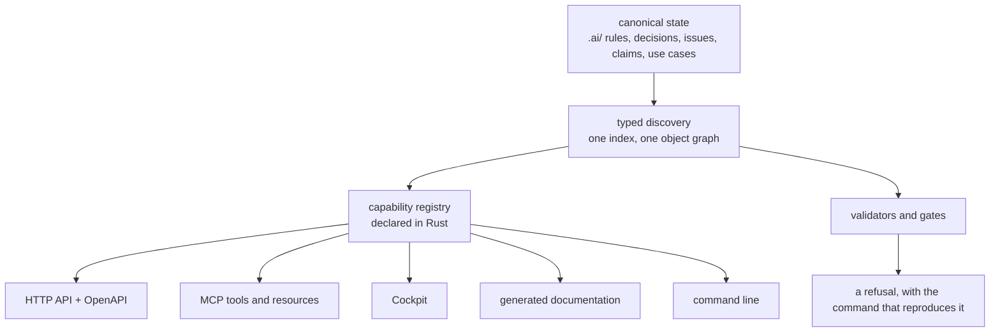

+++
title = "Proof-carrying documentation"
description = "A claim that no test can fail is prose with good formatting. What it took to make a repository refuse its own documentation, what that currently proves, and the exact place where it stops."
template = "page.html"
[extra]
lang = "en"
alternate = "dokumentace-kterou-lze-odmitnout/"
alternate_lang = "cs"
+++

Every repository I have worked in contains sentences that cannot fail.

"The CLI and the HTTP API expose the same operations." "All configuration is validated at startup." "Contributors must write a test for every bug fix." These are not lies when they are written. They become lies later, quietly, while everyone who could have noticed is busy. Nothing breaks when a README stops being true, because a README is not wired to anything. It is prose sitting next to a program, and prose has no exit code.

I have spent the last months building a tool whose entire premise is that this is fixable — not by writing better documentation, but by making documentation the kind of object a build can refuse. This article is about the mechanism, what it currently proves, and the specific place where it stops proving anything, which is the part I find most interesting.

## What Majordomus is

Majordomus is a supervisory control layer for a repository worked on by people and coding agents together. Concretely, it is two programs. A shell tool, `majordomus`, runs a task lifecycle: it briefs a session on what the repository knows, records decisions and handovers, checks work against the task's declared scope, and refuses a `finish` whose obligations are unmet. A Rust executable indexes the repository's `.ai/` layer — rules, decisions, milestones, issues, use cases, claims, session records — into a typed object graph, and serves that graph over a command line, an HTTP API, an OpenAPI document, an MCP server and a web cockpit.

The thing it controls is a repository's own statements about itself. Not the code — the code has compilers and tests already. The layer above the code: what this project promises, which rules bind a change, which decisions are settled, what a session must not touch, and what proves any of it.

That layer exists in every project. It is normally distributed across a CONTRIBUTING file, six Notion pages, an architecture diagram that stopped matching reality two refactors ago, and the memory of whoever has been there longest. When a coding agent joins, it gets whatever fragment fits in a prompt, and then rediscovers the rest — badly, and again tomorrow.

## Why "more context" is not the fix

The obvious response to an agent that does not know your conventions is to tell it your conventions. Put them in a file the agent always reads. This works for about a week.

It fails for a structural reason, not a capacity one. A convention written in a file that nothing enforces has exactly two states — honoured and violated — and the file cannot tell you which one you are in. So the file grows. Contributors add the rule that was broken last week. The agent instruction file becomes a graveyard of past incidents, each line a scar, none of them verifiable. Meanwhile the actual behaviour of the repository drifts away from it, and nobody finds out, because finding out would require someone to read the whole file and audit the whole repository against it, which is precisely the work nobody has time for.

A rule that no command can decide is a rule you are hoping about.

So the design question is not "how do I give the agent more context" but "which of these statements can be made decidable, and what do I do with the ones that cannot".

## The shape of the system

The architecture follows from that question. One canonical declaration, many derived surfaces, and a gate wherever a derivation could silently go stale.



The registry is the part that pays for itself. Every operation is declared once, in Rust, with its identity, its effect and its exposure. Today that registry holds 1482 capabilities. 110 of them are exposed as MCP tools, 1410 as MCP resources, 112 as HTTP operations. Every one of those surfaces is rendered from the same rows, so an operation cannot exist in the API and be missing from the OpenAPI document, and a tool cannot appear over MCP that the registry does not know about. There is a gate that regenerates everything and fails if the result differs from what is committed.

I want to be precise about what this does not cover, because the honest version is more useful than the tidy one. The command line is **not** a pure projection. The command graph holds 195 commands, and 64 of them have no capability behind them — the tool says so itself, in the same report: `commands no capability claims: 64`. Those commands are a second declaration, checked against the first rather than derived from it. Closing that gap is ongoing work, and until it closes, "one declaration, every surface" is true of the API, the MCP surface and the documentation, and aspirational for the CLI.

## Claims as objects

The mechanism I actually want to show you is narrower and, I think, more transferable.

Every capability sentence on the project's public website comes from one file, `docs/CLAIMS.yaml`. A claim there is a typed object: an id, one sentence in the present tense, the canonical file that defines the behaviour, the file that implements it, the test that proves it, and a status. The statuses are declared as data in the same file — guaranteed, advisory, planned, rejected — with their meanings, so the generator cannot invent a fifth.

Guaranteed means: implemented, and a behavioural test proves it.

The rule that makes this more than a spreadsheet is that the relationship must hold in **both** directions, and a gate decides it. `scripts/ci/claim-proof-check` reads every guaranteed claim, opens the test file the claim names, and requires that test to name the claim back in its header. A claim pointing at a test that has never heard of it is a finding. Then it requires the named test to be *runnable* — a shell case under `test/cases/` or a crate test under `apps/majordomus-cli/tests/` — because a claim whose proof is a Markdown file is not proven, it is described.

Right now that check reports:

```console
$ scripts/ci/claim-proof-check --strict
guaranteed claims:   0 of 161 name a test that does not name the claim back
runnable tests:      every guaranteed claim names a shell case or a crate test
blocking rules:      not measured here — scripts/ci/rule-proof-check is the one reader
claim-proof-check: every guaranteed claim names a test that names it back
```

161 guaranteed claims, all closed, and the exemption baseline beside the check contains thirteen lines of comments and no exempted claims. There is nothing on a waiver list.

The same shape applies one level up, to rules. A rule in this repository is a versioned Markdown document with a machine-readable block declaring how it is enforced. 137 rules resolve in a deterministic order; 116 carry a validator; all 109 blocking rules carry one. Four rules declare that a human reader enforces them — and that is a *typed* state with a required reason, not an absence. The distinction matters: "we review this by hand, because an automated check would have to guess" is a defensible engineering position. "Nobody ever decided this" wearing the same clothes is not.

## The place where it stops

Here is the part that a promotional article would leave out.

Everything above proves that a proof **exists**. None of it proves the proof **ran**.

The repository has an evidence ledger — `.ai/repo/evidence/ledger.json` — designed to join claims to recorded executions, so that a claim can carry a state like proven, stale or failing rather than merely "has a test". The subsystem is implemented. The ledger currently holds six executions. All six have `"origin": "local"`. The newest is six days old.

Ask the tool for the proof state of all 176 claims and it answers: 153 not run, 14 stale, 9 no test. Zero proven. The rules report says the same thing in its own vocabulary: `recorded: 0, passing: 0`.

The cause is mundane and specific: no CI workflow calls `majordomus evidence record`. The suite runs on every push — 224 shell cases and 1545 Rust test functions — and writes its results into a log that GitHub deletes on the next re-run. There is no published machine-readable test report; `https://majordomus.dev/reports/tests.json` returns 404.

So the accurate summary of the current state is: **this repository can prove that every guaranteed claim has a test that names it back, and cannot yet prove that any of those tests passed recently.** The first half is a real, enforced, unexempted invariant. The second half is a wire that is not connected. Both are true today, and a reader deserves to be told which is which.

I could have delayed this article until the ledger was populated and written a cleaner story. I think the gap is the more instructive artifact. It is exactly the kind of half-built mechanism that, left undescribed, becomes next year's sentence that cannot fail.

## One real workflow: the rule that refused me

The best demonstration I can give that this governance layer is executable rather than decorative is that it refused me while I was writing this.

This article has a companion written in Czech. I did not translate this one; I wrote a second article from the same evidence base, for a different audience. To publish it, I had to put a file containing Czech prose into the repository.

The repository has a rule, `project.english-only`, whose statement read: *"Code, comments, commits, documents and governance records are written in English, with no exceptions."* It is a blocking rule, and unlike most such statements in most repositories, it is wired to something. `scripts/ci/english-only-check` scans every tracked authored file — every `.md`, `.rs`, `.sh`, `.yaml`, `.html`, plus every extensionless file with a shebang — for letters that occur in Czech, Slovak or Polish and never in English, and for whole non-Latin scripts, matched as UTF-8 byte sequences so the result does not depend on the machine's locale. The site's content tree is in scope. There is no debt baseline in this tree, so a single hit fails the gate.

The check has an allow list with two kinds of entry, `name` for proper nouns and `fixture` for files that use a foreign string as test data. Both are declared with a reason. And both say, in the check's own header: *neither exempts a sentence.*

So the Czech article could not be added. Not "would have been poor practice" — could not: the gate would have gone red, and adding a `fixture` line to silence it would have been a misuse of an exemption whose documentation explicitly forbids exactly that.

What I did instead is the workflow the repository prescribes for changing what it enforces. I recorded a decision — an ADR — stating the distinction the original rule never had to make, because when it was written, every artifact in the repository was a working artifact. A published article addressed to a reader in that reader's language is a different category from a comment, a commit message or a governance record. I raised the rule to version 2 with that distinction written into its statement, added a third allow-list kind, `translation`, which requires a path under the published-content tree, a declared language and a reason, and which cross-checks the declaration against the language the page itself declares in its front matter, so the exemption cannot be one-sided. Then I wrote a behavioural case that proves the amended gate still refuses Czech prose in an ordinary source file, and accepts it only where the new kind permits.

The interesting part is the shape, not the specific rule. Changing what the repository enforces cost a decision record, a version bump, a check change and a test. Nothing about it was ceremonial: without every one of those, the change would not have landed, because the gate that reads rules would have found the rule's declared enforcement no longer matched its implementation.

That is what I mean by executable governance. Not that a document says the rules matter — that the author cannot get around them either.

## What is actually verified

| Statement | Status | How you can check it |
|---|---|---|
| Every guaranteed claim names a runnable test that names it back | Verified, enforced | `scripts/ci/claim-proof-check --strict`, exit 0, empty baseline |
| One registry renders the HTTP API, OpenAPI, MCP and the docs | Verified, measured | `majordomus capabilities projections`: 1482 rows, 112 HTTP, 110 MCP tools, 1410 MCP resources |
| The CLI is derived from that registry | **Not true yet** | 64 of 195 commands have no capability behind them |
| Every blocking rule carries a validator | Verified | 109 of 109; `scripts/ci/rule-proof-check`, exit 0 |
| Claims carry a recorded proof state | **Implemented, unpopulated** | ledger holds 6 executions, all local; 0 of 176 claims proven |
| The published site is generated from the repository | Verified, deployed | `build.json` names the version, the commit and the generator |
| Mesh: servers discover each other across machines | Experimental, off | `enabled: false` by default; status reports inactive |

## What I learned

Three things, in descending order of confidence.

**A gate changes what a document is.** Before `claim-proof-check`, the claims file was a marketing inventory that happened to have a test column. After it, adding a sentence to the website means writing a test, and the honest path of least resistance becomes lowering the claim's status rather than exaggerating it. The file did not change. The consequence of writing in it did.

**Most governance debt is one-sided.** The recurring defect I keep finding in my own work is a check that verifies a relationship from one end only: a claim that names a test, with nothing requiring the test to name the claim; a document that declares a contract, with no validator reading the other side. One-sided checks feel like enforcement and are not, because the half they do not read is exactly the half that rots.

**The distinction between "declared" and "recorded" is where honesty lives.** It is easy to build a system that knows what it promises. It is much harder to build one that knows when it last checked. I have the first and not yet the second, and naming that line precisely — in the tool's own output, on the public site, and in this article — is worth more than closing it would be if I closed it quietly.

## Evidence

Every number above was measured in September 2026, at the commit this page was published from — `build.json` on this site names it — with the command that produced it beside each one. The repository is public.

- Capability counts, projections, unbacked commands: `majordomus capabilities projections --format json`
- Claim counts and proof states: `majordomus evidence show --format json`
- Claim closure: `scripts/ci/claim-proof-check --strict`; baseline `.ai/repo/claim-proof-baseline.txt`
- Rule counts and enforcement modes: `majordomus rules report --format json`; `scripts/ci/rule-proof-check`
- Tests: 224 files under `test/cases/`; 1545 `#[test]` functions, 374 of them in `apps/majordomus-cli/tests/`
- Gates: 54 declared in `.ai/repo/ci/gates.yaml`, 17 always-on
- Deployment: `build.json` on the published site names the source version, the commit and the generator
- The rule this article had to amend: `.ai/repo/rules/project/english-only.v2.md`, and the decision that amended it

The claims themselves are published one page per claim, each naming its test. If a sentence on that site is wrong, there is a specific file to open and a specific command that should have failed.
