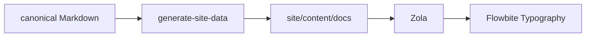

+++
title = "Rendering reference"
description = "Representative Markdown for validating Flowbite Typography, syntax highlighting, tables, callouts and Mermaid across viewports. Not linked from navigation."
template = "docs-page.html"
[extra]
source = "site/content-src/render-test.md"
noindex = true
+++
This page exists to validate rendering. It is the one Markdown file under `site/content/` that is hand-written, and it carries no product claims.

## Second level heading

Paragraph with **strong**, *emphasis*, `inline code`, a [link to the CLI reference](@/docs/cli.md), and a very long unbroken token: `aaaaaaaaaaaaaaaaaaaaaaaaaaaaaaaaaaaaaaaaaaaaaaaaaaaaaaaaaaaaaaaaaaaaaaaaaaaaaaaaaaaaaaaaaaaaaaaaaaaa`.

### Third level

#### Fourth level

##### Fifth level

###### Sixth level

- unordered item
- another item
  - nested item
  - nested item with `code`
    - third level
- [ ] task not done
- [x] task done

1. ordered item
2. ordered item
   1. nested ordered
   2. nested ordered

> A blockquote that runs long enough to wrap on a narrow viewport, so that its left border and padding can be judged against the surrounding text.

> [!NOTE]
> A note callout, projected from GitHub's own alert syntax. On GitHub it renders as an alert; here as a Flowbite alert.

> [!WARNING]
> A warning callout. Only five kinds exist: note, tip, important, warning, caution.

```bash
majordomus start "fix OAuth callback" --scope lib/auth --profile debugging
majordomus check --explain | head -20   # a deliberately long line so that horizontal scrolling inside the block can be checked on a 320px viewport
```

```yaml
version: 1
context:
  always_loaded_budget_lines: 150
  strategy: minimum-sufficient
```

```json
{"ts":"2026-09-03T19:30:12Z","event":"task.started","task_id":"t-20260903193012-a4f1"}
```

| command | answers | writes | exit |
|---|---|---|---|
| `doctor` | is Majordomus itself real and wired here? | no | 0 / 10 / 12 |
| `check` | is the task consistent with policy, scope, state? | no, except `--checkpoint` | 0 / 10 |
| `finish` | evaluate the finish contract | task record, ledger | 0 / 10 / 15 |
| `a very wide column to force horizontal scrolling on phones` | `and another wide one so the wrapper has to do its job rather than the page` | yes | 0 |

---



A footnote reference[^1] closes the page.

[^1]: Footnotes are supported by Zola's Markdown renderer.
